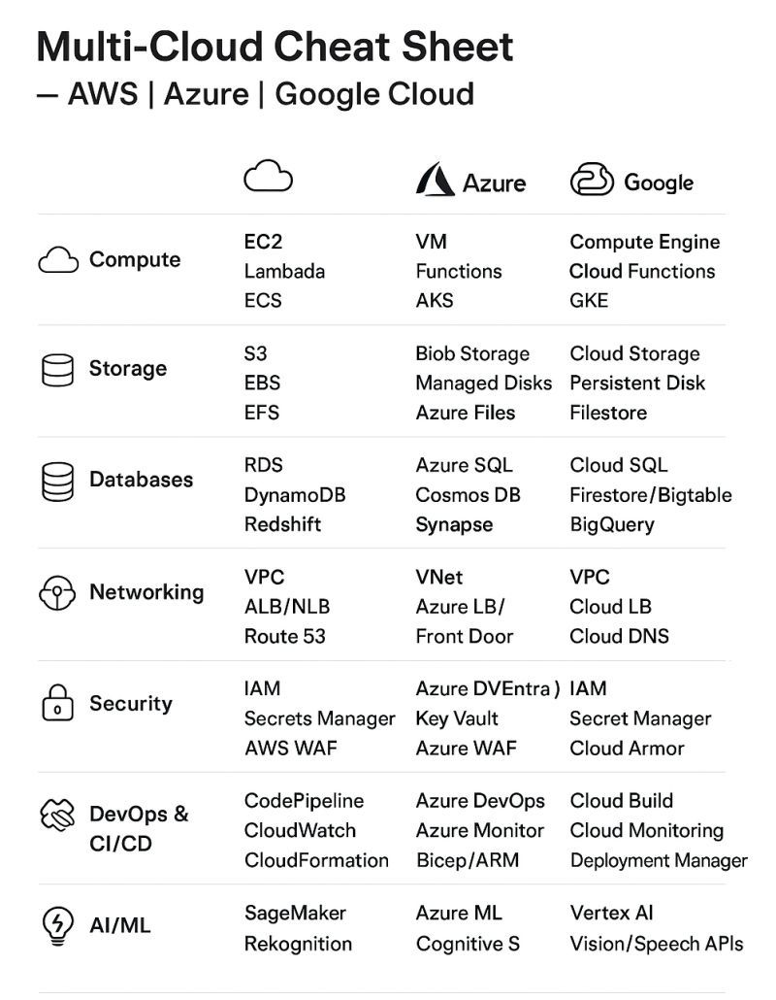

# System architecture — ASCII diagram (with Zipkin / OpenTelemetry)

Below is a full ASCII architecture diagram (Markdown code block) that shows frontend → APIs → microservices → messaging → storage → observability (Zipkin / OpenTelemetry) flows. After the diagram I list the numbered flow steps and short explanations so you can trace how data and events move.

```markdown
# Modern system: Frontend, API (REST/GraphQL), gRPC microservices, Kafka, RabbitMQ, Elasticsearch, DBs, OpenTelemetry/Zipkin

                                +---------------------+
                                |     Frontend UI     |
                                | (Web / Mobile / CLI)|
                                +----------+----------+
                                           |
             (A) REST/GraphQL over HTTPS   |   (B) WebSocket / Subscriptions
                                           v
                                +----------+----------+
                                |     API Gateway     |
                                | (Auth, Rate-limit,  |
                                |  GraphQL Gateway,   |
                                |  REST endpoints)    |
                                +----+--------+-------+
                                     |        |
                         (1) REST/GraphQL   (2) Fetch aggregate data
                                     |        v
                                     |   +----+------+
                                     |   |  Edge-    |
                                     |   |  Resolver |
                                     |   +----+------+
                                     |        |
                                     v        v
                     +---------------+--------+-----------------+
                     | Internal Service Mesh / Load Balancer    |
                     | (Service discovery, TLS, LB)             |
                     +----------+----------------+---------------+
                                |                |
               (3) gRPC (fast)  |                |  HTTP (admin/metrics)
                   calls        |                |
                                v                v
              +-----------------+----+     +-----+---------------+
              |   Auth Service       |     |   Profile Service   |
              |   (gRPC + HTTP)      |     |   (gRPC + DB)       |
              +--+----------------+--+     +------------+--------+
                 |                |                     |
                 |                |  (4) writes/updates |
                 |                v                     v
                 |         +------+-------+   +---------+---------+
                 |         | Relational   |   |   NoSQL / Cache   |
                 |         | DB (Postgres)|   | (Redis/Cassandra) |
                 |         +--------------+   +-------------------+
                 |
                 |  (5) publish events
                 v
       +---------+---------------------------------------------------+
       |                         Kafka                               |
       |           (topics: OrderCreated, PaymentCompleted,          |
       |            ProfileUpdated, AnalyticsEvents...)              |
       +-----+------------------------+-------------------+----------+
             |                        |                   |
   (6) stream consumers        (7) sink/connectors       (8) analytics
             |                        |                   |
             v                        v                   v
   +---------+-------+        +-------+----------+   +----+-----------+
   |  Search Index   |        |  Elastic-        |   |  Stream-       |
   |  Updater (svc)  |        |  search Sink     |   |  Processing    |
   | consumes topic  |        |  (Elasticsearch) |   |  (Spark/ksql)  |
   +-----------------+        +------------------+   +----------------+
             |
             | (9) index documents for full-text search
             v
       +-----+-----------------+
       |   Elasticsearch       |
       +-----------------------+

   Meanwhile, for background jobs / guaranteed delivery:

       +-------------------------------------------+
       |               RabbitMQ (AMQP)             |
       |    (task queues: email, pdf-render, sms)  |
       +---+-----------------+---------------------+
           |                 |
 (10) workers consume      (11) ack / retry / DLQ
           |                 |
           v                 v
   +-------+-------+     +----+----------+
   | Email Worker  |     |  PDF Worker   |
   +---------------+     +---------------+

   Observability / Tracing / Logging / Metrics (cross-cutting):

   [All services instrumented with OpenTelemetry SDK/Agent]
                         |
                         v
                +--------+---------+
                | OpenTelemetry    |
                | Collector (OTLP) |
                +---+----+---+-----+
                    |    |   |
    (A) traces ---->|    |   |-->  (B) metrics  --> Prometheus / Metrics DB
                    |    |   |
                    |    |   +-->  (C) logs      --> ELK / Loki
                    |    |
                    |    +------>  (D) tracing backend
                    |                 (Zipkin / Jaeger / Tempo)
                    |
                    +--------->  APM / Tracing UI (Zipkin/Jaeger/Grafana Tempo)

   Notes:
   - Zipkin can receive spans from the OpenTelemetry Collector (OTLP -> Zipkin exporter).
   - Services may export directly OTLP or Zipkin format; Collector unifies and routes.

         -------------------------------------------------------------------
         # CI/CD + Infra Layer
         
         +-----------------------------------------------------------+
         |                    Source Control (GitHub)                |
         +---------------------------+-------------------------------+
         |
         (12) push/PR triggers GitHub Actions
         |
         v
         +-----------------------------------------------------------+
         | GitHub Actions Workflow                                   |
         |  - Lint/Test/Build                                        |
         |  - Push container image -> GCP Artifact Registry          |
         |  - Trigger Tekton Pipeline (via Cloud Run / GKE)          |
         +---------------------------+-------------------------------+
         |
         v
         +-----------------------------------------------------------+
         | Tekton Pipelines (Kubernetes-native CI/CD)                |
         |  - Deploys microservices to GKE/Cloud Run                 |
         |  - Runs integration/e2e tests                             |
         |  - Canary/Rolling updates                                 |
         +---------------------------+-------------------------------+
         |
         v
         +-----------------------------------------------------------+
         | Terraform (Infra-as-Code)                                 |
         |  - Provisions GCP infra:                                  |
         |    - GKE clusters                                         |
         |    - VPC, Subnets, IAM, Service Accounts                  |
         |    - Pub/Sub / BigQuery / Storage                         |
         |    - Secret Manager / Cloud SQL                           |
         +-----------------------------------------------------------+

  Flow:
   - GitHub → GitHub Actions → (Infra: Terraform → GCP) & (App: Tekton → GKE/Cloud Run)
   - Continuous deploy + infra consistency

1. Source & Version Control
   ──────────────────────────────────────────────────────────────
   ┌─────────────────────────┐
   │        GitHub           │
   │ - App code              │
   │ - IaC (Terraform)       │
   │ - Manifests (K8s/Helm)  │
   └───────────┬─────────────┘
               │ (push/PR triggers)
               v

   ──────────────────────────────────────────────────────────────
2. CI/CD Automation
   ──────────────────────────────────────────────────────────────
   ┌─────────────────────────┐
   │ GitHub Actions          │
   │ - Run unit tests        │
   │ - Static analysis (SAST)│
   │ - Build Docker images   │
   │ - Push to Artifact Reg. │
   └───────────┬─────────────┘
               │ (trigger pipeline)
               v
   ┌─────────────────────────┐
   │ Jenkins / Tekton        │
   │ - Integration tests     │
   │ - Security scans (DAST) │
   │ - Infra deploy (Terraform)
   │ - App deploy (Helm/K8s) │
   └───────────┬─────────────┘
               v

   ──────────────────────────────────────────────────────────────
3. Infrastructure as Code
   ──────────────────────────────────────────────────────────────
   ┌─────────────────────────┐
   │ Terraform 🌍            │
   │ - Provisions GCP infra: │
   │   • GKE clusters        │
   │   • VPC / Subnets       │
   │   • Cloud SQL / Spanner │
   │   • Pub/Sub / Storage   │
   │   • IAM / Secrets       │
   └───────────┬─────────────┘
               v

   ──────────────────────────────────────────────────────────────
4. Container Orchestration
   ──────────────────────────────────────────────────────────────
   ┌─────────────────────────┐
   │ Kubernetes ☸️ (GKE)     │
   │ - Deploy workloads      │
   │ - Service mesh (Istio)  │
   │ - Config/Secrets (KMS)  │
   │ - Autoscaling (HPA/VPA) │
   │ - Rolling/Canary deploy │
   └───────────┬─────────────┘
               v

   ──────────────────────────────────────────────────────────────
5. Application Runtime
   ──────────────────────────────────────────────────────────────
   ┌───────────────────────────────────────────────────────────┐
   │ Microservices Mesh                                         │
   │ - API Gateway (REST/GraphQL, Auth, Rate-limit)             │
   │ - Services (gRPC/REST: Auth, Profile, Orders, Payments)    │
   │ - DBs: Postgres, Redis, Cassandra                          │
   │ - Eventing: Kafka, RabbitMQ                                │
   │ - Search: Elasticsearch                                    │
   │ - Analytics: Spark, BigQuery                               │
   │ - Workers: Email, PDF, Notifications                       │
   └───────────────────────────────────────────────────────────┘

   ──────────────────────────────────────────────────────────────
6. Observability & Ops
   ──────────────────────────────────────────────────────────────
   ┌─────────────────────────┐
   │ OpenTelemetry           │
   │ - Metrics -> Prometheus │
   │ - Logs -> ELK/Loki      │
   │ - Traces -> Jaeger/Zipkin
   └─────────────────────────┘

   ┌─────────────────────────┐
   │ Security / Ops          │
   │ - Vault / Secret Manager│
   │ - Policy (OPA/Gatekeeper│
   │ - Monitoring (Grafana)  │
   │ - Alerting (PagerDuty)  │
   └─────────────────────────┘

   ──────────────────────────────────────────────────────────────
7. Delivery to End Users
   ──────────────────────────────────────────────────────────────
   ┌─────────────────────────┐
   │ CDN / Cloud Load Balancer│
   │ - HTTPS ingress          │
   │ - DDoS protection        │
   └───────────┬─────────────┘
               v
   ┌─────────────────────────┐
   │ Frontend UI             │
   │ - Web, Mobile, CLI      │
   │ - Uses APIs / WebSockets│
   └─────────────────────────┘

```
### 🔑 What’s Added That Was Missing:

* **CI/CD split:** GitHub Actions (lightweight build/test) + Jenkins/Tekton (integration + deploy).
* **Terraform:** explicit infra provisioning (network, IAM, DBs, GKE).
* **Kubernetes (GKE):** with Istio/Service Mesh, autoscaling, rolling updates.
* **Artifact Registry:** built images are stored before deploy.
* **Secrets Management:** Vault/Secret Manager (GCP native).
* **Security:** OPA/Gatekeeper, SAST/DAST in pipelines.
* **Monitoring:** Prometheus/Grafana, logs, alerts.
* **Networking/CDN:** GCP Load Balancer, Cloud CDN, HTTPS ingress.
* **Event/Data layers:** Pub/Sub, BigQuery, Kafka, Spark included.

---

## Numbered flow explanation (detailed)

1. **Client → API Gateway (REST/GraphQL)**

   * Browser/mobile sends REST call or GraphQL query to API Gateway.
   * Gateway handles auth, rate-limiting, caching, and routes requests to internal services or resolves via GraphQL resolvers.

2. **GraphQL resolvers / Edge-Resolvers**

   * If a GraphQL query needs aggregated data from multiple microservices, the gateway or an edge resolver composes several gRPC calls to different services.

3. **Service-to-service calls using gRPC**

   * Internal microservices communicate synchronously with **gRPC** for low latency and typed contracts (Protobuf). Example: Profile Service calls Auth Service to validate a token.

4. **Services update state in databases**

   * Services persist canonical state to relational (Postgres), NoSQL, or caches (Redis). `PUT`/`POST` style semantics are handled within services.

5. **Services publish domain events to Kafka**

   * After state changes, services publish immutable events to Kafka topics (e.g., `OrderCreated`). This enables multiple downstream consumers without tight coupling.

6. **Event consumers process streams**

   * Services that need to react asynchronously (analytics, notifications) subscribe to Kafka topics as consumers (consumer groups). Kafka gives durable retention and replay.

7. **Kafka Connect / Sink to Elasticsearch**

   * A sink connector or a consumer service indexes events/documents into **Elasticsearch** for full-text search, aggregations, or dashboarding.

8. **Stream processing**

   * Real-time transforms or aggregations (ksqlDB, Flink, Spark) consume Kafka topics and produce derived streams/metrics.

9. **Search queries served from Elasticsearch**

   * API/GraphQL can query Elasticsearch directly (via its REST API) or through a service that shapes documents for frontend consumption.

10. **RabbitMQ for background tasks**

    * For jobs needing guaranteed delivery, retries, or complex routing (e.g., email, image processing), producers push messages to RabbitMQ exchanges and workers consume from queues.

11. **Worker ack / DLQ pattern**

    * Workers process tasks, ack on success, NACK/requeue on failure, or push to Dead Letter Queue after retry exhaustion.

## Observability: Zipkin vs OpenTelemetry (how they fit)

* **OpenTelemetry (OTel)** is the instrumentation standard (SDKs, semantic conventions). Instrument your services with OTel to emit traces, metrics, and logs.
* **OpenTelemetry Collector** receives telemetry (OTLP), can process/aggregate/enrich, and export to multiple backends.
* **Zipkin / Jaeger / Tempo** are tracing backends/visualizers. The Collector can export traces to Zipkin format or directly to Jaeger/Tempo. Zipkin is a simple trace UI; Jaeger/Tempo/Grafana provide richer features.
* Typical flow: `Instrumented Service -> OpenTelemetry Collector -> Zipkin/Jaeger/Tempo` and also `Collector -> Prometheus (metrics)`, `Collector -> ELK (logs)`.

---

## Quick mapping to your earlier question list

* **REST / GraphQL**: client-facing API layer (API Gateway).
* **gRPC**: internal, low-latency RPC between services.
* **Kafka**: durable event backbone for publish/subscribe and replay.
* **RabbitMQ**: reliable task/worker queue for background jobs.
* **Elasticsearch**: search & analytics datastore (sink of events).
* **OpenTelemetry / Zipkin**: observability/tracing stack — instrument services with OTel, collect and view traces in Zipkin/Jaeger/Grafana.

---

```markdown
# Modern DevOps / Cloud-Native Architecture (ASCII)

                       +----------------------------------+
                       |        Source Control (Git)      |
                       |   GitHub / GitLab / Bitbucket    |
                       +------------------+---------------+
                                          |
          (1) CI/CD Trigger (commit/push) |
                                          v
                +-------------------------+-------------------------+
                |                  CI/CD Layer                    - |
                |---------------------------------------------------|
                | Jenkins | GitHub Actions | GitLab CI | Tekton     |
                +------------------+--------------------------------+
                                   |
                 (2) Build / Test / Package Artifacts (Docker images)
                                   v
                          +--------+---------+
                          |   Container Build|
                          |   Docker / Podman|
                          +--------+---------+
                                   |
                  (3) Push to Registry (Harbor, ECR, GCR, DockerHub)
                                   v
                         +---------+-------------+
                         |   Container Registry  |
                         +---------+-------------+
                                   |
             (4) Deploy Infra via IaC (Terraform, Ansible, Pulumi, CFN)
                                   v
        +-------------------+    +-----------------------+
        | Provision Infra   |    | Configure Servers     |
        | Terraform / Pulumi|    | Ansible (agentless)   |
        +-------------------+    +-----------------------+
                  |                           |
                  v                           v
         +--------+---------+          +------+------+
         |  Cloud Infra     |          | VMs / Hosts |
         | AWS / Azure / GCP|          | Baremetal   |
         +------------------+          +-------------+
                  |
   (5) Orchestration / Platform Layer
                  v
        +---------+-------------------------------+
        |   Container Orchestration (Kubernetes)  |
        |   - OpenShift (enterprise flavor)       |
        |   - Nomad (simpler alternative)         |
        +---------+-------------------------------+
                  |
     (6) App Deployments / GitOps with ArgoCD
                  v
         +--------+--------+
         |  Applications   |
         |  (Microservices)|
         +--------+--------+
                  |
      (7) Observability / Monitoring / Logging
                  v
   +--------------+------------------------------+
   |   Metrics: Prometheus → Grafana dashboards  |
   |   Logs: ELK / Loki                          |
   |   Traces: OpenTelemetry → Zipkin / Jaeger   |
   +---------------------------------------------+

```

---

# 🔑 Flow Explanation

1. **Source Control** → Developers push code to Git.
2. **CI/CD (Jenkins, GitHub Actions, GitLab CI, Tekton)** → Automates build, test, and packaging pipelines.
3. **Docker/Podman** → Build containers from source → push to registry.
4. **Terraform/Pulumi** → Provision cloud infra (VMs, networks, DBs). **Ansible** → Configure OS / middleware.
5. **Kubernetes/OpenShift** → Deploy & orchestrate containers at scale.
6. **ArgoCD (GitOps)** → Deploy apps declaratively from Git repos into Kubernetes.
7. **Observability** → Prometheus for metrics, Grafana for visualization, ELK/Loki for logs, OpenTelemetry for telemetry → Zipkin/Jaeger for distributed tracing.

---

⚡ This diagram shows **where each tool fits**:

* **Jenkins** → CI/CD automation
* **Terraform/Ansible** → Infrastructure provisioning/config
* **Docker/Podman** → Container packaging
* **Kubernetes/OpenShift** → Orchestration / platform layer
* **ArgoCD** → GitOps deployment
* **Prometheus/Grafana/Zipkin** → Observability

---


Perfect! Let’s take your **end-to-end system flow** and integrate **all the tools, CI/CD, IaC, Kubernetes/OpenShift, and alternatives** directly into a **Mermaid diagram**. I’ll design it hierarchically so each layer is clear, and interchangeable options are noted.
Got it! Let's create a **full ASCII flow diagram** that includes **source control → CI/CD → IaC → orchestration → microservices → observability → delivery**, and shows **alternative tools using “or”** like you suggested. I’ll keep it readable while showing the main flow and options.

```
                                         +------------------------+
                                         | GitHub / GitLab /      |
                                         | Bitbucket [Repo]       |
                                         +-----------+------------+
                                                     |
           +-----------------------------------------+----------------------------------------+
           |                                         |                                        |
           v                                         v                                        v
+-----------------------------+       +-----------------------------+           +-----------------------------+
| GitHub Actions              |       | Jenkins 🛠️                  |           | Tekton Pipelines            |
| Build / Test / Push         |       | CI/CD Automation            |           | Kubernetes-native CI/CD     |
+-------------+---------------+       +-------------+---------------+           +-------------+---------------+
              |                                     |                                           |
              +-----------------+-------------------+-------------------+-----------------------+
                                |                                       |
                                v                                       v
                     +-----------------------------+       +-----------------------------+
                     | Terraform 🌍                |       | Pulumi / CloudFormation     |
                     | Provision GCP / Multi-cloud |       | Alternative IaC             |
                     +-------------+---------------+       +-----------------------------+
                                   |
                +------------------+--------------------+
                |                  |                    |
                v                  v                    v
           +---------+        +------------+       +----------------+
           | GKE ☸️  |        | OpenShift  |       | EKS / AKS      |
           | K8s     |        | Enterprise |       | Rancher        |
           | Cluster |        | K8s + CI/CD|       | Alternative K8s|
           +---------+        +------------+       +----------------+
                |                  |                      |
                +---------+--------+--------+-------------+
                                   |
                                   v
                  +-----------------------------+
                  | API Gateway                 |
                  | Envoy / Kong / Nginx        |
                  +-------------+---------------+
                                |
                                v
                  +-----------------------------+
                  | Microservices               |
                  | Auth / Profile / Orders /   |
                  | Payments                    |
                  +-------------+---------------+
                                |
        +-----------------------+------------------------+
        |                       |                        |
        v                       v                        v
+------------------+        +----------------+        +----------------+
| Databases        |        | Kafka / Pulsar |        | RabbitMQ / SQS |
| Postgres /       |        | Event Streaming|        | Task Queue     |
| Redis / Cassandra|        +----------------+        | Background Jobs|
+------------------+             |                    +----------------+
        |                        |                        |
        v                        v                        v
+---------------+        +------------------------+    +----------------------+
| Elasticsearch |        | Analytics              |    | Workers              |
| Search Index  |        | Spark / BigQuery / KSQL|    | Email / PDF / Notifs |
+---------------+        +------------------------+    +----------------------+
                                |
                                |
                                v
                  +-----------------------------+
                  | Observability / Monitoring  |
                  | OpenTelemetry / Jaeger /    |
                  | Zipkin / Prometheus / ELK   |
                  | Alerts: PagerDuty / Opsgenie|
                  +-----------------------------+
                                |
                                v
                  +-----------------------------+
                  | Load Balancer / Ingress     |
                  | GCP LB / Nginx / OpenShift  |
                  | Router                      |
                  +-------------+---------------+
                                |
                                v
                          +------------+
                          | CDN        |
                          | Cloud CDN /|
                          | CloudFront |
                          +-----+------+
                                |
                                v
                          +--------------+
                          | Frontend     |
                          | Web /        |
                          | Mobile / CLI |
                          +--------------+
```

---


✅ This version should parse correctly in Mermaid.

If you want, I can also **add dashed arrows or color coding** to show **alternative tools** (like OpenShift replacing GKE+Jenkins/Tekton, Pulumi instead of Terraform, etc.) — that makes the diagram **decision-aware**.

Do you want me to do that next?


### 🔑 Notes:

1. **CI/CD Layer**: GitHub Actions, Jenkins, Tekton → all feed into IaC (Terraform/Pulumi) and app deployment.
2. **IaC Layer**: Terraform is the main tool; Pulumi / CloudFormation are alternatives.
3. **Orchestration Layer**: GKE is standard; OpenShift can replace GKE + Tekton/Jenkins with integrated CI/CD. EKS/AKS/Rancher are cloud alternatives.
4. **App Runtime Layer**: All microservices, eventing, DBs, queues, and analytics.
5. **Observability Layer**: Tracing + metrics + logs + alerts.
6. **Delivery Layer**: LB + CDN → Frontend.

---

# 10 Key Components of Microservices Architecture


## 1. Client
These are the end-users who interact with the application via different interfaces like web, mobile, or PC.

## 2. CDN (Content Delivery Network)
CDNs deliver static content like images, stylesheets, and JavaScript files efficiently by caching them closer to the user's location, reducing load times.

## 3. Load Balancer
It distributes incoming network traffic across multiple servers, ensuring no single server becomes a bottleneck and improving the application's availability and reliability.

## 4. API Gateway
An API Gateway acts as an entry point for all clients, handling tasks like request routing, composition, and protocol translation, which helps manage multiple microservices behind the scenes.

## 5. Microservices
Each microservice is a small, independent service that performs a specific business function.  
They communicate with each other via APIs.

## 6. Message Broker
A message broker facilitates communication between microservices by sending messages between them, ensuring they remain decoupled and can function independently.

## 7. Databases
Each microservice typically has its own database to ensure loose coupling.  
This can involve different databases for different microservices.

## 8. Identity Provider
This component handles user authentication and authorization, ensuring secure access to services.

## 9. Service Registry and Discovery
This system keeps track of all microservices and their instances, allowing services to find and communicate with each other dynamically.

## 10. Service Coordination (e.g., Zookeeper)
Tools like Zookeeper help manage and coordinate distributed services, ensuring they work together smoothly.

# ☁️ Multi-Cloud Cheat Sheet — AWS | Azure | Google Cloud

As more organizations adopt **multi-cloud strategies**, understanding how services **map across AWS, Azure, and Google Cloud** becomes essential.

This cheat sheet focuses on **concept-to-concept mapping**, not vendor-specific marketing terms—making it easier to design **portable and cloud-agnostic architectures**.



---

## 🧩 High-Level Summary

<details>
<summary><strong>Click to expand overview</strong></summary>

Each major cloud provider offers similar core building blocks:
- Compute
- Storage
- Databases
- Networking
- Security
- DevOps & CI/CD
- AI/ML

The names differ, but the **concepts remain the same**.

</details>

---

## ☁️ Compute

<details>
<summary><strong>Compute service mapping</strong></summary>

| Concept                | AWS                         | Azure                    | GCP                         |
|------------------------|-----------------------------|--------------------------|-----------------------------|
| Virtual Machines       | EC2                         | Virtual Machines         | Compute Engine              |
| Serverless Functions   | Lambda                      | Azure Functions          | Cloud Functions             |
| Container Service      | ECS                         | Container Apps           | Cloud Run                   |
| Managed Kubernetes     | EKS                         | AKS                      | GKE                         |

</details>

---

## 📦 Storage

<details>
<summary><strong>Storage service mapping</strong></summary>

| Concept                | AWS           | Azure               | GCP                 |
|------------------------|---------------|---------------------|---------------------|
| Object Storage         | S3            | Blob Storage        | Cloud Storage       |
| Block Storage          | EBS           | Managed Disks       | Persistent Disk     |
| File Storage           | EFS           | Azure Files         | Filestore           |

</details>

---

## 🛠 Databases

<details>
<summary><strong>Database service mapping</strong></summary>

### Relational Databases
- **AWS:** RDS  
- **Azure:** Azure SQL / SQL Managed Instance  
- **GCP:** Cloud SQL  

### NoSQL Databases
- **AWS:** DynamoDB  
- **Azure:** Cosmos DB  
- **GCP:** Firestore / Bigtable  

### Data Warehousing
- **AWS:** Redshift  
- **Azure:** Synapse Analytics  
- **GCP:** BigQuery  

</details>

---

## 🌐 Networking

<details>
<summary><strong>Networking service mapping</strong></summary>

| Concept                | AWS               | Azure                    | GCP                 |
|------------------------|-------------------|--------------------------|---------------------|
| Virtual Network        | VPC               | VNet                     | VPC                 |
| Load Balancer          | ALB / NLB         | Azure LB / Front Door    | Cloud Load Balancer |
| DNS                    | Route 53          | Azure DNS                | Cloud DNS           |

</details>

---

## 🔐 Security

<details>
<summary><strong>Security & identity mapping</strong></summary>

| Concept                | AWS                   | Azure                         | GCP                 |
|------------------------|-----------------------|-------------------------------|---------------------|
| Identity & Access      | IAM                   | Azure AD (Entra ID)           | IAM                 |
| Secrets Management     | Secrets Manager       | Key Vault                     | Secret Manager      |
| Web Application Firewall | AWS WAF            | Azure WAF                     | Cloud Armor         |

</details>

---

## 🔄 DevOps & CI/CD

<details>
<summary><strong>DevOps tooling mapping</strong></summary>

| Concept                | AWS                | Azure              | GCP                   |
|------------------------|--------------------|--------------------|-----------------------|
| CI/CD Pipelines        | CodePipeline       | Azure DevOps       | Cloud Build           |
| Monitoring & Logging   | CloudWatch         | Azure Monitor      | Cloud Monitoring      |
| Infrastructure as Code| CloudFormation     | ARM / Bicep        | Deployment Manager    |

</details>

---

## 🤖 AI / ML

<details>
<summary><strong>AI & ML service mapping</strong></summary>

| Concept                | AWS            | Azure              | GCP           |
|------------------------|----------------|--------------------|---------------|
| ML Platform            | SageMaker      | Azure ML           | Vertex AI     |
| Vision / Speech APIs   | Rekognition    | Cognitive Services | Vision / Speech APIs |

</details>

---

## 💡 Multi-Cloud Design Tip

<details>
<summary><strong>Key insight</strong></summary>

❌ Don’t compare clouds **feature-by-feature**  
✅ Compare them **concept-to-concept**

Once you understand the mapping:
- Architectures become portable
- Vendor lock-in is reduced
- Migration and hybrid strategies are easier

</details>

---

## 🏁 Final Takeaway

<details>
<summary><strong>TL;DR</strong></summary>

Cloud providers differ in naming and tooling,  
but the **core primitives are the same**.

Master the concepts — and every cloud becomes familiar.

</details>
```