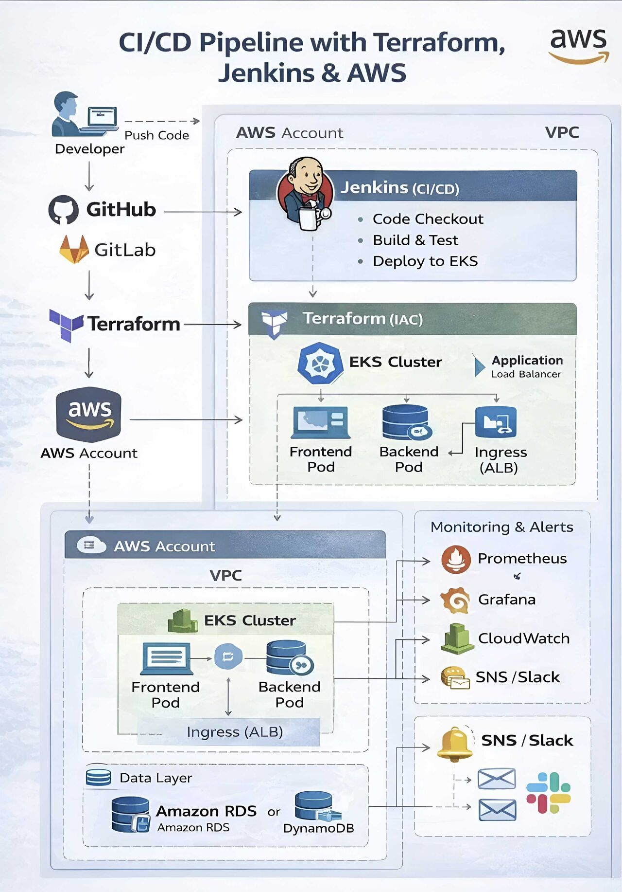

## Jenkins Alternatives for CI/CD 
1. Gilhub actions
2. GitLab CI/CD

[Tekton vs Jenkins](https://youtu.be/7aSe1HQ2lXo?si=koGlTYcQP2O4Wevw)



# 🚀 Production-Grade DevOps CI/CD Architecture

This document describes a **real-world, production-ready DevOps CI/CD architecture** that is **simple, automated, reliable, and scalable**.

---

## 🧩 High-Level Overview

<details>
<summary><strong>Click to expand summary</strong></summary>

A developer pushes code to **GitHub/GitLab**, which automatically triggers **Jenkins**.  
Jenkins builds, tests, containerizes, and deploys the application to **Amazon EKS (Kubernetes)**.  
All infrastructure is provisioned using **Terraform (IaC)**.  
The application is exposed securely via **ALB Ingress**, monitored using **Prometheus, Grafana, and CloudWatch**, and alerts are delivered through **SNS**.

This setup ensures:
- Zero-downtime deployments
- Automated infrastructure
- Observability and reliability
- Fast feedback loops

</details>

---

## 🔁 CI/CD Workflow (Jenkins)

<details>
<summary><strong>CI/CD Flow Details</strong></summary>

1. Developer pushes code to **GitHub / GitLab**
2. Webhook triggers **Jenkins pipeline**
3. Jenkins performs:
  - Source code checkout
  - Build and unit tests
  - Docker image build
  - Push image to AWS container registry (ECR)
  - Deploy application to Kubernetes (EKS)

Jenkins acts as the **central CI/CD engine**, enforcing consistency and automation across environments.

</details>

---

## 🏗️ Infrastructure as Code (Terraform)

<details>
<summary><strong>Infrastructure Provisioning</strong></summary>

All infrastructure is provisioned automatically using **Terraform**, ensuring repeatability and version control.

Terraform provisions:
- VPC and networking
- Public and private subnets
- Amazon EKS cluster
- Worker node groups
- IAM roles and policies
- Application Load Balancer (ALB)
- Monitoring and logging components

✅ No manual setup  
✅ Fully reproducible environments  
✅ Easy scaling and teardown

</details>

---

## ☸️ Kubernetes on Amazon EKS

<details>
<summary><strong>Application Architecture</strong></summary>

The application runs on **Amazon EKS**, following containerized microservice principles:

- Frontend Pod
- Backend Pod
- Kubernetes Services for internal communication

Kubernetes handles:
- Scheduling
- Self-healing
- Rolling updates
- Horizontal scaling

</details>

---

## 🌐 Ingress & Traffic Management

<details>
<summary><strong>Ingress & Load Balancing</strong></summary>

- **AWS Application Load Balancer (ALB)** is used as the Kubernetes Ingress
- Securely exposes the application to the internet
- Enables:
  - Zero-downtime deployments
  - Path-based routing
  - TLS termination

This ensures high availability and seamless user experience.

</details>

---

## 🗄️ Data Layer (Outside Kubernetes)

<details>
<summary><strong>Database & Storage Design</strong></summary>

Best practice: **Databases are not deployed inside Kubernetes**

- **Amazon RDS**
  - Relational data
  - Backups, failover, managed scaling
- **Amazon DynamoDB**
  - Key-value storage
  - Session management
  - Low-latency access

This design improves durability, scalability, and operational simplicity.

</details>

---

## 📊 Monitoring & Observability

<details>
<summary><strong>Monitoring Stack</strong></summary>

Monitoring and reliability are built-in:

- **Prometheus**
  - Collects application and cluster metrics
- **Grafana**
  - Visual dashboards
  - Performance and health monitoring
- **Amazon CloudWatch**
  - Centralized logs
  - Alarms and metrics

Teams can detect issues **before users are impacted**.

</details>

---

## 🚨 Alerts & Incident Response

<details>
<summary><strong>Alerting & Notifications</strong></summary>

When something breaks:

- Alerts are triggered in CloudWatch / Prometheus
- Notifications flow through **Amazon SNS**
- Delivered via:
  - Email
  - Slack

This enables rapid incident response and proactive operations.

</details>

---

## ✅ Why This Is Real DevOps

<details>
<summary><strong>Key DevOps Principles</strong></summary>

✔ Continuous Integration & Deployment  
✔ Infrastructure as Code  
✔ Kubernetes orchestration  
✔ Monitoring & alerting  
✔ Secure, scalable, production-ready architecture

This is how **REAL DevOps** works in production.

</details>

---

## 🏁 Final Takeaway

<details>
<summary><strong>Closing Summary</strong></summary>

This architecture represents a **battle-tested DevOps setup** used in real production environments.  
It combines automation, observability, scalability, and reliability—allowing teams to move fast **without breaking things**.

</details>

## Comparison** of **Jenkins, Terraform, and Kubernetes** in a table format:  

| Feature                       | **Jenkins** 🛠️ (CI/CD)                                  | **Terraform** 🌍 (IaC)                                             | **Kubernetes** ☸️ (Container Orchestration)                   |
|-------------------------------|----------------------------------------------------------|--------------------------------------------------------------------|---------------------------------------------------------------|
| **Purpose**                   | CI/CD Automation (Build, Test, Deploy)                   | Infrastructure as Code (Provisioning & Management)                 | Container Orchestration (Deploy & Manage Containers)          |
| **Primary Function**          | Automates software build, test, and deployment pipelines | Creates and manages cloud infrastructure                           | Manages and scales containerized applications                 |
| **Configuration Language**    | Groovy-based Jenkinsfile (Pipeline as Code)              | HashiCorp Configuration Language (HCL)                             | YAML (Manifest files)                                         |
| **Execution Model**           | Job-based execution (build & deploy workflows)           | Declarative state-based execution                                  | Declarative (Desired state)                                   |
| **State Management**          | No state management                                      | Maintains infrastructure state (`.tfstate`)                        | Maintains cluster state using **etcd**                        |
| **Installation**              | Self-hosted or cloud-based Jenkins server                | CLI tool that runs locally or in pipelines                         | Runs on VMs, Bare Metal, or Cloud                             |
| **Integration**               | Works with Git, Maven, Docker, Kubernetes, etc.          | Works with AWS, Azure, GCP, Kubernetes, etc.                       | Works with Docker, Helm, CI/CD tools                          |
| **Declarative vs Imperative** | Primarily Imperative (Jenkinsfile defines steps)         | Declarative (Defines end state of infrastructure)                  | Declarative (Manages workloads in Kubernetes)                 |
| **Key Features**              | CI/CD Pipelines, Plugin ecosystem, Job scheduling        | Infrastructure provisioning, State management, Multi-cloud support | Load balancing, Auto-scaling, Service discovery, Self-healing |
| **Best For**                  | Automating software delivery (CI/CD)                     | Managing infrastructure resources in the cloud                     | Deploying & managing containerized applications               |
| **Commonly Used With**        | Terraform, Kubernetes, Docker, GitHub Actions            | Jenkins, Kubernetes, AWS, GCP, Azure                               | Terraform, Jenkins, Docker, Helm                              |

**✅ Key Takeaway** 
- **Jenkins** automates software deployment (CI/CD).  
- **Terraform** provisions and manages cloud infrastructure (IaC).  
- **Kubernetes** manages and orchestrates containerized applications.  

💡 **They can work together**:  
✅ **Jenkins** triggers **Terraform** to provision infrastructure.  
✅ **Terraform** deploys **Kubernetes clusters**.  
✅ **Jenkins** then deploys applications onto **Kubernetes**. 🚀  

Let me know if you need a specific workflow example! 😊

# 🔄 Rollback Strategy in DevOps

<details open>
<summary><strong>🔄 Rollback Strategy in DevOps</strong></summary>

In DevOps, ensuring a **rollback strategy** is critical for maintaining application stability during failed deployments.
A solid rollback plan reduces downtime and prevents broken code from affecting users.

---

<details open>
<summary>1️⃣ ✅ Version Control</summary>

* Every deployment is **versioned** using Git tags or commit hashes.
* This allows quick reversion to a previously stable version.

**Example:**

```bash
# Deploying with a specific Git tag
git checkout v1.2.3
git push origin main
```

</details>

---

<details open>
<summary>2️⃣ 🧪 Canary & Blue-Green Deployments</summary>

* **Canary Deployment:** Roll out changes to a small portion of users first.
* **Blue-Green Deployment:** Run two environments (Blue = stable, Green = new). If failure occurs, route traffic back to Blue.

**Example (Kubernetes Canary):**

```yaml
spec:
  replicas: 5
  selector:
    matchLabels:
      app: myapp
  template:
    metadata:
      labels:
        app: myapp
        version: canary
```

This lets only part of the traffic hit the new version.

</details>

---

<details open>
<summary>3️⃣ 🧰 Infrastructure as Code (IaC)</summary>

* Using tools like **Terraform**, infra changes are tracked in code.
* Rollback = simply reapply the last known good config.

**Example (Terraform):**

```bash
# Roll back to previous infra state
terraform apply "previous_plan.tfplan"
```

</details>

---

<details open>
<summary>4️⃣ 📦 Immutable Deployments</summary>

* Containers/images are **immutable** → no in-place edits.
* To rollback, redeploy the last **working image** by version tag.

**Example (Docker):**

```bash
# Rollback to last stable version
docker run myapp:v1.2.3
```

</details>

---

<details open>
<summary>5️⃣ 📜 Rollback Scripts & CI/CD Logic</summary>

* CI/CD pipelines (GitHub Actions, Jenkins, GitLab CI) monitor deployment health.
* If failure detected → pipeline **auto-triggers rollback**.

**Example (GitHub Actions):**

```yaml
- name: Deploy New Version
  run: docker run myapp:latest

- name: Health Check
  run: curl -f http://localhost:8080/health || exit 1

- name: Rollback on Failure
  if: failure()
  run: docker run myapp:v1.2.3
```

</details>

---

## ✅ Real-World Example

🚀 A **Node.js app** was deployed using GitHub Actions + Docker.
🔍 During the **health check stage**, a `500` error was detected.
💡 GitHub Actions **immediately executed rollback** to the previous Docker image.

```yaml
- name: Rollback to Previous Image
  run: docker run myapp:v1.2.3
```

💥 Result: **Downtime avoided**, users never saw disruption.

---

## 🔚 Conclusion

A strong rollback strategy = 🔐 **safer deployments** + 😌 **peace of mind**.
👉 Always **test rollback paths** before you need them.

```test
  🚀 Start Deployment
          |
          v
📦 Deploy New Version
          |
          v
🔍 Run Health Checks
     /           \
 Pass            Fail
  |                |
  v                v
✅ Keep New      ❌ Trigger Rollback
   Version         |
    \              v
     \          ↩️ Rollback to
      \------>  Last Stable Version
                    |
                    v
             ✅ Service Stable
```

</details>
---

# 📚 Loading a Shared Library in a Jenkinsfile

<details open>
<summary><strong> Loading a Shared Library in a Jenkinsfile</strong></summary>

A **Jenkins Shared Library** is stored in a Git repository and allows you to reuse pipeline functions and classes across multiple Jenkins pipelines.
You load it in your **Jenkinsfile** using the `@Library` annotation (or the `library` step).

---

<details open>
<summary>1️⃣ Preconfigured Global Library</summary>

👉 If your Jenkins admin has already set up the shared library in
**Manage Jenkins → Configure System → Global Pipeline Libraries**,
you can load it by its name only.

**Example:**

```groovy
@Library('my-shared-lib') _   // 📦 load the shared library

pipeline {
    agent any
    stages {
        stage('Call Library Function') {
            steps {
                // 📞 call function defined in vars/hello.groovy
                helloWorld()
            }
        }
    }
}
```

💡 `helloWorld()` comes from `vars/hello.groovy` inside the shared library.

</details>

---

<details open>
<summary>2️⃣ Load Dynamically from GitHub</summary>

👉 If not preconfigured globally, you can load the library directly from Git.

**Example:**

```groovy
@Library('my-shared-lib@main') _   // 🔖 load library from branch "main"

library identifier: 'my-shared-lib@main', retriever: modernSCM([
  $class: 'GitSCMSource',
  remote: 'https://github.com/org/shared-library.git' // 🌐 GitHub repo
])

pipeline {
    agent any
    stages {
        stage('Use Library Function') {
            steps {
                // 🛠 use shared library function
                deployApp("staging")
            }
        }
    }
}
```

💡 `deployApp()` comes from `vars/deployApp.groovy` in the shared lib.

</details>

---

<details open>
<summary>3️⃣ Version-Specific Library</summary>

👉 To ensure **stability across teams**, load a specific version or tag.

**Example:**

```groovy
@Library('my-shared-lib@v1.2.0') _   // 🏷 load library version v1.2.0
```

This way, pipelines won’t break when newer versions of the library are updated.

</details>

---

✅ **Summary:**

* `@Library('<name>@<version>')` → loads the library.
* Global libraries need only the name.
* Dynamic libraries require `library` + Git repo config.
* Always prefer **tagged versions** for production stability.

---

```text
  📂 Jenkinsfile
         |
         v
@Library Annotation
         |
         v
🔗 Shared Library?
     /         \
 Global         Dynamic
 Config         Git Repo
   |               |
   v               v
⚙️ Load from   🌐 Fetch from
 Jenkins        Repository
   |               |
    \             /
     \           /
      v         v
 📦 Library Functions
   (vars/, src/, resources/)
          |
          v
🚀 Pipeline Stages
          |
          v
✅ Execute Library Functions
```

</details>

---

Perfect 🙌 Let me enhance your UCD versioning explanation into the same **structured + visual style** we’ve been using, so it’s easy to present or remember.

---

# 🌟 How IBM UrbanCode Deploy (UCD) Handles Versioning

<details open>
<summary><strong>How IBM UrbanCode Deploy (UCD) Handles Versioning</strong></summary>

✅ In IBM **UrbanCode Deploy (UCD)**, versioning is a **core feature** that ensures deployments are:

* **Repeatable** 🌀
* **Traceable** 📝
* **Rollback-safe** 🔄

---

<details open>
<summary>1️⃣ 📦 Component Versions</summary>

* Every build artifact (**JAR, WAR, config files, Docker image**) is stored as a **version** in UCD.
* Versions are immutable → you can always redeploy the same artifact exactly.

</details>

---

<details open>
<summary>2️⃣ 🗄️ CodeStation Repository</summary>

* UCD’s **internal artifact repo** = CodeStation.
* Stores all component versions **securely and immutably**.
* Guarantees you always deploy the artifact as it was built.

</details>

---

<details open>
<summary>3️⃣ 🔄 Rollbacks</summary>

* Since all past versions are retained, UCD enables **rollback to any previous version** with just a few clicks.
* Rollback uses the same deployment process as forward deployments → **safe & consistent**.

</details>

---

<details open>
<summary>4️⃣ 🌐 Deployment Mapping</summary>

* Each environment (Dev, QA, Prod) can be mapped to **different versions** of the same component.
* UCD shows a clear **audit trail**:

  * QA → `v1.2.5`
  * Prod → `v1.2.3`

</details>

---

<details open>
<summary>5️⃣ ⚙️ Automation</summary>

* Deployment processes can:

  * Auto-pick the latest version 🚀
  * Or prompt the user to select a version before deploying 🎛️
* Ensures flexibility across different environments.

</details>

---

## 🔎 Real-World Example

* A **build job** creates artifact → `v1.2.5`.
* Uploaded to UCD as a **component version**.
* QA deploys `v1.2.5`.
* Prod still runs `v1.2.3`.
* If Prod deployment of `v1.2.5` fails → **rollback to `v1.2.3` instantly**.

---

## 📊 Visual Flow (ASCII)

```text
🏗️ Build Artifact (v1.2.5)
        |
        v
📦 Stored in UCD as Component Version
        |
        v
🗄️ CodeStation Repository (Immutable Storage)
        |
        v
🌐 Environments
   ├── Dev → v1.2.5
   ├── QA  → v1.2.5
   └── Prod → v1.2.3
        |
        v
🔄 Rollback Anytime (e.g., Prod back to v1.2.3)
```

---

💡 **In short:**
UCD manages deployments by creating **immutable, traceable versions of artifacts 📦**, storing them in **CodeStation 🗄️**, and enabling **safe rollbacks 🔄** and **full audit tracking 📊** across environments.

</details>

---

Great question 🙌 Let’s enhance your OpenShift vs Kubernetes explanation into a **structured, interview-friendly guide** with collapsible sections and a visual flow for quick recall.

---

# 🌟 OpenShift vs Kubernetes

<details open>
<summary><strong>OpenShift vs Kubernetes</strong></summary>

👉 **OpenShift** is a **container application platform** built on top of **Kubernetes** 🚀.
It provides all Kubernetes features (**orchestration, scaling, self-healing**) plus **enterprise-grade capabilities** for security, CI/CD, and developer productivity.

---

<details open>
<summary>1️⃣ 🔒 Security (SCC vs PSP)</summary>

* **Kubernetes**:

  * Containers can run as root unless restricted via PodSecurityPolicies (PSPs).
* **OpenShift**:

  * Uses **Security Context Constraints (SCCs)**.
  * Enforces **non-root pods by default** → stronger security posture.

</details>

---

<details open>
<summary>2️⃣ 🌐 Networking & Routing</summary>

* **Kubernetes**: Uses **Ingress** to expose services externally.
* **OpenShift**: Provides **Routes** out-of-the-box 🌍 with built-in **HAProxy** → external access is simpler and faster to configure.

</details>

---

<details open>
<summary>3️⃣ ⚙️ Built-in CI/CD</summary>

* **Kubernetes**: No native CI/CD tools.
* **OpenShift**: Includes **Source-to-Image (S2I)** 🖼️ and **Jenkins pipelines** 📦 for automated builds & deployments.

</details>

---

<details open>
<summary>4️⃣ 📦 Image Management</summary>

* **Kubernetes**: Pulls container images from **external registries** (DockerHub, ECR, GCR, etc).
* **OpenShift**: Has an **integrated image registry** 🗂️ + **ImageStreams** for better version tracking and lifecycle management.

</details>

---

<details open>
<summary>5️⃣ 👥 Multi-Tenancy & Projects</summary>

* **Kubernetes**: Uses **namespaces** for isolation.
* **OpenShift**: Uses **Projects** 📂 (which are namespaces + RBAC + resource quotas).
* Easier for multi-team enterprise environments.

</details>

---

<details open>
<summary>6️⃣ 🔑 Authentication & Authorization</summary>

* **Kubernetes**: Requires third-party solutions for RBAC + authentication (e.g., OIDC, Keycloak).
* **OpenShift**: Built-in **OAuth server** 🛡️ → integrates with LDAP, GitHub, Google, etc.

</details>

---

### 📊 ASCII Visual Flow

```text
Kubernetes (Core Features)
   ├── Orchestration ⚙️
   ├── Scaling 📈
   ├── Self-Healing ♻️
   └── Service Discovery 🌐
        |
        v
OpenShift = Kubernetes ➕ Enterprise Features
   ├── 🔒 Security (SCCs, non-root)
   ├── 🌐 Routes (Ingress + HAProxy)
   ├── ⚙️ Built-in CI/CD (S2I, Pipelines)
   ├── 📦 Image Registry + ImageStreams
   ├── 👥 Projects (Namespaces + RBAC + Quotas)
   └── 🔑 OAuth Auth & RBAC out-of-the-box
```

---

### ✅ Short Interview Answer

**“OpenShift is Kubernetes with enterprise add-ons: stricter security (SCCs), built-in CI/CD, an integrated image registry, developer-friendly tooling, and OAuth integration. It makes Kubernetes more secure, easier to use, and production-ready for large organizations.”**

</details>

---

Perfect 🙌 Let’s structure this in the same **parent-child collapsible style** as before.
Here, the **parent** is the main question (`How do you deploy Docker images using GitLab?`) and each **child** section contains the detailed steps.

---

<details open>
<summary>🐳 How do you deploy Docker images using GitLab?</summary>

👉 In GitLab CI/CD, deploying Docker images usually involves **3 main steps**:
1️⃣ Build the Docker image.
2️⃣ Push the image to a registry (GitLab Container Registry, DockerHub, ECR, ACR).
3️⃣ Deploy the image to your environment (Kubernetes, Docker Swarm, or VM).

---

<details open>
<summary>1️⃣ Configure GitLab CI/CD</summary>

* Add a **`.gitlab-ci.yml`** file in your repo.
* Use **GitLab Runners** with Docker installed.

</details>

---

<details open>
<summary>2️⃣ Authenticate with Registry 🔑</summary>

* Store your registry credentials as **CI/CD variables**:

  * `DOCKER_USER`
  * `DOCKER_PASSWORD`

* These are **masked & secure 🔒** in GitLab.

</details>

---

<details open>
<summary>3️⃣ Build & Push the Image 🏗️➡️</summary>

**`.gitlab-ci.yml` snippet:**

```yaml
stages:
  - build
  - deploy

docker_build:
  stage: build
  script:
    - echo $DOCKER_PASSWORD | docker login -u $DOCKER_USER --password-stdin
    - docker build -t registry.gitlab.com/mygroup/myapp:$CI_COMMIT_SHA .
    - docker push registry.gitlab.com/mygroup/myapp:$CI_COMMIT_SHA
```

💡 Notes:

* `$CI_COMMIT_SHA` ensures **unique tags per commit**.
* `registry.gitlab.com` = GitLab’s **built-in registry**.

</details>

---

<details open>
<summary>4️⃣ Deploy the Image 🚀</summary>

Example for **Kubernetes deployment**:

```yaml
deploy_job:
  stage: deploy
  script:
    - kubectl set image deployment/myapp myapp=registry.gitlab.com/mygroup/myapp:$CI_COMMIT_SHA
```

Other options:

* Docker Swarm
* Virtual Machines (via SSH & Docker CLI)


```text
👩‍💻 Developer Commit
        |
        v
📝 .gitlab-ci.yml
        |
        v
🏗️ Build Stage
   - docker build image
        |
        v
🔑 Authenticate with Registry
   - docker login (using CI/CD vars)
        |
        v
📦 Push Stage
   - docker push to registry.gitlab.com/mygroup/myapp:$CI_COMMIT_SHA
        |
        v
🚀 Deploy Stage
   - kubectl set image (Kubernetes)
   - or Docker Swarm / VM deploy
        |
        v
✅ Running Updated App
```

</details>

</details>
---
