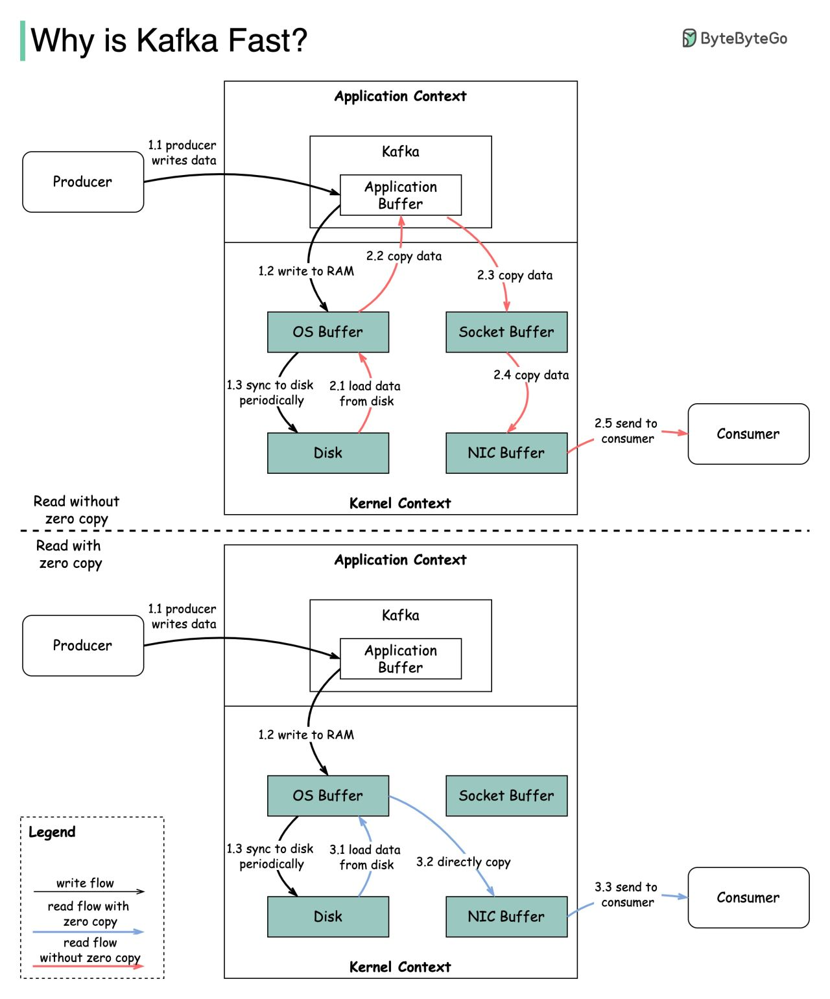
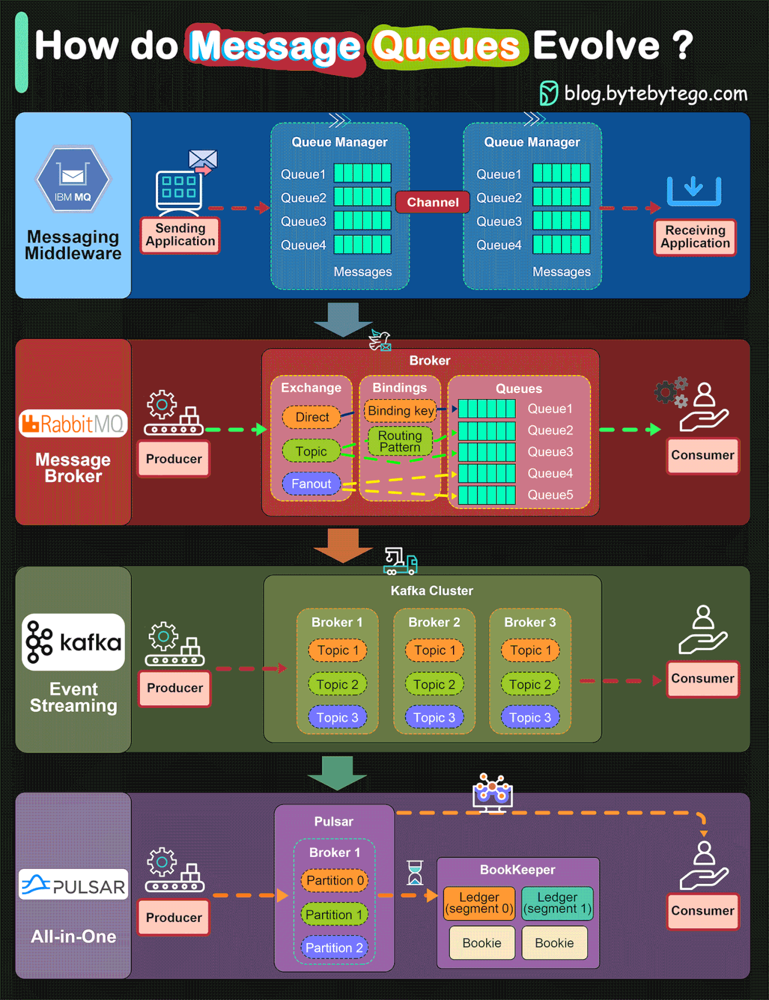

# Kafka

## ⚡ Kafka Performance Design Choices

### Why Kafka Fast

[Kafkademy](https://docs.conduktor.io/learn/fundamentals/what-is-apache-kafka)

<details>

<summary><strong> Steps to setup kafka </strong></summary> 

[Kafka In windows using wsl2](https://docs.conduktor.io/learn/getting-started/install-windows)

[udemy Video](https://www.bilibili.com/video/BV17yNEeWER8?spm_id_from=333.788.videopod.episodes&lang=en&vd_source=233e6f9069beac6800b5ee1b3d47a6b4&p=22)

[Steps to follow](https://docs.conduktor.io/learn/getting-started/install-windows-kraft#installing-wsl2)
- Follow from the above link till the jdk installation. **Note:** Java version 21 will be compatible for new release of kafka.
- Change 11 to 21 in the line `sudo apt-get update; sudo apt-get install -y java-21-amazon-corretto-jdk`
- Then go to link https://kafka.apache.org/community/downloads/ copy the link from binary download type `Binary download: kafka_2.13-4.1.1.tgz (asc, sha512)
  4.1.0` https://dlcdn.apache.org/kafka/4.1.1/kafka_2.13-4.1.1.tgz
- Paste it in the ubuntu console `wget https://dlcdn.apache.org/kafka/4.1.1/kafka_2.13-4.1.1.tgz`
- Once done, at the bottom you will find the name of the file in console. Extract it using this `tar xzf kafka_2.13-4.1.1.tgz`
- Then type `ls` and see. Then `pwd` and see.
- To find all the commands, type `ls kafka_2.13-4.1.1/bin/`
- Now try `kafka_2.13-4.1.1/bin/kafka-topics.sh`
- now go to the directory, type -> `cd kafka_2.13-4.1.1/bin/` (Enter) and `pwd` (Enter), then copy the path shows bellow `/home/sarath/kafka_2.13-4.1.1/bin`
- now go back to home directory, `cd ../../` or `cd`
- now type `nano .bashrc`. This will take in to edit file.
- now do this https://docs.conduktor.io/learn/getting-started/install-windows-kraft#setup-the-$path-environment-variable
- go to the bottom of the line in the console and paste `PATH="$PATH:/home/sarath/kafka_2.13-4.1.1/bin"`
- Now close the file `ctrl + X` and save.
- Restart the ubuntu by close and open ubuntu and type `echo $PATH` and at the last line we can see the kafka bin.
- Now type `kafka-topics.sh`. This should run in home page. If doesn't run, then it is due to the path mismatch.
- Now run kafka in kraft mode - https://docs.conduktor.io/learn/getting-started/install-windows-kraft#start-kafka
- now no need to do like this as mentioned in the webpage `~/kafka_2.13-2.8.1/bin/kafka-storage.sh random-uuid`, just type `kafka-storage.sh random-uuid`
- now use the uuid here `kafka-storage.sh format -t <uuid> -c ~/kafka_2.13-2.8.1/config/server.properties`
- ```
    sarath@Sarath6A9Kumar:~$ kafka-storage.sh format -t 53zsuU1wQ_6Ldl4SKrh26g -c ~/kafka_2.13-4.1.1/config/server.properties
    Because controller.quorum.voters is not set on this controller, you must specify one of the following: --standalone, --initial-controllers, or --no-initial-controllers.
    ```

<details>

<summary><strong> Select which one is needed </strong></summary>

Yep — this is a **KRaft mode** thing, not a bug. Kafka is basically saying: *“I don’t know what kind of controller setup you’re using, so tell me.”*

### What’s going on

In Kafka **4.x (KRaft mode)**, `kafka-storage.sh format` needs to know **how controllers are initialized**. Since your `server.properties` **does not define** `controller.quorum.voters`, Kafka can’t infer it automatically.

So you must explicitly choose **one** of these options.

---

## The 3 valid fixes (pick ONE)

### ✅ **1. Single-node / local / dev setup (most common)**

Use **standalone** mode:

```bash
kafka-storage.sh format \
  -t 53zsuU1wQ_6Ldl4SKrh26g \
  -c ~/kafka_2.13-4.1.1/config/server.properties \
  --standalone
```

👉 Use this if:

* You have **one broker**
* You’re testing locally
* No separate controller nodes

This is what most people want.

---

### ✅ **2. Multi-node cluster – define initial controllers**

If this is a real cluster, you must tell Kafka **who the controllers are**:

```bash
kafka-storage.sh format \
  -t 53zsuU1wQ_6Ldl4SKrh26g \
  -c ~/kafka_2.13-4.1.1/config/server.properties \
  --initial-controllers 1@host1:9093,2@host2:9093,3@host3:9093
```

👉 Use this if:

* You’re setting up a **KRaft quorum**
* Multiple controller nodes exist
* IDs and ports must match `node.id` and controller listeners

---

### ✅ **3. Advanced / automation case**

```bash
--no-initial-controllers
```

This is rare and usually used by orchestration systems. You can ignore this unless you *know* you need it.

---

## Quick recommendation

If you’re unsure → **use `--standalone`**
It’s safe, simple, and correct for 90% of setups.

---

</details>

- Now open the `server.properties` from the path `/kafka_2.13-4.1.1/config` type `nano server.properties`
- Add line `controller.quorum.voters=1@localhost:9093` under `controller.quorum.bootstrap.servers=localhost:9093` save and run the command again `kafka-storage.sh format -t 53zsuU1wQ_6Ldl4SKrh26g -c ~/kafka_2.13-4.1.1/config/server.properties`
- Once format completed, run this cmd to start `kafka-server-start.sh ~/kafka_2.13-4.1.1/config/server.properties`

## Kafka CLI: kafka-topics.sh

[CLI tutorials](https://docs.conduktor.io/learn/cli-tutorials/index)

**Kafka Topic Management**

1. Create Kafka Topics
2. List Kafka Topics
3. Describe Kafka Topics
4. Increase Partitions in a Kafka Topic
5. Delete a Kafka Topic

***Kafka Cluster***

- logs
- purchases
- twitter_tweets
- trucks_gps

[Download code from here](https://www.conduktor.io/apache-kafka-for-beginners)


## To run in docker, make use of docker compose file from below link

</details>





[Kafka Hello World](https://www.javainuse.com/spring/spring-boot-apache-kafka-hello-world)

# 📨 Evolution of Message Queue Architectures
### IBM MQ → RabbitMQ → Kafka → Pulsar

---

<details>
<summary><strong>🔹 IBM MQ</strong></summary>

- **Introduced:** 1993 (originally called *MQSeries*).
- **Renamed:** WebSphere MQ in 2002 → IBM MQ in 2014.
- **Overview:**  
  IBM MQ is one of the earliest enterprise-grade messaging systems, providing **reliable, transactional message delivery** between systems.
- **Key Strengths:**
    - Strong **ACID guarantees**
    - Designed for **banking and financial systems**
    - Robust **message persistence** and **security**
- **Industry Use:** Still widely used in the financial sector, generating over **$1 billion in revenue in 2020**.

</details>

---

<details>
<summary><strong>🔹 RabbitMQ</strong></summary>

- **Architecture:** Built on **AMQP (Advanced Message Queuing Protocol)**.
- **Core Concept:** Messages are sent to an **Exchange**, which routes them to **Queues** based on exchange type and routing keys.
- **Exchange Types:**
    - **Direct:** Message sent to queues with matching routing keys.
    - **Topic:** Message sent to queues with matching patterns.
    - **Fanout:** Message broadcast to all queues bound to the exchange.
- **Flow:**  
  **Producer → Exchange → Queue → Consumer**
- **Use Case:**  
  Ideal for **task queues**, **message routing**, and **application-level communication**.

</details>

---

<details>
<summary><strong>🔹 Kafka</strong></summary>

- **Created by:** LinkedIn, open-sourced in **2011**.
- **Nature:** A **distributed event streaming platform** optimized for **high-throughput** and **low-latency** data pipelines.
- **Architecture Concepts:**
    - **Producer, Broker, Topic, Partition, Consumer**
    - Data is stored in an **append-only log** for fault tolerance.
- **Advantages:**
    - Highly **scalable and durable**
    - Efficient for **real-time data streaming**
    - Simplifies **event-driven architecture**
- **Impact:**  
  Kafka’s design replaced many traditional **AMQP-based systems** and became the backbone of **modern data pipelines**.

</details>

---

<details>
<summary><strong>🔹 Pulsar</strong></summary>

- **Developed by:** Yahoo, now an **Apache open-source project**.
- **Architecture:** Designed as an **all-in-one messaging and streaming platform**.
- **Key Strengths:**
    - **Two-layer architecture:**
        - **Serving Layer:** Brokers handle message serving.
        - **Persistent Layer:** BookKeeper manages durable message storage.
    - **Tiered Storage:** Seamless integration with **object storage (e.g., AWS S3)** for long-term retention.
    - **Multi-tenancy & Geo-replication:** Built-in support for multi-region, cloud-native deployments.
    - **Dynamic Scaling:** Easier **partition migration** and cluster elasticity than Kafka.
- **Positioning:**  
  Pulsar combines **message queuing + event streaming** capabilities into one platform.

</details>

---

### ⚙️ Summary Comparison

| Feature         | IBM MQ               | RabbitMQ              | Kafka                      | Pulsar                               |
|-----------------|----------------------|-----------------------|----------------------------|--------------------------------------|
| **Released**    | 1993                 | 2007                  | 2011                       | 2016                                 |
| **Type**        | Enterprise Messaging | Message Broker        | Event Streaming            | Messaging + Streaming                |
| **Protocol**    | Proprietary          | AMQP                  | Custom TCP                 | Custom                               |
| **Persistence** | Strong               | Configurable          | Log-based                  | Tiered (BookKeeper + Object Storage) |
| **Scalability** | Moderate             | Moderate              | High                       | Very High                            |
| **Ideal Use**   | Financial systems    | Application messaging | Event streaming, analytics | Cloud-native messaging & storage     |

---

📘 **In Summary:**  
Message queue architectures have evolved from **enterprise-centric, transactional systems (IBM MQ)** to **lightweight brokers (RabbitMQ)**, then to **distributed streaming systems (Kafka)**, and finally to **cloud-native unified platforms (Pulsar)** — each iteration improving scalability, flexibility, and real-time data processing.

---

<details>
<summary><strong>1️⃣ Sequential I/O</strong></summary>

Kafka’s first performance advantage comes from its reliance on **Sequential I/O**.  
Instead of randomly reading or writing data on disk, Kafka performs **sequential writes**, which are significantly faster and more predictable — allowing it to handle **high-throughput message streams** efficiently.

</details>

---

<details>
<summary><strong>2️⃣ Zero Copy Principle</strong></summary>

The second major design choice behind Kafka’s exceptional performance is the **Zero Copy Principle**, which minimizes unnecessary data transfers between the **application** and **kernel** contexts.

---

### 🔹 Data Flow Overview

Below is how data is transmitted between the **producer** and **consumer**, illustrating what *zero-copy* means.

---

#### 🧩 Step 1: Producer Writes Data
- **1.1 – 1.3:** The producer writes data to disk sequentially.

---

#### ❌ Step 2: Consumer Reads Data *Without* Zero-Copy

| Step | Description                                                |
|------|------------------------------------------------------------|
| 2.1  | Data is loaded from disk to OS cache.                      |
| 2.2  | Data is copied from OS cache to the Kafka application.     |
| 2.3  | Kafka application copies the data into the socket buffer.  |
| 2.4  | Data is copied from the socket buffer to the network card. |
| 2.5  | The network card sends data out to the consumer.           |

---

#### ✅ Step 3: Consumer Reads Data *With* Zero-Copy

| Step | Description                                                                       |
|------|-----------------------------------------------------------------------------------|
| 3.1  | Data is loaded from disk to OS cache.                                             |
| 3.2  | OS cache directly copies data to the network card via the **sendfile()** command. |
| 3.3  | The network card sends data out to the consumer.                                  |

---

### 🧠 Why It Matters
**Zero-copy** is essentially a shortcut that saves multiple redundant data copies between **user space (application context)** and **kernel space**, resulting in:
- Reduced **CPU overhead**
- Faster **data transmission**
- Higher **throughput** and **lower latency**

</details>

