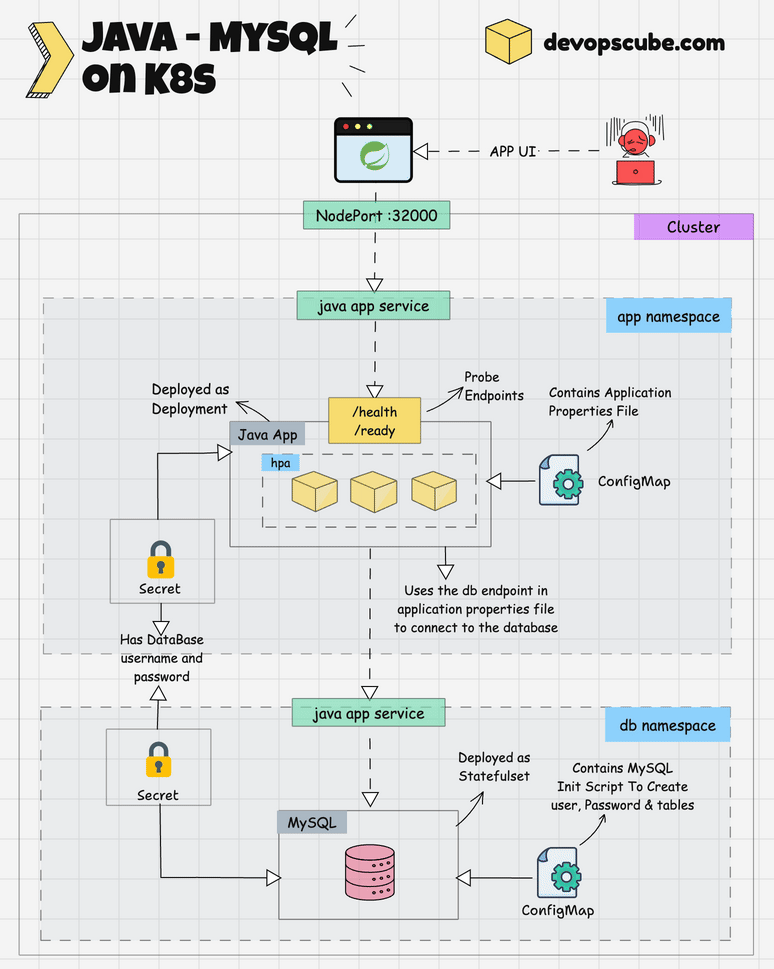
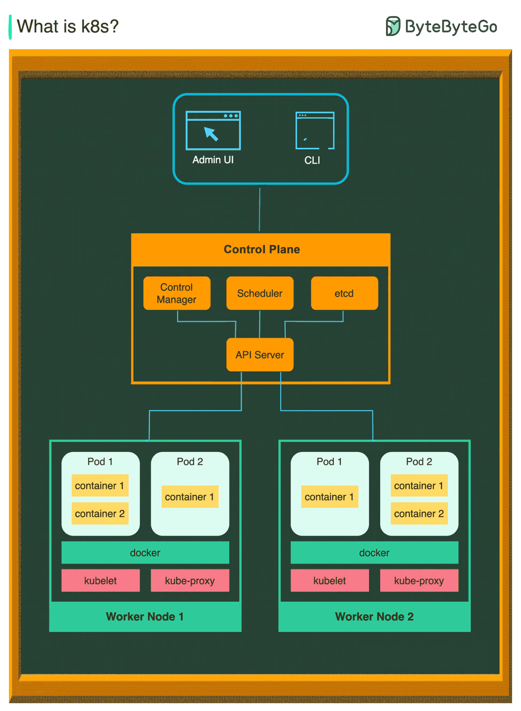

# Kubernetes




[java kuberneties deployment](https://devopscube.com/deploy-java-app-kubernetes/)


---
[GKE](https://youtu.be/Rl5M1CzgEH4?si=LLoZH-khdcmeVe79)
<details open>
<summary><strong>Kubernetes Overview</strong></summary>

* **Pod**
  In a POD, only one main application runs but it can have multiple containers. Each pod gets its own IP address and pods communicate internally using these IPs.

* **Node**
  Nodes are worker machines. If one node crashes, others take over the workload because of Kubernetes’ replication (blueprint) mechanism.

* **Service**
  Service provides a stable IP address and load balancing over multiple pods (copies of the same app).
  Types of Service:

    * **Internal**: Used for internal communication, e.g., DB access restricted inside the cluster.
    * **External**: Exposes an app to outside traffic (e.g., public URL). Uses **Ingress** as an entry point, which routes requests to services.

* **Ingress**
  Entry point for external traffic. It receives requests and forwards them to appropriate services inside the cluster.

* **ConfigMap**
  Used to inject configuration data (like DB configs) into pods without rebuilding images.

* **Secret**
  Securely stores sensitive data such as usernames and passwords.

* **StatefulSet**
  Manages stateful applications like databases, ensuring stable network IDs and storage.

* **Stateless (Deployment)**
  Used for stateless applications with replicas, where no persistent state is stored in pods.

* **Volume**
  Persistent storage for logs, data, etc., which can be local to the node or remote (network storage).

</details>

---

<details open>
<summary><strong>Google Kubernetes Engine (GKE) Architecture</strong></summary>

### 🏗️ GKE Overview

Managed Kubernetes service by Google Cloud Platform (GCP). It manages control plane components for you.

### 🧱 Key Components

1. **Control Plane (Managed by Google)**

    * Kubernetes API Server — main API endpoint

    * etcd — distributed key-value store for cluster state

    * Scheduler — decides which node runs which pod

    * Controller Manager — monitors cluster and manages state

    * Cloud Controller Manager — integrates Kubernetes with GCP services (load balancers, disks)

   > Autopilot mode: Google manages nodes.
   > Standard mode: You manage node pools.

2. **Node Pool (Managed/User-managed)**

    * Group of VM instances running:

        * kubelet (node agent)
        * kube-proxy (network proxy)
        * Container runtime (containerd)

3. **Add-ons & Integrations**

    * GCP IAM for access control
    * Cloud Monitoring & Logging
    * Load balancing with GCP LB
    * Persistent storage integration
    * VPC-native networking

---

# ☸️ 𝐊𝐮𝐛𝐞𝐫𝐧𝐞𝐭𝐞𝐬 (𝐊𝟖𝐬) 𝐎𝐯𝐞𝐫𝐯𝐢𝐞𝐰



**Kubernetes (K8s)** is a **container orchestration system** used for deploying, scaling, and managing containerized applications.  
It draws heavy inspiration from Google’s internal system **Borg** and has become the industry standard for container orchestration.

---

## 🏗️ 𝐀𝐫𝐜𝐡𝐢𝐭𝐞𝐜𝐭𝐮𝐫𝐞 𝐎𝐯𝐞𝐫𝐯𝐢𝐞𝐰

A **Kubernetes cluster** consists of a set of **worker nodes** that run containerized applications.  
Each cluster includes a **control plane** that manages the worker nodes and **Pods** (the smallest deployable units in Kubernetes).

In production, both the **control plane** and **worker nodes** typically span multiple machines for **fault-tolerance** and **high availability**.

---

## 🧭 𝐂𝐨𝐧𝐭𝐫𝐨𝐥 𝐏𝐥𝐚𝐧𝐞 𝐂𝐨𝐦𝐩𝐨𝐧𝐞𝐧𝐭𝐬

The control plane makes **global decisions** about the cluster and responds to cluster events (e.g., scheduling Pods, replacing failed Pods).

<details>
<summary><strong>1️⃣ API Server</strong></summary>

- The **API Server** is the **central communication hub** for the entire Kubernetes cluster.
- All `kubectl` commands and other component interactions go through it.
- It validates and processes REST requests and updates the cluster state in **etcd**.
- Acts as the **front-end** of the Kubernetes control plane.

</details>

<details>
<summary><strong>2️⃣ Scheduler</strong></summary>

- The **Scheduler** monitors newly created Pods that do not yet have an assigned node.
- It determines the **optimal node** to run each Pod based on resource availability and constraints.
- Plays a key role in balancing workload distribution across the cluster.

</details>

<details>
<summary><strong>3️⃣ Controller Manager</strong></summary>

- Runs multiple **controllers** that regulate the cluster’s state, including:
    - **Node Controller** – Manages node availability.
    - **Job Controller** – Manages Job objects ensuring Pods complete their tasks.
    - **EndpointSlice Controller** – Handles service endpoints efficiently.
    - **ServiceAccount Controller** – Manages default accounts and access permissions.
- Ensures that the **desired state** of the system matches the **current state**.

</details>

<details>
<summary><strong>4️⃣ etcd</strong></summary>

- A **highly available key-value store** used as Kubernetes' **backing store** for all cluster data.
- Stores configuration data, cluster state, and metadata.
- Provides **strong consistency** and is critical for cluster recovery.

</details>

---

## ⚙️ 𝐖𝐨𝐫𝐤𝐞𝐫 𝐍𝐨𝐝𝐞𝐬

Each **worker node** runs the services necessary to host Pods, manage network proxying, and maintain container runtime operations.

<details>
<summary><strong>1️⃣ Pods</strong></summary>

- A **Pod** is the **smallest deployable unit** in Kubernetes.
- It can contain **one or more containers** that share the same network namespace and storage.
- Each Pod has a **unique IP address**, applied to all containers within it.
- Typically used to group tightly coupled application containers.

</details>

<details>
<summary><strong>2️⃣ Kubelet</strong></summary>

- A **node-level agent** that ensures containers described in PodSpecs are **running and healthy**.
- Communicates with the **API Server** to receive Pod specifications.
- Reports node and Pod status back to the control plane.

</details>

<details>
<summary><strong>3️⃣ Kube Proxy</strong></summary>

- A **network proxy and load balancer** that runs on each node.
- Manages network rules and forwards requests to the correct Pod or container.
- Supports different proxy modes (e.g., iptables, IPVS) for efficient service routing.

</details>

---

## 🧩 𝐒𝐮𝐦𝐦𝐚𝐫𝐲 𝐓𝐚𝐛𝐥𝐞

| Component              | Layer         | Function                               |
|------------------------|---------------|----------------------------------------|
| **API Server**         | Control Plane | Cluster communication hub              |
| **Scheduler**          | Control Plane | Assigns Pods to nodes                  |
| **Controller Manager** | Control Plane | Maintains desired cluster state        |
| **etcd**               | Control Plane | Persistent key-value data store        |
| **Pods**               | Worker Node   | Smallest deployable unit               |
| **Kubelet**            | Worker Node   | Manages container lifecycle            |
| **Kube Proxy**         | Worker Node   | Handles service networking and routing |

---

💡 **Tip:**  
Use managed Kubernetes services like **GKE (Google Kubernetes Engine)**, **EKS (Amazon Elastic Kubernetes Service)**, or **AKS (Azure Kubernetes Service)** to simplify control plane management and focus on workload deployment.


### 🔗 Architecture Diagram (Text)

```
                +---------------------+
                |  GCP Management     |
                |  Console / gcloud   |
                +---------------------+
                          |
                          v
                +---------------------+
                |  GKE Control Plane  | <--- Managed by Google
                |  API Server, etcd   |
                |  Scheduler, CMs     |
                +---------------------+
                          |
           --------------------------------
          |               |               |
          v               v               v
+----------------+  +----------------+  +----------------+
| Node Pool A    |  | Node Pool B    |  | Node Pool C    |
| VM Instances   |  | GPU-enabled    |  | Preemptible    |
| kubelet, proxy |  | for ML         |  | for CI/CD      |
+----------------+  +----------------+  +----------------+
          |               |               |
          v               v               v
     +--------+      +--------+       +--------+
     |  Pods  |      |  Pods  |       |  Pods  |
     +--------+      +--------+       +--------+
```

---

### 🧠 Deployment Options

* **Standard Mode** — You manage nodes
* **Autopilot Mode** — Fully managed nodes by Google

</details>

---

<details>
<summary><strong>GKE YouTube Demo Commands</strong></summary>

### Part 1: Create a Sample Website Using Docker Container

```bash
docker run -p 8080:80 nginx:latest
docker cp index.html [container-id]:/usr/share/nginx/html/
docker commit [container-id] cad/web:version1
docker tag cad/web:version1 us.gcr.io/youtube-demo-255723/cad-site:version1
docker push us.gcr.io/youtube-demo-255723/cad-site:version1
```

---

### Part 2: Deploying Container in GKE Cluster

```bash
gcloud config set project youtube-demo-255723
gcloud config set compute/zone us-central1-a
```

Create a GKE cluster:

```bash
gcloud container clusters create gk-cluster --num-nodes=1
gcloud container clusters get-credentials gk-cluster
# Configures kubectl to use your new cluster
```

Deploy an application:

```bash
kubectl create deployment web-server --image=us.gcr.io/youtube-demo-255723/cad-site:version1
```

Expose the deployment as a service:

```bash
kubectl expose deployment web-server --type LoadBalancer --port 80 --target-port 80
```

Inspect running pods:

```bash
kubectl get pods
```

Check service details:

```bash
kubectl get service
```

---

### Sources

* [https://cloud.google.com/container-registry/docs/pushing-and-pulling](https://cloud.google.com/container-registry/docs/pushing-and-pulling)
* [https://docs.docker.com/engine/reference/commandline/commit/](https://docs.docker.com/engine/reference/commandline/commit/)
* [https://cloud.google.com/sdk/gcloud/reference/container/clusters/create](https://cloud.google.com/sdk/gcloud/reference/container/clusters/create)
* [https://cloud.google.com/kubernetes-engine/docs/concepts/architecture](https://cloud.google.com/kubernetes-engine/docs/concepts/architecture)

</details>


---