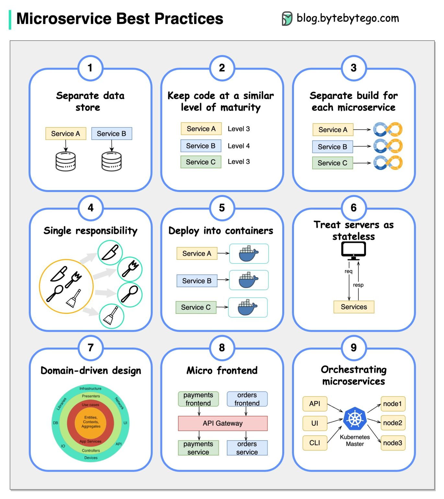
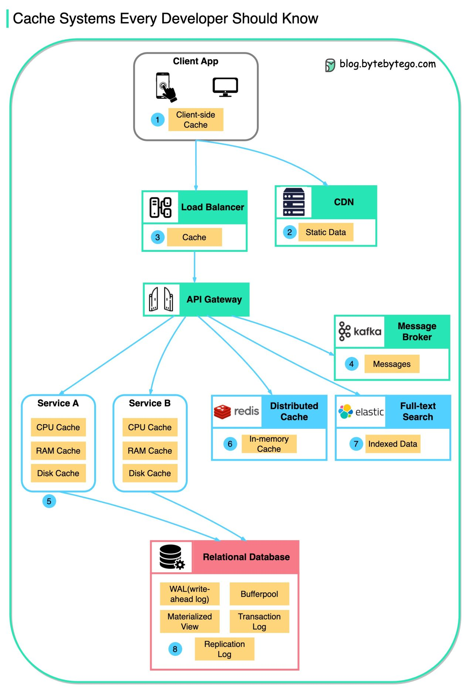
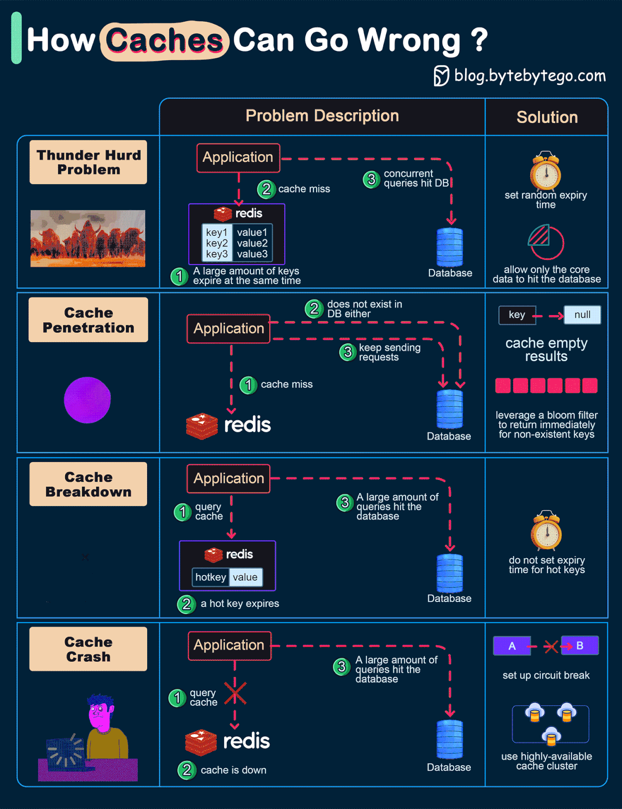
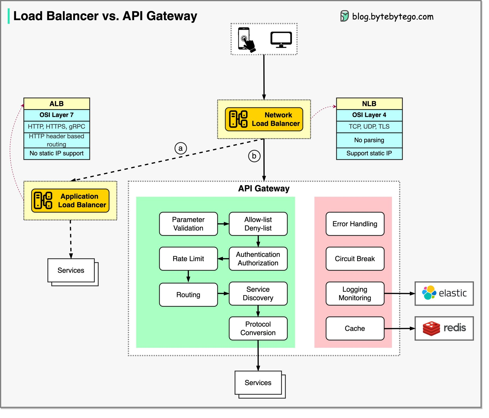
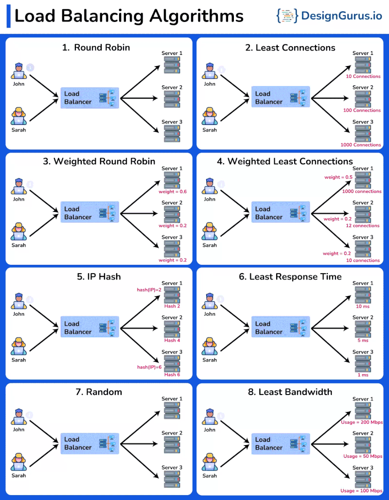
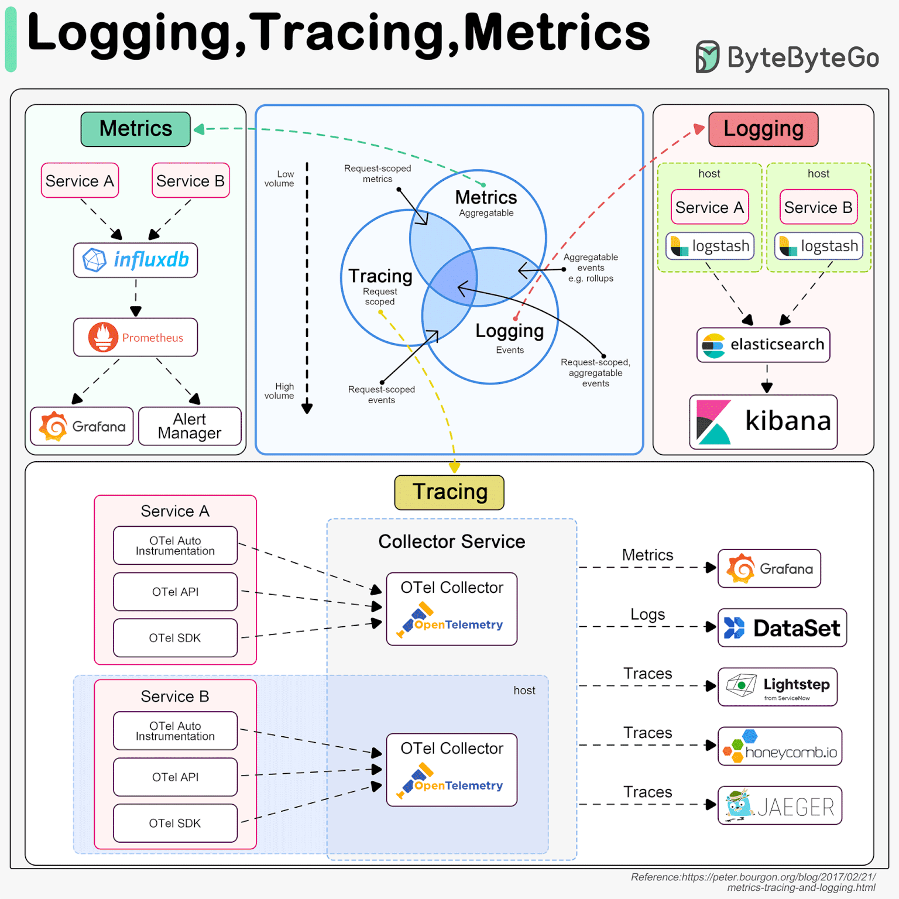

<!-- TOC -->
* [Microservice](#microservice)
  * [🔗 Useful Resources](#-useful-resources)
    * [🔑 Key Benefits:](#-key-benefits)
    * [🔌 Communication Options:](#-communication-options)
    * [🖥️ Virtual Machines (VMs):](#-virtual-machines-vms)
    * [📦 Containers (e.g., Docker):](#-containers-eg-docker)
    * [📈 Scalability:](#-scalability)
    * [🔂 Common Caching Patterns:](#-common-caching-patterns)
    * [🛠️ Tools:](#-tools)
    * [🧭 How It Works:](#-how-it-works)
    * [🧰 Popular Tools:](#-popular-tools)
    * [🔧 Types:](#-types)
  * [📌 Topics Covered](#-topics-covered)
    * [🧭 1. Client-Side Load Balancing](#-1-client-side-load-balancing)
      * [🧰 Tools:](#-tools-1)
      * [📦 Sample: Ribbon Dependency](#-sample-ribbon-dependency)
      * [📦 Sample: LoadBalanced Feign Client](#-sample-loadbalanced-feign-client)
    * [🌐 2. Server-Side Load Balancing](#-2-server-side-load-balancing)
      * [🔧 Tools:](#-tools-2)
    * [📦 3. Kubernetes-Based Load Balancing](#-3-kubernetes-based-load-balancing)
    * [🔍 4. DNS-Based Load Balancing](#-4-dns-based-load-balancing)
    * [📡 5. Global/Distributed Load Balancing](#-5-globaldistributed-load-balancing)
    * [⚙️ Load Balancing Algorithms](#-load-balancing-algorithms)
    * [📊 Monitoring & Auto-scaling](#-monitoring--auto-scaling)
  * [8 Load Balancing Algorithms You Must Know](#8-load-balancing-algorithms-you-must-know)
    * [1. Round Robin](#1-round-robin)
    * [2. Least Connections](#2-least-connections)
    * [3. Weighted Round Robin](#3-weighted-round-robin)
    * [4. Weighted Least Connections](#4-weighted-least-connections)
    * [5. IP Hash](#5-ip-hash)
    * [6. Least Response Time](#6-least-response-time)
    * [7. Random](#7-random)
    * [8. Least Bandwidth](#8-least-bandwidth)
    * [Q1: 🛑 How do you handle a malfunctioning microservice?](#q1--how-do-you-handle-a-malfunctioning-microservice)
    * [Q2: 🚀 Why do we use Microservices?](#q2--why-do-we-use-microservices)
      * [✅ Key Advantages:](#-key-advantages)
      * [⚠️ Challenges:](#-challenges)
    * [Q3: 🌐 How will you maintain load balance in microservices?](#q3--how-will-you-maintain-load-balance-in-microservices)
      * [✅ Strategies:](#-strategies)
    * [🔁 Circuit Breaker States](#-circuit-breaker-states)
    * [⚙️ How It Works](#-how-it-works-1)
    * [✅ Benefits](#-benefits)
    * [🔧 Configuration (Resilience4j Example)](#-configuration-resilience4j-example)
    * [🧰 Common Libraries](#-common-libraries)
* [API Gateway in Microservices](#api-gateway-in-microservices)
    * [🧭 Key Responsibilities of an API Gateway](#-key-responsibilities-of-an-api-gateway)
    * [⚖️ Built-in Load Balancing](#-built-in-load-balancing)
    * [🔐 Filters: Pre and Post](#-filters-pre-and-post)
      * [🔹 Pre-Filters](#-pre-filters)
      * [🔹 Post-Filters](#-post-filters)
    * [🧰 Popular API Gateway Solutions](#-popular-api-gateway-solutions)
    * [✅ Advantages of API Gateways](#-advantages-of-api-gateways)
    * [⚠️ Things to Watch Out For](#-things-to-watch-out-for)
    * [📊 Feature Comparison Table](#-feature-comparison-table)
    * [⚙️ Configuration Overview](#-configuration-overview)
    * [✅ When to Use What?](#-when-to-use-what)
    * [💡 Example: Istio VirtualService for Canary Deployment](#-example-istio-virtualservice-for-canary-deployment)
  * [**basic configuration/code samples** for both **Eureka** (Spring Boot/Netflix OSS) and **Apigee** (Google Cloud API Gateway) to help you get started.](#basic-configurationcode-samples-for-both-eureka-spring-bootnetflix-oss-and-apigee-google-cloud-api-gateway-to-help-you-get-started)
    * [🖥️ 1. Setup Eureka Server](#-1-setup-eureka-server)
      * [👉 Dependencies (`pom.xml`)](#-dependencies-pomxml)
      * [👉 Main Class](#-main-class)
      * [👉 `application.yml` (Eureka Server)](#-applicationyml-eureka-server)
    * [📦 2. Setup Eureka Client (Microservice)](#-2-setup-eureka-client-microservice)
      * [👉 Dependencies (`pom.xml`)](#-dependencies-pomxml-1)
      * [👉 Main Class](#-main-class-1)
      * [👉 `application.yml` (Eureka Client)](#-applicationyml-eureka-client)
    * [🧾 1. Create a Proxy in the Apigee Console](#-1-create-a-proxy-in-the-apigee-console)
    * [💻 2. Example: Proxy via OpenAPI Spec](#-2-example-proxy-via-openapi-spec)
    * [🔐 3. Attach Auth, Quota, and Caching Policies (XML)](#-3-attach-auth-quota-and-caching-policies-xml)
      * [📌 Example: Quota Policy (`quota.xml`)](#-example-quota-policy-quotaxml)
    * [📄 4. Example: Sample `openapi.yaml`](#-4-example-sample-openapiyaml)
    * [📊 5. Monitoring in Apigee](#-5-monitoring-in-apigee)
* [**Microservice Strangler Fig Pattern Strategy**](#microservice-strangler-fig-pattern-strategy)
    * [🔄 **Purpose**](#-purpose)
    * [🌱 **Analogy: The Strangler Fig Tree**](#-analogy-the-strangler-fig-tree)
    * [🧠 **How It Works**](#-how-it-works-2)
    * [🧰 Tools Often Used](#-tools-often-used)
    * [✅ **Advantages**](#-advantages)
    * [⚠️ **Challenges**](#-challenges-1)
    * [💡 Example Use Case](#-example-use-case)
    * [📘 Summary](#-summary)
  * [# **important topics in Microservices**](#-important-topics-in-microservices)
    * [🔹 Synchronous Communication](#-synchronous-communication)
    * [🔹 Asynchronous Communication](#-asynchronous-communication)
    * [🧠 Common Patterns](#-common-patterns)
    * [🛡️ Best Practices](#-best-practices)
    * [📘 Key Concepts](#-key-concepts)
    * [🧾 Strategies](#-strategies-1)
    * [🔁 Refresh strategies](#-refresh-strategies)
    * [🧰 Tools](#-tools-3)
    * [🏗️ Key Features](#-key-features)
    * [🗃️ Principles](#-principles)
    * [🛠️ Tools](#-tools-4)
    * [📌 API Versioning Strategies](#-api-versioning-strategies)
    * [📘 Documentation](#-documentation)
    * [🧠 How It Works: The Sidecar Pattern](#-how-it-works-the-sidecar-pattern)
    * [🏛️ Key Pillars of a Service Mesh](#-key-pillars-of-a-service-mesh)
    * [🧰 Popular Tools](#-popular-tools-1)
    * [✅ When to Use What?](#-when-to-use-what-1)
    * [💡 Example: Istio VirtualService for Canary Deployment](#-example-istio-virtualservice-for-canary-deployment-1)
    * [✅ Advantages](#-advantages-1)
    * [⚠️ Challenges](#-challenges-2)
    * [🏛️ The Pillars of Cloud Native (as defined by the CNCF)](#-the-pillars-of-cloud-native-as-defined-by-the-cncf)
    * [✅ How Microservices Enable a Cloud-Native Approach](#-how-microservices-enable-a-cloud-native-approach)
    * [🧰 Key Cloud-Native Technologies](#-key-cloud-native-technologies)
    * [✅ When to Go Cloud Native](#-when-to-go-cloud-native)
    * [🧠 How It Works](#-how-it-works-3)
    * [✅ Choreography vs. Orchestration: When to Use What?](#-choreography-vs-orchestration-when-to-use-what)
    * [💡 Example: E-commerce Order](#-example-e-commerce-order)
      * [Choreography-Based Saga:](#choreography-based-saga)
      * [Orchestration-Based Saga:](#orchestration-based-saga)
    * [✅ When to Use the Saga Pattern](#-when-to-use-the-saga-pattern)
    * [🧠 How It Works](#-how-it-works-4)
    * [🏛️ Architecture](#-architecture)
    * [✅ Advantages](#-advantages-2)
    * [⚠️ Challenges](#-challenges-3)
    * [✅ When to Use CQRS](#-when-to-use-cqrs)
    * [💡 Conceptual Code Example (Java)](#-conceptual-code-example-java)
    * [🤝 CQRS and Event Sourcing](#-cqrs-and-event-sourcing)
  * [Cqrs Pattern, what is the solution scenario used](#cqrs-pattern-what-is-the-solution-scenario-used)
    * [1. **Separation of Concerns:**](#1-separation-of-concerns)
    * [2. **Scalability:**](#2-scalability)
    * [3. **Flexibility and Optimization:**](#3-flexibility-and-optimization)
    * [4. **Event Sourcing:**](#4-event-sourcing)
    * [5. **Complex Domain Logic:**](#5-complex-domain-logic)
    * [🔌 1. Circuit Breaker Pattern](#-1-circuit-breaker-pattern)
    * [🔄 2. Retry Pattern](#-2-retry-pattern)
    * [⏳ 3. Timeout Pattern](#-3-timeout-pattern)
    * [🧱 4. Bulkhead Pattern](#-4-bulkhead-pattern)
    * [🚦 5. Rate Limiter Pattern](#-5-rate-limiter-pattern)
    * [✅ When to Use Which Resilience Pattern?](#-when-to-use-which-resilience-pattern)
    * [💡 Example: Resilience4j Circuit Breaker + Retry (Java/Spring Boot)](#-example-resilience4j-circuit-breaker--retry-javaspring-boot)
    * [🧰 Tools for Resilience](#-tools-for-resilience)
* [🧩 Key Components of Microservices Architecture](#-key-components-of-microservices-architecture)
    * [**Real-World Microservice Example: Graceful Shutdown Flag in Spring Boot**](#real-world-microservice-example-graceful-shutdown-flag-in-spring-boot)
    * [**Example: Background Job with `volatile` flag**](#example-background-job-with-volatile-flag)
    * [**Triggering Stop on Shutdown**](#triggering-stop-on-shutdown)
    * [**Main Application**](#main-application)
    * [**How it works**](#how-it-works)
    * [**Scenario: Counter Increment**](#scenario-counter-increment)
      * [❌ Using `volatile` only (WRONG)](#-using-volatile-only-wrong)
      * [✅ Correct Approach: Use `AtomicInteger`](#-correct-approach-use-atomicinteger)
    * [**Real-World Microservice Example**](#real-world-microservice-example)
* [Microservice questions](#microservice-questions)
    * [**1. What are microservices, and how do they differ from monolithic architecture?**](#1-what-are-microservices-and-how-do-they-differ-from-monolithic-architecture)
    * [**2. What are the main advantages of using microservices?**](#2-what-are-the-main-advantages-of-using-microservices)
    * [**3. What are the challenges of microservice architectures?**](#3-what-are-the-challenges-of-microservice-architectures)
    * [**4. How do microservices communicate with each other?**](#4-how-do-microservices-communicate-with-each-other)
    * [**5. What is service discovery, and why is it needed in microservices?**](#5-what-is-service-discovery-and-why-is-it-needed-in-microservices)
    * [**6. Can you explain API Gateway and its role in microservices?**](#6-can-you-explain-api-gateway-and-its-role-in-microservices)
    * [**7. How do you handle data consistency across multiple microservices?**](#7-how-do-you-handle-data-consistency-across-multiple-microservices)
    * [**8. What is the difference between synchronous and asynchronous communication in microservices?**](#8-what-is-the-difference-between-synchronous-and-asynchronous-communication-in-microservices)
    * [**9. How do you handle transactions in microservices?**](#9-how-do-you-handle-transactions-in-microservices)
    * [**10. What patterns are used to ensure reliability in microservices (e.g., Circuit Breaker)?**](#10-what-patterns-are-used-to-ensure-reliability-in-microservices-eg-circuit-breaker)
    * [**11. How do you monitor and log across distributed microservices?**](#11-how-do-you-monitor-and-log-across-distributed-microservices)
    * [**12. What is the role of containerization (e.g., Docker) in microservices?**](#12-what-is-the-role-of-containerization-eg-docker-in-microservices)
    * [**13. How do orchestration tools like Kubernetes help in microservices?**](#13-how-do-orchestration-tools-like-kubernetes-help-in-microservices)
    * [**14. What is eventual consistency, and how does it apply to microservices?**](#14-what-is-eventual-consistency-and-how-does-it-apply-to-microservices)
    * [**15. How do you manage database per service vs. shared database in microservices?**](#15-how-do-you-manage-database-per-service-vs-shared-database-in-microservices)
    * [**16. What are some best practices for designing RESTful APIs for microservices?**](#16-what-are-some-best-practices-for-designing-restful-apis-for-microservices)
    * [**17. How do you secure microservices communication?**](#17-how-do-you-secure-microservices-communication)
    * [**18. What is distributed tracing, and why is it important?**](#18-what-is-distributed-tracing-and-why-is-it-important)
    * [**19. Can you explain the concept of “bounded context” in microservices?**](#19-can-you-explain-the-concept-of-bounded-context-in-microservices)
    * [**20. How do you test microservices (unit, integration, contract testing)?**](#20-how-do-you-test-microservices-unit-integration-contract-testing)
    * [**21. What is the Saga pattern, and when would you use it?**](#21-what-is-the-saga-pattern-and-when-would-you-use-it)
    * [**22. How do you handle versioning of microservices APIs?**](#22-how-do-you-handle-versioning-of-microservices-apis)
    * [**23. What is idempotency, and why is it important in microservices?**](#23-what-is-idempotency-and-why-is-it-important-in-microservices)
    * [**24. How do you deal with inter-service failures?**](#24-how-do-you-deal-with-inter-service-failures)
    * [**25. What design patterns are commonly used in microservices?**](#25-what-design-patterns-are-commonly-used-in-microservices)
    * [**26. How do you handle configuration management in microservices?**](#26-how-do-you-handle-configuration-management-in-microservices)
    * [**27. What is the difference between orchestration and choreography in microservices?**](#27-what-is-the-difference-between-orchestration-and-choreography-in-microservices)
    * [**28. How do you deploy and scale microservices?**](#28-how-do-you-deploy-and-scale-microservices)
    * [**29. What role does CI/CD play in microservices development?**](#29-what-role-does-cicd-play-in-microservices-development)
    * [**30. What are some anti-patterns in microservices?**](#30-what-are-some-anti-patterns-in-microservices)
  * [**16️⃣ How would you design inter-service communication to be fault-tolerant?**](#16-how-would-you-design-inter-service-communication-to-be-fault-tolerant)
    * [💡 Problem](#-problem)
    * [🧩 Fault-tolerance Techniques](#-fault-tolerance-techniques)
    * [✅ Example (Resilience4j)](#-example-resilience4j)
    * [🧠 Tip](#-tip)
  * [**17️⃣ What’s the difference between API Gateway vs Load Balancer?**](#17-whats-the-difference-between-api-gateway-vs-load-balancer)
  * [**18️⃣ How do you implement distributed tracing in microservices?**](#18-how-do-you-implement-distributed-tracing-in-microservices)
    * [💡 Goal](#-goal)
    * [⚙️ How It Works](#-how-it-works-5)
    * [🔧 Implementation Steps](#-implementation-steps)
    * [🧠 Benefits](#-benefits-1)
  * [**19️⃣ Explain the Saga pattern in distributed transactions**](#19-explain-the-saga-pattern-in-distributed-transactions)
    * [💡 Problem](#-problem-1)
    * [✅ **Saga Pattern**](#-saga-pattern)
    * [🔹 Types](#-types-1)
    * [🧩 Example (Order → Payment → Inventory)](#-example-order--payment--inventory)
    * [🧠 Key Points](#-key-points)
  * [**20️⃣ How would you secure internal service-to-service communication?**](#20-how-would-you-secure-internal-service-to-service-communication)
    * [🧩 Layers of Security](#-layers-of-security)
    * [🔐 Example (mTLS)](#-example-mtls)
    * [🔐 Example (JWT propagation)](#-example-jwt-propagation)
    * [🧠 Advanced: Service Mesh](#-advanced-service-mesh)
    * [✅ **Summary Table**](#-summary-table)
  * [**11️⃣ Data Consistency Without Distributed Transactions**](#11-data-consistency-without-distributed-transactions)
  * [**12️⃣ Saga Pattern Example**](#12-saga-pattern-example)
  * [**13️⃣ Securing Microservices**](#13-securing-microservices)
  * [**14️⃣ Kafka Consumer Slower Than Producer**](#14-kafka-consumer-slower-than-producer)
  * [**15️⃣ Preventing Cascade Failure**](#15-preventing-cascade-failure)
  * [**15 Key API Design Rules / Best Practices**](#15-key-api-design-rules--best-practices)
    * [✅ Quick Tip](#-quick-tip)
<!-- TOC -->

# Microservice

---

## 🔗 Useful Resources

* ▶️ [YouTube - Code Decode](https://www.youtube.com/watch?v=tGGo15irME8&t=2305s&ab_channel=CodeDecode)
* 💻 [GitHub - Microservices Vaccination App](https://github.com/codedecode25/Microservices_vaccination_citizen)
* 🎞️ [Code Decode YouTube Playlists](https://www.youtube.com/@CodeDecode/playlists)
* 🛡️ [Circuit Breaker Pattern (VinsGuru)](https://www.vinsguru.com/circuit-breaker-pattern/)
* 🧠 [Caching in Microservices (LinkedIn)](https://www.linkedin.com/pulse/exploring-caching-patterns-microservices-architecture-saeed-anabtawi/)
* 🔎 [Service Discovery (GeeksForGeeks)](https://www.geeksforgeeks.org/service-discovery-and-service-registry-in-microservices/)

---




<details open>
<summary><strong>📦 Microservice Architecture Overview</strong></summary>

🧩 Microservices Architecture Overview
🔹 Client Layer:
Clients (Web, Mobile, Postman, etc.) send all requests via a single entry point — API Gateway.

🔹 API Gateway:
Handles Authentication, Routing, and Rate Limiting before forwarding requests to appropriate services.

🔹 Service Discovery (Eureka / Consul / Zookeeper):
Keeps a registry of all active service instances.
When a service scales up or down, it’s automatically discovered and updated — ensuring fault tolerance.

🔹 Microservices (e.g., User, Loan, Payment, Notification, Report):
Each service is independent, loosely coupled, and owns its own database.

🔹 Database Layer:
Every microservice has its own Master + Replica DB setup for better performance and high availability.
Master → handles write operations
Replicas → handle read operations

🔹 Load Balancer:
Distributes incoming requests across multiple service instances or replicas to avoid overload and ensure smooth traffic handling.

🧭 Architecture Diagram
📸 (Refer attached diagram image)
🖼️ The visual below represents how all these components fit together in a modern Microservices setup.

🚀 Highlights
✅ High availability with load balancing
✅ Scalability and service independence
✅ Fault tolerance through service discovery
✅ Optimized reads using DB replicas
✅ Secure and unified entry through API Gateway

Microservices architecture is an approach where an application is composed of **loosely coupled, independently deployable services**. Each service is:

* Focused on a specific business capability.
* Communicates via well-defined APIs.
* Developed and deployed independently.

### 🔑 Key Benefits:

* **Scalability:** Each service can be scaled independently.
* **Flexibility & Agility:** Allows rapid development and deployment.
* **Resilience & Fault Isolation:** Failure in one service doesn't affect others.
* **Technology Diversity:** Services can use different tech stacks.
* **Maintainability:** Smaller, focused codebases are easier to manage.
* **Easy Integration:** REST, gRPC, messaging, etc.

</details>

---

<details>
<summary><strong>🔁 Microservice Communication</strong></summary>

Services communicate using synchronous and asynchronous mechanisms.

### 🔌 Communication Options:

* **Feign Client** (Declarative REST Client)
* **RestTemplate** (Traditional blocking client)
* **RestClient** (Modern, synchronous client)
* **WebClient** (Reactive, non-blocking)
* **gRPC / Thrift** (Binary protocols)
* **Message Brokers:** Kafka, RabbitMQ for event-driven communication

</details>

---

<details>
<summary><strong>🚀 Deployment, Portability, and Scalability</strong></summary>

### 🖥️ Virtual Machines (VMs):

* Heavyweight
* Takes minutes to boot
* OS-level abstraction

### 📦 Containers (e.g., Docker):

* Lightweight and portable
* Fast startup time
* Share host OS kernel
* Ideal for microservices

### 📈 Scalability:

* Use orchestration tools like **Kubernetes**, **Docker Swarm** for:

    * Horizontal scaling
    * Auto-healing
    * Load balancing
    * Zero-downtime deployments

</details>

---

<details>
<summary><strong>🧠 Caching in Microservices</strong></summary>

Caching improves performance, reduces latency, and decreases load on services.

### 🔂 Common Caching Patterns:





* **Client-Side Cache:** Stores data locally (e.g., browser cache).
* **Server-Side Cache:** Shared cache used by services (e.g., Redis, Memcached).
* **CDN (Edge Cache):** For static content close to end-users.
* **Write-Through Cache:** Data written to cache and DB simultaneously.
* **Read-Through Cache:** Cache first, DB only if miss.
* **Cache-Aside (Lazy Load):** App fetches data, stores in cache.

### 🛠️ Tools:

* **Spring Cache Abstraction**
* **Redis**
* **Caffeine**
* **Hazelcast**

</details>

---

<details>
<summary><strong>🔍 Service Discovery</strong></summary>

Service discovery helps services find each other dynamically without hardcoding IPs or ports.

### 🧭 How It Works:

1. **Registration:** Services register themselves to a registry.
2. **Discovery:** Other services query the registry to get endpoint info.
3. **Load Balancing:** Requests are spread across healthy service instances.
4. **Health Checks:** Periodic checks to remove failed instances.
5. **Dynamic Updates:** Automatically reflects scaling or shutdown.
6. **Integration with Orchestration Tools:** e.g., Kubernetes, Consul, Eureka

### 🧰 Popular Tools:

* **Netflix Eureka**
* **Consul**
* **etcd**
* **Kubernetes built-in service registry**

### 🔧 Types:

* **Centralized Registry:** e.g., Eureka, Consul
* **DNS-Based Discovery:** Leverages service names via DNS
* **Client-Side Discovery:** Client queries the registry and load balances
* **Server-Side Discovery:** Load balancer (e.g., API Gateway) handles discovery

</details>

---


## 📌 Topics Covered

* [⚖️ Load Balancing in Microservices](#-load-balancing-in-microservices)
* [❓ Common Microservice Interview Questions](#-common-microservice-interview-questions)
* [🔌 Circuit Breaker Pattern](#-circuit-breaker-pattern)

---

<details>
<summary><strong>⚖️ Load Balancing in Microservices</strong></summary>



Load balancing ensures traffic is evenly distributed across service instances, improving **performance**, **reliability**, and **scalability**.

### 🧭 1. Client-Side Load Balancing

In this strategy, the **client selects the service instance** using an internal load-balancing library.

#### 🧰 Tools:

* **Netflix Ribbon** (Deprecated, but conceptually important)
* **Spring Cloud LoadBalancer**
* **Feign Clients with @LoadBalancerClient**

#### 📦 Sample: Ribbon Dependency

```xml
<dependency>
    <groupId>org.springframework.cloud</groupId>
    <artifactId>spring-cloud-starter-netflix-ribbon</artifactId>
</dependency>
```

#### 📦 Sample: LoadBalanced Feign Client

```xml
<dependency>
   <groupId>org.springframework.cloud</groupId>
   <artifactId>spring-cloud-starter-loadbalancer</artifactId>
</dependency>
```

```java
@LoadBalancerClient(value = "FLIGHT-RESERVATION")
public class ReservationLoadBalancerConfig {
   @Bean
   @LoadBalanced
   public Feign.Builder feiBuilder() {
      return Feign.builder();
   }
}
```

### 🌐 2. Server-Side Load Balancing

Handled by a **gateway or reverse proxy** that distributes requests to service instances.

#### 🔧 Tools:

* **API Gateway** (Spring Cloud Gateway, Netflix Zuul)
* **NGINX**, **HAProxy**
* **AWS ELB**, **Azure Load Balancer**

### 📦 3. Kubernetes-Based Load Balancing

Kubernetes inherently supports load balancing.

* **Services**: Distribute traffic to pods using label selectors.
* **Ingress Controllers**: Manage HTTP load balancing and routing.

### 🔍 4. DNS-Based Load Balancing

Uses DNS records to return different service IPs.

* **Round Robin DNS**
* **Weighted DNS**

⚠️ DNS caching may reduce effectiveness.

### 📡 5. Global/Distributed Load Balancing

For multi-region or high availability:

* **AWS Global Accelerator**
* **Cloudflare Load Balancer**
* **Anycast IP Routing**

### ⚙️ Load Balancing Algorithms

| Algorithm                | Description                        |
|--------------------------|------------------------------------|
| **Round Robin**          | Sequential request distribution    |
| **Least Connections**    | Sends to least busy instance       |
| **IP Hash**              | Sticky sessions based on client IP |
| **Weighted Round Robin** | Based on service capacity          |
| **Random**               | Randomly selects a node            |

### 📊 Monitoring & Auto-scaling

* **Prometheus**, **Grafana** for observability
* **Horizontal Pod Autoscaler (K8s)** for dynamic scaling

## 8 Load Balancing Algorithms You Must Know

### 1. Round Robin
It assigns a request to the first server, then moves to the second, third, and so on, and after reaching the last server, it starts again at the first.

### 2. Least Connections
The Least Connections algorithm directs incoming requests to the server with the lowest number of active connections.

### 3. Weighted Round Robin
It assigns different weights to servers based on their capacities and distributes requests proportionally to these weights.

### 4. Weighted Least Connections
The Weighted Least Connections algorithm combines the Least Connections and Weighted Round Robin algorithms.  
It directs incoming requests to the server with the lowest ratio of active connections to assigned weight.

### 5. IP Hash
The IP Hash algorithm determines the server to which a request should be sent based on the source and/or destination IP address.  
This method maintains session persistence, ensuring that requests from a specific user are directed to the same server.

### 6. Least Response Time
It directs incoming requests to the server with the lowest response time and the fewest active connections.

### 7. Random
It directs incoming requests to a randomly selected server from the available pool.

### 8. Least Bandwidth
It directs incoming requests to the server currently utilizing the least amount of bandwidth.  
This approach helps to ensure that servers are not overwhelmed by network traffic.



</details>

---

<details>
<summary><strong>❓ Common Microservice Interview Questions</strong></summary>

### Q1: 🛑 How do you handle a malfunctioning microservice?

* Deploy **multiple instances** on different ports.
* Use **load balancing** to redirect traffic from the failed instance to healthy ones.
* Implement **circuit breakers**, **health checks**, and **retry logic**.

---

### Q2: 🚀 Why do we use Microservices?

Microservices break down an application into smaller, independent services. Benefits include:

#### ✅ Key Advantages:

1. **Scalability:** Scale only what’s needed.
2. **Modularity & Maintainability:** Small, manageable components.
3. **Technology Diversity:** Use the right tool for the job.
4. **Faster Time to Market:** Independent development/deployment.
5. **Resilience:** Failures don’t affect the whole system.
6. **CI/CD Friendly:** Easier to automate deployments.
7. **Agility:** Quickly adapt to business changes.
8. **Focused Testing:** Better unit and integration testing.
9. **Cloud Readiness:** Works well with Docker, Kubernetes.
10. **Reusability:** Services reused across applications.

#### ⚠️ Challenges:

* Complexity in inter-service communication
* Data consistency
* Infrastructure overhead
* Monitoring and debugging complexity

---

### Q3: 🌐 How will you maintain load balance in microservices?

#### ✅ Strategies:

1. **Client-Side Load Balancing**

    * Uses service discovery + Ribbon/Spring Cloud LoadBalancer.
    * Example: `ReservationLoadBalancerConfig.java`

2. **API Gateway**

    * Routes and load balances requests to services.

3. **Reverse Proxies**

    * NGINX/HAProxy to balance HTTP/TCP traffic.

4. **Kubernetes**

    * Built-in load balancing via `Services` and `Ingress`.

5. **Service Mesh**

    * (e.g., Istio) offers fine-grained control.

6. **Global Load Balancers**

    * Cloud-based solutions for multi-region deployment.

</details>

---

<details>
<summary><strong>🔌 Circuit Breaker Pattern</strong></summary>

A circuit breaker **prevents cascading failures** by stopping calls to a failing service and allowing time for recovery.

### 🔁 Circuit Breaker States

| State         | Description                                                   |
|---------------|---------------------------------------------------------------|
| **Closed**    | Normal operation. Requests flow through.                      |
| **Open**      | Too many failures. All calls blocked.                         |
| **Half-Open** | Trial state. A few requests allowed to test service recovery. |

---

### ⚙️ How It Works

1. **Closed**: All requests allowed. Failures are tracked.
2. **Open**: If failure threshold is met, no further calls are allowed.
3. **Half-Open**: After a cooldown period, a few requests are tested.

    * If they succeed → back to Closed.
    * If they fail → back to Open.

---

### ✅ Benefits

* **Fault Isolation**
* **Improved System Stability**
* **Faster Recovery**

---

### 🔧 Configuration (Resilience4j Example)

```yaml
resilience4j.circuitbreaker:
  instances:
    myService:
      slidingWindowSize: 10
      failureRateThreshold: 50
      waitDurationInOpenState: 30s
      permittedNumberOfCallsInHalfOpenState: 3
```

---

### 🧰 Common Libraries

| Tool                             | Notes                                           |
|----------------------------------|-------------------------------------------------|
| **Hystrix**                      | Netflix's legacy library (no longer maintained) |
| **Resilience4j**                 | Lightweight, modern, Java 8+ functional         |
| **Spring Cloud Circuit Breaker** | Abstraction for different circuit breaker tools |

---

</details>

---

# API Gateway in Microservices

<details>
<summary><strong>🌐 API Gateway in Microservices</strong></summary>

An **API Gateway** is a **centralized entry point** for handling all requests in a microservices architecture. It performs routing, security, monitoring, load balancing, and more, abstracting the internal system complexity from clients.

---

### 🧭 Key Responsibilities of an API Gateway

| Feature                              | Description                                                        |
|--------------------------------------|--------------------------------------------------------------------|
| **Routing**                          | Directs requests to the correct backend service.                   |
| **Load Balancing**                   | Distributes incoming traffic across multiple service instances.    |
| **Authentication & Authorization**   | Ensures only verified clients can access services.                 |
| **Centralized Logging & Monitoring** | Captures logs and metrics for observability.                       |
| **Rate Limiting & Throttling**       | Protects services from overload by limiting request rates.         |
| **Caching**                          | Stores responses for repeated requests to improve performance.     |
| **Protocol Translation**             | Converts between client and backend protocols (e.g., HTTP ↔ gRPC). |
| **Request/Response Transformation**  | Modifies payloads, headers, or response format.                    |
| **Aggregation**                      | Combines responses from multiple services into a single output.    |

---

### ⚖️ Built-in Load Balancing

Most API Gateways (e.g., Spring Cloud Gateway, Apigee, Kong) provide **built-in server-side load balancing**:

* Removes the need for client-side load balancers (e.g., Ribbon).
* Distributes traffic to available service instances automatically.
* Integrates with service discovery for dynamic routing.

---

### 🔐 Filters: Pre and Post

API Gateways use filters for cross-cutting concerns.

#### 🔹 Pre-Filters

* Executed **before routing**.
* Common uses: **authentication**, **logging**, **header validation**.

#### 🔹 Post-Filters

* Executed **after service response**.
* Common uses: **adding headers**, **logging**, **metrics collection**.

---

### 🧰 Popular API Gateway Solutions

| Gateway                  | Type                      | Description                                                                                           |
|--------------------------|---------------------------|-------------------------------------------------------------------------------------------------------|
| **Apigee**               | Commercial (Google Cloud) | Enterprise-grade API management. Full support for analytics, rate limiting, monetization, and OAuth2. |
| **Kong Gateway**         | Open Source / Enterprise  | Built on NGINX. Plugin-based. Scalable and performant.                                                |
| **Apache APISIX**        | Open Source               | High-performance, dynamic, cloud-native API Gateway built on OpenResty.                               |
| **Traefik**              | Open Source               | Modern reverse proxy with dynamic service discovery. Great for Docker and Kubernetes.                 |
| **Spring Cloud Gateway** | Open Source (Java/Spring) | Native to Spring ecosystem. Built-in filters, reactive support.                                       |
| **NGINX**                | Open Source / Commercial  | Traditional reverse proxy/load balancer with API management extensions.                               |

---

### ✅ Advantages of API Gateways

* Simplifies client interaction with backend microservices.
* Centralized policy enforcement.
* Reduces complexity on client side.
* Enables observability and security best practices.

---

### ⚠️ Things to Watch Out For

* **Single Point of Failure**: Must ensure gateway is highly available.
* **Latency Overhead**: Adds a hop in request-response cycle.
* **Scaling Needs**: Should scale horizontally to meet traffic demand.

---

</details>

---

Here’s a **collapsible section** comparing **Eureka** and **Apigee Gateway** in terms of features and configuration. This includes:

* Purpose
* Feature set
* Typical use cases
* Configuration overview

Formatted in both **table form** and **collapsible markdown** for clear, structured documentation.

---

<details>
<summary><strong>🔍 Eureka vs Apigee API Gateway – Feature & Configuration Comparison</strong></summary>

### 📊 Feature Comparison Table

| Feature / Capability                | **Eureka (Netflix OSS)**                   | **Apigee (Google Cloud API Gateway)**                |
|-------------------------------------|--------------------------------------------|------------------------------------------------------|
| **Type**                            | Service Discovery                          | Full-featured API Gateway & Management Platform      |
| **Provider**                        | Netflix OSS, Spring Cloud Netflix          | Google Cloud (Enterprise Product)                    |
| **Primary Role**                    | Registers and discovers microservices      | Routes, secures, monitors, and manages APIs          |
| **Load Balancing**                  | ✖️ (Used with Ribbon / Spring Cloud LB)    | ✔️ Built-in                                          |
| **Authentication & Authorization**  | ✖️ Delegated to other tools                | ✔️ OAuth 2.0, API Keys, JWT                          |
| **Traffic Management (Rate Limit)** | ✖️                                         | ✔️ Policies for throttling, quotas, rate limiting    |
| **Request/Response Transformation** | ✖️                                         | ✔️ Header/body manipulation supported                |
| **Analytics & Monitoring**          | ✖️ Basic via Spring Boot Actuator          | ✔️ Advanced API usage analytics, billing, monitoring |
| **Caching Support**                 | ✖️                                         | ✔️ Built-in response caching                         |
| **Protocol Support**                | Internal only (HTTP, REST)                 | HTTP(S), gRPC, WebSockets                            |
| **API Monetization**                | ✖️                                         | ✔️ Supported                                         |
| **Service Mesh Integration**        | Partial (e.g., with Istio via workarounds) | Not natively, but supports proxying into meshes      |
| **Multi-Cloud / Hybrid Support**    | No                                         | ✔️ Designed for hybrid and multi-cloud deployments   |
| **UI Management Console**           | ✔️ (via Spring Dashboard or Eureka UI)     | ✔️ Full-featured web interface for managing APIs     |

---

### ⚙️ Configuration Overview

| Configuration Step        | **Eureka**                                                | **Apigee**                                         |
|---------------------------|-----------------------------------------------------------|----------------------------------------------------|
| **1. Add Dependencies**   | `spring-cloud-starter-netflix-eureka-server`              | No dependencies; managed via GCP & API proxies     |
| **2. Enable Server**      | `@EnableEurekaServer` on a Spring Boot app                | Create API proxies in Apigee UI or via Apigee APIs |
| **3. Register Clients**   | `@EnableEurekaClient` + service name in `application.yml` | Upload or define OpenAPI spec or proxy endpoint    |
| **4. Discovery Settings** | Specify `eureka.client.serviceUrl.defaultZone`            | Define routing targets and policies                |
| **5. Load Balancing**     | Use Ribbon or Spring Cloud LoadBalancer                   | Automatically handled within Apigee                |
| **6. Security & Auth**    | Custom or delegated (e.g., Spring Security, OAuth config) | Built-in: API key validation, OAuth2, JWT policies |
| **7. Logging/Monitoring** | Via Spring Boot Actuator, Zipkin, Sleuth                  | Advanced monitoring dashboards in Apigee Console   |
| **8. Rate Limiting**      | Not built-in (custom logic or Spring Cloud Gateway)       | Policy-driven configuration per API in Apigee      |

---

### ✅ When to Use What?

| Use Case                             | Use **Eureka**              | Use **Apigee**                                      |
|--------------------------------------|-----------------------------|-----------------------------------------------------|
| Internal service discovery           | ✔️ Yes                      | ✖️ Overkill for internal use only                   |
| Public API management                | ✖️ Not suitable             | ✔️ Ideal for managing and exposing public APIs      |
| API monetization / external clients  | ✖️ Not supported            | ✔️ Monetization, subscriptions, analytics           |
| Lightweight Spring Boot projects     | ✔️ Simple to integrate      | ✖️ Heavyweight; best for large-scale API ecosystems |
| Enterprise-grade security/compliance | ✖️ Custom handling required | ✔️ Built-in policies and regulatory support         |
| Multi-cloud or hybrid deployment     | ✖️ No                       | ✔️ Designed for it                                  |

---

### 💡 Example: Istio VirtualService for Canary Deployment

This YAML configuration for Istio routes 90% of traffic to `v1` of a service and 10% to `v2`, which is a common pattern for canary releases.

```yaml
apiVersion: networking.istio.io/v1alpha3
kind: VirtualService
metadata:
  name: my-service
spec:
  hosts:
    - my-service
  http:
  - route:
    - destination:
        host: my-service
        subset: v1
      weight: 90
    - destination:
        host: my-service
        subset: v2
      weight: 10
```

</details>

---

## **basic configuration/code samples** for both **Eureka** (Spring Boot/Netflix OSS) and **Apigee** (Google Cloud API Gateway) to help you get started.

---

<details>
<summary><strong>🔧 Eureka – Service Discovery Setup (Spring Boot)</strong></summary>

### 🖥️ 1. Setup Eureka Server

#### 👉 Dependencies (`pom.xml`)

```xml
<dependency>
    <groupId>org.springframework.cloud</groupId>
    <artifactId>spring-cloud-starter-netflix-eureka-server</artifactId>
</dependency>
```

#### 👉 Main Class

```java
@SpringBootApplication
@EnableEurekaServer
public class EurekaServerApplication {
    public static void main(String[] args) {
        SpringApplication.run(EurekaServerApplication.class, args);
    }
}
```

#### 👉 `application.yml` (Eureka Server)

```yaml
server:
  port: 8761

eureka:
  client:
    register-with-eureka: false
    fetch-registry: false
```

---

### 📦 2. Setup Eureka Client (Microservice)

#### 👉 Dependencies (`pom.xml`)

```xml
<dependency>
    <groupId>org.springframework.cloud</groupId>
    <artifactId>spring-cloud-starter-netflix-eureka-client</artifactId>
</dependency>
```

#### 👉 Main Class

```java
@SpringBootApplication
@EnableEurekaClient
public class MyServiceApplication {
    public static void main(String[] args) {
        SpringApplication.run(MyServiceApplication.class, args);
    }
}
```

#### 👉 `application.yml` (Eureka Client)

```yaml
spring:
  application:
    name: my-service

eureka:
  client:
    serviceUrl:
      defaultZone: http://localhost:8761/eureka
```

💡 **Now this microservice will register itself with Eureka**, and other services can discover it using its service ID (`my-service`).

---

</details>

---

<details>
<summary><strong>🌐 Apigee – API Proxy Setup (Google Cloud)</strong></summary>

Apigee is configured either via the **Apigee Console UI**, **Apigee Management API**, or **gcloud CLI**. Here's how to create a basic proxy.

---

### 🧾 1. Create a Proxy in the Apigee Console

1. Go to: [https://apigee.google.com](https://apigee.google.com)
2. Choose your organization and environment.
3. Click **Develop > API Proxies > +Proxy**
4. Select:

    * **Reverse proxy**
    * **Provide backend URL** (e.g., `https://my-backend-service.com`)
5. Configure routing, authentication, quota, etc.
6. Click **Deploy** to `test` or `prod`.

---

### 💻 2. Example: Proxy via OpenAPI Spec

You can import an OpenAPI (Swagger) spec file and generate the proxy.

```bash
gcloud api-gateway api-configs create my-config \
    --api=my-api \
    --openapi-spec=openapi.yaml \
    --project=my-gcp-project \
    --backend-auth-service-account=my-sa@my-gcp-project.iam.gserviceaccount.com \
    --display-name="My API Config"
```

---

### 🔐 3. Attach Auth, Quota, and Caching Policies (XML)

In Apigee proxies, you define policies in `XML`.

#### 📌 Example: Quota Policy (`quota.xml`)

```xml
<Quota name="QuotaPolicy">
  <Interval>1</Interval>
  <TimeUnit>minute</TimeUnit>
  <Allow>100</Allow>
</Quota>
```

Attach it inside your proxy under `<Step>` tag.

---

### 📄 4. Example: Sample `openapi.yaml`

```yaml
swagger: '2.0'
info:
  title: Example API
  version: 1.0.0
host: my-api-id.a.run.app
x-google-backend:
  address: https://backend.example.com
paths:
  /hello:
    get:
      operationId: sayHello
      responses:
        '200':
          description: A successful response
```

💡 Upload this using `gcloud` or import from Apigee UI.

---

### 📊 5. Monitoring in Apigee

* Navigate to **Analyze > API Metrics**
* View charts on traffic, latency, errors, quota usage, etc.
* Enable **logging to Stackdriver (Cloud Logging)** for detailed logs.

</details>

---

# **Microservice Strangler Fig Pattern Strategy**

---

<details>
<summary><strong>🌳 Microservice Strangler Fig Pattern Strategy</strong></summary>

### 🔄 **Purpose**

The **Strangler Fig Pattern** is a migration strategy used to **gradually replace a legacy monolithic system** with a new microservices-based architecture. Instead of rewriting everything from scratch, new features are built as microservices while the old system continues to operate. Over time, the legacy parts are "strangled" and fully replaced.

---

### 🌱 **Analogy: The Strangler Fig Tree**

* In nature, a **strangler fig** starts growing beside or on top of a tree.
* Over time, its roots grow down, wrap around the host tree, and eventually **replace it entirely**.
* In software, the **old monolith is the tree**, and the **new microservices are the fig**.

---

### 🧠 **How It Works**

| Phase                             | Description                                                                                                           |
|-----------------------------------|-----------------------------------------------------------------------------------------------------------------------|
| **1. Identify Boundaries**        | Choose a part of the legacy system (e.g., a module or service) that can be separated.                                 |
| **2. Create Proxy/Routing Layer** | Use a façade or API Gateway to intercept requests and direct some to the legacy system and some to new microservices. |
| **3. Replace Incrementally**      | One piece at a time, rewrite legacy functionality as a microservice and update routing.                               |
| **4. Retire Legacy Code**         | Once a module is fully migrated, remove it from the old system. Repeat for the next module.                           |

---

### 🧰 Tools Often Used

* **API Gateway / Reverse Proxy** – e.g., Spring Cloud Gateway, NGINX, Apigee
* **Service Mesh** – for more granular control of routing (e.g., Istio)
* **Message Brokers** – to decouple legacy and new systems using events (e.g., Kafka, RabbitMQ)

---

### ✅ **Advantages**

* No need for a risky big-bang rewrite
* Continuous delivery possible during migration
* Minimizes downtime and regression risks
* Parallel development of new and old systems

---

### ⚠️ **Challenges**

* Routing complexity and maintenance during the transition
* Consistent data management between legacy and new systems
* Requires strong architectural planning and communication between teams

---

### 💡 Example Use Case

Imagine a legacy e-commerce app:

* You start by moving **user registration and authentication** to a new microservice.
* Route all login/signup traffic to the new service.
* Continue to move modules like **product catalog**, **order service**, etc., until the monolith is fully replaced.

---

### 📘 Summary

> **The Strangler Fig Pattern** is a safe and strategic approach to migrate from a legacy system to microservices **incrementally**, enabling agility and avoiding complete system overhauls.

</details>

---

# Important topics in Microservices

<details>
<summary><strong>🧱 1. Microservices vs Monolithic Architecture</strong></summary>

| Feature              | Monolithic                        | Microservices                                |
|----------------------|-----------------------------------|----------------------------------------------|
| **Architecture**     | Single codebase                   | Distributed services                         |
| **Deployment**       | One deployment for all modules    | Independent deployment per service           |
| **Scalability**      | Scale whole app                   | Scale individual services                    |
| **Technology Stack** | Usually uniform                   | Polyglot possible                            |
| **Fault Isolation**  | Hard (single failure = app crash) | Easy (one service crash doesn’t affect rest) |
| **Maintenance**      | Difficult as app grows            | Easier due to modularity                     |

✅ Use microservices when you need flexibility, scalability, and faster delivery.

</details>

---

<details>
<summary><strong>📬 2. Inter-Service Communication</strong></summary>

Microservices must talk to each other in a decoupled and efficient way:

### 🔹 Synchronous Communication

* **REST API** – Common, simple over HTTP
* **gRPC** – Efficient, contract-first communication (Protobuf)

### 🔹 Asynchronous Communication

* **Message Queues** (RabbitMQ, ActiveMQ)
* **Event Streaming** (Kafka, Pulsar)

🔁 **When to use what?**

| Communication | Use Case                                   |
|---------------|--------------------------------------------|
| REST/gRPC     | Real-time, blocking requests               |
| Kafka         | Event-driven, high throughput, scalability |
| RabbitMQ      | Queued, reliable delivery of tasks         |

</details>

---

<details>
<summary><strong>🧩 3. Design Patterns in Microservices</strong></summary>

### 🧠 Common Patterns

* **API Gateway** – Central entry point
* **Circuit Breaker** – Prevent cascading failures
* **Service Discovery** – Dynamic service location (e.g., Eureka)
* **Strangler Fig** – Legacy to microservices migration
* **Saga Pattern** – Manage distributed transactions
* **CQRS** – Command Query Responsibility Segregation
* **Event Sourcing** – Persist system state using event history
* **Bulkhead** – Isolate services to avoid total failure

💡 These patterns solve challenges around **resilience**, **fault-tolerance**, and **scalability**.


➡ 1. API Gateway Pattern: Centralizes external access to your microservices, simplifying communication and providing a single entry point for client requests.

➡ 2. Backends for Frontends Pattern (BFF): Creates dedicated backend services for each frontend, optimizing performance and user experience tailored to each platform.

➡ 3. Service Discovery Pattern: Enables microservices to dynamically discover and communicate with each other, simplifying service orchestration and enhancing system scalability.

➡ 4. Circuit Breaker Pattern: Implements a fault-tolerant mechanism for microservices, preventing cascading failures by automatically detecting and isolating faulty services.

➡ 5. Retry Pattern: Enhances microservices' resilience by automatically retrying failed operations, increasing the chances of successful execution and minimizing transient issues.

➡ 6. Sidecar Pattern: Attaches additional components to your microservices, providing modular functionality without altering the core service itself.

➡ 7. Saga Pattern: Manages distributed transactions across multiple microservices, ensuring data consistency while maintaining the autonomy of your services.

➡ 8. CQRS (Command Query Responsibility Segregation) Pattern: Separates the read and write operations in a microservice, improving performance, scalability, and maintainability.


</details>

---

<details>
<summary><strong>🔐 4. Security in Microservices</strong></summary>

### 🛡️ Best Practices

* **Authentication**: OAuth2, OpenID Connect
* **Authorization**: Role-based or attribute-based
* **JWT**: Token-based stateless auth
* **API Gateway**: Acts as a security gateway
* **Encrypt Data**: Both at-rest and in-transit
* **Zero Trust Model**: Never trust, always verify

🔐 Security should be **centralized at the gateway** but also **enforced at service level**.

</details>

---

<details>
<summary><strong>📊 5. Observability: Logging, Monitoring, Tracing</strong></summary>

### 📘 Key Concepts

| Feature     | Description                                         |
|-------------|-----------------------------------------------------|
| **Logging** | Use centralized log collectors (e.g., ELK stack)    |
| **Metrics** | Use Prometheus, Micrometer, Grafana for stats       |
| **Tracing** | Use OpenTelemetry, Jaeger, Zipkin to trace requests |

* **Correlation ID** – Trace a request across services
* **Health Checks** – Expose readiness/liveness endpoints

🧠 **Observability = Monitoring + Logging + Tracing**

</details>

---

<details>
<summary><strong>⚙️ 6. Configuration Management</strong></summary>

### 🧾 Strategies

* **Spring Cloud Config** – Centralized config for all services
* **Kubernetes ConfigMap / Secrets** – Externalize environment settings
* **Vault** – Secure secrets management

### 🔁 Refresh strategies

* Use **Actuator endpoints** or **bus refresh** in Spring to update configs dynamically.

</details>

---

<details>
<summary><strong>🚀 7. Deployment & Orchestration</strong></summary>

### 🧰 Tools

| Layer             | Tools                                 |
|-------------------|---------------------------------------|
| **Containers**    | Docker                                |
| **Orchestration** | Kubernetes, Docker Swarm              |
| **Service Mesh**  | Istio, Linkerd                        |
| **CI/CD**         | Jenkins, GitHub Actions, GitLab CI/CD |

### 🏗️ Key Features

* **Horizontal Scaling**
* **Rolling Deployments**
* **Self-healing**
* **Service Discovery (in-built in K8s)**

</details>

---

<details>
<summary><strong>📦 8. Microservices Testing Types</strong></summary>

| Test Type            | Purpose                                 |
|----------------------|-----------------------------------------|
| **Unit Test**        | Test logic in isolation                 |
| **Integration Test** | Test interaction between components     |
| **Contract Test**    | Verify service communication agreements |
| **End-to-End Test**  | Simulate full user journeys             |
| **Performance Test** | Check behavior under load               |

Tools: **JUnit, TestContainers, WireMock, Postman/Newman, Gatling**

</details>

---

<details>
<summary><strong>🔄 9. Data Management in Microservices</strong></summary>

### 🗃️ Principles

* **Database per service** – No shared DBs
* **Eventual consistency** – Accept delays in sync
* **Distributed Transactions** – Use **Saga** or **Outbox Pattern**

### 🛠️ Tools

* **Kafka / Debezium** – For event-based data sync
* **Change Data Capture (CDC)** – Listen to DB changes

</details>

---

<details>
<summary><strong>📚 10. API Versioning & Documentation</strong></summary>

### 📌 API Versioning Strategies

* URI versioning: `/api/v1/users`
* Header versioning: `Accept-Version: v1`
* Media type versioning: `application/vnd.company.v1+json`

### 📘 Documentation

* **Swagger/OpenAPI** – Interactive API docs
* **SpringDoc** – Swagger integration with Spring Boot

</details>

---

<details>
<summary><strong>🕸️ 11. Service Mesh</strong></summary>

A **Service Mesh** is a dedicated infrastructure layer for making service-to-service communication safe, fast, and reliable. It provides a transparent and language-independent way to automate application network functions like traffic management, security, and observability.

### 🧠 How It Works: The Sidecar Pattern

A service mesh works by deploying a lightweight network proxy, called a **sidecar**, alongside each service instance. All traffic into and out of the service is routed through this proxy, which forms the **data plane**. A central **control plane** manages and configures all the sidecars.

| Component         | Description                                                                                                          |
|-------------------|----------------------------------------------------------------------------------------------------------------------|
| **Data Plane**    | Composed of sidecar proxies (e.g., Envoy, Linkerd2-proxy) that sit next to each service. Handles the actual traffic. |
| **Control Plane** | The "brain" of the mesh. Configures the proxies to enforce policies. Manages service discovery, routing rules, etc.  |

---

### 🏛️ Key Pillars of a Service Mesh

| Pillar                 | Description                                                                                             |
|------------------------|---------------------------------------------------------------------------------------------------------|
| **Traffic Management** | Fine-grained control over traffic: dynamic routing, canary releases, A/B testing, retries, timeouts.    |
| **Security**           | Secure communication between services with mutual TLS (mTLS). Enforces access control policies.         |
| **Observability**      | Provides detailed telemetry (metrics, logs, traces) for all traffic without needing to change app code. |

---

### 🧰 Popular Tools

| Tool        | Description                                                                                               |
|-------------|-----------------------------------------------------------------------------------------------------------|
| **Istio**   | The most feature-rich and widely adopted service mesh. Uses Envoy as its sidecar proxy.                   |
| **Linkerd** | Focuses on simplicity, performance, and low resource overhead. Uses a custom micro-proxy written in Rust. |
| **Consul**  | Originally for service discovery, now includes a full-featured service mesh (Consul Connect).             |

---

### ✅ When to Use What?

| Scenario                               | Recommendation                                                                        |
|----------------------------------------|---------------------------------------------------------------------------------------|
| **Complex, large-scale enterprise**    | **Istio**: Offers the most extensive feature set for traffic management and security. |
| **Simplicity and performance**         | **Linkerd**: Known for its ease of use, low resource footprint, and high performance. |
| **Already using Consul for discovery** | **Consul Connect**: A natural extension if you're already in the HashiCorp ecosystem. |

---

### 💡 Example: Istio VirtualService for Canary Deployment

This YAML configuration for Istio routes 90% of traffic to `v1` of a service and 10% to `v2`, which is a common pattern for canary releases.

```yaml
apiVersion: networking.istio.io/v1alpha3
kind: VirtualService
metadata:
  name: my-service
spec:
  hosts:
    - my-service
  http:
  - route:
    - destination:
        host: my-service
        subset: v1
      weight: 90
    - destination:
        host: my-service
        subset: v2
      weight: 10
```

---

### ✅ Advantages

* **Language Agnostic**: Networking logic is abstracted out of the application code.
* **Improved Observability**: Consistent metrics, logs, and traces for all services.
* **Enhanced Security**: mTLS encryption can be enabled transparently.
* **Advanced Traffic Control**: Simplifies complex deployment strategies.

### ⚠️ Challenges

* **Complexity**: Adds another layer of infrastructure to manage.
* **Latency**: The extra hop through the sidecar proxy can add minor latency.
* **Resource Overhead**: Running a sidecar for every service instance consumes CPU and memory.

</details>

---

<details>
<summary><strong>☁️ 12. Cloud Native & Microservices</strong></summary>

**Cloud Native** is an approach to building and running applications that fully exploits the advantages of the cloud computing delivery model. It's about how applications are created and deployed, not where. Microservices are a core component of cloud-native architectures.

### 🏛️ The Pillars of Cloud Native (as defined by the CNCF)

The Cloud Native Computing Foundation (CNCF) defines cloud native with these key pillars:

1.  **Microservices**: Structuring applications as a collection of loosely coupled services.
2.  **Containers**: Packaging services and their dependencies into lightweight, portable containers (e.g., Docker).
3.  **Continuous Delivery (CI/CD)**: Automating the build, test, and deployment pipeline to release software faster and more reliably.
4.  **DevOps**: A culture and practice that brings development and operations teams together, automating infrastructure and workflows.
5.  **Orchestration**: Using tools like Kubernetes to manage containerized applications at scale, handling deployment, scaling, and healing.

---

### ✅ How Microservices Enable a Cloud-Native Approach

| Cloud-Native Goal   | How Microservices Help                                                              |
|---------------------|-------------------------------------------------------------------------------------|
| **Agility & Speed** | Small, independent teams can develop, deploy, and scale their services separately.  |
| **Scalability**     | Services can be scaled horizontally and automatically based on demand.              |
| **Resilience**      | Failure in one service doesn't bring down the entire application.                   |
| **Flexibility**     | Teams can choose the best technology stack for their specific service.              |
| **Portability**     | Containers make it easy to run services consistently across different environments. |

---

### 🧰 Key Cloud-Native Technologies

*   **Containerization**: Docker, containerd
*   **Orchestration**: Kubernetes
*   **Service Mesh**: Istio, Linkerd
*   **Observability**: Prometheus, Grafana, Jaeger, OpenTelemetry
*   **CI/CD**: Jenkins, GitLab CI, GitHub Actions
*   **Infrastructure as Code (IaC)**: Terraform, Ansible

---

### ✅ When to Go Cloud Native

| Scenario                                 | Recommendation                                                                                                 |
|------------------------------------------|----------------------------------------------------------------------------------------------------------------|
| **New Greenfield Projects**              | **Yes**: Start with a cloud-native approach from day one for maximum agility.                                  |
| **Modernizing a Monolith**               | **Yes, gradually**: Use patterns like Strangler Fig to migrate parts of the monolith to cloud-native services. |
| **High Scalability & Resilience Needs**  | **Yes**: Cloud-native is designed for systems that need to scale dynamically and withstand failures.           |
| **Small, Simple Applications**           | **Maybe not**: The overhead of Kubernetes and other tools might be overkill for simple apps with low traffic.  |
| **Team without DevOps/Cloud Experience** | **With caution**: Adopting cloud-native requires a shift in culture and skills. Invest in training first.      |

</details>

---

<details>
<summary><strong>🔄 13. The Saga Pattern for Distributed Transactions</strong></summary>

Since microservices have their own databases, you cannot use traditional ACID transactions across services.
The **Saga Pattern** is a way to manage data consistency across microservices in a distributed transaction.

A saga is a sequence of local transactions.
Each local transaction updates the database within a single service and publishes an event or message that triggers the next local transaction in the saga.
If a local transaction fails, the saga executes a series of **compensating transactions** to undo the preceding transactions.

---

### 🧠 How It Works

There are two common ways to coordinate a saga:

1.  **Choreography**: Each service produces and listens to another service's events and decides if an action should be taken. There is no central coordinator.
    *   **Pros**: Simple, loosely coupled.
    *   **Cons**: Can be hard to track which services listen to which events. Risk of cyclic dependencies.

2.  **Orchestration**: A central controller (the orchestrator) tells the participants what local transactions to execute. The orchestrator manages the entire sequence of events.
    *   **Pros**: Centralized logic, easier to understand and manage. Less coupling between services.
    *   **Cons**: The orchestrator can become a single point of failure.

---

### ✅ Choreography vs. Orchestration: When to Use What?

| Scenario                                     | Recommendation    | Reason                                                                        |
|----------------------------------------------|-------------------|-------------------------------------------------------------------------------|
| **Simple workflows with few participants**   | **Choreography**  | Avoids the complexity of a central orchestrator. Services are more decoupled. |
| **Complex workflows with many participants** | **Orchestration** | Centralized logic is easier to manage, monitor, and debug.                    |
| **Need for high-level visibility**           | **Orchestration** | The orchestrator provides a single place to see the status of a transaction.  |
| **Rapidly evolving services**                | **Choreography**  | Services can be added or changed without modifying a central orchestrator.    |

---

### 💡 Example: E-commerce Order

An order process might involve three services: `Order Service`, `Payment Service`, and `Stock Service`.

#### Choreography-Based Saga:

1.  `Order Service` saves an order as `PENDING` and publishes an `ORDER_CREATED` event.
2.  `Payment Service` listens for `ORDER_CREATED`, processes the payment, and publishes a `PAYMENT_PROCESSED` event.
3.  `Stock Service` listens for `PAYMENT_PROCESSED`, updates the stock, and publishes a `STOCK_UPDATED` event.
4.  `Order Service` listens for `STOCK_UPDATED` and marks the order as `COMPLETED`.

**If payment fails**, `Payment Service` publishes a `PAYMENT_FAILED` event. `Order Service` listens and cancels the order (compensating transaction).

#### Orchestration-Based Saga:

1.  A client requests to create an order.
2.  The `Order Orchestrator` receives the request and starts the saga.
3.  It sends a `Process Payment` command to the `Payment Service`.
4.  If successful, it sends an `Update Stock` command to the `Stock Service`.
5.  If all steps succeed, it marks the order as complete.

**If any step fails**, the orchestrator sends compensating commands to the preceding services (e.g., `Refund Payment`).

---

### ✅ When to Use the Saga Pattern

*   When you need to maintain data consistency across multiple services.
*   When you can live with eventual consistency.
*   For long-lived transactions that can't hold locks for a long time.

</details>

---

<details>
<summary><strong>🔀 14. CQRS (Command Query Responsibility Segregation)</strong></summary>

**CQRS** is a design pattern that separates the model for reading data (**Query**) from the model for writing data (**Command**). This means that you use a different model to update information than the model you use to read it.

In a traditional Create, Read, Update, Delete (CRUD) model, the same data model is used for both read and write operations. In complex domains, this can lead to overly complicated models that are difficult to maintain and optimize.

---

### 🧠 How It Works

The core idea is to split the application into two parts:

1.  **Command Side**: Handles create, update, and delete requests. These operations are typically task-based and can be processed asynchronously. The command side is focused on processing commands and ensuring data consistency.
2.  **Query Side**: Handles read requests. The query side is optimized for querying and can use a denormalized data model (a read model) to improve performance.

The two sides can be synchronized using events. When the command side processes a command, it publishes an event, which the query side subscribes to in order to update its read model.

---

### 🏛️ Architecture

  <!-- Replace with a real image URL if available -->

| Component           | Description                                                                                               |
|---------------------|-----------------------------------------------------------------------------------------------------------|
| **Command**         | An object that represents an intent to change the state of the system (e.g., `CreateUserCommand`).        |
| **Command Handler** | Processes the command and executes the business logic.                                                    |
| **Query**           | An object that represents a request for data (e.g., `GetUserByIdQuery`).                                  |
| **Query Handler**   | Retrieves data from the read store and returns it.                                                        |
| **Event Store**     | Often used with CQRS, especially with Event Sourcing. Stores a sequence of events that represent changes. |
| **Read Model**      | A denormalized view of the data, optimized for a specific query.                                          |

---

### ✅ Advantages

*   **Scalability**: You can scale the read and write sides independently. For example, if your application is read-heavy, you can add more instances to the query side.
*   **Performance**: The query side can use a highly optimized data model for reads, avoiding complex joins and calculations.
*   **Flexibility**: The separation allows you to use different database technologies for the read and write sides (e.g., a relational DB for writes and a document DB for reads).
*   **Simplicity**: Each model (command and query) is simpler because it only has one responsibility.

### ⚠️ Challenges

*   **Complexity**: CQRS introduces more complexity into the system, especially with the need to synchronize the read and write models.
*   **Eventual Consistency**: Since the read model is updated asynchronously, there is a delay between the write and when the change is visible on the read side. This is not suitable for all use cases.
*   **Code Duplication**: There might be some duplication of data structures between the command and query models.

---

### ✅ When to Use CQRS

| Scenario                                 | Recommendation                                                                                               |
|------------------------------------------|--------------------------------------------------------------------------------------------------------------|
| **High-performance applications**        | **Yes**: Optimize read and write workloads independently. Scale the read side for many users.                |
| **Complex business domains**             | **Yes**: Simplifies models by separating concerns. Different models for writing and reading are clearer.     |
| **Collaborative environments**           | **Yes**: Multiple users working on the same data can benefit from a command-based model to avoid conflicts.  |
| **Simple CRUD-based applications**       | **No**: The complexity of CQRS is likely overkill. A traditional model is simpler to implement and maintain. |
| **Systems requiring strong consistency** | **With caution**: The eventual consistency of the read model can be a challenge.                             |

---

### 💡 Conceptual Code Example (Java)

Here's a simplified look at the components in a Java application.

```java
// --- Command Side ---

// A command object representing an intent
public class CreateUserCommand {
    private final String userId;
    private final String name;
    // constructor, getters
}

// A handler that processes the command
@Service
public class UserCommandHandler {
    public void handle(CreateUserCommand command) {
        // ... validation logic ...
        // ... save to write database ...
        // ... publish UserCreatedEvent ...
    }
}


# --- Query Side ---

// A simple DTO for the read model
public class UserDto {
    private String id;
    private String displayName;
    // constructor, getters
}

// A handler that processes queries
@Service
public class UserQueryHandler {
    public UserDto handle(GetUserQuery query) {
        // ... fetch from read database (e.g., a denormalized view) ...
        return new UserDto(...);
    }
}
```

---

### 🤝 CQRS and Event Sourcing

CQRS is often used with **Event Sourcing**. In this pattern, instead of storing the current state of an entity, you store a sequence of state-changing events. The current state can be derived by replaying the events.

*   The **command** side validates the command and, if successful, creates an event that is stored in the event store.
*   The **query** side listens to these events to build and update its read models.

## Cqrs Pattern, what is the solution scenario used

The Command Query Responsibility Segregation (CQRS) pattern is a design pattern that separates the responsibilities for reading and writing data in a system. In a traditional architecture, the same model is often used for both reading and writing operations. CQRS suggests splitting the model into two parts: one for handling commands (changing state) and another for handling queries (reading state).

**Solution Scenario for CQRS:**

### 1. **Separation of Concerns:**

- **Scenario:**

  - In a complex application, the requirements for reading data (queries) and writing data (commands) can be different.
  - Performance and scalability considerations may vary between reading and writing operations.

- **Solution:**
  - CQRS allows you to create separate models for handling reads and writes.
  - The read model can be optimized for query performance and can be denormalized to suit the specific needs of different views.
  - The write model focuses on processing commands and updating the system's state.

### 2. **Scalability:**

- **Scenario:**

  - Some systems may experience different scalability requirements for read and write operations.
  - Reads are often more frequent than writes in many applications.

- **Solution:**
  - CQRS enables independent scaling of the read and write components.
  - Read models can be replicated or distributed to multiple servers for improved read performance, while the write model can be optimized for handling command processing.

### 3. **Flexibility and Optimization:**

- **Scenario:**

  - Business requirements for reporting and analytics may differ from the requirements for transactional processing.
  - Read models might need to be denormalized or transformed to suit specific reporting needs.

- **Solution:**
  - CQRS allows flexibility in designing read models tailored to specific query requirements.
  - You can optimize read models for specific use cases, aggregating data from multiple sources or transforming it as needed for presentation.

### 4. **Event Sourcing:**

- **Scenario:**

  - Storing the state changes as a series of events can be valuable for auditing, debugging, or rebuilding the state at any point in time.

- **Solution:**
  - CQRS is often used in conjunction with event sourcing. Instead of storing the current state of the system, events are stored, and the system's state can be reconstructed by replaying these events.
  - Event sourcing can be particularly useful in scenarios where the history of state changes is important.

### 5. **Complex Domain Logic:**

- **Scenario:**

  - In domains with complex business logic, separating read and write responsibilities can lead to a more maintainable and comprehensible system.

- **Solution:**
  - CQRS allows for the creation of a domain model that focuses on handling commands and enforcing business rules without the complexities introduced by read-specific concerns.
  - Read models can be simpler and optimized for efficient querying.

It's important to note that while CQRS provides benefits, it also adds complexity to a system. Therefore, it's generally recommended to apply CQRS in scenarios where the separation of concerns and independent scalability of read and write components provide significant advantages for the specific requirements of the application.


</details>

---

<details>
<summary><strong>🛡️ 15. Resilience and Fault Tolerance Patterns</strong></summary>

In a distributed system like a microservices architecture, failures are inevitable. Resilience is the ability of the system to recover from failures and continue to function. Fault tolerance is the property that enables a system to continue operating properly in the event of the failure of some of its components.

Here are some key patterns to build resilient and fault-tolerant microservices:

---

### 🔌 1. Circuit Breaker Pattern

Already covered in detail, this pattern prevents an application from repeatedly trying to execute an operation that is likely to fail.

---

### 🔄 2. Retry Pattern

The Retry pattern enables an application to handle transient failures by transparently retrying a failed operation. This is useful for temporary issues like network glitches or temporary service unavailability.

**Considerations:**
*   **Idempotency**: Ensure that retrying an operation does not have unintended side effects.
*   **Retry Strategy**: Use an exponential backoff strategy (waiting longer between each retry) to avoid overwhelming a struggling service.

---

### ⏳ 3. Timeout Pattern

The Timeout pattern prevents an application from waiting indefinitely for a response from a remote service. By setting a timeout, you can free up resources and avoid cascading failures caused by long-running requests.

---

### 🧱 4. Bulkhead Pattern

The Bulkhead pattern isolates elements of an application into pools so that if one fails, the others will continue to function. This is similar to the bulkheads in a ship's hull. For example, you can limit the number of concurrent calls to a specific service, so a failure in that service doesn't exhaust all available resources.

---

### 🚦 5. Rate Limiter Pattern

The Rate Limiter pattern controls the consumption of resources by limiting the rate at which a service can be called. This protects your services from being overwhelmed by too many requests, whether malicious (DDoS attacks) or unintentional.

**Common Algorithms:**
*   **Token Bucket**: A fixed number of tokens are available in a bucket. Each request consumes a token.
*   **Leaky Bucket**: Requests are processed at a fixed rate.

---

### ✅ When to Use Which Resilience Pattern?

| Pattern             | When to Use It                                                                                         |
|---------------------|--------------------------------------------------------------------------------------------------------|
| **Retry**           | For transient, temporary failures (e.g., brief network error, temporary DB lock).                      |
| **Timeout**         | To prevent a single long-running request from consuming resources indefinitely.                        |
| **Circuit Breaker** | To prevent cascading failures when a downstream service is completely unavailable or has high latency. |
| **Bulkhead**        | To isolate failures and prevent one misbehaving service from exhausting all resources.                 |
| **Rate Limiter**    | To protect a service from being overwhelmed by too many requests in a short period.                    |

---

### 💡 Example: Resilience4j Circuit Breaker + Retry (Java/Spring Boot)

This example shows how to wrap a remote call with a circuit breaker and a retry mechanism.

```java
@Service
public class ExternalApiService {

    private final RestTemplate restTemplate;

    public ExternalApiService(RestTemplateBuilder builder) {
        this.restTemplate = builder.build();
    }

    @CircuitBreaker(name = "myService", fallbackMethod = "fallback")
    @Retry(name = "myService")
    public String fetchData() {
        // This call might fail
        return restTemplate.getForObject("http://example.com/data", String.class);
    }

    // Fallback method must have the same signature, plus the exception
    public String fallback(Throwable t) {
        // Return a default value or a cached response
        return "Default Fallback Response";
    }
}
```

And the configuration in `application.yml`:
```yaml
resilience4j.retry:
  instances:
    myService:
      maxAttempts: 3
      waitDuration: 100ms

resilience4j.circuitbreaker:
  instances:
    myService:
      slidingWindowSize: 10
      failureRateThreshold: 50
      waitDurationInOpenState: 10s
```

---

### 🧰 Tools for Resilience

*   **Resilience4j**: A popular lightweight fault tolerance library for Java. It provides implementations for Circuit Breaker, Retry, Bulkhead, Rate Limiter, and more.
*   **Service Mesh (e.g., Istio, Linkerd)**: Many resilience patterns (like retries, timeouts, and circuit breakers) can be configured at the infrastructure level using a service mesh, without changing the application code.

</details>

---

# 1. All Keys & IDs — Clear Purpose and Usage

### 1.1 Idempotency Key

**Purpose**: Prevent **duplicate execution** of the *same operation*

* **Used in**: POST / PATCH APIs
* **Generated by**: Client
* **Stored in**: Redis / DB
* **Lifetime**: Short (e.g., 24 hours)

#### Example

Client retries payment due to timeout → server executes only once.

#### Flow

```
Client → POST /pay
Headers:
  Idempotency-Key: abc123
```

Server logic:

* If key exists → return cached response
* If not → process & store result

---

### 1.2 Request ID

**Purpose**: Trace **one HTTP request**

* **Used in**: Logs
* **Generated by**: Client / Gateway / Server
* **Lifetime**: One request

#### Example

Find logs for a failed API call.

```
X-Request-ID: req-789
```

---

### 1.3 Correlation ID

**Purpose**: Trace **one business flow across services**

* **Used in**: Microservices
* **Generated by**: Gateway / System
* **Lifetime**: Entire request chain

#### Example

User request goes through Order → Payment → Inventory.

```
X-Correlation-ID: corr-456
```

---

### 1.4 Primary Key

**Purpose**: Uniquely identify a database record

* **Used in**: Database
* **Generated by**: Server
* **Lifetime**: Permanent

#### Example

```
user_id = 101
order_id = 5001
```

---

### 1.5 Snowflake ID

**Purpose**: Generate **fast, unique, time-ordered IDs**

* **Used in**: Distributed systems
* **Generated by**: Application node
* **Lifetime**: Permanent

### Example

```
739483920493829120
```

---

### 1.6 ETag

**Purpose**: Prevent **concurrent update conflicts**

* **Used in**: GET / PUT / PATCH
* **Generated by**: Server
* **Lifetime**: Until resource changes

#### Example

```
ETag: "v5"
If-Match: "v5"
```

---

## 2. Framework & System Features

### 2.1 Spring Integration – IdempotentReceiver

**Purpose**: Avoid duplicate message processing

* **Used in**: Kafka / RabbitMQ
* **Key stored in**: Metadata store

#### Example

```
Message-ID → processed only once
```

---

### 2.2 ShedLock

**Purpose**: Ensure **only one instance** runs a scheduled job

* **Used in**: Distributed cron jobs
* **Stored in**: DB / Redis

#### Example

```java
@Scheduled(cron = "0 0 * * * *")
@SchedulerLock(name = "cleanupJob")
```

---

### 2.3 ETags (`If-Match`)

**Purpose**: Avoid lost updates

#### Example

Two users editing same record:

* User A updates → success
* User B updates with old ETag → **409 Conflict**

---

### 2.4 Custom Idempotency Implementation

**Purpose**: Safe retries for APIs

#### Example

```
POST /order
Idempotency-Key: xyz789
```

---

## 3. Full ASCII Diagram (All Concepts Included)

```
CLIENT
  |
  |  GET /orders/101
  |<----------------------
  |       ETag: "v5"
  |
  |  PATCH /orders/101
  |  Headers:
  |   - If-Match: "v5"
  |   - Idempotency-Key
  |   - Request-ID
  |   - Correlation-ID
  v
API GATEWAY
  |
  |-- logs (Request-ID)
  |-- forwards (Correlation-ID)
  v
SERVICE A
  |
  |-- Validate ETag (If-Match)
  |-- Check Idempotency-Key (Redis)
  |-- Generate Snowflake ID (if new)
  |-- Persist using Primary Key
  v
DATABASE
  |
  |-- Update version → new ETag
  v
SERVICE B
  |
  |-- Same Correlation-ID
  v
LOGS / TRACING SYSTEM
```

---

## 4. Where Each One Is Used (One Glance Table)

| Feature            | Protects             | Layer          |
| ------------------ | -------------------- | -------------- |
| Idempotency Key    | Duplicate operations | API            |
| Request ID         | One HTTP call        | Logs           |
| Correlation ID     | End-to-end flow      | Microservices  |
| Primary Key        | Data identity        | Database       |
| Snowflake ID       | Scale & uniqueness   | System         |
| ETag               | Concurrent updates   | Resource       |
| ShedLock           | Scheduled jobs       | Infrastructure |
| IdempotentReceiver | Message replay       | Messaging      |

---

## 5. Mental Model (Exam Gold 🧠)

```
Same request retry?        → Idempotency Key
Same data edited twice?   → ETag
Same job on many pods?    → ShedLock
Same message twice?       → IdempotentReceiver
Track one call?           → Request ID
Track whole flow?         → Correlation ID
```

---

## 6. Interview One-Line Summary

> **Ids track requests, keys prevent duplicates, ETags protect data, Snowflake scales, ShedLock coordinates, and Primary Keys persist identity.**

---

## 7. Spring Boot Code Examples (Minimal & Correct)

### 7.1 Idempotency Key (POST / PATCH API)

#### Controller

```java
@PostMapping("/payments")
public ResponseEntity<?> pay(
        @RequestHeader("Idempotency-Key") String key,
        @RequestBody PaymentRequest request) {

    return idempotencyService.execute(key, () -> {
        Payment p = paymentService.process(request);
        return ResponseEntity.ok(p);
    });
}
```

#### Service (Redis-backed)

```java
public <T> T execute(String key, Supplier<T> action) {
    String redisKey = "idem:" + key;

    if (redisTemplate.hasKey(redisKey)) {
        return (T) redisTemplate.opsForValue().get(redisKey);
    }

    T result = action.get();
    redisTemplate.opsForValue().set(redisKey, result, Duration.ofHours(24));
    return result;
}
```

✅ **Guarantee**: Same request → same response → no double execution

---

### 7.2 Request ID & Correlation ID (Filter)

```java
@Component
public class TraceFilter extends OncePerRequestFilter {

    @Override
    protected void doFilterInternal(
        HttpServletRequest request,
        HttpServletResponse response,
        FilterChain chain) throws IOException, ServletException {

        String requestId = Optional.ofNullable(request.getHeader("X-Request-Id"))
                                   .orElse(UUID.randomUUID().toString());

        String correlationId = Optional.ofNullable(request.getHeader("X-Correlation-Id"))
                                       .orElse(requestId);

        MDC.put("requestId", requestId);
        MDC.put("correlationId", correlationId);

        response.setHeader("X-Request-Id", requestId);
        response.setHeader("X-Correlation-Id", correlationId);

        chain.doFilter(request, response);
        MDC.clear();
    }
}
```

📌 Logs now show:

```
[requestId=abc] [correlationId=xyz]
```

---

### 7.3 Snowflake ID Generator (Simple)

```java
public class Snowflake {

    private static final long EPOCH = 1700000000000L;
    private long lastTimestamp = -1L;
    private long sequence = 0L;

    public synchronized long nextId() {
        long ts = System.currentTimeMillis() - EPOCH;
        if (ts == lastTimestamp) sequence++;
        else sequence = 0;

        lastTimestamp = ts;
        return (ts << 12) | sequence;
    }
}
```

✅ Time-ordered
✅ Distributed-safe
✅ DB-independent

---

### 7.4 ETag with Spring Boot (REST)

#### Entity

```java
@Entity
public class Order {
    @Id
    private Long id;

    private String status;

    @Version
    private Long version;
}
```

#### Controller

```java
@GetMapping("/orders/{id}")
public ResponseEntity<Order> get(@PathVariable Long id) {
    Order order = repo.findById(id).orElseThrow();
    return ResponseEntity.ok()
            .eTag("\"" + order.getVersion() + "\"")
            .body(order);
}
```

```java
@PatchMapping("/orders/{id}")
public ResponseEntity<?> update(
        @PathVariable Long id,
        @RequestHeader("If-Match") String etag,
        @RequestBody Order req) {

    Order order = repo.findById(id).orElseThrow();

    if (!etag.equals("\"" + order.getVersion() + "\"")) {
        return ResponseEntity.status(HttpStatus.PRECONDITION_FAILED).build();
    }

    order.setStatus(req.getStatus());
    repo.save(order);
    return ResponseEntity.ok(order);
}
```

---

### 7.5 ShedLock (Distributed Cron)

```java
@Scheduled(cron = "0 0 * * * *")
@SchedulerLock(name = "hourlyCleanup", lockAtMostFor = "10m")
public void cleanup() {
    // runs on only ONE node
}
```

---

### 7.6 Spring Integration – IdempotentReceiver

```java
@Bean
public IntegrationFlow flow(MetadataStore store) {
    return IntegrationFlows.from("inputChannel")
        .idempotentReceiver(
            headerExpression("messageId"),
            new MetadataStoreSelector(store)
        )
        .handle(msg -> process(msg))
        .get();
}
```

✅ Duplicate Kafka/RabbitMQ messages ignored

---

## 8. Redis Schema Design (Production)

```
idem:{Idempotency-Key} → API response (TTL 24h)
lock:hourlyCleanup     → ShedLock entry
msg:{Message-ID}       → Processed message
```

✔ TTL mandatory
✔ Small payloads
✔ No permanent storage

---

## 9. ETag vs `@Version` (Very Important)

| Aspect             | ETag         | `@Version`   |
| ------------------ | ------------ | ------------ |
| Layer              | HTTP         | Database     |
| Client aware       | Yes          | No           |
| Prevents           | Lost updates | Dirty writes |
| Works without REST | ❌            | ✅            |

📌 **Best practice**:
**Use both together**

---

## 10. Common Interview Trap Questions ⚠️

### ❓ “Is Idempotency Key same as ETag?”

❌ No

* Idempotency → request safety
* ETag → data consistency

---

### ❓ “Can Request ID replace Correlation ID?”

❌ No

* Request ID = one hop
* Correlation ID = many hops

---

### ❓ “Can Snowflake be Primary Key?”

✅ Yes (very common)

---

### ❓ “Is ETag needed if using `@Version`?”

✅ Yes (for REST clients)

---

## 11. Ultimate Mental Map 🧠

```
Duplicate API retry?      → Idempotency Key
Duplicate message?        → IdempotentReceiver
Concurrent update?        → ETag + @Version
Multiple pods cron?       → ShedLock
Trace one HTTP call?      → Request ID
Trace full request flow?  → Correlation ID
Scale ID generation?      → Snowflake
```

---

## 12. Final Interview One-Liner

> **Idempotency protects operations, ETags protect data, IDs protect observability, Snowflake protects scale, and locks protect coordination.**

---

## Below is a ready-to-copy Spring Boot starter template that already includes:

✅ Idempotency Key (Redis)
✅ Request ID + Correlation ID
✅ ETag + `@Version`
✅ Snowflake ID
✅ ShedLock
✅ Clean structure (production-style)

You can **copy-paste and run**.

---

## 1. Project Structure (Recommended)

```
spring-boot-starter-template
 ├── config
 │   ├── RedisConfig.java
 │   ├── TraceFilter.java
 │   └── ShedLockConfig.java
 ├── controller
 │   └── OrderController.java
 ├── service
 │   ├── IdempotencyService.java
 │   └── OrderService.java
 ├── util
 │   └── SnowflakeIdGenerator.java
 ├── entity
 │   └── Order.java
 ├── repository
 │   └── OrderRepository.java
 └── Application.java
```

---

## 2. `pom.xml` (Minimal & Complete)

```xml
<dependencies>

    <!-- Web -->
    <dependency>
        <groupId>org.springframework.boot</groupId>
        <artifactId>spring-boot-starter-web</artifactId>
    </dependency>

    <!-- JPA -->
    <dependency>
        <groupId>org.springframework.boot</groupId>
        <artifactId>spring-boot-starter-data-jpa</artifactId>
    </dependency>

    <!-- Redis -->
    <dependency>
        <groupId>org.springframework.boot</groupId>
        <artifactId>spring-boot-starter-data-redis</artifactId>
    </dependency>

    <!-- ShedLock -->
    <dependency>
        <groupId>net.javacrumbs.shedlock</groupId>
        <artifactId>shedlock-spring</artifactId>
    </dependency>
    <dependency>
        <groupId>net.javacrumbs.shedlock</groupId>
        <artifactId>shedlock-provider-jdbc-template</artifactId>
    </dependency>

    <!-- DB -->
    <dependency>
        <groupId>com.h2database</groupId>
        <artifactId>h2</artifactId>
        <scope>runtime</scope>
    </dependency>

</dependencies>
```

---

## 3. Request ID & Correlation ID Filter

```java
@Component
public class TraceFilter extends OncePerRequestFilter {

    @Override
    protected void doFilterInternal(
            HttpServletRequest request,
            HttpServletResponse response,
            FilterChain chain) throws IOException, ServletException {

        String requestId = Optional.ofNullable(request.getHeader("X-Request-Id"))
                .orElse(UUID.randomUUID().toString());

        String correlationId = Optional.ofNullable(request.getHeader("X-Correlation-Id"))
                .orElse(requestId);

        MDC.put("requestId", requestId);
        MDC.put("correlationId", correlationId);

        response.setHeader("X-Request-Id", requestId);
        response.setHeader("X-Correlation-Id", correlationId);

        chain.doFilter(request, response);
        MDC.clear();
    }
}
```

---

## 4. Redis Config (Idempotency)

```java
@Configuration
public class RedisConfig {

    @Bean
    public RedisTemplate<String, Object> redisTemplate(
            RedisConnectionFactory factory) {

        RedisTemplate<String, Object> template = new RedisTemplate<>();
        template.setConnectionFactory(factory);
        return template;
    }
}
```

---

## 5. Idempotency Service

```java
@Service
public class IdempotencyService {

    private final RedisTemplate<String, Object> redisTemplate;

    public IdempotencyService(RedisTemplate<String, Object> redisTemplate) {
        this.redisTemplate = redisTemplate;
    }

    public <T> T execute(String key, Supplier<T> action) {
        String redisKey = "idem:" + key;

        if (redisTemplate.hasKey(redisKey)) {
            return (T) redisTemplate.opsForValue().get(redisKey);
        }

        T result = action.get();
        redisTemplate.opsForValue().set(redisKey, result, Duration.ofHours(24));
        return result;
    }
}
```

---

## 6. Snowflake ID Generator

```java
@Component
public class SnowflakeIdGenerator {

    private static final long EPOCH = 1700000000000L;
    private long sequence = 0;
    private long lastTimestamp = -1;

    public synchronized long nextId() {
        long timestamp = System.currentTimeMillis() - EPOCH;

        if (timestamp == lastTimestamp) {
            sequence++;
        } else {
            sequence = 0;
        }

        lastTimestamp = timestamp;
        return (timestamp << 12) | sequence;
    }
}
```

---

## 7. Entity with `@Version` (ETag support)

```java
@Entity
public class Order {

    @Id
    private Long id;

    private String status;

    @Version
    private Long version;

    // getters & setters
}
```

---

## 8. Repository

```java
public interface OrderRepository extends JpaRepository<Order, Long> {
}
```

---

## 9. Service Layer

```java
@Service
public class OrderService {

    private final OrderRepository repo;
    private final SnowflakeIdGenerator idGen;

    public OrderService(OrderRepository repo, SnowflakeIdGenerator idGen) {
        this.repo = repo;
        this.idGen = idGen;
    }

    public Order create(String status) {
        Order order = new Order();
        order.setId(idGen.nextId());
        order.setStatus(status);
        return repo.save(order);
    }
}
```

---

## 10. Controller (Idempotency + ETag)

```java
@RestController
@RequestMapping("/orders")
public class OrderController {

    private final OrderService service;
    private final OrderRepository repo;
    private final IdempotencyService idem;

    public OrderController(OrderService service,
                           OrderRepository repo,
                           IdempotencyService idem) {
        this.service = service;
        this.repo = repo;
        this.idem = idem;
    }

    @PostMapping
    public ResponseEntity<Order> create(
            @RequestHeader("Idempotency-Key") String key,
            @RequestParam String status) {

        return idem.execute(key, () ->
                ResponseEntity.ok(service.create(status)));
    }

    @GetMapping("/{id}")
    public ResponseEntity<Order> get(@PathVariable Long id) {
        Order order = repo.findById(id).orElseThrow();
        return ResponseEntity.ok()
                .eTag("\"" + order.getVersion() + "\"")
                .body(order);
    }

    @PatchMapping("/{id}")
    public ResponseEntity<?> update(
            @PathVariable Long id,
            @RequestHeader("If-Match") String etag,
            @RequestParam String status) {

        Order order = repo.findById(id).orElseThrow();

        if (!etag.equals("\"" + order.getVersion() + "\"")) {
            return ResponseEntity.status(HttpStatus.PRECONDITION_FAILED).build();
        }

        order.setStatus(status);
        return ResponseEntity.ok(repo.save(order));
    }
}
```

---

## 11. ShedLock Config + Job

```java
@Configuration
@EnableScheduling
public class ShedLockConfig {

    @Bean
    public LockProvider lockProvider(DataSource ds) {
        return new JdbcTemplateLockProvider(ds);
    }
}
```

```java
@Scheduled(cron = "0 0 * * * *")
@SchedulerLock(name = "cleanupJob")
public void cleanup() {
    // runs on only one instance
}
```

---

# 12. `application.yml`

```yaml
spring:
  datasource:
    url: jdbc:h2:mem:testdb
  jpa:
    hibernate:
      ddl-auto: update

  redis:
    host: localhost
    port: 6379
```

---

## 13. What This Template Gives You 🚀

✔ Safe API retries
✔ Full request tracing
✔ Distributed-safe IDs
✔ REST concurrency protection
✔ Cluster-safe schedulers
✔ Interview-grade architecture

---


# 🧩 Key Components of Microservices Architecture

<details>  
<summary>🧩 Key Components of Microservices Architecture</summary>  

Build scalable, flexible, and robust systems by mastering these building blocks 👇

---

<details>  
<summary>1️⃣ 🛠 API Gateway</summary>  

* Entry point for **all client requests**.
* Handles **routing, auth, rate limiting, and logging**.
* Examples: **Spring Cloud Gateway, Zuul**.

</details>  

---

<details>  
<summary>2️⃣ 📘 Service Registry & Discovery</summary>  

* Dynamically tracks services and their **network locations**.
* Avoids **hardcoded IPs**.
* Examples: **Eureka, Consul, Zookeeper**.

</details>  

---

<details>  
<summary>3️⃣ ⚖️ Load Balancer</summary>  

* Distributes requests evenly across **multiple service instances**.
* Ensures **high availability and performance**.
* Examples: **Ribbon, NGINX, Kubernetes Services**.

</details>  

---

<details>  
<summary>4️⃣ ⚙️ Configuration Server</summary>  

* Centralized management of **application configs**.
* Enables **dynamic updates** without redeployment.
* Examples: **Spring Cloud Config, Consul KV**.

</details>  

---

<details>  
<summary>5️⃣ 🗄️ Database per Service</summary>  

* Each microservice owns its **own database/schema**.
* Prevents **tight coupling** and enables independent scaling.

</details>  

---

<details>  
<summary>6️⃣ 📊 Monitoring & Logging</summary>  

* Provides **observability** into microservices health and performance.
* Tools: **ELK Stack, Prometheus, Grafana, Zipkin, Jaeger**.

</details>  

---

<details>  
<summary>7️⃣ 🔐 Security Layer</summary>  

* Protects service communication and endpoints.
* Techniques: **JWT, OAuth2, HTTPS, Role-Based Access (RBAC)**.

</details>  

---

<details>  
<summary>8️⃣ 📤 Message Broker (Optional)</summary>  

* Enables **asynchronous communication** between services.
* Improves **decoupling and resilience**.
* Examples: **Kafka, RabbitMQ, ActiveMQ**.

```text
   🌍 Client Request
           |
           v
     🛠 API Gateway
           |
           v
📘 Service Discovery <--> ⚖️ Load Balancer
           |
           v
     🗄️ Microservice
     /        |        \
DB (own)   Logs 📊   🔐 Secure
           |
           v
 📤 Message Broker (async)
```

</details>  

---

<details>  
<summary>📋 Quick Reference Table</summary>  

| Component               | Purpose                              | Examples                         |
|-------------------------|--------------------------------------|----------------------------------|
| 🛠 API Gateway          | Entry point, routing, security       | Spring Cloud Gateway, Zuul       |
| 📘 Service Registry     | Service discovery, avoid hardcoding  | Eureka, Consul, Zookeeper        |
| ⚖️ Load Balancer        | Distribute traffic, improve uptime   | Ribbon, NGINX, K8s Services      |
| ⚙️ Config Server        | Centralized configs, dynamic updates | Spring Cloud Config, Consul KV   |
| 🗄️ DB per Service      | Data isolation, avoid coupling       | Independent schema per service   |
| 📊 Monitoring & Logging | Observability, debugging             | ELK, Prometheus, Grafana, Zipkin |
| 🔐 Security Layer       | Auth, encryption, RBAC               | JWT, OAuth2, HTTPS               |
| 📤 Message Broker       | Async comms, decoupling              | Kafka, RabbitMQ, ActiveMQ        |

</details>  

---

✅ **Summary**:
Microservices architecture is powered by **API gateways, service discovery, load balancers, config servers, independent databases, observability tools, security, and optional message brokers**. Mastering these ensures a **scalable, secure, and resilient** system 🚀.

</details>  

---

<details>  
<summary>✅ How to Handle Microservice Slowness due to External API Calls</summary>  

“When a microservice slows down due to external API calls, I focus on making the system **faster, more resilient, and non-blocking**. Here’s my approach 👇”

---

<details>  
<summary>1️⃣ Analyze with Tracing & Logs</summary>  

* Use **Spring Cloud Sleuth + Zipkin**, **New Relic**, or **Jaeger**.
* Identify **slow API dependencies, latency, and failure points**.

</details>  

---

<details>  
<summary>2️⃣ Add Timeouts ⏳</summary>  

* Configure **connection & read timeouts** in `RestTemplate` / `WebClient`.
* Prevents **threads hanging indefinitely** on external calls.

</details>  

---

<details>  
<summary>3️⃣ Use Circuit Breaker ⚡</summary>  

* Implement **Resilience4j** or **Hystrix**.
* Breaks the circuit after repeated failures.
* Avoids **cascading failures** across the system.

</details>  

---

<details>  
<summary>4️⃣ Apply Fallback Logic 🔄</summary>  

* Return **default response** or **cached data** when API fails.
* Enables **graceful degradation** for better UX.

</details>  

---

<details>  
<summary>5️⃣ Make Calls Asynchronous 🧵</summary>  

* Use `@Async`, `CompletableFuture`, or **Project Reactor** (`WebClient`).
* Makes calls **non-blocking**.
* Improves **throughput and scalability**.

</details>  

---

<details>  
<summary>6️⃣ Implement Caching (Redis) ⚡</summary>  

* Cache **frequent or predictable responses**.
* Reduces repeated external API calls.
* Improves **latency** and **availability**.

</details>  

---

<details>  
<summary>7️⃣ Use Bulkhead Pattern 🧱</summary>  

* Assign **dedicated thread pool** for external API calls.
* Prevents **one slow API** from blocking the entire microservice.

</details>  

---

<details>  
<summary>📊 ASCII Flow</summary>  

```text
 Client Request
        |
        v
   Microservice
   [External API Call]
        |
   ┌───────────────┐
   │ Resilience Layer│
   │ Timeouts ⏳     │
   │ Circuit Breaker⚡│
   │ Bulkheads 🧱    │
   └───────────────┘
        |
   Fallback / Cache 🔄
        |
        v
 Response to Client ✅
```

</details>  

---

<details>  
<summary>📋 Quick Reference Table</summary>  

| Strategy            | Tool/Tech Examples         | Purpose 🚀              |
|---------------------|----------------------------|-------------------------|
| Tracing & Logs      | Sleuth, Zipkin, Jaeger     | Detect bottlenecks      |
| Timeouts ⏳          | RestTemplate, WebClient    | Avoid thread blocking   |
| Circuit Breaker ⚡   | Resilience4j, Hystrix      | Stop cascading failures |
| Fallback Logic 🔄   | Custom defaults, Cache     | Graceful degradation    |
| Async Calls 🧵      | CompletableFuture, Reactor | Free up main threads    |
| Caching ⚡           | Redis, Hazelcast           | Faster responses        |
| Bulkhead Pattern 🧱 | Resilience4j Thread Pools  | Isolate failures        |

</details>  

---

🧠 **Final Note**:
By combining **timeouts, circuit breakers, async patterns, caching, and bulkheads**, you can make microservices **resilient to external slowness** while still serving users smoothly ✅.

</details>  

---

* ✅ `WebClient` with **timeouts**
* ✅ **Resilience4j** circuit breaker + fallback
* ✅ **Async execution**
* ✅ **Redis caching** for fallback

---

<details>  
<summary>📄 Spring Boot Sample Code – Resilient External API Call</summary>  

```java
@Configuration
public class WebClientConfig {

    @Bean
    public WebClient webClient(WebClient.Builder builder) {
        return builder
                .clientConnector(
                        new ReactorClientHttpConnector(
                                HttpClient.create()
                                        .responseTimeout(Duration.ofSeconds(3)) // ⏳ Timeout
                        )
                )
                .build();
    }
}
```

```java
@Service
public class ExternalApiService {

    private final WebClient webClient;
    private final RedisTemplate<String, String> redisTemplate;

    public ExternalApiService(WebClient webClient, RedisTemplate<String, String> redisTemplate) {
        this.webClient = webClient;
        this.redisTemplate = redisTemplate;
    }

    @CircuitBreaker(name = "externalApi", fallbackMethod = "fallbackResponse") // ⚡ Circuit Breaker
    @Async // 🧵 Async execution
    public CompletableFuture<String> callExternalApi() {
        return webClient.get()
                .uri("https://slow-api.com/data")
                .retrieve()
                .bodyToMono(String.class)
                .toFuture()
                .thenApply(response -> {
                    // Cache successful response
                    redisTemplate.opsForValue().set("externalApiCache", response, Duration.ofMinutes(5));
                    return response;
                });
    }

    // 🔄 Fallback logic
    private CompletableFuture<String> fallbackResponse(Throwable ex) {
        String cached = redisTemplate.opsForValue().get("externalApiCache");
        if (cached != null) {
            return CompletableFuture.completedFuture("[CACHE] " + cached);
        }
        return CompletableFuture.completedFuture("[DEFAULT RESPONSE] External API unavailable");
    }
}
```

```yaml
# application.yml
resilience4j:
  circuitbreaker:
    instances:
      externalApi:
        failureRateThreshold: 50       # % of failures before opening circuit
        waitDurationInOpenState: 10s   # how long before retry
        permittedNumberOfCallsInHalfOpenState: 3
        slidingWindowSize: 10
```

</details>  

---

<details>  
<summary>📊 ASCII Flow</summary>  

```text
 Client Request
       |
       v
  ExternalApiService
       |
       v
   WebClient (3s timeout) ⏳
       |
   Resilience4j Circuit Breaker ⚡
       |
   ┌───────────────┐
   │ API Response   │
   │ OR             │
   │ Fallback 🔄    │
   └───────────────┘
       |
   Redis Cache ⚡ (if API fails)
       |
       v
 Response to Client ✅
```

</details>  

---

<details>  
<summary>📋 Quick Reference Table</summary>  

| Feature            | Implementation                   | Purpose 🚀                |
|--------------------|----------------------------------|---------------------------|
| Timeout ⏳          | `responseTimeout(3s)`            | Avoid hanging calls       |
| Circuit Breaker ⚡  | Resilience4j (`@CircuitBreaker`) | Stop cascading failures   |
| Fallback 🔄        | `fallbackResponse()` method      | Graceful degradation      |
| Async Execution 🧵 | `@Async CompletableFuture`       | Non-blocking threads      |
| Cache ⚡            | RedisTemplate                    | Faster fallback responses |

</details>  

---

✅ With this setup:

* If the **API is fast** → return & cache response.
* If the **API is slow/unavailable** → circuit breaker trips → return **cached or default fallback**.
* All calls are **async & non-blocking**.

---

Alright 👍

### **Real-World Microservice Example: Graceful Shutdown Flag in Spring Boot**

In microservices, you often have **background tasks** (e.g., polling a queue, scheduled jobs). When shutting down the application, you want to **signal those threads to stop gracefully**.

---

### **Example: Background Job with `volatile` flag**

```java
import org.springframework.stereotype.Component;

@Component
public class BackgroundJob implements Runnable {

    private volatile boolean running = true; // shutdown flag

    @Override
    public void run() {
        while (running) {
            System.out.println("Processing background task...");

            try {
                Thread.sleep(2000); // simulate work
            } catch (InterruptedException e) {
                Thread.currentThread().interrupt();
            }
        }
        System.out.println("Background job stopped.");
    }

    public void stopJob() {
        running = false; // ensure visibility across threads
    }
}
```

---

### **Triggering Stop on Shutdown**

Use Spring Boot’s **lifecycle hooks** to stop the job when the application shuts down:

```java
import jakarta.annotation.PreDestroy;
import org.springframework.beans.factory.annotation.Autowired;
import org.springframework.stereotype.Component;

@Component
public class ShutdownManager {

    @Autowired
    private BackgroundJob backgroundJob;

    @PreDestroy
    public void onShutdown() {
        System.out.println("Application shutting down... stopping background job.");
        backgroundJob.stopJob();
    }
}
```

---

### **Main Application**

```java
import org.springframework.boot.CommandLineRunner;
import org.springframework.boot.SpringApplication;
import org.springframework.boot.autoconfigure.SpringBootApplication;

@SpringBootApplication
public class DemoApplication implements CommandLineRunner {

    private final BackgroundJob backgroundJob;

    public DemoApplication(BackgroundJob backgroundJob) {
        this.backgroundJob = backgroundJob;
    }

    public static void main(String[] args) {
        SpringApplication.run(DemoApplication.class, args);
    }

    @Override
    public void run(String... args) {
        new Thread(backgroundJob).start(); // start job in separate thread
    }
}
```

### **How it works**

1. The background job runs in its own thread.
2. On shutdown, Spring calls `@PreDestroy`, setting the `volatile running` flag to `false`.
3. The worker thread immediately **sees the update** and exits the loop gracefully.

✅ **This is a classic real-world use of `volatile`:** a **lightweight shutdown flag** for background workers in microservices.

---

### **Scenario: Counter Increment**

Suppose we want to count requests in a Spring Boot app.

#### ❌ Using `volatile` only (WRONG)

```java
public class RequestCounter {
    private volatile int count = 0;

    public void increment() {
        count++; // not atomic!
    }

    public int getCount() {
        return count;
    }
}
```

* Problem: `count++` is actually **three steps**:

  1. Read value
  2. Increment
  3. Write back

Even if `count` is `volatile`, **two threads can read the same old value and overwrite each other’s increment**.
This causes **lost updates**.

---

#### ✅ Correct Approach: Use `AtomicInteger`

```java
import java.util.concurrent.atomic.AtomicInteger;

public class RequestCounter {
    private final AtomicInteger count = new AtomicInteger(0);

    public void increment() {
        count.incrementAndGet(); // atomic operation
    }

    public int getCount() {
        return count.get();
    }
}
```

* `AtomicInteger` ensures **atomicity + visibility**.
* No updates are lost, even with 100s of threads.

---

### **Real-World Microservice Example**

Counting API requests in Spring Boot:

```java
import org.springframework.web.bind.annotation.GetMapping;
import org.springframework.web.bind.annotation.RestController;
import java.util.concurrent.atomic.AtomicInteger;

@RestController
public class RequestController {

    private final AtomicInteger counter = new AtomicInteger();

    @GetMapping("/api/hello")
    public String hello() {
        int requestNumber = counter.incrementAndGet();
        return "Hello! You are visitor #" + requestNumber;
    }
}
```

* Each request increments the counter **safely** across multiple threads.

---

**✅ Key Takeaway**

* Use `volatile` when you need **visibility** only (flags, shutdown signals).
* Use `AtomicInteger`, `AtomicLong`, or `synchronized` when you also need **atomicity** (counters, financial transactions, etc.).

---

# Microservice questions

1. What are microservices, and how do they differ from monolithic architecture?
2. What are the main advantages of using microservices?
3. What are the challenges of microservice architectures?
4. How do microservices communicate with each other?
5. What is service discovery, and why is it needed in microservices?
6. Can you explain API Gateway and its role in microservices?
7. How do you handle data consistency across multiple microservices?
8. What is the difference between synchronous and asynchronous communication in microservices?
9. How do you handle transactions in microservices?
10. What patterns are used to ensure reliability in microservices (e.g., Circuit Breaker)?
11. How do you monitor and log across distributed microservices?
12. What is the role of containerization (e.g., Docker) in microservices?
13. How do orchestration tools like Kubernetes help in microservices?
14. What is eventual consistency, and how does it apply to microservices?
15. How do you manage database per service vs. shared database in microservices?
16. What are some best practices for designing RESTful APIs for microservices?
17. How do you secure microservices communication?
18. What is distributed tracing, and why is it important?
19. Can you explain the concept of “bounded context” in microservices?
20. How do you test microservices (unit, integration, contract testing)?
21. What is the Saga pattern, and when would you use it?
22. How do you handle versioning of microservices APIs?
23. What is idempotency, and why is it important in microservices?
24. How do you deal with inter-service failures?
25. What design patterns are commonly used in microservices?
26. How do you handle configuration management in microservices?
27. What is the difference between orchestration and choreography in microservices?
28. How do you deploy and scale microservices?
29. What role does CI/CD play in microservices development?
30. What are some anti-patterns in microservices?

---

### **1. What are microservices, and how do they differ from monolithic architecture?**

* **Microservices**: An architectural style where an application is built as a collection of small, independent services that communicate via APIs.
* **Monolithic**: A single, tightly coupled codebase where all functionality (UI, business logic, data access) is bundled together.
* **Difference**:

  * Microservices = modular, independently deployable, scalable.
  * Monolith = tightly coupled, hard to scale and maintain.

---

### **2. What are the main advantages of using microservices?**

* **Scalability** – each service can be scaled independently.
* **Flexibility in technology** – different services can use different programming languages, databases, or frameworks.
* **Faster development & deployment** – teams can work on services independently and deploy without affecting the whole system.
* **Fault isolation** – failure in one service doesn’t bring down the entire system.
* **Better maintainability** – smaller codebases are easier to understand and modify.
* **Continuous delivery support** – microservices fit naturally with CI/CD pipelines.

---

### **3. What are the challenges of microservice architectures?**

* **Complexity** – more moving parts than a monolith; requires orchestration and governance.
* **Data consistency** – harder to maintain ACID transactions across services.
* **Network latency & failures** – communication between services adds overhead and failure points.
* **Monitoring & debugging** – tracing issues across distributed services is more difficult.
* **Deployment & configuration management** – need automation tools (CI/CD, Kubernetes).
* **Security** – more endpoints → larger attack surface.
* **Team coordination** – requires strong DevOps and collaboration practices.

---

### **4. How do microservices communicate with each other?**

* **Synchronous communication** – direct request/response, usually via HTTP (REST, gRPC).
* **Asynchronous communication** – using message brokers (Kafka, RabbitMQ, ActiveMQ) for event-driven communication.
* **Service discovery** – helps services locate each other dynamically.
* Choice depends on use case: synchronous for real-time queries, asynchronous for decoupling and scalability.

---

### **5. What is service discovery, and why is it needed in microservices?**

* **Service discovery** is the process by which microservices automatically find the network locations of other services they need to communicate with.
* **Why needed:**

  * In dynamic environments (like containers), services can move or scale, so hardcoding addresses is not feasible.
  * Ensures requests always reach the correct instance of a service.
* **Methods:**

  * **Client-side discovery:** service queries a registry to find other services.
  * **Server-side discovery:** a load balancer or API gateway routes requests to available services.

---

### **6. Can you explain API Gateway and its role in microservices?**

* **API Gateway** is a server that acts as a single entry point for all client requests to microservices.
* **Roles:**

  * Request routing to appropriate services
  * Authentication and authorization
  * Rate limiting and throttling
  * Aggregating responses from multiple services
  * Protocol translation (e.g., HTTP ↔ WebSocket)

---

### **7. How do you handle data consistency across multiple microservices?**

* **Eventual consistency** – updates propagate asynchronously, and systems eventually reach a consistent state.
* **Saga pattern** – breaking a transaction into a series of local transactions across services, with compensating actions on failure.
* **Two-phase commit (less common)** – a distributed transaction protocol to ensure ACID consistency, but it’s complex and less scalable.
* **Design approach:** prefer eventual consistency and idempotent operations.

---

### **8. What is the difference between synchronous and asynchronous communication in microservices?**

* **Synchronous:**

  * Client waits for the service to respond before continuing.
  * Examples: HTTP REST calls, gRPC.
  * Pros: simple, real-time responses.
  * Cons: tighter coupling, higher risk of cascading failures.
* **Asynchronous:**

  * Client sends a message/event and continues without waiting.
  * Examples: message queues (Kafka, RabbitMQ).
  * Pros: decoupled, resilient, better scalability.
  * Cons: more complex, eventual consistency required.

---

Alright 👍

### **9. How do you handle transactions in microservices?**

* **Distributed transactions** are tricky because each service has its own database.
* **Approaches:**

  * **Saga pattern:** split a transaction into a series of local transactions with compensating actions if one fails.
  * **Event-driven architecture:** services react to events to update state asynchronously.
  * Avoid using traditional two-phase commit unless absolutely necessary due to complexity.

---

### **10. What patterns are used to ensure reliability in microservices (e.g., Circuit Breaker)?**

* **Circuit Breaker:** stops requests to a failing service to prevent cascading failures.
* **Retry pattern:** retries failed requests with backoff.
* **Timeouts:** prevent long-running calls from blocking resources.
* **Bulkhead:** isolates service components so failures in one don’t affect others.
* **Fallbacks:** provide default responses if a service fails.

---

### **11. How do you monitor and log across distributed microservices?**

* **Centralized logging:** collect logs from all services in one place (e.g., ELK Stack, Splunk).
* **Distributed tracing:** track requests across services (e.g., Jaeger, Zipkin).
* **Metrics monitoring:** track service health, latency, and throughput (Prometheus, Grafana).
* **Alerting:** trigger alerts when failures or anomalies occur.



---

Alright 👍

### **12. What is the role of containerization (e.g., Docker) in microservices?**

* Packages a service with its dependencies into a portable container.
* Ensures consistent environments across development, testing, and production.
* Simplifies deployment, scaling, and isolation of services.
* Works well with orchestration tools like Kubernetes for managing multiple microservices.

---

### **13. How do orchestration tools like Kubernetes help in microservices?**

* Automates deployment, scaling, and management of containerized microservices.
* Provides service discovery, load balancing, and health checks.
* Manages rolling updates, self-healing, and resource allocation.
* Makes microservices more resilient and easier to operate at scale.

---

### **14. What is eventual consistency, and how does it apply to microservices?**

* **Eventual consistency:** data across distributed systems will become consistent over time, but may be temporarily inconsistent.
* **Application in microservices:**

  * Each service manages its own data, so updates are propagated asynchronously.
  * Useful in high-scale systems where strong consistency (ACID) is hard to achieve.
* Requires idempotent operations and careful design to avoid conflicts.

---

Alright 👍

### **15. How do you manage database per service vs. shared database in microservices?**
- **Database per service (preferred):**
  - Each service owns its database and schema.
  - Promotes loose coupling and independence.
  - Requires patterns like event-driven updates or sagas for cross-service data consistency.
- **Shared database (not recommended):**
  - Multiple services access the same database.
  - Easier to maintain initially but leads to tight coupling and scalability issues.

---

### **16. What are some best practices for designing RESTful APIs for microservices?**
- Use **resource-based URLs** (`/users`, `/orders`).
- Use **HTTP methods** correctly (GET, POST, PUT, DELETE).
- Include **status codes** for success and errors.
- Support **pagination, filtering, and sorting** for collections.
- Maintain **versioning** (`/v1/users`) for backward compatibility.
- Keep APIs **stateless** and idempotent when possible.

---

### **17. How do you secure microservices communication?**
- **Authentication & authorization:** JWT tokens, OAuth2, API keys.
- **Transport security:** TLS/HTTPS for all communication.
- **Network policies:** firewalls, service mesh policies (Istio, Linkerd).
- **Rate limiting & throttling:** prevent abuse and DoS attacks.
- **Secret management:** store credentials and keys securely (Vault, Kubernetes secrets).  

---

Alright 👍

### **18. What is distributed tracing, and why is it important?**

* **Distributed tracing** tracks requests as they flow through multiple microservices.
* Helps identify:

  * Latency bottlenecks
  * Service failures
  * Performance issues
* Tools: **Jaeger, Zipkin, OpenTelemetry**
* Important because microservices are distributed and traditional logging alone doesn’t show the full request path.

---

Alright 👍

### **19. Can you explain the concept of “bounded context” in microservices?**

* **Bounded context** comes from Domain-Driven Design (DDD).
* It defines a **clear boundary** within which a service has a specific responsibility and domain model.
* Ensures services do not overlap or share responsibilities unnecessarily, promoting loose coupling and clarity.

---

### **20. How do you test microservices (unit, integration, contract testing)?**

* **Unit testing:** test individual service logic in isolation.
* **Integration testing:** test interaction between services or with databases.
* **Contract testing:** ensure communication between services adheres to agreed API contracts.
* **End-to-end testing:** optional, tests full workflow across services.

---

### **21. What is the Saga pattern, and when would you use it?**

* **Saga pattern:** manages distributed transactions across multiple services by breaking them into **local transactions** with **compensating actions** on failure.
* **Use case:** when multiple microservices need to update data consistently without locking distributed databases.

---

### **22. How do you handle versioning of microservices APIs?**

* **URL versioning:** `/v1/users`, `/v2/users`
* **Header versioning:** specify version in HTTP headers
* **Query parameter versioning:** `?version=1`
* Maintain backward compatibility to avoid breaking clients.

---

### **23. What is idempotency, and why is it important in microservices?**

* **Idempotency:** performing the same operation multiple times has the **same effect as once**.
* Important for:

  * Retry mechanisms
  * Network failures
  * Preventing duplicate updates or orders

### 🔁 Idempotency in REST API (Simple & Clear)

**Idempotent** means:
👉 *Calling the same API multiple times gives the **same result** as calling it once.*

---

## 1️⃣ Why Idempotency is needed

In real systems:

* Network timeouts
* Client retries
* Double-click / refresh
* Mobile app re-sending requests

Without idempotency → **duplicate data / duplicate actions** ❌

---

## 2️⃣ HTTP Methods & Idempotency

| Method | Idempotent | Why                            |
| ------ | ---------- | ------------------------------ |
| GET    | ✅ Yes      | Only reads data                |
| PUT    | ✅ Yes      | Replaces resource              |
| DELETE | ✅ Yes      | Deleting again has no effect   |
| POST   | ❌ No       | Creates new resource each time |

---

## 3️⃣ Real-Life Example (Problem)

```http
POST /payments
{
  "amount": 1000
}
```

Client retries → **Payment happens twice** 💸💸

---

## 4️⃣ Solution: Idempotency Key 🔑

Client sends a **unique key** in header:

```http
POST /payments
Idempotency-Key: abc123

{
  "amount": 1000
}
```

### Server Logic:

* If key is **new** → process request
* If key **already exists** → return **previous response**

---

## 5️⃣ ASCII Flow Diagram (Complete)

```
Client
  |
  | POST /payments
  | Idempotency-Key: abc123
  v
API Server
  |
  |-- Check Idempotency-Key
        |
        |-- Exists?
        |      |
        |      |-- YES --> Return cached response (200 OK)
        |      |
        |      |-- NO
        |             |
        |             |-- Execute business logic
        |             |-- Store result with key (TTL 24h)
        |             |-- Return response (201 Created)
```

---

## 6️⃣ Where to Store Idempotency Keys

| Storage   | Usage                           |
| --------- | ------------------------------- |
| Redis     | Best (fast, TTL support)        |
| Database  | Durable but slower              |
| In-memory | Not safe for multiple instances |

---

## 7️⃣ Idempotency vs Request ID vs ETag

| Key Type            | Purpose                      | Persistence            | Generated By  |
| ------------------- | ---------------------------- | ---------------------- | ------------- |
| **Idempotency-Key** | Prevent duplicate operations | Short-lived (24h)      | Client        |
| **Request-ID**      | Trace a request              | Short-lived            | Client/Server |
| **ETag**            | Cache validation             | Until resource changes | Server        |

### Why ETag is not in flow?

* **ETag = caching & concurrency**
* **Idempotency = safe retries**
  ➡ Different problems, different solutions

---

## 8️⃣ When to Use Idempotency ✅

Use it for:

* Payments
* Orders
* Bookings
* Wallet transactions
* Email/SMS triggers

❌ Not needed for:

* GET APIs
* Read-only operations

---

## 9️⃣ Spring Boot – Simple Example

```java
@PostMapping("/payments")
public ResponseEntity<?> pay(
        @RequestHeader("Idempotency-Key") String key) {

    if (redis.exists(key)) {
        return redis.get(key); // return cached response
    }

    ResponseEntity<?> response = processPayment();
    redis.save(key, response, 24, TimeUnit.HOURS);

    return response;
}
```

---

## 🔑 Key Takeaway

> **Idempotency ensures safety in distributed systems by making retries harmless.**

---

### **24. How do you deal with inter-service failures?**

* Use **circuit breakers** to stop calls to failing services temporarily.
* Implement **retries with exponential backoff**.
* Provide **fallback responses** when a service is down.
* Use **timeouts** to prevent long waits.
* Monitor and alert on failures for rapid resolution.

---

### **25. What design patterns are commonly used in microservices?**

* **Circuit Breaker** – prevent cascading failures.
* **Saga** – manage distributed transactions.
* **API Gateway** – single entry point for clients.
* **Event Sourcing** – capture state changes as events.
* **CQRS (Command Query Responsibility Segregation)** – separate read/write models.
* **Bulkhead** – isolate services to contain failures.

---

### **26. How do you handle configuration management in microservices?**

* Use **centralized configuration services** (e.g., Spring Cloud Config, Consul).
* Store environment-specific configs outside the codebase.
* Support **dynamic updates** without redeploying services.
* Keep secrets encrypted and secure.

---

### **27. What is the difference between orchestration and choreography in microservices?**

* **Orchestration:** a central service controls the flow between microservices.
* **Choreography:** services react to events independently, no central controller.
* **Trade-off:** orchestration = easier to manage complex workflows; choreography = more decoupled and scalable.

---

### **28. How do you deploy and scale microservices?**

* **Deployment:** use containerization (Docker) and orchestration platforms (Kubernetes, ECS).
* **Scaling:**

  * **Horizontal scaling:** add more instances of a service.
  * **Vertical scaling:** increase resources (CPU/memory) for a service.
* Use **auto-scaling policies** and **load balancers** to handle traffic dynamically.

---

### **29. What role does CI/CD play in microservices development?**

* Automates building, testing, and deploying individual services.
* Ensures **faster and more reliable releases**.
* Supports **independent deployment** of microservices without affecting others.
* Enables **rollback**, monitoring, and zero-downtime deployments.

---

### **30. What are some anti-patterns in microservices?**

* **Shared database** across services → tight coupling.
* **God service / huge service** → monolith disguised as microservice.
* **Chatty communication** → too many synchronous calls between services.
* **Ignoring monitoring/logging** → difficult to debug distributed issues.
* **No versioning of APIs** → breaking clients on updates.

---

## **16️⃣ How would you design inter-service communication to be fault-tolerant?**

### 💡 Problem

In microservices, network calls **fail** — due to latency, timeouts, or partial outages.
We need to design communication that *fails gracefully* and *recovers automatically.*

---

### 🧩 Fault-tolerance Techniques

| Technique                            | Description                                                              | Example                                    |
|--------------------------------------|--------------------------------------------------------------------------|--------------------------------------------|
| **Retries with backoff**             | Retry transient failures with exponential delays                         | Spring Cloud Retry, Resilience4j `Retry`   |
| **Circuit Breaker**                  | Stop calling a failing service temporarily to avoid cascading failures   | Resilience4j `CircuitBreaker`              |
| **Bulkhead isolation**               | Limit concurrent calls per dependency to prevent total thread exhaustion | Thread-pool or semaphore isolation         |
| **Timeouts**                         | Don’t wait indefinitely — fail fast                                      | `WebClient.timeout(Duration.ofSeconds(2))` |
| **Fallbacks / graceful degradation** | Return cached or default responses when downstream unavailable           | `fallbackMethod()` in Resilience4j         |
| **Rate limiting**                    | Protect services from overload                                           | Bucket4j / API Gateway limits              |
| **Async / event-driven**             | Use messaging (Kafka, RabbitMQ) to decouple services                     | Non-blocking, retryable events             |

---

### ✅ Example (Resilience4j)

```java
@CircuitBreaker(name = "inventoryService", fallbackMethod = "fallback")
@Retry(name = "inventoryRetry")
public Product getProduct(String id) {
    return webClient.get()
        .uri("http://inventory-service/products/" + id)
        .retrieve()
        .bodyToMono(Product.class)
        .block();
}

public Product fallback(String id, Throwable t) {
    return new Product(id, "Unknown", 0);
}
```

### 🧠 Tip

Combine **Resilience4j + Spring Cloud CircuitBreaker + Service Discovery (Eureka/Consul)** for full fault-tolerant communication.

---

## **17️⃣ What’s the difference between API Gateway vs Load Balancer?**

| Feature              | **API Gateway**                                                                      | **Load Balancer**                                                  |
|----------------------|--------------------------------------------------------------------------------------|--------------------------------------------------------------------|
| **Purpose**          | Single entry point for client → handles routing, authentication, rate limiting, etc. | Distributes traffic among multiple instances of the *same* service |
| **Layer**            | Application layer (L7)                                                               | Transport/network layer (L4 / L7)                                  |
| **Routing logic**    | Can route by path, header, or user                                                   | Purely round-robin / least-connections                             |
| **Responsibilities** | Auth, throttling, caching, metrics, protocol translation (REST↔gRPC)                 | Traffic distribution only                                          |
| **Examples**         | Spring Cloud Gateway, Kong, NGINX Ingress, Zuul                                      | AWS ALB/ELB, NGINX, HAProxy                                        |
| **Scope**            | Cross-service                                                                        | Single-service instance group                                      |

**👉 Rule of thumb:**

* Use a **Load Balancer** *inside* a cluster to distribute load among replicas.
* Use an **API Gateway** *outside* as the single client entry point and policy enforcement layer.

---

## **18️⃣ How do you implement distributed tracing in microservices?**

### 💡 Goal

Trace a request across multiple services → understand latency, bottlenecks, and failures.

---

### ⚙️ How It Works

1. Each request carries a **trace ID** and **span ID** via HTTP headers.
2. Every service logs and propagates these IDs downstream.
3. A tracing backend (e.g., Zipkin, Jaeger, Tempo) aggregates spans into a timeline.

---

### 🔧 Implementation Steps

1. **Add tracing dependencies**

   ```xml
   <dependency>
       <groupId>io.micrometer</groupId>
       <artifactId>micrometer-tracing-bridge-brave</artifactId>
   </dependency>
   <dependency>
       <groupId>io.zipkin.reporter2</groupId>
       <artifactId>zipkin-reporter-brave</artifactId>
   </dependency>
   ```

2. **Spring Boot integration**

    * Spring Boot 3.x + Micrometer Tracing (replaces Sleuth)
    * Automatically instruments `WebClient`, `RestTemplate`, and Feign.

3. **Trace context propagation**

    * Headers: `traceparent`, `b3`, or `x-b3-traceid`.
    * Example (manual):

      ```java
      webClient.get()
        .header("traceparent", traceContext.traceId())
        .retrieve();
      ```

4. **Visualization**

    * Run **Zipkin** or **Jaeger** server.
    * View end-to-end request latency timeline.

---

### 🧠 Benefits

* Detect slow downstream services.
* Trace asynchronous and message-based calls.
* Enable correlation with logs (via `traceId` in log pattern).

---

## **19️⃣ Explain the Saga pattern in distributed transactions**

### 💡 Problem

In microservices, a transaction may span multiple services, but **2-Phase Commit (XA)** is too slow and complex.

### ✅ **Saga Pattern**

Break a distributed transaction into a **series of local transactions**, coordinated via events or a saga orchestrator.

---

### 🔹 Types

| Type              | Coordination                         | Description                                               |
|-------------------|--------------------------------------|-----------------------------------------------------------|
| **Choreography**  | Event-based (no central coordinator) | Each service listens to previous event and emits the next |
| **Orchestration** | Central Saga Orchestrator            | A controller directs each step and compensations          |

---

### 🧩 Example (Order → Payment → Inventory)

**Choreography Flow:**

```
OrderService → publish(OrderCreated)
PaymentService → on(OrderCreated) → processPayment → publish(PaymentDone)
InventoryService → on(PaymentDone) → reserveStock → publish(InventoryReserved)
```

**If failure occurs**, emit compensating events:

* Payment failed → `OrderCancelled`
* Inventory failed → `PaymentRefunded`, `OrderCancelled`

---

### 🧠 Key Points

* Each step has a **compensating action** (undo logic).
* Event bus or message broker (Kafka/RabbitMQ) ensures **eventual consistency**.
* Avoid long-lived distributed locks.

---

## **20️⃣ How would you secure internal service-to-service communication?**

### 🧩 Layers of Security

| Layer                       | Mechanism                        | Description                                        |
| --------------------------- | -------------------------------- | -------------------------------------------------- |
| **Transport (Network)**     | **mTLS (Mutual TLS)**            | Both client & server authenticate via certificates |
| **Application (Identity)**  | **OAuth2 / JWT tokens**          | Each service validates identity of caller          |
| **Network isolation**       | Private VPC / Service mesh       | Restrict external access                           |
| **API Gateway enforcement** | Token validation & rate limiting | Central security policies                          |
| **Secrets management**      | Vault / AWS Secrets Manager      | Rotate API keys, DB creds securely                 |

---

### 🔐 Example (mTLS)

* Generate certs for each service.
* Configure both ends to trust the same CA:

  ```yaml
  server:
    ssl:
      key-store: classpath:server-keystore.jks
      trust-store: classpath:truststore.jks
  ```

### 🔐 Example (JWT propagation)

* Service A authenticates via API Gateway → gets a JWT.
* Pass the JWT to downstream services via `Authorization: Bearer ...`.
* Each internal service validates the token (signature + claims).

---

### 🧠 Advanced: Service Mesh

Tools like **Istio**, **Linkerd**, or **Consul Connect** automate:

* mTLS between services.
* Policy enforcement.
* Observability + retries.

---

### ✅ **Summary Table**

| #  | Topic                       | Key Takeaway                                            |
|----|-----------------------------|---------------------------------------------------------|
| 16 | Fault-tolerant comms        | Use retry, circuit-breaker, timeouts, async messaging   |
| 17 | API Gateway vs LB           | Gateway = smart entry point; LB = traffic distributor   |
| 18 | Distributed tracing         | Trace & span IDs + Zipkin/Jaeger/Micrometer Tracing     |
| 19 | Saga pattern                | Event-driven or orchestrated compensation instead of XA |
| 20 | Service-to-service security | mTLS + JWT + network isolation + Vault + service mesh   |

---

Absolutely! Here’s a **concise, interview-friendly version** of your microservices & design questions:

---

## **11️⃣ Data Consistency Without Distributed Transactions**

* Use **event-driven architecture** instead of 2PC/XA.
* Techniques:

    * **Eventual consistency** via **async events** (Kafka, RabbitMQ).
    * **Outbox pattern**: write DB + event in the same transaction, then publish.
* Avoid blocking distributed transactions; embrace **eventual consistency**.

---

## **12️⃣ Saga Pattern Example**

* **Definition:** Break a distributed transaction into **local transactions** with **compensating actions**.
* **Example:** Order → Payment → Inventory

    * **Choreography style:**

        1. Order created → publish `OrderCreated`
        2. Payment service → process payment → publish `PaymentDone`
        3. Inventory → reserve stock → publish `InventoryReserved`
    * If payment fails → publish `OrderCancelled` → rollback previous steps.

---

## **13️⃣ Securing Microservices**

* **Transport Layer:** **mTLS** for encrypted, authenticated communication.
* **Identity:** **JWT / OAuth2** for service-to-service authentication.
* **Gateway:** API Gateway enforces authentication, rate-limiting, and central policies.
* **Secrets:** Use **Vault / AWS Secrets Manager** for API keys and credentials.

---

## **14️⃣ Kafka Consumer Slower Than Producer**

* Problem: **backpressure / growing consumer lag**.
* Solutions:

    * Increase **consumer parallelism / partitions**.
    * **Batch processing** and **asynchronous processing**.
    * Use **flow control** or **pause/resume** consumption.
    * Monitor lag and set alerting; consider **dead-letter queue**.

---

## **15️⃣ Preventing Cascade Failure**

* Techniques to prevent cascading service failures:

    * **Circuit breaker** (Resilience4j, Hystrix) → stop calling a failing service.
    * **Timeouts** → fail fast.
    * **Fallbacks / default responses** → graceful degradation.
    * **Bulkheads** → isolate resources per service.
* **Goal:** One failing service doesn’t crash the entire system.

---

## **15 Key API Design Rules / Best Practices**

1. **Use Nouns, Not Verbs**

    * `/users` instead of `/getUsers`

2. **Use Proper HTTP Methods**

    * GET, POST, PUT, PATCH, DELETE

3. **Use Consistent Naming Conventions**

    * Plural nouns, camelCase or snake_case consistently

4. **Version Your API**

    * `/api/v1/users`

5. **Statelessness**

    * Each request contains all needed info

6. **Use Standard HTTP Status Codes**

    * 200, 201, 204, 400, 401, 403, 404, 500

7. **Consistent Request/Response Format**

    * JSON is standard; include `code`, `message` for errors

8. **Pagination, Filtering, Sorting**

    * `/users?limit=20&offset=0&sort=createdAt,desc`

9. **Input Validation & Error Handling**

    * Prevent invalid data; provide meaningful error messages

10. **Security Best Practices**

    * HTTPS, JWT/OAuth2, RBAC, rate limiting

11. **Idempotency for PUT/DELETE**

    * Repeated calls produce same result

12. **Backward Compatibility**

    * Avoid breaking changes; add new fields instead of changing existing ones

13. **Document APIs**

    * Swagger / OpenAPI; keep docs up-to-date

14. **Logging & Monitoring**

    * Track request IDs, errors, response times

15. **Optional: HATEOAS / Hypermedia Links**

    * Include links to related resources for discoverability

---

### ✅ Quick Tip

> “Think like a client”: easy-to-use, predictable, secure, versioned, and properly documented APIs are always preferred.

---


