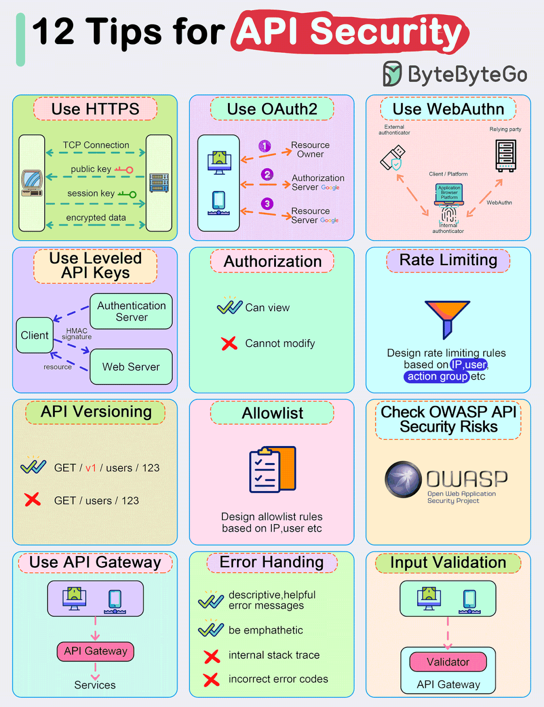
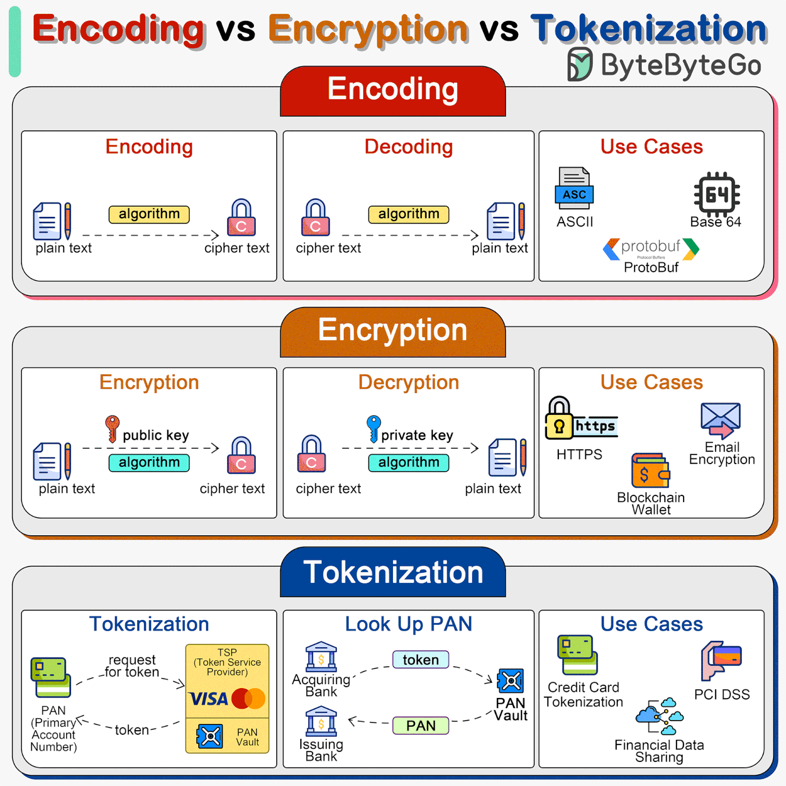

# 🧠 Mastering APIs

<details>
<summary><strong>1. Introduction to APIs</strong></summary>

💡 **Definition of API:**  
An API is a set of rules and protocols that allows different software applications to communicate with each other.

✅️ **Types of APIs:**
- **Public:** Openly available for any developers.
- **Private:** Restricted for internal use within an organization.
- **Partner:** Shared with specific partners.
- **Composite APIs:** Combine multiple APIs into one, allowing complex operations to be executed with a single call.

</details>

---

<details>
<summary><strong>2. API Architectures</strong></summary>

💡 **Describes different architectural styles for designing APIs:**

- **REST:** Representational State Transfer, a widely used architectural style leveraging standard HTTP methods.
- **GraphQL:** A query language for APIs allowing clients to specify exactly what data they need.
- **SOAP:** Simple Object Access Protocol, a protocol for exchanging structured information.
- **gRPC:** A high-performance RPC framework using HTTP/2.
- **WebSockets:** Enables real-time, two-way communication between client and server.
- **Webhooks:** Allow servers to send callbacks to clients when events occur.
- **AMQP:** Advanced Message Queuing Protocol for messaging.
- **MQTT:** Lightweight messaging protocol for small sensors and devices.

</details>

---

<details>
<summary><strong>3. API Security</strong></summary>



💡 **Focuses on securing APIs to prevent unauthorized access:**

- **Authentication:** Verifies the identity of a user or application.
- **OAuth:** Standard for token-based authorization.
- **JWT:** JSON Web Tokens for secure data transmission.
- **Basic Authentication:** Uses username and password.
- **Rate Limiting:** Controls the number of API calls a client can make in a certain time.
- **Encryption:** Secures data in transit using protocols like TLS/SSL.
- **Authorization:** Ensures that authenticated users have permission to perform specific actions.

</details>

---

<details>
<summary><strong>4. API Design Best Practices</strong></summary>

🔧 **Principles to create robust APIs:**

- **RESTful Conventions:** Following REST principles for resource design.
- **Versioning:** Managing API updates without breaking existing clients.
- **Pagination:** Handling large data sets efficiently.
- **HATEOAS:** Hypermedia as the engine of application state, guiding clients through available actions.

</details>

---

<details>
<summary><strong>5. API Documentation</strong></summary>

💡 **Guides developers on how to use APIs:**

- **Swagger:** OpenAPI specification, a powerful tool for API documentation.
- **Postman:** Platform for testing APIs.
- **OpenAPI Specification:** Standard that defines how APIs should be described.
- **Redoc:** API documentation generator.

</details>

---

<details>
<summary><strong>6. API Testing</strong></summary>

💡 **Tools and frameworks to test APIs:**

- **Postman:** For manual and automated testing.
- **SoapUI:** Testing SOAP and REST APIs.
- **Katalon Studio:** Automation testing.
- **Insomnia:** REST client for debugging APIs.
- **JMeter:** Performance testing.
- **Pact:** Consumer-driven contract testing.
- **Karate:** API testing automation.
- **Rest-Assured:** Java library for testing REST services.
- **Newman:** CLI agent for Postman collections.
- **Cypress:** End-to-end testing.

</details>




# 🌐 REST API – Rules, Principles & Guidelines

## 1️⃣ Core REST Principles (Architectural Constraints)

These are **mandatory rules** for an API to be truly RESTful.

### 1. Client–Server Separation

* Client UI and server logic are **independent**
* Improves scalability and portability

✅ Example
Frontend → React
Backend → Spring Boot REST API

---

### 2. Statelessness (MOST IMPORTANT)

* Each request must contain **all required information**
* Server **must not store client session**

❌ Bad

```http
GET /orders
```

✅ Good

```http
GET /orders
Authorization: Bearer <token>
```

---

### 3. Cacheability

* Responses must define whether they are cacheable
* Improves performance and reduces server load

```http
Cache-Control: max-age=3600
ETag: "v3"
```

---

### 4. Uniform Interface

Consistent rules across all APIs:

* Resource identification
* HTTP methods
* Status codes
* Media types (JSON)

---

### 5. Layered System

* Client doesn’t know if it talks to:

    * API Gateway
    * Load Balancer
    * Microservice

---

### 6. Code on Demand (Optional)

* Server can send executable code (JS)
* Rarely used

---

## 2️⃣ Resource Design Rules

### 1. Use **Nouns**, Not Verbs

❌ Bad

```
/getUsers
/createOrder
```

✅ Good

```
/users
/orders
```

---

### 2. Use Plural Resource Names

```
/users
/orders
/products
```

---

### 3. Hierarchical Resources

```
/users/{userId}/orders/{orderId}
```

---

## 3️⃣ HTTP Method Rules (Idempotency Included)

* **Safe** → Does **not change server state**
* **Idempotent** → Multiple identical requests have **same effect as one**

Here is the **refactored, clean, exam-ready version** with an added **“Purpose”** column, keeping everything **accurate, non-repetitive, and clear**.

---

## 🧭 HTTP Methods – Safety, Idempotency & Purpose

**Definitions (read once):**

* **Safe** → Does **not change server state**
* **Idempotent** → Multiple identical requests have the **same effect as one**

---

### 📋 HTTP Methods Comparison Table

| HTTP Method | Safe  | Idempotent | Purpose                                     | Why                                        |
| ----------- | ----- | ---------- | ------------------------------------------- | ------------------------------------------ |
| **GET**     | ✅ Yes | ✅ Yes      | Retrieve resource data                      | Only reads data                            |
| **HEAD**    | ✅ Yes | ✅ Yes      | Retrieve headers only                       | Same as GET, without body                  |
| **OPTIONS** | ✅ Yes | ✅ Yes      | Discover supported operations               | Metadata only                              |
| **PUT**     | ❌ No  | ✅ Yes      | Create or fully replace a resource          | Same request results in same state         |
| **DELETE**  | ❌ No  | ✅ Yes      | Remove a resource                           | Repeated deletes have no additional effect |
| **POST**    | ❌ No  | ❌ No       | Create a new resource or trigger processing | Each request creates a new outcome         |
| **PATCH**   | ❌ No  | ❌ No       | Partially update a resource                 | Repeating may produce different results    |

---

### 🧠 Key Exam & Interview Notes

* **All Safe methods are Idempotent**
* **POST is neither Safe nor Idempotent**
* **PUT vs PATCH**

    * `PUT` → Full replacement (Idempotent)
    * `PATCH` → Partial update (Not guaranteed Idempotent)

* **DELETE is Idempotent but not Safe**

---

### 🎯 One-Line Memory Trick

> **GET / HEAD / OPTIONS → Safe + Idempotent**
> **PUT / DELETE → Not Safe, but Idempotent**
> **POST / PATCH → Neither Safe nor Idempotent**

---

### 📌 Real-World Usage Tip

* Use **GET** for reads
* Use **PUT** when client knows full resource
* Use **PATCH** for partial updates
* Use **POST** for creation or actions
* Use **Idempotency-Key** for POST (payments, orders)

## 🧠 One-Line Memory Trick

> **Safe = Read only**
> **Idempotent = Repeat without side effects**

---

## 🔁 Visual ASCII Summary

```
            SAFE?
              |
     YES ---------------- NO
      |                   |
 GET, HEAD, OPTIONS     PUT, DELETE
                          |
                    Idempotent
                          |
                   POST, PATCH ❌
```


# 🔁 Idempotency in Microservices — Why It Matters More Than You Think

In **microservices architectures**, failures are normal.

Networks fail.  
Services retry.  
Users click buttons twice.

That’s exactly why **idempotency** is not a “nice to have” — it’s **critical**.

---

## 🧠 What Is Idempotency?

<details>
<summary><strong>Click to expand</strong></summary>

**Idempotency** means:

> If the same request is sent multiple times, the outcome should be the same as if it were sent only once.

No duplicate side effects.  
No unexpected behavior.

</details>

---

## ❓ Why Idempotency Matters in Real Systems

<details>
<summary><strong>Real-world failure scenarios</strong></summary>

In production systems:

- APIs are retried automatically
- Clients may resend requests
- API gateways may timeout and retry
- Messages can be delivered more than once
- Distributed systems are *eventually consistent*

❌ Without idempotency → **duplicate actions happen**

</details>

---

## 💳 Real-Time Example: Payment Service

<details>
<summary><strong>What can go wrong?</strong></summary>

### Scenario:

1. User clicks **“Pay ₹5,000”**
2. Payment service processes the request
3. Network timeout occurs
4. Client retries the same request

👉 If the service is **not idempotent**:

- Payment is processed **twice**
- User is charged **₹10,000 😨**

This is one of the most common and dangerous production bugs.

</details>

---

## ✅ How Idempotency Solves This Problem

<details>
<summary><strong>Idempotency in action</strong></summary>

### Step-by-step solution:

- Client sends a **unique Idempotency Key**  
  _(example: `txn-123`)_
- Payment service stores:
  - Idempotency key
  - Request result
- When the same request arrives again:
  - Service detects the duplicate key
  - Returns the **previous response**
  - ❌ Does NOT charge again

</details>

---

## 🎯 Result

<details>
<summary><strong>What you gain</strong></summary>

- ✅ One payment
- ✅ Safe retries
- ✅ No duplicate charges
- ✅ Happy customers

</details>

---

## 📌 APIs That MUST Be Idempotent

<details>
<summary><strong>Critical use cases</strong></summary>

Idempotency is mandatory for:

- Payments
- Order creation
- Inventory updates
- Refunds
- Message processing (Kafka, SQS, RabbitMQ, etc.)

Anywhere retries can happen → idempotency is required.

</details>

---

## 🧩 Key Takeaway

<details>
<summary><strong>Final thoughts</strong></summary>

Retries are unavoidable in microservices.  
Duplicate side effects are **not**.

If your API can be retried:
**Idempotency is not optional — it’s mandatory.**

</details>

# 🔁 Idempotency in Microservices — Why It Matters More Than You Think

In microservices, failures are normal.  
Networks fail. Services retry. Clients double-click.

That’s why **idempotency is mandatory, not optional**.

---

## 🧠 What Is Idempotency?

<details>
<summary><strong>Concept</strong></summary>

**Idempotency** means:

> Sending the same request multiple times produces the same result as sending it once.

No duplicate side effects.  
No inconsistent state.

</details>

---

## 🔄 Why Idempotency Is Critical

<details>
<summary><strong>Real-world realities</strong></summary>

- APIs retry automatically  
- Clients resend requests  
- Gateways timeout and retry  
- Messages can be delivered more than once  
- Distributed systems are unreliable by nature  

❌ Without idempotency → **duplicate actions happen**

</details>

---

## 💳 Payment Service Example (Problem)

<details>
<summary><strong>Failure scenario</strong></summary>

1. User clicks **Pay ₹5,000**
2. Payment service processes the request
3. Network timeout occurs
4. Client retries the same request

👉 Without idempotency → **₹10,000 charged**

</details>

---

## 🧭 Sequence Diagram — Without Idempotency

<details>
<summary><strong>Duplicate payment flow</strong></summary>

```mermaid
sequenceDiagram
    participant Client
    participant PaymentService
    participant Bank

    Client->>PaymentService: Pay ₹5000
    PaymentService->>Bank: Charge ₹5000
    Bank-->>PaymentService: Success
    PaymentService-->>Client: Timeout

    Client->>PaymentService: Retry Pay ₹5000
    PaymentService->>Bank: Charge ₹5000
    Bank-->>PaymentService: Success
    PaymentService-->>Client: Success
````

❌ Result: **Two charges**

</details>

---

## ✅ How Idempotency Fixes This

<details>
<summary><strong>Key idea</strong></summary>

* Client sends an **Idempotency Key**
* Service stores the key + response
* Duplicate request → return cached response
* No duplicate side effects

</details>

---

## 🧭 Sequence Diagram — With Idempotency

<details>
<summary><strong>Safe retry flow</strong></summary>

```mermaid
sequenceDiagram
    participant Client
    participant PaymentService
    participant DB
    participant Bank

    Client->>PaymentService: Pay ₹5000 (key=txn-123)
    PaymentService->>DB: Check key txn-123
    DB-->>PaymentService: Not found
    PaymentService->>Bank: Charge ₹5000
    Bank-->>PaymentService: Success
    PaymentService->>DB: Store key + result
    PaymentService-->>Client: Success

    Client->>PaymentService: Retry Pay ₹5000 (key=txn-123)
    PaymentService->>DB: Check key txn-123
    DB-->>PaymentService: Found
    PaymentService-->>Client: Previous success response
```

✅ Result: **One charge, safe retry**

</details>

---

## 🧩 REST API — Idempotent Payment Example

<details>
<summary><strong>REST API implementation</strong></summary>

### Request

```http
POST /payments
Idempotency-Key: txn-123
Content-Type: application/json

{
  "amount": 5000,
  "currency": "INR",
  "userId": "u-101"
}
```

### Backend Logic (Pseudo-Code)

```java
public PaymentResponse createPayment(Request request, String key) {
    Optional<PaymentRecord> existing = repo.findByKey(key);

    if (existing.isPresent()) {
        return existing.get().getResponse();
    }

    PaymentResult result = bank.charge(request);
    repo.save(key, result);

    return result;
}
```

### Database Table (Example)

```text
idempotency_key | response | created_at
--------------------------------------
txn-123         | SUCCESS  | 2026-01-18
```

</details>

---

## 📦 Kafka / Message Queue — Idempotent Consumer

<details>
<summary><strong>Kafka consumer example</strong></summary>

### Problem

Kafka guarantees **at-least-once delivery**
→ Messages **can be processed more than once**

### Solution: Idempotent Consumer

```java
@KafkaListener(topics = "payments")
public void processPayment(PaymentEvent event) {

    if (processedEventRepo.exists(event.getEventId())) {
        return; // duplicate message
    }

    process(event);
    processedEventRepo.save(event.getEventId());
}
```

### Storage for Deduplication

* Database table
* Redis
* DynamoDB

```text
event_id     | processed_at
----------------------------
evt-789      | 2026-01-18
```

</details>

---

## 📌 APIs That MUST Be Idempotent

<details>
<summary><strong>Non-negotiable use cases</strong></summary>

* Payments
* Order creation
* Inventory updates
* Refunds
* Kafka / queue consumers
* Webhooks

Anywhere retries exist → idempotency is required.

</details>

---

## 🏁 Final Takeaway

<details>
<summary><strong>Key lesson</strong></summary>

Retries are unavoidable in microservices.
Duplicate side effects are **not**.

If your API can be retried,
**Idempotency is mandatory — not optional.**

</details>

## ⏳ TTL Strategies for Idempotency Keys (Production-Grade)

Idempotency keys **cannot live forever**.
Without proper TTL (Time-To-Live), systems become slower, costlier, and harder to maintain.

The goal:
> Keep idempotency data **long enough to handle retries**, but **not forever**.

---

## 🎯 Why TTL Is Important

<details>
<summary><strong>Problems without TTL</strong></summary>

- Infinite growth of idempotency tables
- Higher storage and query costs
- Slower lookups
- Harder operational cleanup
- Compliance & data retention issues

TTL keeps idempotency **safe, efficient, and scalable**.

</details>

---

## 🧠 Core TTL Design Principles

<details>
<summary><strong>Golden rules</strong></summary>

1. TTL must be **longer than the maximum retry window**
2. TTL depends on **business criticality**
3. High-risk actions → longer TTL
4. Low-risk actions → shorter TTL
5. TTL should be **configurable**, not hardcoded

</details>

---

## ⏱️ Common TTL Strategies

### 1️⃣ Fixed TTL (Most Common)

<details>
<summary><strong>Simple & effective</strong></summary>

- Assign a fixed expiration time to idempotency keys
- Example:
  - Payments → 24 hours
  - Orders → 12 hours
  - Inventory updates → 1 hour

**Pros**
- Simple implementation
- Easy to reason about

**Cons**
- May keep data longer than needed

</details>

---

### 2️⃣ Retry-Window-Based TTL (Best Practice)

<details>
<summary><strong>TTL tied to retry behavior</strong></summary>

TTL = **Max retry duration + safety buffer**

Example:
- Client retries for 30 minutes
- Gateway retries for 10 minutes
- Add 2× buffer

➡ TTL ≈ **2 hours**

**Pros**
- Efficient storage
- Aligns with real retry patterns

**Cons**
- Requires understanding retry policies

</details>

---

### 3️⃣ State-Based TTL (Advanced)

<details>
<summary><strong>Different TTL per state</strong></summary>

TTL varies based on request outcome:

| State      | TTL Example |
|-----------|-------------|
| SUCCESS   | 24 hours    |
| FAILED    | 5 minutes   |
| PENDING   | 1 hour      |

**Why?**
- Failures retry quickly
- Success needs longer protection

**Pros**
- Optimized storage
- Business-aware logic

**Cons**
- More complex implementation

</details>

---

### 4️⃣ Sliding TTL (Rare but Useful)

<details>
<summary><strong>TTL extends on retry</strong></summary>

- TTL resets every time the same idempotency key is received
- Useful for long-running or async workflows

**Pros**
- Handles delayed retries well

**Cons**
- Risk of keys never expiring
- Requires max TTL cap

</details>

---

### 5️⃣ Permanent + Archival (High-Risk Systems)

<details>
<summary><strong>Financial-grade systems</strong></summary>

- Store idempotency records permanently
- Move older records to cold storage (S3)

Used for:
- Banking
- Ledger systems
- Regulatory compliance

**Pros**
- Full audit trail
- Zero risk of duplicate financial actions

**Cons**
- Higher storage cost
- Requires archival strategy

</details>

---

## 🗄️ TTL by Storage Type

<details>
<summary><strong>Where TTL is enforced</strong></summary>

### Redis
- Native TTL support
- Ideal for short-lived keys (minutes → hours)

```text
SET txn-123 response EX 7200
````

### DynamoDB

* Native TTL attribute
* Auto cleanup by AWS

```text
ttl = epoch_timestamp
```

### SQL Databases

* Scheduled cleanup jobs
* Index on `created_at`

```sql
DELETE FROM idempotency_keys
WHERE created_at < NOW() - INTERVAL '24 hours';
```

## 🧭 Recommended TTLs (Real-World Defaults)


<summary><strong>Production-ready guidance</strong></summary>

| Use Case          | Recommended TTL |
| ----------------- | --------------- |
| Payments          | 24–72 hours     |
| Orders            | 12–24 hours     |
| Refunds           | 48–72 hours     |
| Inventory updates | 1–6 hours       |
| Webhooks          | 24 hours        |
| Kafka consumers   | 1–7 days        |


## ⚠️ Common TTL Mistakes


<summary><strong>What to avoid</strong></summary>

* TTL shorter than retry window ❌
* No TTL at all ❌
* Hardcoded TTL values ❌
* Same TTL for all APIs ❌
* Not monitoring TTL cleanup ❌

---

## 🏁 Final Rule of Thumb


> TTL should outlive retries — not business records.

Retries are temporary.
Idempotency protection should be too.

Design TTLs deliberately, and your microservices will scale safely.

</details>
```

---

## 4️⃣ HTTP Status Code Guidelines

## 🔵 1xx — Informational

| Status Code | Name                | Purpose / Meaning                                      |
| ----------- | ------------------- | ------------------------------------------------------ |
| **100**     | Continue            | Initial part of request received; client may continue  |
| **101**     | Switching Protocols | Server is switching protocols (HTTP → WebSocket)       |
| **102**     | Processing          | Request accepted but processing not completed (WebDAV) |
| **103**     | Early Hints         | Preload resources before final response (performance)  |

---

## 🟢 2xx — Success

| Status Code | Name                          | Purpose / Meaning                              |
| ----------- | ----------------------------- | ---------------------------------------------- |
| **200**     | OK                            | Request succeeded                              |
| **201**     | Created                       | Resource successfully created                  |
| **202**     | Accepted                      | Request accepted but processed asynchronously  |
| **203**     | Non-Authoritative Information | Metadata modified by proxy                     |
| **204**     | No Content                    | Success with no response body                  |
| **205**     | Reset Content                 | Client should reset the view/form              |
| **206**     | Partial Content               | Partial response (range requests, streaming)   |
| **207**     | Multi-Status                  | Multiple independent status codes (WebDAV)     |
| **208**     | Already Reported              | Resource already included in response (WebDAV) |
| **226**     | IM Used                       | Delta encoding / instance manipulation (rare)  |

---

## 🟡 3xx — Redirection

| Status Code | Name               | Purpose / Meaning                          |
| ----------- | ------------------ | ------------------------------------------ |
| **300**     | Multiple Choices   | Multiple representations available         |
| **301**     | Moved Permanently  | Permanent redirect (SEO friendly)          |
| **302**     | Found              | Temporary redirect                         |
| **303**     | See Other          | Redirect after POST → GET                  |
| **304**     | Not Modified       | Cached version still valid                 |
| **305**     | Use Proxy          | Must use proxy (deprecated)                |
| **306**     | Unused             | Reserved                                   |
| **307**     | Temporary Redirect | Redirect without changing HTTP method      |
| **308**     | Permanent Redirect | Permanent redirect without changing method |

---

## 🟠 4xx — Client Errors

| Status Code | Name                            | Purpose / Meaning                          |
| ----------- | ------------------------------- | ------------------------------------------ |
| **400**     | Bad Request                     | Invalid request syntax or validation error |
| **401**     | Unauthorized                    | Authentication required or failed          |
| **402**     | Payment Required                | Reserved (sometimes billing/quota APIs)    |
| **403**     | Forbidden                       | Access denied                              |
| **404**     | Not Found                       | Resource not found                         |
| **405**     | Method Not Allowed              | HTTP method not supported                  |
| **406**     | Not Acceptable                  | Requested format not supported             |
| **407**     | Proxy Authentication Required   | Proxy authentication required              |
| **408**     | Request Timeout                 | Client took too long                       |
| **409**     | Conflict                        | Request conflicts with current state       |
| **410**     | Gone                            | Resource permanently removed               |
| **411**     | Length Required                 | Missing `Content-Length`                   |
| **412**     | Precondition Failed             | Conditional headers failed                 |
| **413**     | Payload Too Large               | Request body too large                     |
| **414**     | URI Too Long                    | URL too long                               |
| **415**     | Unsupported Media Type          | Unsupported content type                   |
| **416**     | Range Not Satisfiable           | Invalid range request                      |
| **417**     | Expectation Failed              | Cannot meet `Expect` header                |
| **418**     | I’m a teapot                    | Joke status (RFC 2324 😂)                  |
| **421**     | Misdirected Request             | Wrong server                               |
| **422**     | Unprocessable Entity            | Validation error                           |
| **423**     | Locked                          | Resource locked (WebDAV)                   |
| **424**     | Failed Dependency               | Previous request failure (WebDAV)          |
| **425**     | Too Early                       | Replay request risk                        |
| **426**     | Upgrade Required                | Protocol upgrade required                  |
| **428**     | Precondition Required           | Prevent race conditions                    |
| **429**     | Too Many Requests               | Rate limiting                              |
| **431**     | Request Header Fields Too Large | Headers too large                          |
| **451**     | Unavailable For Legal Reasons   | Legal restriction                          |

---

## 🔴 5xx — Server Errors

| Status Code | Name                            | Purpose / Meaning          |
| ----------- | ------------------------------- | -------------------------- |
| **500**     | Internal Server Error           | Generic server failure     |
| **501**     | Not Implemented                 | Feature not supported      |
| **502**     | Bad Gateway                     | Invalid upstream response  |
| **503**     | Service Unavailable             | Server overloaded/down     |
| **504**     | Gateway Timeout                 | Upstream timeout           |
| **505**     | HTTP Version Not Supported      | Unsupported HTTP version   |
| **506**     | Variant Also Negotiates         | Content negotiation error  |
| **507**     | Insufficient Storage            | Storage exhausted (WebDAV) |
| **508**     | Loop Detected                   | Infinite loop detected     |
| **510**     | Not Extended                    | Extension required         |
| **511**     | Network Authentication Required | Network login required     |

---

## 5️⃣ Request & Response Design

### Use JSON (Standard)

```http
Content-Type: application/json
```

---

### Consistent Response Structure

```json
{
  "success": true,
  "data": {},
  "error": null,
  "timestamp": "2026-01-12T10:30:00Z"
}
```

---

### Use Meaningful Error Responses

```json
{
  "errorCode": "ORDER_NOT_FOUND",
  "message": "Order 123 does not exist"
}
```

---

## 6️⃣ Versioning Rules

### Preferred (URL Versioning)

```
/api/v1/orders
/api/v2/orders
```

Other options:

* Header-based
* Media type versioning

---

## 7️⃣ Pagination, Sorting & Filtering

### Pagination

```
GET /orders?page=1&size=20
```

### Sorting

```
GET /orders?sort=createdAt,desc
```

### Filtering

```
GET /orders?status=PAID&amount>1000
```

---

## 8️⃣ Security Guidelines

### Authentication

* OAuth2 / JWT / API Keys

```http
Authorization: Bearer <token>
```

---

### Authorization

* Role-based access (RBAC)
* Scope-based access

---

### HTTPS Mandatory

❌ HTTP
✅ HTTPS

---

## 9️⃣ Idempotency & Reliability

### Use Idempotency Keys for POST

```http
Idempotency-Key: uuid
```

Prevents duplicate operations (payments, orders)

---

### Use Timeouts & Retries

* Client retries
* Server handles duplicates safely

---

## 🔟 Concurrency & Consistency

### Optimistic Locking with ETag

```http
If-Match: "v3"
```

Prevents lost updates

---

## 1️⃣1️⃣ Naming & Formatting Rules

* camelCase for JSON fields
* kebab-case for URLs
* ISO-8601 for dates

```json
"createdAt": "2026-01-12T10:30:00Z"
```

---

## 1️⃣2️⃣ Logging, Tracing & Monitoring

### Request ID

```http
X-Request-ID: abc-123
```

Used for distributed tracing

---

## 1️⃣3️⃣ Documentation Rules

* OpenAPI / Swagger
* Examples for each API
* Clear error definitions

---

## 1️⃣4️⃣ Common REST Anti-Patterns ❌

| Anti-Pattern             | Why Bad            |
| ------------------------ | ------------------ |
| Using verbs in URLs      | Breaks REST        |
| Returning 200 for errors | Confusing          |
| Chatty APIs              | Performance issues |
| Breaking statelessness   | Scalability issues |

---

## ✅ REST API GOLDEN RULES (Interview Favorite)

> ✔ Stateless
> ✔ Resource-based
> ✔ Proper HTTP methods
> ✔ Correct status codes
> ✔ Consistent responses
> ✔ Secure by default

---

## 🧠 One-Line Summary

> **REST is not just JSON over HTTP — it is a disciplined contract using HTTP semantics correctly.**

---

# Top 6 API Styles: Choosing the Best Fit for Your Project

APIs are the backbone of modern software, enabling smooth integration and communication between systems. Here’s a look at the top six API architecture styles and when to use each:

[Top6Api](../images/SpringBoot/TOP6API.gif)

---

### 1. **SOAP (Simple Object Access Protocol)**
**Best for:** Enterprise applications needing a standardized, secure protocol.  
SOAP offers strong typing and robust security features, making it ideal for complex and regulated environments.

---

### 2. **RESTful (Representational State Transfer)**
**Best for:** Web services, especially public-facing applications.  
It prioritizes simplicity and scalability with a stateless, resource-oriented design that enables efficient client-server communication.

---

### 3. **GraphQL**
**Best for:** Scenarios requiring flexible, client-driven data retrieval.  
Clients can specify exactly what data they need, reducing over-fetching and under-fetching, and optimizing performance.

---

### 4. **gRPC**
**Best for:** High-performance, low-latency communication in microservices architectures.  
It supports efficient serialization and bi-directional streaming, making it ideal for real-time apps and distributed systems.

---

### 5. **WebSockets**
**Best for:** Real-time, bidirectional communication (e.g., chat apps, online gaming).  
Persistent connections allow instant data updates and seamless user interaction.

---

### 6. **Webhooks**
**Best for:** Event-driven systems.  
They let applications react to events in real time, making them perfect for notifications and automated actions.

---

### 🧭 **Conclusion**
Choosing the right API style enhances **performance**, **scalability**, and **user experience** by aligning architectural strengths with project needs.

---