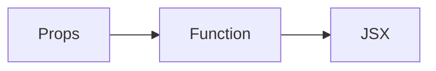
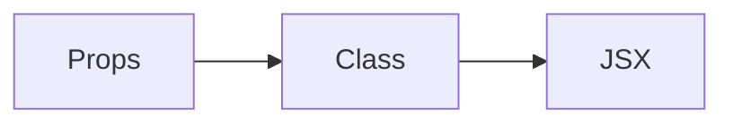

<details open>
<summary><strong>📘 React Overview</strong></summary>

🔗 Interview Questions:

* [Local Link](../md2/ReactQuestionAnswers.md)
* [Simplilearn Questions](https://www.simplilearn.com/tutorials/reactjs-tutorial/reactjs-interview-questions)

🧭 References:

* [React Dev Blog](https://react.dev/blog/2023/03/16/introducing-react-dev)
* [Pagination in React](https://www.educative.io/answers/how-to-implement-pagination-in-reactjs)

</details>

---

<details open>
<summary><strong>⚙️ Installation</strong></summary>

* Install [Node.js](https://nodejs.org/)
* Use any IDE (e.g., VS Code)

</details>

---

<details open>
<summary><strong>🚀 Create React App</strong></summary>

1. Open a terminal in your folder.

2. Run:

   ```bash
   npx create-react-app react-app-name
   ```

  * `npx`: Executes a package without installing globally.
  * Alternatively: `npm install -g create-react-app` (global installation)

3. Navigate:

   ```bash
   cd react-app-name
   ```

4. Start:

   ```bash
   npm start
   ```

</details>

---

<details open>
<summary><strong>🧱 React Basics</strong></summary>

<details open>
<summary><strong>📦 Components</strong></summary>

* Components describe parts of UI and are reusable.
* Two types:

  * **Stateless Functional Component**
  * **Stateful Class Component**
* Naming: Start with a capital letter (`App`, `Header`)

---

<details open>
<summary><strong>🧩 Functional (Stateless) Components</strong></summary>

* JavaScript functions returning JSX.
* Preferable due to:

  * No use of `this`
  * Simple and readable
  * UI-focused



</details>

<details open>
<summary><strong>🧠 Class (Stateful) Components</strong></summary>

* Extend `React.Component`
* Use `this.state` and lifecycle methods



</details>

</details>

---

<details open>
<summary><strong>📐 JSX (JavaScript XML)</strong></summary>

* JSX allows HTML in JS
* Declarative approach to UI building

**Imperative vs Declarative**

* Imperative: `document.getElementById()`
* Declarative: `<h1>{state.title}</h1>`

</details>

<details open>
<summary><strong>🧩 React Fragments</strong></summary>

* Use empty tags `<> ... </>` instead of extra `<div>` to group children

```jsx
<>
  <h1>Title</h1>
  <p>Description</p>
</>
```

</details>

<details open>
<summary><strong>⚓ React Hooks (Since 2018)</strong></summary>

* Use state/lifecycle in function components
* E.g., `useState`, `useEffect`

📌 Rules of Hooks:

* Call at the **top level**
* Do not use inside loops or conditions
* Only call from **React functions**

</details>

<details open>
<summary><strong>📬 Props</strong></summary>

* Props = Parameters
* Immutable (read-only)
* Passed from parent to child
* Can be strings, arrays, objects, functions, emojis

</details>

<details open>
<summary><strong>📦 State</strong></summary>

* State = Local component data
* Mutable, changes trigger re-render
* Can hold strings, booleans, arrays, objects

🧠 Use case:

* Props are fixed
* State changes dynamically

📌 State Rules:

* Declare at the top
* Don’t use inside conditions/loops
* Don’t merge automatically like class components

</details>

<details open>
<summary><strong>🌐 DOM vs Virtual DOM</strong></summary>

* React doesn't directly manipulate the real DOM.
* JSX combines HTML, JS, and CSS efficiently using Virtual DOM for fast updates.

</details>

</details>

---

