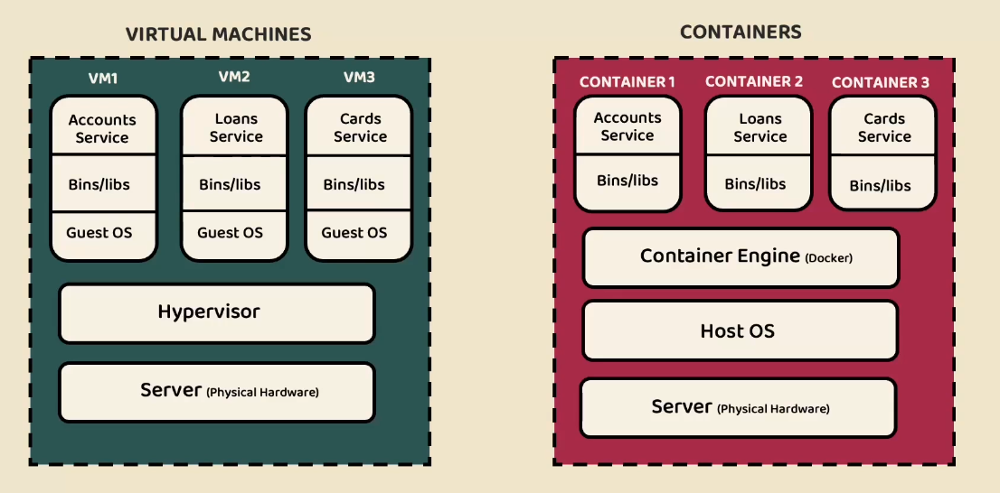

# Docker

<details>
<summary><strong>Vm vs Containers</strong></summary>




</details>

<details>
<summary><strong>Docker Architecture</strong></summary>


</details>

<details>
<summary><strong>Container</strong></summary>

- Container is a small microVM which runs on top of Linux. It has all the dependencies of application code, client libraries.

</details>

<details>
<summary><strong>Simple image creation</strong></summary>

**Create a container image**
```bash
$ docker run -d -p 8800:80 httpd
````

* `-d` - detach and run in background.
* `-p` - map host port to container port.

**Show the web page**

```bash
$ curl localhost:8800
```

**Kill the Container**

```bash
$ docker stop <container-id>
```

</details>

<details>
<summary><strong>Types of Docker creation</strong></summary>

1. **Dockerfile**

  * A file containing instructions for creating Docker images.
  * Static, less flexible for complex/custom images or multi-OS/arch/version support.


</details>

---

# All Docker Commands

<details>
<summary><strong>1. Setup & Info Commands</strong></summary>

| Command            | Purpose                                                 |
|--------------------|---------------------------------------------------------|
| `docker version`   | Check Docker client/server versions                     |
| `docker info`      | Show system-wide Docker info (containers, images, etc.) |
| `docker system df` | Show Docker disk usage                                  |

</details>

<details>
<summary><strong>2. Image Management</strong></summary>

| Purpose                  | Command                             | Notes                         |
|--------------------------|-------------------------------------|-------------------------------|
| Pull an image            | `docker pull <image-name>`          | Downloads image from registry |
| Pull a specific image    | `docker pull nginx`                 | Example                       |
| List images              | `docker images`                     | Shows local images            |
| Inspect an image         | `docker inspect <image-id or name>` | Image metadata                |
| Remove an image          | `docker rmi <image-id or name>`     | Image must not be in use      |
| Remove unused images     | `docker image prune`                | Dangling images only          |
| Remove all unused images | `docker image prune -a`             | ⚠️ Aggressive cleanup         |

</details>


<details>
<summary><strong>3. Container Lifecycle</strong></summary>

| Purpose                   | Command                                 | Notes                                            |
|---------------------------|-----------------------------------------|--------------------------------------------------|
| Run a new container       | `docker run -d -p 8080:80 nginx`        | `-d` detached, `-p` port, `--name`, `-v`, `--rm` |
| List running containers   | `docker ps`                             | Shows running containers only                    |
| List all containers       | `docker ps -a`                          | Running + stopped                                |
| Stop a container          | `docker stop <container-name or id>`    | Graceful stop (SIGTERM)                          |
| Start a stopped container | `docker start <container-name or id>`   | Reuses existing container                        |
| Restart a container       | `docker restart <container-name or id>` | Stop + start                                     |
| Kill a container          | `docker kill <container-name or id>`    | Immediate stop (SIGKILL)                         |
| Remove a container        | `docker rm <container-name or id>`      | Container must be stopped                        |
| Remove all containers     | `docker rm $(docker ps -a -q)`          | Removes all containers                           |
| Remove stopped containers | `docker container prune`                | Safe cleanup                                     |
| Remove everything         | `docker system prune -a`                | ⚠️ Containers, images, networks                  |

</details>


<details>
<summary><strong>4. Working with Containers</strong></summary>

| Purpose                            | Command                                     | Notes                              |
|------------------------------------|---------------------------------------------|------------------------------------|
| Run a shell in a running container | `docker exec -it <container-name> bash`     | Use `sh` if `bash` isn’t available |
| Run a one-time command             | `docker run --rm alpine echo hello`         | Container removed after execution  |
| View container logs                | `docker logs <container-name>`              | Add `-f` to follow logs            |
| Copy files from container          | `docker cp <container>:<path> <local-path>` | Copies from container to host      |
| Copy files to container            | `docker cp <local-path> <container>:<path>` | Copies from host to container      |
| View running containers            | `docker ps`                                 | Add `-a` to see all containers     |
| Inspect a container                | `docker inspect <container-name>`           | Detailed container metadata        |
| Restart a container                | `docker restart <container-name>`           | Graceful restart                   |
| Stop a container                   | `docker stop <container-name>`              | Sends SIGTERM                      |
| Remove a container                 | `docker rm <container-name>`                | Must be stopped first              |

</details>

<details>
<summary><strong>5. Docker Volumes (Persistent Storage)</strong></summary>

| Purpose                     | Command                                         | Notes                     |
|-----------------------------|-------------------------------------------------|---------------------------|
| Create a volume             | `docker volume create <name>`                   | Managed by Docker         |
| List volumes                | `docker volume ls`                              | Shows all volumes         |
| Inspect a volume            | `docker volume inspect <name>`                  | View mountpoint & usage   |
| Mount volume in a container | `docker run -v <volume-name>:/app/data <image>` | Named volume              |
| Mount bind volume           | `docker run -v $(pwd):/app <image>`             | Host directory mount      |
| Remove a volume             | `docker volume rm <name>`                       | Volume must not be in use |
| Remove unused volumes       | `docker volume prune`                           | ⚠️ Deletes unused data    |

</details>


<details>
<summary><strong>6. Docker Networks</strong></summary>

| Purpose                           | Command                                           | Notes                              |
|-----------------------------------|---------------------------------------------------|------------------------------------|
| Create a network                  | `docker network create <name>`                    | Uses default bridge driver         |
| List networks                     | `docker network ls`                               | Shows all available networks       |
| Inspect a network                 | `docker network inspect <name>`                   | View connected containers & config |
| Connect container to network      | `docker network connect <network> <container>`    | Can connect running containers     |
| Disconnect container from network | `docker network disconnect <network> <container>` | Use `-f` to force                  |
| Remove a network                  | `docker network rm <name>`                        | Network must not be in use         |
| Remove unused networks            | `docker network prune`                            | Safe if not attached               |

</details>


<details>
<summary><strong>7. Cleanup & Maintenance (Docker)</strong></summary>


### 7. 🧹 Cleanup & Maintenance (Docker)

| Purpose                                        | Command                              | Notes / Warnings                            |
| ---------------------------------------------- | ------------------------------------ | ------------------------------------------- |
| **Remove stopped containers**                  | `docker container prune`             | Safe: running containers unaffected         |
| **Remove unused images**                       | `docker image prune`                 | Removes dangling images only                |
| **Remove unused images (all)**                 | `docker image prune -a`              | ⚠️ Removes unused images, not just dangling |
| **Remove unused volumes**                      | `docker volume prune`                | ⚠️ Can delete persisted data                |
| **Remove unused networks**                     | `docker network prune`               | Safe if not attached to containers          |
| **Remove unused containers, images, networks** | `docker system prune`                | Default cleanup                             |
| **Aggressive cleanup (everything)**            | `docker system prune -a`             | ⚠️ Removes all unused images                |
| **Full cleanup incl. volumes**                 | `docker system prune -a --volumes`   | 🚨 Nuclear option — deletes data            |
| **Remove specific container**                  | `docker rm <container_id>`           | Use `-f` to force                           |
| **Remove specific image**                      | `docker rmi <image_id>`              | Image must not be in use                    |
| **Remove specific volume**                     | `docker volume rm <volume_name>`     | Data is permanently lost                    |
| **Remove everything manually**                 | `docker rm -f $(docker ps -aq)`      | Stops & removes all containers              |
| **Remove all images manually**                 | `docker rmi -f $(docker images -aq)` | After removing containers                   |
| **Check disk usage**                           | `docker system df`                   | Great before cleanup                        |

---

💡 **Tip:**
Run `docker system df` first to see *what’s actually eating disk space* before going full `prune -a --volumes`.

</details>


<details>
<summary><strong>8. Docker Compose – Common Commands</strong></summary>

### 8. 🐳 Docker Compose – Common Commands

| Purpose                           | Command                                       | Notes                                  |
| --------------------------------- | --------------------------------------------- | -------------------------------------- |
| **Start all services (detached)** | `docker compose up -d`                        | Creates & starts containers            |
| **Start with forced recreation**  | `docker compose up -d --force-recreate`       | Recreates containers even if unchanged |
| **Start a specific service**      | `docker compose up -d kafka`                  | Starts only the specified service      |
| **Recreate a specific service**   | `docker compose up -d --force-recreate kafka` | Useful after config changes            |
| **Stop all services**             | `docker compose down`                         | Stops and removes containers           |
| **Stop & remove volumes**         | `docker compose down -v`                      | ⚠️ Deletes named volumes (data loss)   |
| **Stop & remove images**          | `docker compose down --rmi all`               | Removes images built by compose        |
| **Build images**                  | `docker compose build`                        | Builds images defined in compose file  |
| **Build without cache**           | `docker compose build --no-cache`             | Forces a clean build                   |
| **Pull images**                   | `docker compose pull`                         | Fetches latest images from registry    |
| **Pull a specific service**       | `docker compose pull kafka`                   | Useful for selective updates           |
| **Start existing containers**     | `docker compose start`                        | Does **not** recreate containers       |
| **Stop running containers**       | `docker compose stop`                         | Containers remain defined              |
| **Restart services**              | `docker compose restart`                      | Graceful restart                       |
| **View running services**         | `docker compose ps`                           | Shows container status                 |
| **View logs (all services)**      | `docker compose logs`                         | Aggregated logs                        |
| **Follow logs (live)**            | `docker compose logs -f`                      | Streaming logs                         |
| **Logs for one service**          | `docker compose logs kafka`                   | Scoped logging                         |
| **Execute command in container**  | `docker compose exec kafka bash`              | Interactive shell                      |
| **Run one-off command**           | `docker compose run kafka <cmd>`              | Starts a new container                 |
| **Validate compose file**         | `docker compose config`                       | Checks syntax & resolves vars          |

</details>

---


<details>
<summary>✅ Bonus: Useful Commands Summary Table</summary>

| Task                 | Command                       |
|----------------------|-------------------------------|
| Run a container      | `docker run`                  |
| List containers      | `docker ps [-a]`              |
| Start/stop           | `docker start/stop`           |
| Remove               | `docker rm/rmi`               |
| Show logs            | `docker logs`                 |
| Shell into container | `docker exec -it <name> bash` |
| System cleanup       | `docker system prune`         |

</details>

---

# Docker in Spring Boot

<details>
<summary><strong>Dockerfile</strong></summary>

### 📦 Step 1: Package the Spring Boot Application

```bash
./mvnw clean package
# or for Gradle
./gradlew build
```

Produces `target/your-app.jar` or `build/libs/your-app.jar`.

---

### 🐳 Step 2: Create a Dockerfile

```Dockerfile
FROM openjdk:17-jdk-slim
WORKDIR /app
COPY target/your-app.jar app.jar
EXPOSE 8080
ENTRYPOINT ["java", "-jar", "app.jar"]
```

> Replace `target/your-app.jar` with your actual JAR path.

---

### 🏗️ Step 3: Build the Docker Image

```bash
docker build . -t your-dockerhub-username/your-app-name:tag
```

Example:

```bash
docker build . -t s14321k/accounts:d1
```

---

### ▶️ Step 4: Test the Docker Image Locally (Optional)

```bash
docker run -d -p 8080:8080 s14321k/accounts:d1
docker run -d -p 8081:8080 s14321k/accounts:d1  # Another instance on different host port
```

Stop container:

```bash
docker stop <container-id>
```

---

### 🚀 Step 5: Log in to Docker Hub

```bash
docker login
```

---

### 🚀 Step 6: Push the Docker Image

```bash
docker push your-dockerhub-username/your-app-name:tag
```

</details>

<details>
<summary><strong>Build packs instead of Dockerfile</strong></summary>

* **Maven (`pom.xml`)**:

```xml
<image>
  <name>your-dockerhub-username/your-app-name:tag</name>
</image>
```

Run:

```bash
./mvnw spring-boot:build-image
```

* **Gradle (`build.gradle`)**:

```gradle
image {
    name = "your-dockerhub-username/your-app-name:tag"
}
// or
bootBuildImage {
	imageName = 's14321l/${rootProject.name}:d1'
}
```

Run:

```bash
./gradlew bootBuildImage
```

---

### ✅ Optional: Automate with Jib (Maven or Gradle)

* Add Jib plugin, configure image name.

* **Maven example**:

```xml
<plugin>
  <groupId>com.google.cloud.tools</groupId>
  <artifactId>jib-maven-plugin</artifactId>
  <version>3.3.1</version>
  <configuration>
    <to>
      <image>your-dockerhub-username/your-app-name:tag</image>
    </to>
  </configuration>
</plugin>
```

* **Gradle example**:

```gradle
plugins {
    id 'com.google.cloud.tools.jib' version '3.3.1'
}
jib {
    from { image = 'openjdk:21-jdk-slim' }
    to { image = 'your-group/your-image-name:latest' }
}
```

Build commands:

* Maven:

```bash
mvn compile jib:dockerBuild
```

* Gradle:

```bash
./gradlew jib
```

</details>

<details>
<summary><strong>Sample Spring Boot Project Structure</strong></summary>

```
springboot-docker-app/
├── src/
│   └── main/
│       └── java/
│           └── com/example/demo/
│               └── DemoApplication.java
├── target/
│   └── demo-0.0.1-SNAPSHOT.jar
├── pom.xml
├── Dockerfile
└── .github/
    └── workflows/
        └── docker-image.yml
```

---

### 🐳 Sample Dockerfile

```Dockerfile
FROM openjdk:17-jdk-slim
WORKDIR /app
COPY target/demo-0.0.1-SNAPSHOT.jar app.jar
EXPOSE 8080
ENTRYPOINT ["java", "-jar", "app.jar"]
```

---

### 🚀 GitHub Actions Workflow (`.github/workflows/docker-image.yml`)

```yaml
name: Build and Push Docker Image

on:
  push:
    branches: [ "main" ]

jobs:
  build:
    runs-on: ubuntu-latest

    steps:
      - uses: actions/checkout@v3
      - uses: actions/setup-java@v3
        with:
          java-version: '17'
          distribution: 'temurin'
      - run: ./mvnw clean package -DskipTests
      - uses: docker/login-action@v3
        with:
          username: ${{ secrets.DOCKER_USERNAME }}
          password: ${{ secrets.DOCKER_PASSWORD }}
      - uses: docker/build-push-action@v5
        with:
          context: .
          push: true
          tags: your-dockerhub-username/springboot-docker-app:latest
```

---

### 🛡️ Set Secrets in GitHub Repository

* `DOCKER_USERNAME`: Docker Hub username
* `DOCKER_PASSWORD`: Docker Hub password or token

Push to `main` branch builds and pushes image automatically.

</details>

---

# docker-compose.yml file

<details>
<summary><strong>docker-compose.yml samples</strong></summary>

```yaml
services:
  db:
    container_name: opc-hub
    image: postgres:17
    volumes:
      - ./init.sql:/docker-entrypoint-initdb.d/init.sql
    ports:
      - "5432:5432"
    environment:
      POSTGRES_USER: your_user
      POSTGRES_PASSWORD: your_password
      POSTGRES_DB: your_database
```

ChatGPT sample:

```yaml
version: '3.8'

services:
  db:
    image: postgres:17
    container_name: postgres-db
    restart: always
    environment:
      POSTGRES_USER: your_user
      POSTGRES_PASSWORD: your_password
      POSTGRES_DB: your_database
    ports:
      - "5432:5432"
    volumes:
      - postgres_data:/var/lib/postgresql/data

volumes:
  postgres_data:
```

---

### Run this docker-compose.yml

Go to folder with `docker-compose.yml`:

```bash
docker-compose up
```

</details>

---

# CURL Commands

<details>
<summary><strong>Common curl commands for API testing</strong></summary>

### 1. Basic HTTP GET

```bash
curl http://localhost:8080
```

### 2. GET with custom path

```bash
curl http://localhost:8080/api/users
```

### 3. GET with headers (Auth)

```bash
curl -H "Authorization: Bearer <token>" http://localhost:8080/api/users
```

### 4. POST with JSON data

```bash
curl -X POST http://localhost:8080/api/users \
     -H "Content-Type: application/json" \
     -d '{"name": "John", "email": "john@example.com"}'
```

### 5. PUT (update)

```bash
curl -X PUT http://localhost:8080/api/users/1 \
     -H "Content-Type: application/json" \
     -d '{"name": "Jane"}'
```

### 6. DELETE request

```bash
curl -X DELETE http://localhost:8080/api/users/1
```

### 7. See full HTTP response

```bash
curl -i http://localhost:8080/api/users
```

### 8. Save response to file

```bash
curl http://localhost:8080/api/data -o output.json
```

### 9. Follow redirects

```bash
curl -L http://localhost:8080/redirect-me
```

### 10. Form submission (x-www-form-urlencoded)

```bash
curl -X POST http://localhost:8080/login \
     -d "username=admin&password=secret"
```

### 11. Basic Authentication

```bash
curl -u admin:secret http://localhost:8080/secure
```

### 12. Send custom headers

```bash
curl -H "X-Request-ID: abc123" http://localhost:8080/api
```

### 13. Upload a file

```bash
curl -F "file=@/path/to/file.txt" http://localhost:8080/upload
```

### 14. Test Docker container API

```bash
docker run -p 8800:8080 my-spring-app
curl http://localhost:8800/actuator/health
```

---

### Bonus: Curl Cheat Sheet Summary

| Task            | Command                                                                   |
|-----------------|---------------------------------------------------------------------------|
| Basic GET       | `curl http://localhost:8080`                                              |
| POST JSON       | `curl -X POST -H "Content-Type: application/json" -d '{"key":"val"}' URL` |
| PUT/DELETE      | `curl -X PUT/DELETE URL`                                                  |
| Auth Header     | `curl -H "Authorization: Bearer TOKEN" URL`                               |
| Basic Auth      | `curl -u user:pass URL`                                                   |
| Follow Redirect | `curl -L URL`                                                             |
| Save Output     | `curl URL -o file.txt`                                                    |
| Show Headers    | `curl -i URL`                                                             |

</details>

---

# Other Most Used Commands

<details>
<summary><strong>Essential tools used alongside Docker & APIs</strong></summary>

### 1. wget – simpler alternative to curl (downloads)

```bash
wget http://localhost:8080/file.zip
```

### 2. httpie – human-friendly curl alternative

```bash
http GET http://localhost:8080/api/users
http POST http://localhost:8080/api/users name=John
```

Install with:

```bash
pip install httpie
```

### 3. ping – test host/IP connectivity

```bash
ping localhost
ping google.com
```

### 4. netstat / ss – check active ports

```bash
netstat -tuln
ss -tuln
```

### 5. telnet / nc (netcat) – test port connectivity

```bash
telnet localhost 8080
nc -zv localhost 8080
```

### 6. jq – JSON viewer/parser

```bash
curl localhost:8080/api | jq
```

Install with:

```bash
sudo apt install jq
# or on Mac
brew install jq
```

### 7. docker logs – debug container output

```bash
docker logs <container-name>
```

### 8. docker exec – run commands inside container

```bash
docker exec -it <container-name> bash
```

### 9. kubectl – Kubernetes CLI

```bash
kubectl get pods
kubectl logs <pod-name>
kubectl exec -it <pod-name> -- bash
```

### 10. lsof – check which process uses a port

```bash
lsof -i :8080
```

---

### Summary Table

| Tool              | Purpose                  |
|-------------------|--------------------------|
| http (httpie)     | Easier curl alternative  |
| ping, telnet, nc  | Connectivity checks      |
| wget              | File downloads           |
| jq                | Pretty print/filter JSON |
| netstat, ss, lsof | Port/process checks      |
| docker logs/exec  | Container debugging      |
| kubectl           | Kubernetes management    |

</details>

---

# Docker Trouble shoots

---

<details>
<summary><strong>Docker Trouble shoots</strong></summary>

* If `docker ps` shows error or no response, **make sure Docker Desktop (or Docker daemon) is running**.

* Check Docker service status:

```bash
# On Linux
sudo systemctl status docker

# Start Docker if not running
sudo systemctl start docker
```

* Common issues & fixes:

  * **Docker daemon not running**: Start Docker Desktop or the Docker service.

  * **Permission denied**: Run docker commands with `sudo` or add your user to `docker` group:

  ```bash
  sudo usermod -aG docker $USER
  newgrp docker
  ```

  * **Port conflicts**: Make sure ports required by your containers or Docker are free.

  * **Image pull failures**: Check internet connection or Docker Hub credentials.

  * **Disk space full**: Clean unused Docker objects with

  ```bash
  docker system prune -a
  ```

* **Restart Docker Desktop** can fix many transient problems.

* Use logs and verbose flags to diagnose:

```bash
docker logs <container-name>
docker info
docker system df
```

</details>

---

# 🚀 Best Practices for Reducing Docker Image Size

Reducing image size is important because smaller images:

* ⚡ **Build faster** during CI/CD.
* 🚀 **Deploy faster** to production.
* 💾 **Consume less storage** in registries and on servers.
* 🔒 **Reduce attack surface** by having fewer unnecessary packages.

---

<details>
<summary><b>1. 🪶 Choose a Minimal Base Image</b></summary>

Instead of using large OS images like **Ubuntu** or **Debian**, use **Alpine** or **Scratch**.

**Example:**

```dockerfile
# ❌ Bad (large)
FROM ubuntu:20.04  

# ✅ Good (small)
FROM alpine:3.19
```

📊 **Why?**

* Alpine: \~5 MB
* Ubuntu: \~70–100 MB

</details>

---

<details>
<summary><b>2. 🏗️ Use Multi-Stage Builds</b></summary>

Compile your app in one stage, then copy only the required output to a final **lightweight runtime stage**.

**Example:**

```dockerfile
# Stage 1: Build
FROM golang:1.22 AS builder
WORKDIR /app
COPY .. .
RUN go build -o myapp

# Stage 2: Minimal runtime
FROM alpine:3.19
WORKDIR /app
COPY --from=builder /app/myapp .
CMD ["./myapp"]
```

✅ Result: Production image contains only the compiled binary, not build tools or dependencies.

</details>

---

<details>
<summary><b>3. 🧹 Remove Unnecessary Files</b></summary>

Always clear caches and temporary files after installing packages.

**Alpine Example:**

```dockerfile
RUN apk add --no-cache git \
    && rm -rf /var/cache/apk/* /tmp/*
```

**Debian/Ubuntu Example:**

```dockerfile
RUN apt-get update && apt-get install -y git \
    && rm -rf /var/lib/apt/lists/*
```

</details>

---

<details>
<summary><b>4. 🧩 Combine RUN Instructions</b></summary>

Each `RUN` command creates a new **image layer**. Combine related commands to avoid unnecessary layers.

**Bad Example:**

```dockerfile
RUN apt-get update
RUN apt-get install -y git
RUN rm -rf /var/lib/apt/lists/*
```

**Good Example:**

```dockerfile
RUN apt-get update && apt-get install -y git \
    && rm -rf /var/lib/apt/lists/*
```

</details>

---

<details>
<summary><b>5. 🚫 Use .dockerignore</b></summary>

Prevent large, unnecessary files (like `.git`, `node_modules`, logs) from being sent to the **Docker build context**.

**Example `.dockerignore`:**

```
.git
node_modules
*.log
*.tmp
```

📉 **Why?**
Smaller build context → faster builds → smaller final images.

</details>

---

<details>
<summary><b>✅ Summary: Docker Image Size Best Practices</b></summary>

* 🪶 Use **small base images** (`alpine`, `slim`, `scratch`).
* 🏗️ Apply **multi-stage builds**.
* 🧹 Remove **caches & temp files**.
* 🚫 Use **.dockerignore** effectively.
* 🧩 Combine commands into **fewer layers**.
* 🎯 Avoid copying **unnecessary files**.

</details>

---

# 🔄 Docker Image Optimization Flow

<details>
<summary><strong>🔄 Docker Image Optimization Flow</strong></summary>


```text
          ┌────────────────────────┐
          │   Start: Build Image   │
          └───────────┬────────────┘
                      │
                      ▼
       ┌──────────────────────────────┐
       │ 1. Choose Minimal Base Image │
       │   (alpine / slim / scratch)  │
       └───────────┬──────────────────┘
                   │
                   ▼
       ┌──────────────────────────────┐
       │ 2. Use Multi-Stage Builds    │
       │   (build → runtime)          │
       └───────────┬──────────────────┘
                   │
                   ▼
       ┌──────────────────────────────┐
       │ 3. Remove Unnecessary Files  │
       │   (caches, tmp, pkg lists)   │
       └───────────┬──────────────────┘
                   │
                   ▼
       ┌──────────────────────────────┐
       │ 4. Combine RUN Instructions  │
       │   (fewer layers)             │
       └───────────┬──────────────────┘
                   │
                   ▼
       ┌──────────────────────────────┐
       │ 5. Use .dockerignore         │
       │   (exclude big/unneeded dirs)│
       └───────────┬──────────────────┘
                   │
                   ▼
       ┌──────────────────────────────┐
       │        Final Runtime         │
       │   ✅ Small, Secure Image     │
       └──────────────────────────────┘
```

</details>
