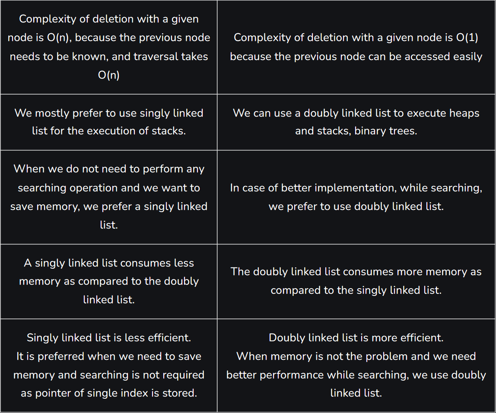

<!-- TOC  Alt + insrt in intellij-->

<!-- TOC -->
* [Java Interview Question Bank](#java-interview-question-bank)
* [Java Principles & Best Practices , Memory Management](#java-principles--best-practices--memory-management)
  * [Java Memory Management Principles](#java-memory-management-principles)
* [🚀 Primary Main Features of Java](#-primary-main-features-of-java)
    * [Java's Main Features (with Examples)](#javas-main-features-with-examples)
  * [🧩 Class Loaders in Java](#-class-loaders-in-java)
    * [1. Bootstrap Class Loader](#1-bootstrap-class-loader)
    * [2. Extension Class Loader](#2-extension-class-loader)
    * [3. System/Application Class Loader](#3-systemapplication-class-loader)
    * [Java Class Loaders (Simple & Clear)](#java-class-loaders-simple--clear)
* [🆔 Identifiers in Java](#-identifiers-in-java)
    * [Some Java Keywords](#some-java-keywords)
    * [Java Identifiers (Short & Simple)](#java-identifiers-short--simple)
  * [🏷️ What is a Class?](#-what-is-a-class)
  * [🏗️ Common Types of Classes in Java](#-common-types-of-classes-in-java)
    * [1. Regular (Concrete) Class](#1-regular-concrete-class)
    * [2. Abstract Class](#2-abstract-class)
    * [3. Interface](#3-interface)
    * [4. Final Class](#4-final-class)
    * [5. Inner Class](#5-inner-class)
    * [6. Static Nested Class](#6-static-nested-class)
    * [7. Anonymous Class](#7-anonymous-class)
  * [🧩 Example of Anonymous Class](#-example-of-anonymous-class)
  * [📚 Common Java Terms](#-common-java-terms)
* [Java Constructors](#java-constructors)
  * [1. Default Constructor](#1-default-constructor)
  * [2. Parameterized Constructor](#2-parameterized-constructor)
  * [3. Copy Constructor](#3-copy-constructor)
  * [4. Constructor Chaining](#4-constructor-chaining)
  * [5. Private Constructor](#5-private-constructor)
* [Private Class vs Private Constructor](#private-class-vs-private-constructor)
  * [Example: Private Class](#example-private-class)
  * [Example: Private Constructor (Singleton)](#example-private-constructor-singleton)
  * [🧩 **1️⃣ Constructor Chaining**](#-1-constructor-chaining)
  * [🧱 **2️⃣ Method Chaining (Fluent Interface)**](#-2-method-chaining-fluent-interface)
    * [🔹 Basic Example](#-basic-example)
    * [🔹 Real-world Example: `StringBuilder`](#-real-world-example-stringbuilder)
    * [🔹 Another Example: Streams API](#-another-example-streams-api)
  * [🧩 **3️⃣ Builder Pattern (Chaining for Object Construction)**](#-3-builder-pattern-chaining-for-object-construction)
    * [Example:](#example)
  * [⚙️ **4️⃣ Stream Chaining / Functional Chaining**](#-4-stream-chaining--functional-chaining)
  * [🧠 **5️⃣ Operator / DSL-style Chaining**](#-5-operator--dsl-style-chaining)
  * [⚡ **6️⃣ Other Types of “Chaining” Concepts**](#-6-other-types-of-chaining-concepts)
  * [⚠️ **7️⃣ Pitfalls / Best Practices**](#-7-pitfalls--best-practices)
  * [✅ **Summary**](#-summary)
    * [🔑 TL;DR](#-tldr)
    * [📊 Which One Should You Use?](#-which-one-should-you-use)
* [Modifiers in Java](#modifiers-in-java)
  * [1. Access Modifiers](#1-access-modifiers)
    * [Details](#details)
    * [Example of Private Modifier](#example-of-private-modifier)
    * [Private Constructor](#private-constructor)
  * [2. Non-Access Modifiers](#2-non-access-modifiers)
    * [`static` Modifier](#static-modifier)
    * [✅ Key Points about Static Blocks:](#-key-points-about-static-blocks)
    * [📌 Example:](#-example)
    * [⚡ Common Uses:](#-common-uses)
    * [`final` Modifier](#final-modifier)
    * [`abstract` Modifier](#abstract-modifier)
    * [`native` Modifier](#native-modifier)
      * [Summary Table](#summary-table)
* [Strings in Java](#strings-in-java)
  * [String vs StringBuffer vs StringBuilder vs String Pool](#string-vs-stringbuffer-vs-stringbuilder-vs-string-pool)
    * [String vs StringBuffer vs StringBuilder](#string-vs-stringbuffer-vs-stringbuilder)
    * [String Pool](#string-pool)
    * [Memory Areas Related to Strings](#memory-areas-related-to-strings)
    * [Memory Areas Related to Strings](#memory-areas-related-to-strings-1)
    * [Memory Areas Explained](#memory-areas-explained)
    * [Interning and String Pool](#interning-and-string-pool)
    * [Example](#example-1)
    * [Summary Table](#summary-table-1)
  * [🧠 Java Memory Spaces (JVM Memory Structure)](#-java-memory-spaces-jvm-memory-structure)
    * [🔁 Flow Diagram (Markdown Text Format)](#-flow-diagram-markdown-text-format)
  * [🧩 JVM Memory Areas Explained](#-jvm-memory-areas-explained)
    * [1. **Heap**](#1-heap)
    * [2. **Young Generation (YG)**](#2-young-generation-yg)
    * [3. **Old Generation (Tenured)**](#3-old-generation-tenured)
    * [4. **Stack**](#4-stack)
    * [5. **Metaspace** (Java 8+)](#5-metaspace-java-8)
    * [6. **Program Counter (PC) Register**](#6-program-counter-pc-register)
    * [7. **Native Method Stack**](#7-native-method-stack)
      * [✅ Summary Table](#-summary-table)
    * [JVM Memory Areas Explained](#jvm-memory-areas-explained)
    * [String Literal vs String Object](#string-literal-vs-string-object)
    * [String Manipulation: `concat()` vs `+` Operator](#string-manipulation-concat-vs--operator)
    * [Deep Copy vs Shallow Copy](#deep-copy-vs-shallow-copy)
    * [Why is String Immutable in Java?](#why-is-string-immutable-in-java)
    * [Creating an Immutable Class in Java](#creating-an-immutable-class-in-java)
    * [Creating a Singleton Class in Java](#creating-a-singleton-class-in-java)
* [Wrapper Classes and Autoboxing](#wrapper-classes-and-autoboxing)
    * [🔹 **1. Definition**](#-1-definition)
    * [🔹 **2. Why Wrapper Classes Exist**](#-2-why-wrapper-classes-exist)
    * [🔹 **3. Auto-Boxing & Unboxing**](#-3-auto-boxing--unboxing)
    * [🔹 **4. Example — boolean vs Boolean**](#-4-example--boolean-vs-boolean)
    * [🔹 **5. Key Differences Summary**](#-5-key-differences-summary)
    * [🧠 **In short**](#-in-short)
    * [Autoboxing](#autoboxing)
    * [Example Custom Wrapper Class Demonstrating Autoboxing](#example-custom-wrapper-class-demonstrating-autoboxing)
    * [StackOverflow - Due to out of memory](#stackoverflow---due-to-out-of-memory)
* [Object-Oriented Programming (OOP) in Java](#object-oriented-programming-oop-in-java)
  * [1. Polymorphism](#1-polymorphism)
    * [Definition](#definition)
    * [Inheritance vs Polymorphism](#inheritance-vs-polymorphism)
    * [Types of Inheritance](#types-of-inheritance)
    * [Method Overloading](#method-overloading)
    * [Constructor Overloading](#constructor-overloading)
    * [Method Overriding](#method-overriding)
      * [Covariant Return Type](#covariant-return-type)
    * [Overriding Restrictions on private, static, final methods](#overriding-restrictions-on-private-static-final-methods)
      * [Overloading allowed for private, static, final methods within same class](#overloading-allowed-for-private-static-final-methods-within-same-class)
    * [Data Binding in Java](#data-binding-in-java)
  * [2. Inheritance](#2-inheritance)
  * [3. Encapsulation](#3-encapsulation)
  * [4. Abstraction](#4-abstraction)
  * [5. Interface](#5-interface)
    * [Private methods in interface](#private-methods-in-interface)
    * [Variables in Interfaces](#variables-in-interfaces)
    * [Class inside Interface](#class-inside-interface)
    * [Interface inside Class](#interface-inside-class)
    * [Marker Interface vs Functional Interface](#marker-interface-vs-functional-interface)
    * [Common Functional Interfaces and Marker Interfaces](#common-functional-interfaces-and-marker-interfaces)
    * [Java 8+ Interface Enhancements](#java-8-interface-enhancements)
  * [6. Functional Interfaces in Java (`java.util.function`)](#6-functional-interfaces-in-java-javautilfunction)
  * [7. Comparable vs Comparator](#7-comparable-vs-comparator)
  * [8. `implements` vs `extends`](#8-implements-vs-extends)
  * [9. Interface vs Abstract Class](#9-interface-vs-abstract-class)
    * [Why use interface over abstract class?](#why-use-interface-over-abstract-class)
  * [10. Cohesion vs Coupling](#10-cohesion-vs-coupling)
    * [Coupling](#coupling)
    * [Cohesion](#cohesion)
* [Association, Aggregation, and Composition (IS-A / HAS-A)](#association-aggregation-and-composition-is-a--has-a)
  * [🧩 1. What is an “IS-A” relationship?](#-1-what-is-an-is-a-relationship)
    * [➡️ Example](#-example-1)
    * [🧠 Conceptually:](#-conceptually)
      * [🪶 ASCII diagram:](#-ascii-diagram)
  * [🧩 2. What is a “HAS-A” relationship?](#-2-what-is-a-has-a-relationship)
    * [➡️ Example](#-example-2)
    * [🧠 Conceptually:](#-conceptually-1)
      * [🪶 ASCII diagram:](#-ascii-diagram-1)
      * [⚖️ Summary Table](#-summary-table-1)
* [🧩 HAS-A Relationship Types in Java](#-has-a-relationship-types-in-java)
  * [⚙️ 1. Composition — *Strong HAS-A relationship*](#-1-composition--strong-has-a-relationship)
    * [➡️ Example: Car **has** an Engine](#-example-car-has-an-engine)
      * [🪶 ASCII Diagram](#-ascii-diagram-2)
  * [⚙️ 2. Aggregation — *Weak HAS-A relationship*](#-2-aggregation--weak-has-a-relationship)
    * [➡️ Example: Department **has** Employees](#-example-department-has-employees)
      * [🪶 ASCII Diagram](#-ascii-diagram-3)
    * [🧠 Quick Comparison Table](#-quick-comparison-table)
      * [🧩 Summary Diagram (All Relationships)](#-summary-diagram-all-relationships)
      * [Summary](#summary)
* [🧱 Java Collections Framework Guide](#-java-collections-framework-guide)
  * [🔍 Why Collections Framework?](#-why-collections-framework)
    * [🌐 Collections Hierarchy Overview](#-collections-hierarchy-overview)
    * [🧭 Interactive Decision Flowchart: Pick the Right Collection](#-interactive-decision-flowchart-pick-the-right-collection)
      * [🧠 Example Scenarios](#-example-scenarios)
      * [1. You need to store data with keys and values and want to sort them by keys:](#1-you-need-to-store-data-with-keys-and-values-and-want-to-sort-them-by-keys)
      * [2. You want to store a list of names with duplicates and access by index:](#2-you-want-to-store-a-list-of-names-with-duplicates-and-access-by-index)
      * [3. You want to store a set of unique cities, and order doesn’t matter:](#3-you-want-to-store-a-set-of-unique-cities-and-order-doesnt-matter)
      * [4. You want to store key-value pairs with insertion order preserved and need thread safety:](#4-you-want-to-store-key-value-pairs-with-insertion-order-preserved-and-need-thread-safety)
      * [🧰 Summary Table](#-summary-table-2)
  * [🛠 Core Interfaces and Key Differences](#-core-interfaces-and-key-differences)
    * [Iterable vs Collection](#iterable-vs-collection)
    * [Iterator vs Enumeration](#iterator-vs-enumeration)
    * [Collection Interface Methods](#collection-interface-methods)
    * [Iterator Interface](#iterator-interface)
    * [Iterable Interface](#iterable-interface)
  * [🧩 List Implementations](#-list-implementations)
    * [ArrayList](#arraylist)
    * [LinkedList](#linkedlist)
    * [Vector (Legacy)](#vector-legacy)
    * [Stack (Legacy)](#stack-legacy)
  * [🌀 Queue Implementations](#-queue-implementations)
  * [🎯 Set Implementations](#-set-implementations)
    * [HashSet](#hashset)
    * [LinkedHashSet](#linkedhashset)
    * [TreeSet](#treeset)
  * [🧮 Map Implementations](#-map-implementations)
    * [🔑 **Key Differences Between `HashMap` and `Hashtable`**](#-key-differences-between-hashmap-and-hashtable)
    * [✅ **When to Use**](#-when-to-use)
    * [📌 Example](#-example-3)
  * [🧠 Thread Safety Comparison](#-thread-safety-comparison)
  * [🧠 `hashCode()` and `equals()` in Hash-Based Collections](#-hashcode-and-equals-in-hash-based-collections)
    * [**When to override `hashCode()` and `equals()`**](#when-to-override-hashcode-and-equals)
    * [**Rules**](#rules)
    * [**When you don’t need them**](#when-you-dont-need-them)
    * [**How it works**](#how-it-works)
    * [**Example**](#example-2)
  * [🔁 What Is Treeify and Threshold?](#-what-is-treeify-and-threshold)
  * [🧩 Final Full ASCII Diagram with Treeify and Threshold](#-final-full-ascii-diagram-with-treeify-and-threshold)
    * [⚙️ Behind the Scenes: Key Conditions](#-behind-the-scenes-key-conditions)
    * [📊 Quick Summary Table](#-quick-summary-table)
    * [🧪 How It Helps](#-how-it-helps)
    * [✅ Final Notes](#-final-notes)
    * [🧠 Imagine This First...](#-imagine-this-first)
    * [🔍 Key Concepts (Simple Terms)](#-key-concepts-simple-terms)
    * [🔄 Flow of How HashMap Works (Step-by-Step)](#-flow-of-how-hashmap-works-step-by-step)
      * [Let's say:](#lets-say)
    * [Step 1: **Key is Hashed**](#step-1-key-is-hashed)
    * [Step 2: **Find the Right Bucket**](#step-2-find-the-right-bucket)
    * [Step 3: **Handle Collisions (Chaining)**](#step-3-handle-collisions-chaining)
    * [Step 4: **Retrieving a Value (get method)**](#step-4-retrieving-a-value-get-method)
      * [🧱 ASCII Diagram: Internal Working of HashMap](#-ascii-diagram-internal-working-of-hashmap)
    * [🔁 If there's a collision:](#-if-theres-a-collision)
    * [⚙️ Internally (Technical, but simple)](#-internally-technical-but-simple)
    * [📌 Summary (Even Simpler)](#-summary-even-simpler)
  * [🧠 What Is ConcurrentHashMap?](#-what-is-concurrenthashmap)
    * [✅ Why Use It?](#-why-use-it)
    * [🔍 How It Differs from HashMap](#-how-it-differs-from-hashmap)
    * [⚙️ Internal Working (Java 8 and above)](#-internal-working-java-8-and-above)
      * [🔩 Core Concepts:](#-core-concepts)
    * [🔄 Insertion Flow (Put Operation)](#-insertion-flow-put-operation)
      * [🧱 ASCII Diagram of ConcurrentHashMap (Simplified)](#-ascii-diagram-of-concurrenthashmap-simplified)
    * [🧪 Read Operation (Get)](#-read-operation-get)
    * [🔐 Treeification & Resizing](#-treeification--resizing)
    * [🚨 What It Doesn’t Do](#-what-it-doesnt-do)
    * [✅ When to Use ConcurrentHashMap](#-when-to-use-concurrenthashmap)
    * [📌 Summary](#-summary-1)
    * [1. Collections.synchronizedMap(Map\<K, V>)](#1-collectionssynchronizedmapmapk-v)
    * [2. ConcurrentHashMap\<K, V>](#2-concurrenthashmapk-v-)
      * [⚖️ Key Differences](#-key-differences)
    * [🧭 When to Use What?](#-when-to-use-what)
    * [❗ Why ConcurrentHashMap Disallows Nulls?](#-why-concurrenthashmap-disallows-nulls)
  * [🛡️ Summary: When to Use What?](#-summary-when-to-use-what)
* [**Java Collections Framework Overview (Java 1.0 - Java 21)**](#java-collections-framework-overview-java-10---java-21)
    * [Legend:](#legend)
    * [**1. What is Serialization?**](#1-what-is-serialization)
    * [**2. Why do we need to serialize if an object is already in memory (which is bytes anyway)?**](#2-why-do-we-need-to-serialize-if-an-object-is-already-in-memory-which-is-bytes-anyway)
    * [**3. Why Serialization is Needed (Use Cases)**](#3-why-serialization-is-needed-use-cases)
    * [**4. Analogy**](#4-analogy)
  * [Marshaling/Unmarshaling](#marshalingunmarshaling)
    * [🧩 What is *Marshaling* in Java?](#-what-is-marshaling-in-java)
    * [🔄 What is *Unmarshaling*?](#-what-is-unmarshaling)
    * [🧠 Related Terms](#-related-terms)
  * [🧰 Examples of Marshalling in Java](#-examples-of-marshalling-in-java)
    * [1️⃣ Java Serialization](#1-java-serialization)
    * [2️⃣ JAXB Example (XML Marshalling)](#2-jaxb-example-xml-marshalling)
  * [💡 Summary](#-summary-2)
    * [Boxing & Autoboxing (Primitive → Wrapper Object)](#boxing--autoboxing-primitive--wrapper-object)
    * [Unboxing & Auto-unboxing (Wrapper Object → Primitive)](#unboxing--auto-unboxing-wrapper-object--primitive)
    * [Why?](#why)
    * [`final` keyword](#final-keyword)
    * [`finally` block](#finally-block)
    * [`finalize()` method](#finalize-method)
    * [Example:](#example-3)
* [⚙️ 𝐂𝐚𝐜𝐡𝐢𝐧𝐠 𝐒𝐭𝐫𝐚𝐭𝐞𝐠𝐢𝐞𝐬 & 𝐁𝐞𝐬𝐭 𝐏𝐫𝐚𝐜𝐭𝐢𝐜𝐞𝐬](#-𝐂𝐚𝐜𝐡𝐢𝐧𝐠-𝐒𝐭𝐫𝐚𝐭𝐞𝐠𝐢𝐞𝐬--𝐁𝐞𝐬𝐭-𝐏𝐫𝐚𝐜𝐭𝐢𝐜𝐞𝐬)
  * [Caching in java](#caching-in-java)
* [Two types of error:-](#two-types-of-error-)
  * [Exception Handling](#exception-handling)
  * [throw new and throws](#throw-new-and-throws)
    * [`throw`](#throw)
    * [`throws`](#throws)
  * [Checked and Unchecked Exceptions](#checked-and-unchecked-exceptions)
    * [1. **Checked Exceptions**](#1-checked-exceptions)
    * [2. **Unchecked Exceptions**](#2-unchecked-exceptions)
  * [Try with Resource (Java 7 and Java 9 Improvements)](#try-with-resource--java-7-and-java-9-improvements-)
  * [⚙️ **1. Nested try-catch**](#-1-nested-try-catch)
  * [⚙️ **2. Handling multiple exceptions**](#-2-handling-multiple-exceptions)
    * [🧠 Quick Summary Table](#-quick-summary-table-1)
  * [</details>](#details-1)
* [Multithreading](#multithreading)
  * [Volatile Keyword](#volatile-keyword)
    * [**Scenario: Stopping a background thread**](#scenario-stopping-a-background-thread)
    * [**Example**](#example-4)
    * [**Why `volatile` matters here**](#why-volatile-matters-here)
    * [**Key Points**](#key-points)
  * [Deadlock](#deadlock)
    * [🔹 (threads & resources)](#-threads--resources)
    * [🔹 Key characteristics of Deadlock](#-key-characteristics-of-deadlock)
    * [🔹 Simple Java Example](#-simple-java-example)
  * [Race Condition](#race-condition)
    * [✅ Fail-Safe:](#-fail-safe)
    * [❌ Fail-Fast:](#-fail-fast)
  * [📞 Runnable vs Callable](#-runnable-vs-callable)
    * [🔸 Method-Level](#-method-level)
    * [🔸 Block-Level](#-block-level)
    * [🔸 Class-Level](#-class-level)
    * [🔸 wait/notify/notifyAll](#-waitnotifynotifyall)
    * [🔸 Explicit Lock (ReentrantLock)](#-explicit-lock-reentrantlock)
    * [🔸 volatile](#-volatile)
    * [1. Threads](#1-threads)
    * [2. ExecutorService](#2-executorservice)
    * [3. CompletableFuture (Java 8+)](#3-completablefuture-java-8)
    * [4. CompletableFuture with Callback](#4-completablefuture-with-callback)
    * [5. Spring @Async](#5-spring-async)
    * [6. Virtual Threads (Java 21)](#6-virtual-threads-java-21)
  * [🧩 Two Separate Concepts](#-two-separate-concepts)
  * [⚙️ 1. Synchronous Method](#-1-synchronous-method)
  * [🧱 2. Synchronized Method](#-2-synchronized-method)
  * [⚡ 3. Asynchronous Method](#-3-asynchronous-method)
  * [🔒 4. Synchronized Block (Inside a Method)](#-4-synchronized-block-inside-a-method)
  * [🚀 5. Asynchronous Block (Inside a Method)](#-5-asynchronous-block-inside-a-method)
  * [🔗 6. Combining Both (Synchronized + Asynchronous)](#-6-combining-both-synchronized--asynchronous)
      * [🧠 Summary Table](#-summary-table-3)
    * [🧩 Example Combo](#-example-combo)
    * [✅ Synchronized](#-synchronized)
    * [❌ Non-Synchronized](#-non-synchronized)
* [🧵 Multithreading Concepts: Advanced](#-multithreading-concepts-advanced)
    * [🧩 **Process Synchronization**](#-process-synchronization)
      * [🔐 Common IPC Mechanisms:](#-common-ipc-mechanisms)
    * [🧵 **Thread Synchronization**](#-thread-synchronization)
      * [☑️ Techniques:](#-techniques)
    * [1️⃣ **Using `Thread` Class (Basic)**](#1-using-thread-class-basic)
    * [2️⃣ **Using `Runnable` Interface**](#2-using-runnable-interface)
    * [3️⃣ **Using `ExecutorService` (Thread Pool)**](#3-using-executorservice-thread-pool)
    * [4️⃣ **Using `CompletableFuture` (Java 8+)**](#4-using-completablefuture-java-8)
  * [🧩 **1️⃣ What is `ThreadLocal`?**](#-1-what-is-threadlocal)
    * [🔹 Example](#-example-4)
  * [⚙️ **2️⃣ How It Works Internally**](#-2-how-it-works-internally)
  * [💼 **3️⃣ Real-World Use Cases**](#-3-real-world-use-cases)
    * [✅ **Use Case 1: Request Context in Web Applications**](#-use-case-1-request-context-in-web-applications)
    * [✅ **Use Case 2: Database Connection or Session Management**](#-use-case-2-database-connection-or-session-management)
    * [✅ **Use Case 3: Logging Context / Tracing**](#-use-case-3-logging-context--tracing)
    * [✅ **Use Case 4: Thread-Specific Formatter / Parser**](#-use-case-4-thread-specific-formatter--parser)
  * [⚠️ **4️⃣ Pitfalls & Best Practices**](#-4-pitfalls--best-practices)
    * [✅ Safe usage pattern](#-safe-usage-pattern)
  * [🧠 **5️⃣ Summary**](#-5-summary)
    * [🚀 **In a Real Project**](#-in-a-real-project)
  * [🧵 1️⃣ Using `Thread` + `wait/notify`](#-1-using-thread--waitnotify)
  * [⚙️ 2️⃣ Using `ExecutorService` + `Lock` + `Condition`](#-2-using-executorservice--lock--condition)
* [🧩 Design Patterns in Java](#-design-patterns-in-java)
  * [🔒 Singleton Pattern](#-singleton-pattern)
  * [🏭 Factory Pattern](#-factory-pattern)
  * [🏭🏢 Abstract Factory Pattern](#-abstract-factory-pattern)
  * [🏗️ Builder Pattern](#-builder-pattern)
  * [🔌 Adapter Pattern](#-adapter-pattern)
  * [🎨 Decorator Pattern](#-decorator-pattern)
  * [👀 Observer Pattern](#-observer-pattern)
  * [🧠 Strategy Pattern](#-strategy-pattern)
  * [🕹️ Command Pattern](#-command-pattern)
  * [Basic](#basic)
    * [Summary](#summary-1)
    * [Tabular Comparison](#tabular-comparison)
    * [Example with warning:](#example-with-warning)
    * [Suppressing warnings:](#suppressing-warnings)
    * [Notes:](#notes)
    * [1. Trigonometric:](#1-trigonometric)
    * [2. Exponential / Logarithmic:](#2-exponential--logarithmic)
    * [3. Power / Root:](#3-power--root)
    * [4. Rounding:](#4-rounding)
    * [5. Misc:](#5-misc)
    * [Math.max():](#mathmax)
    * [Math.min():](#mathmin)
  * [26. What is the difference between install and deploy](#26-what-is-the-difference-between-install-and-deploy)
* [⚙️ **Question:**](#-question)
  * [🧩 **1️⃣ The Basics**](#-1-the-basics)
    * [🔹 Example](#-example-5)
    * [🔹 Example](#-example-6)
    * [Builder Style:](#builder-style)
    * [Record Style:](#record-style)
    * [**1️⃣ What happens if you override `hashCode()` but not `equals()`?**](#1-what-happens-if-you-override-hashcode-but-not-equals)
      * [💡 Explanation](#-explanation)
      * [⚠️ Effect](#-effect)
      * [✅ Example:](#-example-7)
    * [**2️⃣ How does JVM handle method overloading and overriding internally?**](#2-how-does-jvm-handle-method-overloading-and-overriding-internally)
      * [🔹 **Overloading** (compile-time polymorphism)](#-overloading-compile-time-polymorphism)
      * [🔹 **Overriding** (runtime polymorphism)](#-overriding-runtime-polymorphism)
    * [✅ **Short Answer:**](#-short-answer)
    * [🔍 **Detailed Explanation**](#-detailed-explanation)
      * [1️⃣ What determines overriding?](#1-what-determines-overriding)
      * [2️⃣ What does `@Override` actually do?](#2-what-does-override-actually-do)
      * [3️⃣ Why it matters](#3-why-it-matters)
    * [⚠️ **Special Cases**](#-special-cases)
    * [🧠 **In summary**](#-in-summary)
    * [✅ **Takeaway**](#-takeaway)
    * [**3️⃣ Difference between `final`, effectively final, and `const`**](#3-difference-between-final-effectively-final-and-const)
      * [Example:](#example-5)
    * [**4️⃣ Pass-by-value vs. reference in Java**](#4-pass-by-value-vs-reference-in-java)
      * [💡 Explanation](#-explanation-1)
      * [Example:](#example-6)
    * [**5️⃣ Implement an immutable list without using `Collections.unmodifiableList()`**](#5-implement-an-immutable-list-without-using-collectionsunmodifiablelist)
      * [✅ Example:](#-example-8)
  * [**6️⃣ How does the ForkJoinPool work internally?**](#6-how-does-the-forkjoinpool-work-internally)
    * [💡 Concept](#-concept)
    * [⚙️ Internal Mechanics](#-internal-mechanics)
    * [✅ Example](#-example-9)
  * [**7️⃣ Difference between `synchronized`, `Lock`, and `StampedLock`**](#7-difference-between-synchronized-lock-and-stampedlock)
    * [🧩 Example](#-example-10)
  * [**8️⃣ CompletableFuture vs. traditional Future**](#8-completablefuture-vs-traditional-future)
    * [✅ Example](#-example-11)
  * [**9️⃣ Design a concurrent cache with Read-Write Locks**](#9-design-a-concurrent-cache-with-read-write-locks)
    * [💡 Goal](#-goal)
    * [✅ Example Implementation](#-example-implementation)
    * [🚀 Optimization](#-optimization)
  * [**🔟 False Sharing and How to Avoid It**](#-false-sharing-and-how-to-avoid-it)
    * [💡 Concept](#-concept-1)
    * [🔍 Example](#-example-12)
    * [🚫 Effect](#-effect-1)
    * [✅ Avoidance Techniques](#-avoidance-techniques)
      * [✅ **Summary Table**](#-summary-table-4)
* [Junit](#junit)
  * [Junit mockito](#junit-mockito)
  * [Java Questions](#java-questions)
<!-- TOC -->

# Java Interview Question Bank

- [Java Interview Questions 1](https://www.java2novice.com/java-interview-questions/)
- [Java Interview Questions 2](https://www.java67.com/2015/03/top-40-core-java-interview-questions-answers-telephonic-round.html)
- [Java Go through Points](https://www.javamadesoeasy.com/)

---

# Java Principles & Best Practices , Memory Management

<details>
<summary><strong>Java Principles & Best Practices</strong></summary>

<details>
<summary>1. Single Responsibility Principle (SRP)</summary>

A class should have **only one reason to change**.

**Bad Example:**

```java
class User {
    void saveToDatabase() {}
    void printUserDetails() {}
}
```

**Good Example:**

```java
class User {}
class UserRepository {
    void save(User user) {}
}
class UserPrinter {
    void print(User user) {}
}
```

</details>

---

<details>
<summary>2. Open/Closed Principle (OCP)</summary>

Classes should be **open for extension, but closed for modification**.

**Bad Example:**

```java
class Discount {
    double getDiscount(String type) {
        if (type.equals("STUDENT")) return 0.2;
        if (type.equals("SENIOR")) return 0.3;
        return 0;
    }
}
```

**Good Example (using polymorphism):**

```java
interface Discount {
    double getDiscount();
}

class StudentDiscount implements Discount {
    public double getDiscount() { return 0.2; }
}

class SeniorDiscount implements Discount {
    public double getDiscount() { return 0.3; }
}
```

</details>

---

<details>
<summary>3. Liskov Substitution Principle (LSP)</summary>

Subtypes must be **replaceable** with their base types without breaking the program.

**Bad Example:**

```java
class Bird {
    void fly() {}
}
class Ostrich extends Bird {  // Ostrich can't fly
    void fly() { throw new UnsupportedOperationException(); }
}
```

**Good Example:**

```java
interface Bird {}
interface Flyable extends Bird { void fly(); }

class Sparrow implements Flyable {
    public void fly() { System.out.println("Flying"); }
}

class Ostrich implements Bird {}
```

</details>

---

<details>
<summary>4. Interface Segregation Principle (ISP)</summary>

Clients should not be forced to implement **unnecessary methods**.

**Bad Example:**

```java
interface Worker {
    void work();
    void eat();
}

class Robot implements Worker {
    public void work() {}
    public void eat() {} // Not applicable
}
```

**Good Example:**

```java
interface Workable { void work(); }
interface Eatable { void eat(); }

class Robot implements Workable {
    public void work() {}
}
```

</details>

---

<details>
<summary>5. Dependency Inversion Principle (DIP)</summary>

Depend on **abstractions**, not on concrete implementations.

**Bad Example:**

```java
class MySQLDatabase {
    void connect() {}
}

class App {
    MySQLDatabase db = new MySQLDatabase();
}
```

**Good Example:**

```java
interface Database { void connect(); }

class MySQLDatabase implements Database {
    public void connect() {}
}

class App {
    private Database db;
    App(Database db) { this.db = db; }
}
```

</details>

---

<details>
<summary>6. DRY (Don’t Repeat Yourself)</summary>

Avoid duplicating logic. Extract common behavior into methods/classes.

**Bad Example:**

```java
int areaSquare(int side) { return side * side; }
int areaRectangle(int length, int width) { return length * width; }
```

**Good Example:**

```java
class ShapeUtils {
    static int area(int a, int b) { return a * b; }
}
```

</details>

---

<details>
<summary>7. KISS (Keep It Simple, Stupid)</summary>

Prefer **simple and clear solutions** over clever but complex ones.

**Bad Example:**

```java
int add(int a, int b) {
    return (a | b) + (a & b); // Bitwise trick
}
```

**Good Example:**

```java
int add(int a, int b) {
    return a + b;
}
```

</details>

---

<details>
<summary>8. YAGNI (You Aren’t Gonna Need It)</summary>

Don’t write code for future needs that may never come.

**Bad Example:**

```java
class Car {
    void fly() {}  // Not needed now
}
```

**Good Example:**

```java
class Car {
    void drive() {}
}
```

</details>

---

<details>
<summary>9. Validate Before Use</summary>

Always **validate inputs** before using them to avoid crashes and bugs.

**Bad Example:**

```java
int divide(int a, int b) {
    return a / b;  // Risk of divide by zero
}
```

**Good Example:**

```java
int divide(int a, int b) {
    if (b == 0) throw new IllegalArgumentException("Divider cannot be zero");
    return a / b;
}
```

</details>

---

<details>
<summary>10. Favor Composition Over Inheritance</summary>

Use **composition** instead of inheritance when possible.

**Bad Example:**

```java
class Engine {}
class Car extends Engine {}  // Wrong: Car is not an Engine
```

**Good Example:**

```java
class Engine {}
class Car {
    private Engine engine;
    Car(Engine engine) { this.engine = engine; }
}
```

</details>

---

<details>
<summary>11. Law of Demeter (LoD)</summary>

An object should only talk to its **direct friends**, not strangers.

**Bad Example:**

```java
order.getCustomer().getAddress().getCity();
```

**Good Example:**

```java
class Order {
    Customer customer;
    String getCustomerCity() {
        return customer.getCity();
    }
}
order.getCustomerCity();
```

</details>

---

<details>
<summary>12. Fail Fast Principle</summary>

Detect and report errors **early**, instead of failing silently.

**Usage Example:**

```java
if (list == null) throw new IllegalArgumentException("List cannot be null");
```

</details>

---

## Java Memory Management Principles

<details>
<summary>1. Avoid Creating Unnecessary Objects</summary>

Unnecessary objects increase memory usage and GC pressure.

**Bad Example:**

```java
String s1 = new String("Hello"); // Creates unnecessary object
```

**Good Example:**

```java
String s1 = "Hello"; // Uses string pool
```

</details>

---

<details>
<summary>2. Prefer Immutability</summary>

Immutable objects are thread-safe and reduce errors.

**Usage Example:**

```java
final class Person {
    private final String name;
    Person(String name) { this.name = name; }
    String getName() { return name; }
}
```

Immutable objects also reduce chances of memory leaks caused by unintended modifications.

</details>

---

<details>
<summary>3. Use Primitive Types Instead of Wrappers (when possible)</summary>

Wrappers (`Integer`, `Double`) consume more memory than primitives (`int`, `double`).

**Bad Example:**

```java
Integer sum = 0;
for (Integer i = 0; i < 1000; i++) {
    sum += i;
}
```

**Good Example:**

```java
int sum = 0;
for (int i = 0; i < 1000; i++) {
    sum += i;
}
```

</details>

---

<details>
<summary>4. Reuse Objects When Possible</summary>

For heavy objects, reuse instances instead of creating new ones repeatedly.

**Usage Example:**

```java
// Reuse Random instead of creating in every method call
private static final Random random = new Random();
```

</details>

---

<details>
<summary>5. Be Careful with Static References</summary>

Static references live until the class is unloaded and may cause **memory leaks**.

**Bad Example:**

```java
static List<String> cache = new ArrayList<>();
```

**Good Example:**

* Use weak references (`WeakHashMap`) if cache entries can be discarded.
* Clean up static fields when not needed.

</details>

---

<details>
<summary>6. Close Resources Properly</summary>

Unclosed resources (files, sockets, DB connections) leak memory.

**Bad Example:**

```java
FileInputStream fis = new FileInputStream("data.txt");
```

**Good Example (try-with-resources):**

```java
try (FileInputStream fis = new FileInputStream("data.txt")) {
    // use fis
}
```

</details>

---

<details>
<summary>7. Use StringBuilder/StringBuffer for Concatenation in Loops</summary>

String concatenation in loops creates multiple intermediate objects.

**Bad Example:**

```java
String result = "";
for (int i = 0; i < 100; i++) {
    result += i;
}
```

**Good Example:**

```java
StringBuilder sb = new StringBuilder();
for (int i = 0; i < 100; i++) {
    sb.append(i);
}
String result = sb.toString();
```

</details>

---

<details>
<summary>8. Avoid Memory Leaks with Collections</summary>

Collections can hold references long after they are needed.

**Bad Example:**

```java
List<byte[]> list = new ArrayList<>();
while (true) {
    list.add(new byte[1024]); // OutOfMemoryError
}
```

**Good Example:**

```java
list.clear(); // Release references when no longer needed
```

Or use `WeakHashMap` when keys should be garbage collected.

</details>

---

<details>
<summary>9. Use Object Pooling Carefully</summary>

* For lightweight objects, let GC handle them.
* For expensive resources (DB connections, threads), use pooling (`ExecutorService`, connection pools).

**Usage Example:**

```java
ExecutorService executor = Executors.newFixedThreadPool(5);
```

</details>

---

<details>
<summary>10. Monitor and Tune Garbage Collection</summary>

* Use JVM options to optimize GC (`-Xms`, `-Xmx`, `-XX:+UseG1GC`).
* Monitor memory with tools like **VisualVM, JConsole, Flight Recorder**.

**Usage:**

```bash
java -Xms512m -Xmx1024m -XX:+UseG1GC MyApp
```

</details>

---

<details>
<summary>11. Weak References for Caching</summary>

Use `WeakReference` or `WeakHashMap` for objects that can be garbage collected.

**Usage Example:**

```java
Map<Object, String> cache = new WeakHashMap<>();
```

</details>

---

<details>
<summary>12. Prefer Local Variables Over Instance Variables</summary>

Local variables are eligible for GC as soon as the method exits, while instance variables may remain longer.

**Usage Example:**

```java
public int compute() {
    int temp = 100;  // released quickly
    return temp * 2;
}
```

</details>

</details>

---

# 🚀 Primary Main Features of Java

<details>
<summary>Java main features</summary>

1. Platform Independent  
2. Object Oriented Programming Language  
   - Abstraction  
   - Encapsulation  
   - Inheritance  
   - Polymorphism  
3. Simple  
4. Robust  
5. Secure  
6. Distributed  
7. Multithreading  
8. Portable  

### Java's Main Features (with Examples)

1. **Platform Independent**
   - Write once, run anywhere. Java code compiles to bytecode, which runs on any OS with a JVM.
- _Example:_

```java
// Compile on Windows, run on Linux
javac Hello.java
java Hello
```

2. **Object-Oriented**
   - Uses classes and objects. Supports Abstraction, Encapsulation, Inheritance, and Polymorphism.
- _Example:_

```java
class Dog { void bark() { System.out.println("Woof"); } }
```

3. **Simple**
   - Easy syntax, no pointers, automatic memory management.
   - _Example:_

```java
int x = 5; // No pointer arithmetic
```

4. **Robust**
   - Strong memory management, exception handling, type checking.
   - _Example:_

```java
try { int a = 5/0; } catch(Exception e) { System.out.println("Error"); }
```

5. **Secure**
   - No explicit pointer, runs in JVM sandbox, bytecode verification.
   - _Example:_
     // Applets run in restricted environment

6. **Distributed**
   - Supports networking, RMI, and web applications.
   - _Example:_
     
```java
import java.net.*;
Socket s = new Socket("localhost", 8080);
```

7. **Multithreaded**
   - Can run multiple threads (tasks) at once.
   - _Example:_
     
```java
new Thread(() -> System.out.println("Hello from thread")).start();
```

8. **Portable**
   - Java programs run the same on any platform with JVM.
   - _Example:_
     // Bytecode runs on Windows, Mac, Linux

</details>

---

## 🧩 Class Loaders in Java

<details>
<summary>Class Loaders explanation</summary>

### 1. Bootstrap Class Loader

### 2. Extension Class Loader

### 3. System/Application Class Loader


### Java Class Loaders (Simple & Clear)

Java uses class loaders to load classes into memory in a specific order:

1. **Bootstrap Class Loader**
   - Loads core Java classes (like `java.lang.*`).
   - Built into JVM, not accessible in Java code.
   - _Example:_ Loads `String.class` from the JDK.

2. **Extension (Platform) Class Loader**
   - Loads classes from extension directories (e.g., `JAVA_HOME/lib/ext`).
   - _Example:_ Loads optional Java libraries.

3. **System (Application) Class Loader**
   - Loads classes from your application's classpath.
   - _Example:_ Loads your own classes: `com.myapp.Main`.

**Hierarchy:**

```
Bootstrap
   ↓
Extension
   ↓
System (Application)
```

**Code Example:**
```java
ClassLoader cl = MyClass.class.getClassLoader();
System.out.println(cl); // Usually prints 'sun.misc.Launcher$AppClassLoader'
```

---
</details>

---

# 🆔 Identifiers in Java

<details>
<summary>Java Identifiers and Keywords</summary>

- Identifiers start with alphabets, underscore `_`, or dollar `$`.
- Case sensitive.
- **Keywords cannot be used as identifiers**.

### Some Java Keywords

| Keyword                   | Usage                                   |
|---------------------------|-----------------------------------------|
| `class`                   | Declare a class                         |
| `public`                  | Accessibility modifier                  |
| `static`                  | Belongs to class rather than instance   |
| `void`                    | Method returns nothing                  |
| `main`                    | Entry point of Java program             |
| `new`                     | Create new object                       |
| `if`, `else`              | Conditional statements                  |
| `for`, `while`, `do`      | Loop constructs                         |
| `return`                  | Exit method and optionally return value |
| `try`, `catch`, `finally` | Exception handling blocks               |
| `throw`, `throws`         | Exception declaration and throwing      |


### Java Identifiers (Short & Simple)

**Identifiers** are names for variables, methods, classes, etc.

**Rules:**
* Must start with a letter (A-Z, a-z), underscore `_`, or dollar sign `$`.
* Can contain digits (0-9) after the first character.
* Case sensitive (`MyVar` ≠ `myvar`).
* Cannot use Java keywords (like `class`, `int`).

**Examples:**
```java
int age;
String _name;
double $salary;
// int 2ndValue; // Invalid: cannot start with digit
// int class;    // Invalid: 'class' is a keyword
```

**Common Java Keywords:**
`class`, `public`, `static`, `void`, `if`, `else`, `for`, `while`, `return`, `try`, `catch`, `throw`, `throws`

</details>

---

<details>
<summary>Variables in Java</summary>

* **Local:** Inside method body; cannot be `static`.
* **Instance:** Inside class body; each object has its own copy.
* **Static:** Shared across all instances; memory allocated once when class loads.

</details>

---

## 🏷️ What is a Class?

A **class** is a blueprint or template from which objects are created. It contains data (fields) and behaviors (methods).

---

## 🏗️ Common Types of Classes in Java

<details>
<summary>Common Java Class Types</summary>

### 1. Regular (Concrete) Class
- Can be instantiated to create objects.
- Contains fields, methods, constructors.

```java
public class Car {
    // Fields, methods, constructors
}
````

### 2. Abstract Class

* Cannot be instantiated.
* May contain abstract methods to be implemented by subclasses.

```java
public abstract class Shape {
    // Abstract and regular methods
}
```

### 3. Interface

* Collection of abstract methods (before Java 8).
* From Java 8, can have default method implementations.

```java
public interface Drawable {
    void draw(); // implicitly public and abstract
}
```

### 4. Final Class

* Cannot be extended (subclassed).

```java
public final class UtilityClass {
    // Methods and fields
}
```

### 5. Inner Class

* Defined inside another class.
* Can be static or non-static.

```java
public class Outer {
    class Inner {
        // Inner class
    }
}
```

### 6. Static Nested Class

* Static class inside another class.
* Cannot access instance variables of outer class.

```java
public class Outer {
    static class Nested {
        // Static nested class
    }
}
```

### 7. Anonymous Class

* Local class without a name.
* Usually used to instantiate interfaces or extend classes once.

```java
Runnable myRunnable = new Runnable() {
    public void run() {
        // Implementation
    }
};
```

</details>

---

## 🧩 Example of Anonymous Class

```java
class Polygon {
    public void display() {
        System.out.println("Inside the Polygon class");
    }
}

class AnonymousDemo {
    public void createClass() {
        // Anonymous class extending Polygon
        Polygon p1 = new Polygon() {
            public void display() {
                System.out.println("Inside an anonymous class.");
            }
        };
        p1.display();
    }
}

class Main {
    public static void main(String[] args) {
        AnonymousDemo an = new AnonymousDemo();
        an.createClass();
    }
}
```

**Output:**
`Inside an anonymous class.`

---

## 📚 Common Java Terms

| Term                 | Explanation                                                      |
|----------------------|------------------------------------------------------------------|
| `import java.io.*;`  | Import all classes from `java.io` package                        |
| `class`              | Defines a class containing data and methods                      |
| `static void main()` | `static` means method can be called without object instantiation |
| `void`               | Method returns no value                                          |
| `System.in`          | Standard input stream (keyboard input)                           |
| `System.out`         | Standard output stream (console output)                          |
| `println()`          | Prints text and moves to a new line                              |

---


# Java Constructors

In Java:

- You can create multiple constructors in a single class without limit.
- Constructors are special methods used to initialize objects.
- They are invoked when an object is created using the `new` keyword.

---

## 1. Default Constructor

- No parameters.
- Provided automatically by Java if no constructor is explicitly defined.

```java
public class MyClass {
    // Default constructor
    public MyClass() {
        // Initialization logic
    }
}
````

---

## 2. Parameterized Constructor

* Takes one or more parameters.
* Used to initialize object properties with given values.

```java
public class MyClass {
    public MyClass(int x, String str) {
        // Initialization using parameters
    }
}
```

---

## 3. Copy Constructor

* Creates a new object by copying an existing object's state.

```java
public class MyClass {
    private int x;
    private String str;

    // Copy constructor
    public MyClass(MyClass original) {
        this.x = original.x;
        this.str = original.str;
    }
}
```

---

## 4. Constructor Chaining

* One constructor calls another within the same class using `this()`.

```java
public class MyClass {
    private int x;
    private String str;

    public MyClass(int x, String str) {
        this.x = x;
        this.str = str;
    }

    public MyClass() {
        this(0, "default");
    }
}
```

---

## 5. Private Constructor

* Has private access modifier.
* Prevents instantiation from outside the class.
* Commonly used for utility classes or singleton patterns.

```java
public class UtilityClass {
    private UtilityClass() {
        // Prevent instantiation
    }
}
```

---

# Private Class vs Private Constructor

| Feature           | Private Class                                  | Private Constructor                                     |
|-------------------|------------------------------------------------|---------------------------------------------------------|
| **Scope**         | Accessible only within the enclosing class     | Accessible only within the class itself                 |
| **Purpose**       | Encapsulate helper functionality, inner logic  | Prevent external instantiation of the class             |
| **Instantiation** | Can be instantiated inside the enclosing class | Prevents instantiation except from within the class     |
| **Use Cases**     | Nested helper classes                          | Singleton pattern, utility classes, controlled creation |

---

## Example: Private Class

```java
public class OuterClass {

    private static class InnerClass {
        // Inner logic
    }

    public void doSomething() {
        InnerClass inner = new InnerClass();
        // Use inner instance
    }
}
```

---

## Example: Private Constructor (Singleton)

```java
public class Singleton {

    private static Singleton instance;

    private Singleton() {
        // Private constructor
    }

    public static Singleton getInstance() {
        if (instance == null) {
            instance = new Singleton();
        }
        return instance;
    }
}

public class Main {
    public static void main(String[] args) {
        // Access the Singleton instance
        Singleton singleObject = Singleton.getInstance();

        // Use its methods
        singleObject.showMessage();
    }
}

```

---

**Summary:**

* **Private Class:** Controls access to the class itself (typically nested classes).
* **Private Constructor:** Controls instantiation of the class.
* You don’t use new Singleton() because the constructor is private.
* You always call Singleton.getInstance() to get the single shared instance.
* Every time you call getInstance(), it will return the same object.

---

<details>

Yes — **constructor chaining** is just one form of “chaining,” but Java supports other kinds of chaining as well — especially in *method calls*, *builders*, and *functional streams*.

Let’s go step by step 👇

---

## 🧩 **1️⃣ Constructor Chaining**

You already know this one — when one constructor calls another within the same class (using `this()`) or a parent’s constructor (`super()`).

```java
class Vehicle {
    Vehicle() { System.out.println("Vehicle"); }
    Vehicle(String type) { this(); System.out.println(type); }
}
```

✅ **Purpose:**
Avoid code duplication and ensure consistent initialization.

---

## 🧱 **2️⃣ Method Chaining (Fluent Interface)**

This is very common in modern Java APIs — a style where methods return `this` so calls can be chained.

---

### 🔹 Basic Example

```java
class Person {
    private String name;
    private int age;

    public Person setName(String name) {
        this.name = name;
        return this;
    }

    public Person setAge(int age) {
        this.age = age;
        return this;
    }
}

Person p = new Person()
                .setName("Alice")
                .setAge(30);
```

> ✅ Each setter returns the same object → allows continuous chaining.

This is called the **Fluent Interface Pattern**.

---

### 🔹 Real-world Example: `StringBuilder`

```java
String result = new StringBuilder()
                    .append("Hello ")
                    .append("World")
                    .append("!")
                    .toString();
```

Each `.append()` returns the same `StringBuilder` instance — that’s **method chaining** in action.

---

### 🔹 Another Example: Streams API

```java
List<Integer> result = numbers.stream()
                              .filter(n -> n % 2 == 0)
                              .map(n -> n * 2)
                              .sorted()
                              .toList();
```

Here, every intermediate operation returns a new `Stream`, enabling chainable operations.

---

## 🧩 **3️⃣ Builder Pattern (Chaining for Object Construction)**

Builder pattern is an **advanced form of method chaining** for immutable or complex objects.

### Example:

```java
class User {
    private final String name;
    private final int age;

    private User(Builder builder) {
        this.name = builder.name;
        this.age = builder.age;
    }

    public static class Builder {
        private String name;
        private int age;

        public Builder name(String name) {
            this.name = name;
            return this;
        }

        public Builder age(int age) {
            this.age = age;
            return this;
        }

        public User build() {
            return new User(this);
        }
    }
}
```

Usage:

```java
User u = new User.Builder()
                .name("Alice")
                .age(25)
                .build();
```

✅ **Why it’s popular:**

* Makes object construction readable
* Works well for immutable objects
* Avoids telescoping constructors

---

## ⚙️ **4️⃣ Stream Chaining / Functional Chaining**

In **functional programming style**, chaining is about **composing transformations**.

Example:

```java
String result = Optional.of(" Java ")
                        .map(String::trim)
                        .map(String::toUpperCase)
                        .orElse("EMPTY");
```

Each call returns another `Optional` → pure functional chaining.

---

## 🧠 **5️⃣ Operator / DSL-style Chaining**

Some frameworks design **DSLs (Domain-Specific Languages)** using chaining to read like English.

Example (in Spring Security or Mockito):

```java
http.authorizeRequests()
    .antMatchers("/admin").hasRole("ADMIN")
    .antMatchers("/user").authenticated()
    .and()
    .formLogin();
```

or

```java
verify(userService, times(1)).save(any());
```

> ✅ This chaining builds configuration objects step-by-step, making APIs more expressive.

---

## ⚡ **6️⃣ Other Types of “Chaining” Concepts**

| Type                           | Description                                                    | Example                              |
|--------------------------------|----------------------------------------------------------------|--------------------------------------|
| **Exception chaining**         | One exception wraps another (cause chaining)                   | `new RuntimeException("msg", cause)` |
| **Stream/Functional chaining** | Each method returns a new instance for next transformation     | `.filter().map().collect()`          |
| **Builder chaining**           | Build complex objects fluently                                 | `.name().age().build()`              |
| **Pipeline chaining**          | Sequence of processing steps in design (e.g., servlet filters) | `doFilter(request, response)`        |

---

## ⚠️ **7️⃣ Pitfalls / Best Practices**

* Return `this` **only when mutating the same instance**.
  (Builder pattern creates new instance at the end.)
* Avoid chaining **void** methods (they break the chain).
* Ensure methods in the chain **don’t depend on execution order unexpectedly**.
* Use chaining for **readability**, not just for compact code.

---

## ✅ **Summary**

| Type                     | Example                       | Purpose                           |
|--------------------------|-------------------------------|-----------------------------------|
| **Constructor chaining** | `this()` / `super()`          | Reuse constructor logic           |
| **Method chaining**      | `.setName().setAge()`         | Fluent interface / readability    |
| **Builder chaining**     | `.name().age().build()`       | Complex immutable object creation |
| **Stream chaining**      | `.filter().map().collect()`   | Functional data transformation    |
| **Exception chaining**   | `new RuntimeException(cause)` | Error context propagation         |

---

### 🔑 TL;DR

> ✅ *Constructor chaining* → within the same class.
> ✅ *Method chaining* → between method calls returning `this` or new objects.
> ✅ *Builder / Stream chaining* → modern fluent APIs and functional pipelines.

---


### 📊 Which One Should You Use?

| Approach            | Best When                                        |
|---------------------|--------------------------------------------------|
| `Thread`            | Simple and quick demos/tests                     |
| `Runnable`          | Cleaner logic, reusable, better practice         |
| `ExecutorService`   | Managing **many tasks**, scalability and control |
| `CompletableFuture` | Asynchronous, reactive programming, modern Java  |

</details>

---

---

# Modifiers in Java

---

## 1. Access Modifiers

| Modifier      | Access within class | Access within package | Access outside package by subclass | Access outside package (non-subclass) |
|---------------|---------------------|-----------------------|------------------------------------|---------------------------------------|
| **public**    | Yes                 | Yes                   | Yes                                | Yes                                   |
| **protected** | Yes                 | Yes                   | Yes                                | No                                    |
| **default**   | Yes                 | Yes                   | No                                 | No                                    |
| **private**   | Yes                 | No                    | No                                 | No                                    |

### Details

- **`public`**: Accessible from anywhere.
- **`protected`**: Accessible in the same package and subclasses (even outside package).
- **`default`** (no modifier): Accessible only within the same package.
- **`private`**: Accessible only within the defining class.

### Example of Private Modifier

```java
class Sarath {
    private String name = "sarath"; // accessible only within this class
}

class Friend {
    public void access() {
        Sarath sar = new Sarath();
        String var = sar.name; // Compilation error: name has private access in Sarath
    }
}
````

---

### Private Constructor

* A constructor declared `private` restricts instantiation **outside the class**.
* Commonly used in:

  * **Singleton Pattern** (single instance control)
  * **Utility classes** (only static members, no instances)

```java
public class UtilityClass {
    private UtilityClass() {
        // Prevent instantiation
    }
}
```

---

## 2. Non-Access Modifiers

| Modifier   | Applies To                        | Purpose                                                                              |
|------------|-----------------------------------|--------------------------------------------------------------------------------------|
| `static`   | Variables, methods, inner classes | Makes members belong to the class rather than instances                              |
| `final`    | Variables, methods, classes       | Prevents reassignment, method overriding, or subclassing                             |
| `abstract` | Classes, methods                  | Defines classes or methods that cannot be instantiated or must be overridden         |
| `native`   | Methods                           | Declares a method implemented in platform-dependent code (e.g., C/C++)               |
| `strictfp` | Classes, methods                  | Ensures consistent floating-point calculations across platforms (Removed in Java 17) |

---

### `static` Modifier

* **Static Variables (Class Variables)**

  * Single copy shared across all instances.
  * Used for constants or shared data.

```java
public class MyClass {
    static int staticCount = 0;
}
```

* **Static Methods**

  * Called without creating an instance.
  * Cannot access instance members directly.

```java
public class MyClass {
    static void display() {
        System.out.println("Static method");
    }
}
```

* **Static Blocks**

  * Run once when the class is loaded.
  * Used for static variable initialization or setup.

```java
public class MyClass {
    static {
        System.out.println("Static block executed");
    }
}
```

In Java, a **static block** (also called a *static initializer block*) is used to initialize static variables 
or run some setup code when the class is first loaded into memory by the JVM.

---

### ✅ Key Points about Static Blocks:

1. **Executed Once**

  * Runs only once, when the class is loaded into the JVM (before `main()` runs and before any object is created).

2. **Initialization of Static Variables**

  * Useful for assigning complex values to `static` variables that cannot be set with a single statement.

3. **Runs Before Constructor**

  * Executes before any constructor or instance block runs.

4. **Multiple Static Blocks**

  * You can have more than one static block; they are executed in the order they appear in the class.

---

### 📌 Example:

```java
class Demo {
    static int value;

    // Static block
    static {
        System.out.println("Static block executed.");
        value = 42; // Initializing static variable
    }

    public static void main(String[] args) {
        System.out.println("Main method executed.");
        System.out.println("Value = " + value);
    }
}
```

**Output:**

```
Static block executed.
Main method executed.
Value = 42
```

---

### ⚡ Common Uses:

1. **Complex static variable initialization**

```java
static Map<Integer, String> map;
static {
   map = new HashMap<>();
   map.put(1, "One");
   map.put(2, "Two");
}
```

2. **Loading native libraries**

```java
static {
   System.loadLibrary("nativeLib");
}
```

3. **Configuration setup** (e.g., reading from a file or environment variables at class load time).

---

### `final` Modifier

* **Final Variables**

  * Constants; value assigned once and cannot be changed.

```java
final int MAX_USERS = 100;
```

* **Final Methods**

  * Cannot be overridden by subclasses.

```java
public final void display() {
    System.out.println("Cannot override this method");
}
```

* **Final Classes**

  * Cannot be subclassed.

```java
public final class UtilityClass {
    // cannot be extended
}
```

---

### `abstract` Modifier

* **Abstract Classes**

  * Cannot be instantiated directly.
  * May contain abstract methods (no implementation).

```java
public abstract class Shape {
    abstract void draw();
}
```

* **Abstract Methods**

  * Must be overridden by subclasses.

```java
public abstract void draw();
```

---

### `native` Modifier

* Indicates that the method is implemented in platform-dependent code, typically in C or C++.

```java
public native void nativeMethod();
```

* Requires use of JNI (Java Native Interface).

---

#### Summary Table

| Modifier    | Type       | Can apply to           | Effect / Use case                              |
| ----------- | ---------- | ---------------------- | ---------------------------------------------- |
| `public`    | Access     | Classes, methods, vars | Accessible everywhere                          |
| `protected` | Access     | Methods, vars          | Package + subclasses only                      |
| `default`   | Access     | Classes, methods, vars | Package only                                   |
| `private`   | Access     | Classes, methods, vars | Class only                                     |
| `static`    | Non-access | Vars, methods, classes | Belongs to class, shared                       |
| `final`     | Non-access | Vars, methods, classes | Constant, no override, no subclass             |
| `abstract`  | Non-access | Classes, methods       | Abstract behavior, must subclass/override      |
| `native`    | Non-access | Methods                | Implemented in native code                     |
| `strictfp`  | Non-access | Classes, methods       | Consistent floating-point (removed in Java 17) |

---


# Strings in Java

## String vs StringBuffer vs StringBuilder vs String Pool

### String vs StringBuffer vs StringBuilder

| Feature            | String                  | StringBuffer                       | StringBuilder                      |
|--------------------|-------------------------|----------------------------------|----------------------------------|
| Mutability         | Immutable               | Mutable                          | Mutable                          |
| Thread Safety      | Thread-safe by nature    | Thread-safe (synchronized)       | Not thread-safe                  |
| Performance        | Slow for concatenation   | Slower due to synchronization    | Faster (recommended for single-thread) |
| Introduced         | Java 1.0                | Java 1.0                         | Java 1.5                        |
| Use Case           | When immutability needed | Multi-threaded environment string manipulation | Single-threaded environment string manipulation |

- Since `String` is immutable, every manipulation creates a new object, which may cause performance overhead and memory churn.
- `StringBuffer` and `StringBuilder` are mutable and provide methods like `append()`, `insert()`, `delete()`, and `substring()` for efficient string manipulation.
- Internally, the `+` operator for string concatenation uses either `StringBuffer` or `StringBuilder`.

---

### String Pool

- A **String Pool** (or **String Intern Pool**) is a special memory area in the Java heap where JVM stores literal String values.
- When a String literal is created, JVM checks the pool first. If it exists, the reference is reused; else, a new String object is created in the pool.
- This saves memory and improves performance.

```java
String literal = "Sarath";           // Uses String Pool
String object = new String("Sarath"); // New object on heap, not in pool by default

// Comparisons:
literal == object;  // false (different references)
literal == "Sarath"; // true (both point to pool)
```

---

### Memory Areas Related to Strings

* **Eden Space:** Where new objects (including String objects) are allocated.
* **PermGen Space (Permanent Generation):** Used in older Java versions to store class metadata and interned Strings.
* **MetaSpace:** Replaced PermGen since Java 8 to store class metadata outside the heap.

---


<details>
<summary><strong>🧠 Java Memory Areas Related to Strings</strong></summary>

### Memory Areas Related to Strings

Strings are stored differently depending on how they are created and the Java version.

```mermaid
flowchart TD

    Start["String Creation"]

    Start --> IsLiteral{"Is it a Literal?"}

    %% new String path
    IsLiteral -- No --> NewString["new String(&quot;Hello&quot;) <br/>(Heap Object)"]
    NewString --> Eden["Eden Space (Young Gen)<br/>(in Heap)"]

    %% String literal path
    IsLiteral -- Yes --> Literal["&quot;Hello&quot; (String Literal)<br/>Goes to String Pool"]
    Literal --> Interned["Interned in:<br/>- PermGen (Java ≤ 7)<br/>- Metaspace (Java 8+)"]

```



---

### Memory Areas Explained


| Area          | Description                                              | Java Version     |
| ------------- | -------------------------------------------------------- | ---------------- |
| Eden Space    | New objects, including new Strings created with `new`    | All versions     |
| PermGen Space | Stores class metadata and interned strings               | Java 7 and below |
| MetaSpace     | Replaces PermGen for class metadata and interned strings | Java 8 and above |

---

### Interning and String Pool

* **String Pool** stores literals and interned strings.
* `String.intern()` adds strings explicitly to the pool.
* Pool was in PermGen (≤Java7), moved to MetaSpace (Java8+).

---

### Example

```java
String a = "Hello";              // Stored in String pool
String b = new String("Hello");  // New object in Eden Space (Heap)

System.out.println(a == b);          // false
System.out.println(a == b.intern()); // true
```

---

### Summary Table

| Java Version | Heap (Eden Space)      | PermGen / MetaSpace | String Pool Location |
| ------------ | ---------------------- | ------------------- | -------------------- |
| Java ≤ 7     | `new String()` objects | PermGen             | PermGen              |
| Java 8+      | `new String()` objects | MetaSpace           | MetaSpace            |

</details>

---

## 🧠 Java Memory Spaces (JVM Memory Structure)

Java Virtual Machine (JVM) memory is split into several **memory areas**, each with a **specific purpose** for managing objects, threads, and class-level data.

---

### 🔁 Flow Diagram (Markdown Text Format)


---

## 🧩 JVM Memory Areas Explained

### 1. **Heap**

* **Purpose**: Stores all **objects**, **class instances**, **arrays**
* **Managed by**: Garbage Collector (GC)
* **Subdivided into**:

  * **Young Generation**

    * **Eden Space**: New objects created here.
    * **Survivor Spaces (S0/S1)**: Surviving objects from minor GC.
  * **Old Generation**: Long-lived objects promoted here.

---

### 2. **Young Generation (YG)**

* Optimized for fast allocation and collection (minor GC).
* **Eden Space**:

  * Where all new objects are created.
  * If not garbage collected, moved to Survivor.
* **Survivor Space (S0 & S1)**:

  * Objects that survive GC cycles.
  * After a few cycles, moved to Old Gen.

---

### 3. **Old Generation (Tenured)**

* Stores **long-living objects** (e.g., strings in use, singletons).
* Collected less frequently via **major GC** (slower than minor GC).

---

### 4. **Stack**

* **Thread-local memory**
* Stores:

  * Method calls (stack frames)
  * Primitive local variables
  * Object references (not actual objects)
* Automatically **pushed/popped** during method calls
* Faster than heap memory
* Throws `StackOverflowError` if exceeded

---

### 5. **Metaspace** (Java 8+)

* Stores **class metadata**
* Replaced **PermGen** from Java 8 onwards
* Grows dynamically (unlike PermGen which had fixed size)
* Contains:

  * Class names
  * Method/field metadata
  * Constant pool (for that class)
* **Not part of the heap** — resides in **native memory**

---

### 6. **Program Counter (PC) Register**

* **Thread-specific**: Keeps track of current instruction address
* Helps resume execution in the correct place

---

### 7. **Native Method Stack**

* For executing **native (non-Java)** methods via JNI (Java Native Interface)

---

#### ✅ Summary Table

| Memory Area       | Purpose                               | Collected by GC | Thread Scoped |
| ----------------- | ------------------------------------- | --------------- | ------------- |
| Heap (Eden + Old) | Stores objects, arrays                | ✅               | ❌             |
| Stack             | Stores local variables & method calls | ❌               | ✅             |
| Metaspace         | Class metadata                        | ✅ (limited)     | ❌             |
| PC Register       | Tracks next instruction               | ❌               | ✅             |
| Native Stack      | Native method handling                | ❌               | ✅             |


### JVM Memory Areas Explained

| Memory Area             | Purpose                                     | Notes                        |
| ----------------------- | ------------------------------------------- | ---------------------------- |
| **Heap**                | Stores objects and arrays                   | Managed by Garbage Collector |
| **Young Generation**    | New objects allocated here                  | Eden + Survivor spaces       |
| **Old Generation**      | Long-lived objects moved here               | Major GC occurs              |
| **Stack**               | Stores method calls, primitives, references | Thread-local, fast access    |
| **Metaspace**           | Stores class metadata and interned strings  | Outside heap, Java 8+        |
| **PC Register**         | Tracks current instruction address          | Thread-local                 |
| **Native Method Stack** | For native method execution                 | JNI calls                    |
---

### String Literal vs String Object

* **String Literal:** Stored in the String pool.
* **String Object:** Created via `new` keyword, stored in heap, separate from the pool.
* `.intern()` can be used to add a String object to the pool explicitly.

---

### String Manipulation: `concat()` vs `+` Operator

* `concat()` only creates a new String object if the length of the string being concatenated is greater than zero.
* The `+` operator always creates a new String object regardless.

```java
String str1 = "Rock";
String str2 = "Star";
String str3 = str1.concat(str2); // "RockStar"
```

---

### Deep Copy vs Shallow Copy

* **Shallow Copy:** Copies only the reference of an object; both objects point to the same data.
* **Deep Copy:** Copies the actual data and creates an independent clone.

---

### Why is String Immutable in Java?

* Multiple references can point to the same String in the String pool.
* If String were mutable, one reference changing the String would affect others unexpectedly.
* Immutability ensures thread safety, security, and consistency.
* Immutable Strings have stable hash codes, making them reliable as keys in hash-based collections.

---

### Creating an Immutable Class in Java

1. Declare the class as `final` so it can't be extended.
2. Declare all fields as `private` and `final`.
3. Do not provide setter methods.
4. Initialize all fields via constructor (defensive copies for mutable fields).
5. Provide only getters.
6. Ensure deep copy of mutable objects.

---

### Creating a Singleton Class in Java

```java
public class Database {

    private static Database dbInstance;

    private Database() {
        // private constructor to prevent instantiation
    }

    public static synchronized Database getInstance() {
        if (dbInstance == null) {
            dbInstance = new Database();
        }
        return dbInstance;
    }
}
```

---

# Wrapper Classes and Autoboxing

Java provides wrapper classes for primitives to allow objects to represent primitive types.

| Primitive Type | Wrapper Class |
|----------------|---------------|
| int            | Integer       |
| long           | Long          |
| short          | Short         |
| byte           | Byte          |
| char           | Character     |
| float          | Float         |
| double         | Double        |
| boolean        | Boolean       |

---

<details>
<summary>🧩 Primitive vs Wrapper Class in Java</summary>

### 🔹 **1. Definition**

| Type              | Example                                     | Stored in                    | Default Value      | Nullable | Usage                                                         |
|-------------------|---------------------------------------------|------------------------------|--------------------|----------|---------------------------------------------------------------|
| **Primitive**     | `int`, `boolean`, `char`, `double`          | Stack / directly in variable | `0`, `false`, etc. | ❌ No     | Fast and memory-efficient                                     |
| **Wrapper Class** | `Integer`, `Boolean`, `Character`, `Double` | Heap (as an Object)          | `null`             | ✅ Yes    | Used with Collections, Generics, or when `null` is meaningful |

---

### 🔹 **2. Why Wrapper Classes Exist**

Java’s **Collections (e.g., List, Map, Set)** and **Generics** can only work with *objects*, not primitive types.

Example:

```java
List<int> list = new ArrayList<>();   // ❌ Not allowed
List<Integer> list = new ArrayList<>(); // ✅ Works
```

Wrapper classes wrap the primitive in an object so it can behave like any other reference type.

---

### 🔹 **3. Auto-Boxing & Unboxing**

Java automatically converts between primitives and their wrappers:

```java
int a = 10;
Integer b = a;  // Auto-boxing (primitive -> wrapper)
int c = b;      // Unboxing (wrapper -> primitive)
```

---

### 🔹 **4. Example — boolean vs Boolean**

```java
class Example {
    boolean primitiveBool;
    Boolean wrapperBool;

    void showDefaults() {
        System.out.println("boolean default: " + primitiveBool);
        System.out.println("Boolean default: " + wrapperBool);
    }

    public static void main(String[] args) {
        new Example().showDefaults();
    }
}
```

**Output:**

```
boolean default: false
Boolean default: null
```

✅ **Explanation:**

* `boolean` → primitive, default is `false`.
* `Boolean` → object, default is `null`.

---

### 🔹 **5. Key Differences Summary**

| Feature                 | Primitive         | Wrapper Class        |
| ----------------------- | ----------------- | -------------------- |
| **Type**                | Data type         | Object               |
| **Default Value**       | e.g. `0`, `false` | `null`               |
| **Can be null?**        | ❌ No              | ✅ Yes                |
| **Stored in**           | Stack             | Heap                 |
| **Performance**         | Fast              | Slightly slower      |
| **Used in Collections** | ❌ No              | ✅ Yes                |
| **Example**             | `int`, `boolean`  | `Integer`, `Boolean` |

---

### 🧠 **In short**

* Use **primitives** when performance and memory are critical.
* Use **wrappers** when you need `null` values, or when working with **Collections** or **Generics**.

</details>

---

### Autoboxing

* Automatic conversion of primitive types to their corresponding wrapper classes.

### Example Custom Wrapper Class Demonstrating Autoboxing

```java
public class MyInteger {
    private int value;

    // Constructor
    public MyInteger(int value) {
        this.value = value;
    }

    // Getter
    public int getValue() {
        return value;
    }

    // Setter
    public void setValue(int value) {
        this.value = value;
    }

    // Method demonstrating autoboxing
    public void setIntegerValue(Integer integerValue) {
        this.value = integerValue;  // Autoboxing converts Integer to int automatically
    }

    public static void main(String[] args) {
        MyInteger myIntWrapper = new MyInteger(42);
        System.out.println("Wrapped Value: " + myIntWrapper.getValue());

        myIntWrapper.setValue(100);
        System.out.println("Modified Value: " + myIntWrapper.getValue());

        myIntWrapper.setIntegerValue(123); // Autoboxing occurs here
        System.out.println("Autoboxed Value: " + myIntWrapper.getValue());
    }
}
```

### StackOverflow - Due to out of memory

<details>
<summary>📦 <strong>Pass by Value vs Pass by Reference</strong></summary>

* Java is **always pass by value**.
* It does **not support pass by reference**.
* Object references are passed by value, but the reference still points to the same object.

</details>

---

# Object-Oriented Programming (OOP) in Java

OOP refers to programming using **objects**. The main concepts are:

- Polymorphism
- Encapsulation
- Inheritance
- Abstraction
- Class, Object, Method

---

## 1. Polymorphism

### Definition
Ability to differentiate entities with the same name efficiently. Achieved mainly by:

- **Compile-time Polymorphism** (Method Overloading)
- **Run-time Polymorphism** (Method Overriding)

### Inheritance vs Polymorphism
- **Inheritance**: New class inherits properties/methods of an existing class (code reuse).
- **Polymorphism**: Same method name behaves differently based on context (overloading/overriding).

### Types of Inheritance
1. Single
2. Multi-level
3. Multiple (Not supported in Java classes)
4. Hybrid
5. Hierarchical

---

### Method Overloading
Same method name with different parameters in the same class.

### Constructor Overloading
Multiple constructors with different parameter lists.

### Method Overriding
Subclass provides specific implementation of a superclass method.

#### Covariant Return Type
Overriding method can return subtype of the original method's return type.

---

### Overriding Restrictions on private, static, final methods

| Modifier | Overridable? | Explanation                                      |
|----------|--------------|-------------------------------------------------|
| private  | No           | Not visible to subclasses                        |
| static   | No           | Resolved at compile-time (static binding)       |
| final    | No           | Cannot be changed by subclasses                  |

#### Overloading allowed for private, static, final methods within same class

```java
public class Example {
    private static final void method() {
        System.out.println("Private static final no-arg");
    }
    private static final void method(int x) {
        System.out.println("Private static final with int: " + x);
    }
    public static void main(String[] args) {
        Example.method();
        Example.method(5);
    }
}
```

---

### Data Binding in Java


* **Static Binding (Early Binding)**: Method calls resolved at compile-time (static, private, final methods).
* **Dynamic Binding (Late Binding)**: Method calls resolved at runtime via overriding (non-static, non-final, non-private methods).

Example of dynamic binding:

```java
class Animal { void sound() { System.out.println("Animal sound"); } }
class Dog extends Animal { void sound() { System.out.println("Dog barks"); } }

Animal animal = new Dog();
animal.sound();  // Prints: Dog barks (dynamic binding)
```

---

## 2. Inheritance

* Mechanism where subclass inherits fields and methods of superclass.
* Java **does not support multiple inheritance** with classes due to ambiguity issues.
* Terminology:

  * **Superclass/Base/Parent**
  * **Subclass/Derived/Child**

---

## 3. Encapsulation

* Hiding internal state and requiring all interaction to be performed through an object's methods.
* Protects object integrity by preventing direct access to fields.
* Improves code maintainability.

---

## 4. Abstraction

* Abstract classes may have abstract methods (no body) and concrete methods.
* Declared using `abstract` keyword.
* Provides a base class that subclasses must extend and implement abstract methods.

---

## 5. Interface

* Defines **abstract methods** (Java 7 and before: only abstract methods).
* Since Java 8: supports `default` and `static` methods with bodies.
* Java 9: supports `private` methods for code reuse inside interfaces.

### Private methods in interface

* Used to avoid code duplication in default/static methods.
* Not accessible by implementing classes.

```java
public interface MyInterface {
    void publicAbstractMethod();
    default void defaultMethod() {
        privateHelper();
    }
    static void staticMethod() {
        privateHelper();
    }
    private void privateHelper() {
        System.out.println("Helper inside interface");
    }
}
```

---

### Variables in Interfaces

* Implicitly `public static final` (constants).

### Class inside Interface

* Allowed; nested class inside interface is implicitly `public static`.

```java
interface Outer {
    class Inner {
        void display() {
            System.out.println("Class inside interface");
        }
    }
}

public class Test {
    public static void main(String[] args) {
        Outer.Inner obj = new Outer.Inner();
        obj.display();
    }
}
```

### Interface inside Class

* Nested interfaces are implicitly `static`.

```java
class Outer {
    interface InnerInterface {
        void display();
    }
}

class Impl implements Outer.InnerInterface {
    public void display() {
        System.out.println("Interface inside class");
    }
}
```

---

### Marker Interface vs Functional Interface

| Interface Type       | Description                                                  | Example        |
|----------------------|--------------------------------------------------------------|----------------|
| Marker Interface     | No methods; used to mark a class for special treatment       | `Serializable` |
| Functional Interface | Exactly one abstract method; can have default/static methods | `Runnable`     |

---

Below is a **refactored, expandable / collapsible Markdown section** that cleanly **extends your table** and **covers all commonly used Functional Interfaces and Marker Interfaces**, without repetition and in an **exam-ready + interview-ready** structure.

You can directly paste this into your master notes.

---

## 🧩 Common Functional Interfaces & Marker Interfaces (Java)

<details>
<summary><strong>📌 What are Functional Interfaces?</strong></summary>

* A **Functional Interface** has **exactly one abstract method**
* Introduced mainly for **Lambda expressions** (Java 8)
* Can have:

    * default methods
    * static methods
* Annotated with `@FunctionalInterface` (optional but recommended)

</details>

---

<details>
<summary><strong>⚙️ Core Functional Interfaces (java.lang & java.util.concurrent)</strong></summary>

| Interface  | Method Signature          | Notes                                      |
| ---------- | ------------------------- | ------------------------------------------ |
| Runnable   | `void run()`              | Used in threads, no return value           |
| Callable   | `V call()`                | Returns value, can throw checked exception |
| Comparable | `int compareTo(T o)`      | Defines natural ordering                   |
| Comparator | `int compare(T o1, T o2)` | Custom sorting logic                       |

</details>

---

<details>
<summary><strong>🔁 Core Functional Interfaces (java.util.function)</strong></summary>

| Interface         | Method            | Input    | Output    | Use Case               |
| ----------------- | ----------------- | -------- | --------- | ---------------------- |
| Supplier<T>       | `T get()`         | ❌        | ✅         | Supplies data          |
| Consumer<T>       | `void accept(T)`  | ✅        | ❌         | Consumes data          |
| Predicate<T>      | `boolean test(T)` | ✅        | boolean   | Condition check        |
| Function<T,R>     | `R apply(T)`      | ✅        | ✅         | Transformation         |
| UnaryOperator<T>  | `T apply(T)`      | ✅        | Same type | Single input operation |
| BinaryOperator<T> | `T apply(T,T)`    | 2 inputs | Same type | Combine two values     |

</details>

---

<details>
<summary><strong>🧠 Primitive Specializations</strong></summary>

Used to **avoid autoboxing overhead**.

| Interface      | Example                |
| -------------- | ---------------------- |
| IntPredicate   | `boolean test(int)`    |
| LongConsumer   | `void accept(long)`    |
| DoubleSupplier | `double getAsDouble()` |
| IntFunction<R> | `R apply(int)`         |

</details>

---

<details>
<summary><strong>🧪 Examples (Lambda Ready)</strong></summary>

```java
Supplier<String> supplier = () -> "Hello";

Consumer<String> consumer = s -> System.out.println(s);

Predicate<Integer> isPositive = x -> x > 0;

Function<String, Integer> length = s -> s.length();

UnaryOperator<Integer> square = x -> x * x;

BinaryOperator<Integer> sum = (a, b) -> a + b;
```

</details>

---

<details>
<summary><strong>🏷️ What are Marker Interfaces?</strong></summary>

* Marker interfaces **do not have methods**
* Used to **mark a class**
* JVM or frameworks check presence using `instanceof`
* Enable or change behavior implicitly

</details>

---

<details>
<summary><strong>🏷️ Common Marker Interfaces</strong></summary>

| Interface                        | Purpose                                  |
| -------------------------------- | ---------------------------------------- |
| Cloneable                        | Allows object cloning using `clone()`    |
| Serializable                     | Enables object serialization             |
| RandomAccess                     | Indicates fast random access (ArrayList) |
| SingleThreadModel *(deprecated)* | Thread control in servlets               |

</details>

---

<details>
<summary><strong>📌 Marker vs Functional Interface</strong></summary>

| Aspect    | Functional Interface | Marker Interface         |
| --------- | -------------------- | ------------------------ |
| Methods   | Exactly one abstract | No methods               |
| Purpose   | Lambda expressions   | Metadata / behavior hint |
| Example   | Supplier, Predicate  | Serializable, Cloneable  |
| JVM usage | Executes logic       | Checks capability        |

</details>

---

<details>
<summary><strong>🧠 Interview One-Liners</strong></summary>

* **Runnable vs Callable** → Callable returns value & throws checked exception
* **Predicate vs Function** → Predicate returns boolean, Function returns object
* **UnaryOperator** → Function with same input/output type
* **Marker Interface** → Enables behavior without methods

</details>

---

### Java 8+ Interface Enhancements

* `default` methods with implementation
* `static` methods
* `@FunctionalInterface` annotation to indicate single abstract method interface

Example:

```java
public interface DefaultStaticExampleInterface {
    default void show() {
        System.out.println("Default method in interface");
    }
    static void display() {
        System.out.println("Static method in interface");
    }
}

public class DefaultStaticExampleClass implements DefaultStaticExampleInterface {}

public class Main {
    public static void main(String[] args) {
        DefaultStaticExampleInterface.display();
        DefaultStaticExampleClass obj = new DefaultStaticExampleClass();
        obj.show();
    }
}
```

---

## 6. Functional Interfaces in Java (`java.util.function`)

| Interface        | Method         | Description                                                   | Example                                  |
|------------------|----------------|----------------------------------------------------------------|-------------------------------------------|
| `Supplier<T>`     | `get()`        | Supplies a result with no input                               | `Supplier<String> s = () -> "Hello";`     |
| `Consumer<T>`     | `accept(T)`    | Consumes an input without returning a result                  | `Consumer<String> c = s -> System.out.println(s);` |
| `Predicate<T>`    | `test(T)`      | Returns a boolean based on input condition                    | `Predicate<Integer> p = x -> x > 10;`     |
| `UnaryOperator<T>`| `apply(T)`     | Takes one argument, returns same type                         | `UnaryOperator<Integer> square = x -> x * x;` |
| `BinaryOperator<T>`| `apply(T, T)` | Takes two arguments of same type, returns same type           | `BinaryOperator<Integer> add = (a,b) -> a + b;` |

---

## 7. Comparable vs Comparator

| Comparable                                                                                 | Comparator                                                                                 |
|--------------------------------------------------------------------------------------------|---------------------------------------------------------------------------------------------|
| Single sort logic (`compareTo`)                                                            | Multiple sort logic (`compare`)                                                            |
| Affects the original class (must modify class)                                             | Doesn't modify original class                                                              |
| Used when default natural ordering is sufficient                                           | Used when custom sort logic is needed                                                      |

**Example:**
```java
// Comparable
class Student implements Comparable<Student> {
    int age;
    public int compareTo(Student s) {
        return this.age - s.age;
    }
}

// Comparator
Comparator<Student> nameComparator = (s1, s2) -> s1.name.compareTo(s2.name);
```

---

## 8. `implements` vs `extends`

| Keyword      | Used For                 | Supports Multiple Inheritance |
| ------------ | ------------------------ | ----------------------------- |
| `implements` | Interface implementation | ✅ Yes                         |
| `extends`    | Class inheritance        | ❌ No (only one class)         |

---

## 9. Interface vs Abstract Class

| Feature              | Interface                                        | Abstract Class                |
| -------------------- | ------------------------------------------------ | ----------------------------- |
| Methods              | Only abstract (Java 7), default/static (Java 8+) | Abstract and concrete methods |
| Multiple Inheritance | Yes                                              | No                            |
| Constructor          | Not allowed                                      | Can have constructors         |
| main() method        | ❌ Cannot have main                               | ✅ Can have main               |
| Access Modifiers     | All methods are `public`                         | Can have any access modifier  |

### Why use interface over abstract class?

* To define a contract for implementation across unrelated classes.
* Supports multiple inheritance for type polymorphism.

---

## 10. Cohesion vs Coupling

### Coupling

**Definition:** Degree of direct knowledge one class has of another.

| Type           | Description                                                              |
| -------------- | ------------------------------------------------------------------------ |
| Tight Coupling | Classes are highly dependent on each other. Difficult to test/modify.    |
| Loose Coupling | Classes communicate via interfaces or abstraction. Promotes flexibility. |

**Example:**

> Spring Framework uses **Dependency Injection (DI)** to reduce tight coupling via POJOs.


---

### Cohesion

**Definition:** Degree to which class members (methods/variables) are related to each other.

| Type          | Description                                                               |
|---------------|---------------------------------------------------------------------------|
| High Cohesion | Class has well-defined responsibility, easier to maintain & reuse.        |
| Low Cohesion  | Class handles many unrelated tasks. Difficult to understand and maintain. |


**Comparison:**

* **High Cohesion**: Specific, clear responsibilities. 👍
* **Low Cohesion**: General, unrelated logic. 👎

# Association, Aggregation, and Composition (IS-A / HAS-A)

<details>
<summary>🔗 <strong>Association, Aggregation, and Composition (IS-A / HAS-A)</strong></summary>

* **Association**: General relationship between classes.
* **Aggregation**: "Has-a" relationship, loosely coupled.
* **Composition**: Strong ownership, tightly coupled.


* Spring Boot MongoDB Join Example: [Link](https://www.javaprogramto.com/2020/05/spring-boot-data-mongodb-projections-aggregations.html)

---

## 🧩 1. What is an “IS-A” relationship?

**Definition:**
An **IS-A** relationship represents **inheritance** — one class **inherits** from another.
It means **“is a kind of”** relationship between two classes.

### ➡️ Example

```java
class Animal {
    void eat() {
        System.out.println("Animal eats food");
    }
}

class Dog extends Animal {
    void bark() {
        System.out.println("Dog barks");
    }
}
```

Here:

* `Dog` **is an** `Animal`
* So, the **IS-A relationship** exists between `Dog` and `Animal`.

✅ We can write:

```java
Dog d = new Dog();
d.eat(); // Inherited from Animal
```

### 🧠 Conceptually:

* The subclass (child) **inherits** the behavior and properties of the parent.
* It helps achieve **code reuse** and **polymorphism**.

#### 🪶 ASCII diagram:

```
   Animal
     ↑
     |
    Dog
```

👉 `Dog IS-A Animal`

---

## 🧩 2. What is a “HAS-A” relationship?

**Definition:**
A **HAS-A** relationship represents **composition** or **aggregation** — one class **contains** another class as a member.

It means **“has a”** or **“contains a”** relationship.

### ➡️ Example

```java
class Engine {
    void start() {
        System.out.println("Engine starts");
    }
}

class Car {
    private Engine engine = new Engine();  // Car HAS-A Engine

    void startCar() {
        engine.start();
        System.out.println("Car is running");
    }
}
```

Here:

* `Car` **has an** `Engine`.
* The **HAS-A relationship** exists between `Car` and `Engine`.

✅ We can write:

```java
Car car = new Car();
car.startCar();
```

### 🧠 Conceptually:

* One class **uses or contains** another class.
* It’s **composition** if the contained object’s lifetime depends on the container.
  Example: A `Car`’s `Engine` exists only as long as the `Car` exists.
* It’s **aggregation** if they can exist independently.
  Example: A `Department` **has many** `Employees`, but `Employee` can exist without `Department`.

#### 🪶 ASCII diagram:

```
Car -----> Engine
   (has-a)
```

👉 `Car HAS-A Engine`

---

#### ⚖️ Summary Table

| Concept   | Relationship Type         | Implementation           | Keyword Used            | Example              | Meaning             |
| --------- | ------------------------- | ------------------------ | ----------------------- | -------------------- | ------------------- |
| **IS-A**  | Inheritance               | `extends` / `implements` | `extends`, `implements` | `Dog extends Animal` | “Dog is an Animal”  |
| **HAS-A** | Composition / Aggregation | Member object            | Instance field          | `Car has Engine`     | “Car has an Engine” |

---

**✅ Key Takeaway**

* Use **IS-A** when one class is a specialized type of another → inheritance.
  Example: `class Manager extends Employee`
* Use **HAS-A** when one class uses or contains another → composition.
  Example: `class Employee { Address address; }`

---

**difference between Composition and Aggregation**,

which are the **two types of “HAS-A” relationships** in Java.

---

# 🧩 HAS-A Relationship Types in Java

A “HAS-A” relationship means **one class contains another**.
But **how tightly** one class owns the other defines whether it’s:

* **Composition** (strong ownership)
* **Aggregation** (weak ownership)

---

## ⚙️ 1. Composition — *Strong HAS-A relationship*

**Definition:**
When one class **owns** another class completely —
the contained object **cannot exist independently** of the container.

* **Lifetime is dependent:**
  If the container object is destroyed, the contained object is also destroyed.

### ➡️ Example: Car **has** an Engine

```java
class Engine {
    void start() {
        System.out.println("Engine starts");
    }
}

class Car {
    private Engine engine; // Composition

    Car() {
        engine = new Engine(); // Car creates and owns Engine
    }

    void startCar() {
        engine.start();
        System.out.println("Car is running");
    }
}
```

✅ **Explanation:**

* `Car` **creates** the `Engine` object.
* If the `Car` object is destroyed → its `Engine` object also ceases to exist.
* `Engine`’s lifecycle is **tied** to `Car`.

#### 🪶 ASCII Diagram

```
[Car] ♦───>[Engine]
   Composition (strong ownership)
```

Diamond (♦) denotes *composition* (from UML).

---

## ⚙️ 2. Aggregation — *Weak HAS-A relationship*

**Definition:**
When one class **uses** another class **without owning it**.
The contained object can **exist independently**.

* **Lifetime is independent:**
  If the container is destroyed, the contained object still exists elsewhere.

### ➡️ Example: Department **has** Employees

```java
class Employee {
    String name;
    Employee(String name) {
        this.name = name;
    }
}

class Department {
    private String deptName;
    private List<Employee> employees; // Aggregation

    Department(String deptName, List<Employee> employees) {
        this.deptName = deptName;
        this.employees = employees; // Injected from outside
    }

    void showEmployees() {
        for (Employee e : employees)
            System.out.println(e.name);
    }
}
```

✅ **Explanation:**

* `Employee` objects are created **outside** the `Department`.
* `Department` just **uses a reference** to them.
* Even if the `Department` is deleted, employees can exist independently.

#### 🪶 ASCII Diagram

```
[Department] ◇───>[Employee]
    Aggregation (weak ownership)
```

Hollow diamond (◇) denotes *aggregation* (from UML).

---

### 🧠 Quick Comparison Table

| Feature             | **Composition**                                  | **Aggregation**                         |
| ------------------- | ------------------------------------------------ | --------------------------------------- |
| **Type**            | Strong HAS-A                                     | Weak HAS-A                              |
| **Ownership**       | One class **owns** the other                     | One class **uses** the other            |
| **Object lifetime** | Dependent – contained object dies with container | Independent – contained object lives on |
| **Instantiation**   | Usually created inside container                 | Usually passed in from outside          |
| **Example**         | `Car` has an `Engine`                            | `Department` has `Employees`            |
| **UML symbol**      | ♦ (filled diamond)                               | ◇ (hollow diamond)                      |

---

#### 🧩 Summary Diagram (All Relationships)

```
             ┌──────────────┐
             │   Animal     │
             └──────▲───────┘
                    │ IS-A
             ┌──────┴───────┐
             │     Dog      │
             └──────────────┘

             ┌──────────────┐
             │     Car      │
             └──────♦───────┘   Composition
                    │
             ┌──────┴───────┐
             │    Engine    │
             └──────────────┘

             ┌──────────────┐
             │ Department   │
             └──────◇───────┘   Aggregation
                    │
             ┌──────┴───────┐
             │  Employee    │
             └──────────────┘
```

---

✅ **In short:**

* **IS-A** → Inheritance (`extends` / `implements`)
* **HAS-A (Composition)** → Strong containment (one object *owns* another)
* **HAS-A (Aggregation)** → Weak containment (one object *uses* another)

</details>

---

#### Summary

| Concept            | Goal                                            |
|--------------------|-------------------------------------------------|
| **Polymorphism**   | Same interface, different behavior              |
| **Encapsulation**  | Hide internal details                           |
| **Inheritance**    | Code reuse, hierarchical logic                  |
| **Abstraction**    | Define contract via interfaces/abstract classes |
| **Loose Coupling** | Better modularity via DI/Interfaces             |
| **High Cohesion**  | Clear responsibility, easier maintenance        |


---

# 🧱 Java Collections Framework Guide

## 🔍 Why Collections Framework?

* Avoids writing boilerplate data structure logic (list, set, map, queue).
* Offers ready-to-use implementations and utility methods.
* Ensures standardization across all Java applications.

---


---

### 🌐 Collections Hierarchy Overview


---

### 🧭 Interactive Decision Flowchart: Pick the Right Collection


---

#### 🧠 Example Scenarios

#### 1. You need to store data with keys and values and want to sort them by keys:

→ `TreeMap`

#### 2. You want to store a list of names with duplicates and access by index:

→ `ArrayList`

#### 3. You want to store a set of unique cities, and order doesn’t matter:

→ `HashSet`

#### 4. You want to store key-value pairs with insertion order preserved and need thread safety:

→ `LinkedHashMap` + `Collections.synchronizedMap(...)`

---

#### 🧰 Summary Table

| Need                           | Collection                                                           |
|--------------------------------|----------------------------------------------------------------------|
| Key-value with sorted keys     | `TreeMap`                                                            |
| Key-value with insertion order | `LinkedHashMap`                                                      |
| Simple key-value (no order)    | `HashMap`                                                            |
| List with index access         | `ArrayList`                                                          |
| List without index priority    | `LinkedList`                                                         |
| Unique, sorted elements        | `TreeSet`                                                            |
| Unique, insertion order        | `LinkedHashSet`                                                      |
| Unique, no order               | `HashSet`                                                            |
| Thread safety                  | `ConcurrentHashMap`, `CopyOnWriteArrayList`, `synchronizedMap`, etc. |

---

## 🛠 Core Interfaces and Key Differences

### Iterable vs Collection

| Interface    | Role                                   |
|--------------|----------------------------------------|
| `Iterable`   | Root interface for iteration           |
| `Collection` | Base interface for Lists, Sets, Queues |

### Iterator vs Enumeration

| Feature        | Iterator                                      | Enumeration                                    |
|----------------|-----------------------------------------------|------------------------------------------------|
| Remove Element | ✅ Allows remove() during traversal            | ❌ Read-only; cannot modify                     |
| Coverage       | Universal cursor (works with all collections) | Only for legacy classes like Vector, Hashtable |
| Method Support | hasNext(), next(), remove()                   | hasMoreElements(), nextElement()               |
| Direction      | Forward only                                  | Forward only                                   |
| Used For       | All modern collections                        | Legacy (Vector, Hashtable)                     |
| Thread Safety  | Not thread-safe by default                    | ❌ Not thread-safe                              |
| Fail-fast      | ✅                                             | ❌                                              |

---

<details>
<summary>📦 Utility Classes and Interfaces</summary>

### Collection Interface Methods

* `add(E e)`, `remove(Object o)`
* `addAll()`, `removeAll()`
* `size()`, `isEmpty()`
* `clear()`
* `stream()`

### Iterator Interface

* `hasNext()`, `next()`, `remove()`

### Iterable Interface

* `iterator()` — only method

</details>

---


## 🧩 List Implementations

<details>
<summary><strong>📋 List Implementations</strong></summary>

| Type       | Order Maintained | Sorted | Allows Duplicates | Thread Safe                   |
| ---------- | ---------------- | ------ | ----------------- | ----------------------------- |
| ArrayList  | ✅ Yes            | ❌ No   | ✅ Yes             | ❌ No                          |
| LinkedList | ✅ Yes            | ❌ No   | ✅ Yes             | ❌ No                          |
| Vector     | ✅ Yes            | ❌ No   | ✅ Yes             | ✅ Yes                         |
| Stack      | ✅ Yes            | ❌ No   | ✅ Yes             | ✅ Yes (inherited from Vector) |

### ArrayList

* Backed by **resizable array**
* Random access supported (O(1))
* Not synchronized

### LinkedList

* Doubly linked list
* Insertion/deletion faster (O(1) at ends)
* Slower random access (O(n))




### Vector (Legacy)

* Synchronized version of ArrayList
* Avoid unless thread-safe list is needed

### Stack (Legacy)

* LIFO structure
* Prefer `Deque` (like `ArrayDeque`) over `Stack`

</details>

---

## 🌀 Queue Implementations

<details>
<summary><strong>🔄 Queue & Deque</strong></summary>

| Interface       | Implementations                             | Notes                                    |
|-----------------|---------------------------------------------|------------------------------------------|
| `Queue`         | `LinkedList`, `PriorityQueue`               | FIFO, priority-based                     |
| `Deque`         | `ArrayDeque`, `LinkedList`                  | Double-ended (add/remove from both ends) |
| `BlockingQueue` | `LinkedBlockingQueue`, `ArrayBlockingQueue` | Thread-safe queues                       |

| Type                                         | Order Maintained | Sorted | Allows Duplicates | Thread Safe               | Nulls Allowed             |
|----------------------------------------------|------------------|--------|-------------------|---------------------------|---------------------------|
| **Queue (Interface)**                        | ✅ FIFO           | ❌ No   | ✅ Yes             | Depends on implementation | Depends on implementation |
| **Deque (Interface)**                        | ✅ Ends           | ❌ No   | ✅ Yes             | Depends on implementation | Depends on implementation |
| **ArrayDeque**                               | ✅ Yes            | ❌ No   | ✅ Yes             | ❌ No                      | **No nulls**              |
| **LinkedList (as Queue)**                    | ✅ Yes            | ❌ No   | ✅ Yes             | ❌ No                      | **Multiple nulls**        |
| **PriorityQueue**                            | ✅ Partial (Heap) | ✅ Yes  | ✅ Yes             | ❌ No                      | **No nulls**              |
| **ConcurrentLinkedQueue**                    | ✅ Yes            | ❌ No   | ✅ Yes             | ✅ Yes                     | **No nulls**              |
| **BlockingQueue (e.g. LinkedBlockingQueue)** | ✅ Yes            | ❌ No   | ✅ Yes             | ✅ Yes                     | **No nulls**              |

---

📌 **Key Notes**:

* Most **concurrent queue implementations** in Java **do not allow nulls** (they throw `NullPointerException` if you try to insert).
* Only **LinkedList (when used as Queue/Deque)** permits **multiple null elements**.

---

</details>

---

## 🎯 Set Implementations

<details>
<summary><strong>🚫 Set Implementations</strong></summary>

### HashSet

* Unordered, unique elements
* Backed by HashMap
* Average time: O(1)

### LinkedHashSet

* Ordered by insertion
* Slightly more memory than HashSet

### TreeSet

* Sorted order (natural or custom Comparator)
* Backed by Red-Black Tree
* Time complexity: O(log n)

| Type              | Order Maintained | Sorted | Allows Duplicates | Thread Safe | Nulls Allowed                                                                                        |
|-------------------|------------------|--------|-------------------|-------------|------------------------------------------------------------------------------------------------------|
| **HashSet**       | ❌                | ❌      | ❌                 | ❌           | **One null**                                                                                         |
| **LinkedHashSet** | ✅                | ❌      | ❌                 | ❌           | **One null**                                                                                         |
| **TreeSet**       | ✅ (Sorted)       | ✅      | ❌                 | ❌           | **None** (throws `NullPointerException` if you add null, since it uses `Comparable` or `Comparator`) |

</details>

---

## 🧮 Map Implementations

| Type                  | Ordered?   | Thread Safe | Notes                               | Nulls Allowed                                                                        |
|-----------------------|------------|-------------|-------------------------------------|--------------------------------------------------------------------------------------|
| **HashMap**           | ❌          | ❌           | Most used, allows one null key      | **1 null key, multiple null values**                                                 |
| **LinkedHashMap**     | ✅          | ❌           | Preserves insertion order           | **1 null key, multiple null values**                                                 |
| **TreeMap**           | ✅ (Sorted) | ❌           | Sorted by natural/comparator key    | **No null keys, multiple null values** (unless comparator supports nulls explicitly) |
| **Hashtable**         | ❌          | ✅ (legacy)  | Slower, use only for legacy support | **No null keys, no null values**                                                     |
| **ConcurrentHashMap** | ❌          | ✅ (modern)  | Thread-safe, no null keys allowed   | **No null keys, no null values**                                                     |

---

### 🔑 **Key Differences Between `HashMap` and `Hashtable`**

| Feature              | `HashMap`                                                                                          | `Hashtable`                                                                        |
|----------------------|----------------------------------------------------------------------------------------------------|------------------------------------------------------------------------------------|
| **Thread-safety**    | Not synchronized (not thread-safe). Must be synchronized externally if used in multithreaded code. | Synchronized (thread-safe for concurrent access).                                  |
| **Performance**      | Faster, since no synchronization overhead.                                                         | Slower, due to synchronized methods.                                               |
| **Null Keys/Values** | Allows **one `null` key** and multiple `null` values.                                              | **Does not allow** `null` keys or `null` values.                                   |
| **Legacy vs Modern** | Introduced in **Java 1.2** as part of the Collections Framework.                                   | Legacy class from **Java 1.0**, prior to Collections Framework.                    |
| **Iteration**        | Iterators are **fail-fast** (throw `ConcurrentModificationException` if modified while iterating). | Enumerators are **not fail-fast**.                                                 |
| **Use in new code**  | Recommended for most cases (unless thread-safety is needed).                                       | Considered obsolete; replaced by `ConcurrentHashMap` for thread-safe alternatives. |

---

### ✅ **When to Use**

* **Use `HashMap`** → When you don’t need synchronization and want better performance.
* **Use `ConcurrentHashMap`** → Instead of `Hashtable` if you need thread safety in modern Java.
* **Avoid `Hashtable`** → Kept mostly for backward compatibility with older codebases.

---

### 📌 Example

```java
import java.util.*;

public class MapExample {
    public static void main(String[] args) {
        // HashMap
        Map<Integer, String> hashMap = new HashMap<>();
        hashMap.put(1, "Apple");
        hashMap.put(2, "Banana");
        hashMap.put(null, "Cherry"); // null key allowed
        hashMap.put(3, null);        // null value allowed
        System.out.println("HashMap: " + hashMap);

        // Hashtable
        Map<Integer, String> hashtable = new Hashtable<>();
        hashtable.put(1, "Dog");
        hashtable.put(2, "Cat");
        // hashtable.put(null, "Fish"); // ❌ NullPointerException
        // hashtable.put(3, null);      // ❌ NullPointerException
        System.out.println("Hashtable: " + hashtable);
    }
}
```

---

## 🧠 Thread Safety Comparison

| Collection | Thread Safe? | Alternative                                  |
|------------|--------------|----------------------------------------------|
| ArrayList  | ❌            | `CopyOnWriteArrayList`                       |
| HashMap    | ❌            | `ConcurrentHashMap`                          |
| HashSet    | ❌            | `Collections.synchronizedSet()`              |
| TreeSet    | ❌            | `ConcurrentSkipListSet` (via concurrent pkg) |
| Stack      | ✅ (legacy)   | Prefer `ArrayDeque`                          |
| Vector     | ✅            | Use cautiously (legacy)                      |

---

## 🧠 `hashCode()` and `equals()` in Hash-Based Collections

<details>
<summary><strong>🧠 equals() vs == vs hashCode()</strong></summary>


* When used as keys in `HashMap` or elements in `HashSet`, override both.
* **Contract:**

  * If `a.equals(b)` is true → `a.hashCode() == b.hashCode()` must be true
  * But the reverse isn't mandatory.

* `==` → compares **reference** (memory address)
* `equals()` → compares **value/content**
* `hashCode()` → used in hashing collections (`HashMap`, `HashSet`, etc.)

Example:

```java
String a = "hello";
String b = new String("hello");

System.out.println(a == b);        // false
System.out.println(a.equals(b));   // true
```

---

### **When to override `hashCode()` and `equals()`**

1. **Objects are logically equal based on fields**
  - If two objects should be considered “equal” based on their content, not memory reference.
  - Example: two `Person` objects with the same `id` should be considered equal, even if they are different instances.

```java
class Person {
    private int id;
    private String name;

    @Override
    public boolean equals(Object o) {
        if (this == o) return true;
        if (!(o instanceof Person)) return false;
        Person person = (Person) o;
        return id == person.id;
    }

    @Override
    public int hashCode() {
        return Objects.hash(id);
    }
}
```

---

2. **When using objects in hash-based collections**
  - **`HashSet`**, **`HashMap`**, **`HashTable`** rely on `hashCode()` to locate objects.
  - If you override `equals()` but **not** `hashCode()`, hash-based collections may behave incorrectly (duplicate entries may appear).

---

3. **When objects are keys in maps or elements in sets**
  - Example: using a `Person` as a key in `HashMap`:

```java
Map<Person, String> map = new HashMap<>();
map.put(new Person(1, "Alice"), "Engineer");
map.put(new Person(1, "Alice"), "Manager"); // Without proper equals & hashCode, both entries may exist
```

- Correct `equals` + `hashCode` ensures that the second `put` **replaces the first entry**.

---

### **Rules**
1. If two objects are equal (`equals()`), they **must have the same hash code**.
2. If two objects have the same hash code, they **may or may not be equal**.
3. If you override **one**, you almost always override the **other**.

---

### **When you don’t need them**
- For classes that are **never used in hash-based collections** or where **reference equality (`==`) is sufficient**, you don’t need to override them.

---

### **How it works**
1. When you insert or lookup an object:
  - `hashCode()` determines **which bucket** to look in.
  - `equals()` checks if an **equal object already exists** in that bucket.

2. **HashSet** → Only stores unique objects.
  - Uses both `hashCode()` + `equals()` to ensure uniqueness.

3. **HashMap** → Key uniqueness works the same way.
  - If `equals()` returns true for an existing key, the value is replaced.

---

### **Example**

```java
Set<Person> set = new HashSet<>();
set.add(new Person(1, "Alice"));
set.add(new Person(1, "Alice")); // Same ID, same equals/hashCode

System.out.println(set.size()); // 1
```

If `equals()` and `hashCode()` are **not overridden**, the two objects are treated as different → size = 2.

---

✅ **Interview takeaway**:
- `hashCode()` → *which bucket*
- `equals()` → *is it the same object logically?*
- Together they prevent duplicates and ensure correct behavior.

</details>

[INTERNAL WORKING OF HASHMAP](https://youtu.be/7k0VYHuUF6g?si=7bOzb74JFvNW2yD8)

* **Threshold**
* **Resizing**
* **When a bucket becomes a linked list**
* **When it is "treeified" (converted to a red-black tree)**

This will help you clearly understand the **internal working of Java’s `HashMap`**, including what happens **before and after collisions**, and how it maintains **performance**.

---

## 🔁 What Is Treeify and Threshold?

| Concept       | Description                                                                                                                                                                                                                   |
| ------------- | ----------------------------------------------------------------------------------------------------------------------------------------------------------------------------------------------------------------------------- |
| **Threshold** | When the number of key-value pairs exceeds `capacity * loadFactor` (default `0.75`), the map **resizes** (doubles in size).                                                                                                   |
| **Treeify**   | When **many entries exist in a single bucket** (≥ 8 entries) **and total capacity ≥ 64**, the bucket is **converted from a linked list to a red-black tree**. This improves lookup performance from **O(n)** to **O(log n)**. |
| **Untreeify** | If the bucket size drops below 6 after deletions, the tree is **converted back to a linked list**.                                                                                                                            |

---

## 🧩 Final Full ASCII Diagram with Treeify and Threshold

```
              +---------------------------+
              |   Object to be inserted   |
              +---------------------------+
                           |
                           v
                 1. Compute hashCode()
                           |
                           v
                 +-------------------+
                 | Hash bucket index |
                 +-------------------+
                           |
                           v
          --------------------------------------
          |         HashMap Table[] (Buckets)  |
          --------------------------------------
            |        |        |        |       
            v        v        v        v       
          Bucket0  Bucket1  Bucket2  Bucket3 ...
                               |
                               v
        +-----------------------------------------+
        |   Linked List of Nodes (same index)     |
        +-----------------------------------------+
        | Node1 (key1, value1) ->                 |
        | Node2 (key2, value2) ->                 |
        | Node3 (key3, value3) -> ...             |
        | ...                                     |
        +-----------------------------------------+
                               |
          If entries in list >= 8 AND capacity >= 64
                               |
                               v
          +-------------------------------------+
          | Convert list to Red-Black Tree      |
          | (Treeify: O(n) → O(log n) access)   |
          +-------------------------------------+

⬇️

Now Bucket[i] points to:
        +------------------------------+
        |   Red-Black Tree (TreeNode) |
        +------------------------------+

          /        \
     key3           key1
       \            /
      key5        key2

(Organized for efficient search & insert)

```

---

### ⚙️ Behind the Scenes: Key Conditions

| Feature         | Condition (When It Happens)                                                                  |
|-----------------|----------------------------------------------------------------------------------------------|
| **Resize**      | When number of entries > `capacity * loadFactor` (e.g., 12 entries in 16 buckets at 0.75 LF) |
| **Treeify**     | When a single bucket has ≥ **8 nodes** and total capacity ≥ **64**                           |
| **Linked List** | Default structure for collisions                                                             |
| **Untreeify**   | When nodes in a tree < **6**, convert back to list                                           |

---

### 📊 Quick Summary Table

| Key Concept                 | Default Value / Behavior     |
|-----------------------------|------------------------------|
| Initial Capacity            | 16 buckets                   |
| Load Factor                 | 0.75                         |
| Resize Threshold            | 16 × 0.75 = 12 entries       |
| Treeify Threshold           | 8 entries in a single bucket |
| Minimum Capacity to Treeify | 64 buckets                   |
| Untreeify Threshold         | <6 entries in a tree bucket  |

---

### 🧪 How It Helps

* **Resizing** ensures the map doesn’t get too crowded → keeps lookup fast
* **Treeify** ensures performance doesn't degrade with many hash collisions
* **Linked list** is simple and used unless there’s a high number of collisions

---

### ✅ Final Notes

* Java 8 introduced **treeification** for performance improvements
* You don’t see this as a user, but it **silently keeps `HashMap` fast**
* Good hash functions help avoid treeification altogether

---

### 🧠 Imagine This First...

Think of a **HashMap like a school locker system**:

* You have **lots of lockers** (slots or buckets).
* Each locker has a **number**.
* To store your stuff (data), you:

    * Use a **key** (like your name or ID)
    * The school gives you a **locker number** based on your key
* Later, you can find your stuff by giving the **same key** — and the school knows **exactly where to look**.

That’s how a **HashMap** works!

---

### 🔍 Key Concepts (Simple Terms)

| Term          | Meaning (Easy Explanation)                           |
|---------------|------------------------------------------------------|
| **Key**       | A name or ID (like "John", "Math", etc.)             |
| **Value**     | The thing you want to store (like marks, info, etc.) |
| **Hash**      | A number generated from the key                      |
| **Bucket**    | A locker where the value is stored                   |
| **Collision** | When two keys point to the same locker               |

---

### 🔄 Flow of How HashMap Works (Step-by-Step)

#### Let's say:

```java
map.put("Apple", "Red");
map.put("Banana", "Yellow");
map.put("Grapes", "Green");
```

---

### Step 1: **Key is Hashed**

Java runs a **hash function** on the key to convert it into a number.

For example:

| Key    | Hash | Bucket Index (hash % size) |
|--------|------|----------------------------|
| Apple  | 1234 | 2                          |
| Banana | 4567 | 7                          |
| Grapes | 7890 | 0                          |

---

### Step 2: **Find the Right Bucket**

HashMap has an internal array (like lockers):

```
Index:   0   1   2   3   4   5   6   7
        [ ] [ ] [ ] [ ] [ ] [ ] [ ] [ ]
```

Now it places the key-value pairs at the calculated index:

```
Index:   0   1   2            7
        [ ] [ ] [Apple=Red] [Banana=Yellow]
        [Grapes=Green]
```

---

### Step 3: **Handle Collisions (Chaining)**

If two keys point to the same index, Java **links them in a list** (like hanging keys on a hook):

```
Index:   0
        [Grapes=Green] -> [AnotherKey=Value] -> null
```

---

### Step 4: **Retrieving a Value (get method)**

```java
map.get("Banana");
```

* Java calculates the **hash** of "Banana"
* Finds **index 7**
* Checks the bucket at index 7
* Finds `"Banana=Yellow"` and returns `"Yellow"`

---

#### 🧱 ASCII Diagram: Internal Working of HashMap

```
                    ┌───────────────┐
        "Apple" --> │ Hash Function │ --> 1234 --> Index 2
                    └───────────────┘
                            ↓
                   ┌───────────────────┐
 HashMap Array --> │ ... │ [2] │ [7] │ ...
                   └───────────────────┘
                             ↓
                        ┌────────────┐
                        │ Apple=Red  │
                        └────────────┘

Now another key:

   "Banana" --> Hash --> 4567 --> Index 7
                             ↓
                        ┌──────────────┐
                        │ Banana=Yellow│
                        └──────────────┘
```

### 🔁 If there's a collision:

```
Two keys go to the same index (e.g., 7):

Index 7:
┌────────────────────────────────────┐
│ Banana=Yellow → Mango=Orange → null│
└────────────────────────────────────┘
```

---

### ⚙️ Internally (Technical, but simple)

* Uses an **array of buckets**
* Each bucket is a **linked list** or **tree** (if too many items)
* Hash function: `hashCode()` → processes it → gets index
* Resizes when too full (e.g., 75% of capacity)

---

### 📌 Summary (Even Simpler)

| What You Do       | What HashMap Does Internally         |
| ----------------- | ------------------------------------ |
| `put(key, value)` | Calculates where to store            |
| `get(key)`        | Calculates where to find             |
| Keys collide      | Links multiple values in same bucket |
| Too many entries  | HashMap grows automatically          |

---

Great question! Let’s now dive into **ConcurrentHashMap** — what it is, **how it's different from HashMap**, and **how it works internally**, especially in **multi-threaded environments**.

---

## 🧠 What Is ConcurrentHashMap?

`ConcurrentHashMap` is a **thread-safe** version of `HashMap` in Java.

### ✅ Why Use It?

Because **regular `HashMap` is not thread-safe**. In a multithreaded program:

* Two threads inserting data at the same time → can corrupt the internal structure of `HashMap`.
* This could lead to **infinite loops**, data loss, or unpredictable results.

`ConcurrentHashMap` allows:

* **Multiple threads** to **read and write** safely
* Without needing to **synchronize the whole map**

---

### 🔍 How It Differs from HashMap

| Feature                      | HashMap                      | ConcurrentHashMap                        |
| ---------------------------- | ---------------------------- | ---------------------------------------- |
| Thread-safe?                 | ❌ No                         | ✅ Yes                                    |
| Allows null keys/values      | ✅ Yes                        | ❌ No (throws NPE)                        |
| Synchronization              | ❌ None                       | ✅ Fine-grained (segments / nodes)        |
| Performance (multi-threaded) | ⚠️ Poor                      | 🚀 Optimized                             |
| Internal Structure           | Buckets + Linked List / Tree | Similar, but with **thread-safe access** |

---

### ⚙️ Internal Working (Java 8 and above)

In **Java 8**, `ConcurrentHashMap` uses a **lock-free, non-blocking approach** for most operations, with **segment-like behavior** for write safety.

#### 🔩 Core Concepts:

* **Bucket Array (like HashMap)**: Holds data
* **Synchronized only parts** of the array (not the whole map)
* Uses:

    * `synchronized` blocks only when needed (not whole map)
    * **CAS (Compare-And-Swap)** operations for atomic updates
    * **Concurrent reads** without locking
    * **Lock striping**: Only one bucket is locked, not the whole map

---

### 🔄 Insertion Flow (Put Operation)

Let’s break it down step-by-step:

```
Thread 1 → map.put("A", 100);
Thread 2 → map.put("B", 200);
```

* Each thread computes hash of key ("A", "B")
* Finds the **bucket (index)**
* **If no collision**:

    * Uses **CAS (lock-free)** to insert the node
* **If collision** (another entry at same index):

    * Synchronizes **only that bucket's node**
    * Traverses or treeifies if needed
* No global lock!

---

#### 🧱 ASCII Diagram of ConcurrentHashMap (Simplified)

```
+-------------------------------+
|        ConcurrentHashMap      |
+-------------------------------+
|  [0]  [1]  [2]  [3]  [4] ...  |
|  |     |     |     |          |
|  v     v     v     v          |
|Node  Node  null  Node         |
| A=100 B=200      C=300        |
| (locked by T1) (locked by T2) |
+-------------------------------+

Multiple threads:
- T1 inserts "A" in bucket 0 → locks bucket 0
- T2 inserts "B" in bucket 1 → locks bucket 1
→ No interference!
```

---

### 🧪 Read Operation (Get)

* **Fully non-blocking**
* Multiple threads can **read without locks**
* Achieved using **volatile** and safe memory visibility guarantees

---

### 🔐 Treeification & Resizing

* Just like `HashMap`, if too many collisions in a bucket, it **treeifies** to Red-Black Tree.
* Resizing is done using **thread-safe cooperative techniques**:

    * Multiple threads help resize
    * Old buckets are gradually copied to new array

---

### 🚨 What It Doesn’t Do

* Doesn’t support `null` **keys or values**:

```java
map.put(null, "test"); // Throws NullPointerException
```
* Doesn’t allow locking the entire map directly (use `Collections.synchronizedMap()` if you need coarse locking).

---

### ✅ When to Use ConcurrentHashMap

| Use Case                             | Recommendation   |
|--------------------------------------|------------------|
| Multi-threaded caching               | ✅ Yes           |
| Shared state in web server           | ✅ Yes           |
| Replace `synchronizedMap()`          | ✅ Better        |
| Single-threaded or read-heavy access | ❌ Overkill      |

---

### 📌 Summary

| Feature          | Details                       |
|------------------|-------------------------------|
| Thread-safe?     | ✅ Yes (fine-grained locking) |
| Read operations  | Lock-free                     |
| Write operations | Per-bucket locking + CAS      |
| Structure        | Buckets + linked list / tree  |
| Null keys/values | ❌ Not allowed                |
| Performance      | 🚀 Highly optimized           |

---

<details>
<summary>🔁 <strong>Collections.synchronizedMap() vs ConcurrentHashMap</strong></summary>

### 1. Collections.synchronizedMap(Map\<K, V>)

* Wraps a regular map with synchronized methods.
* Synchronizes on the entire map for every operation.
* Slower under high concurrency due to full-map lock.
* Manual synchronization needed during iteration.

```java
Map<String, String> map = Collections.synchronizedMap(new HashMap<>());
synchronized (map) {
    for (Map.Entry<String, String> entry : map.entrySet()) {
        System.out.println(entry.getKey() + " -> " + entry.getValue());
    }
}
```

---

### 2. [ConcurrentHashMap\<K, V>](https://javahungry.blogspot.com/2015/02/how-concurrenthashmap-works-in-java-internal-implementation.html)

* Fine-grained locking or lock-free (Java 8+).
* Allows concurrent access without blocking readers.
* Weakly consistent iterator (no ConcurrentModificationException).
* Best for high-concurrency scenarios.

```java
Map<String, String> map = new ConcurrentHashMap<>();
map.put("A", "Apple");
map.put("B", "Banana");

for (Map.Entry<String, String> entry : map.entrySet()) {
    System.out.println(entry.getKey() + " -> " + entry.getValue());
}
```

---

#### ⚖️ Key Differences

| Feature           | `Collections.synchronizedMap()` | `ConcurrentHashMap`  |
| ----------------- | ------------------------------- | -------------------- |
| Locking Mechanism | Entire map                      | Fine-grained locking |
| Concurrency       | Low                             | High                 |
| Read Operations   | Blocking                        | Lock-free (Java 8+)  |
| Write Operations  | Full lock                       | Partial locking      |
| Iteration Safety  | Must synchronize manually       | Weakly consistent    |
| Null Keys/Values  | ✅ Yes                           | ❌ No (NPE thrown)    |
| Performance       | Lower under contention          | High scalability     |

---

### 🧭 When to Use What?

* ✅ Use `Collections.synchronizedMap()` when:

    * Few concurrent threads
    * You need `null` keys/values
    * Simplicity is more important than performance

* ✅ Use `ConcurrentHashMap` when:

    * High concurrency & performance is required
    * Safe iteration without locking is needed
    * `null` keys/values are not needed

---

### ❗ Why ConcurrentHashMap Disallows Nulls?

* Prevents ambiguity in `map.get(key)`:

    * `null` might mean missing key or `null` value.
* Avoids needing extra synchronization for `null` checks.
* Ensures safe concurrent computation.

</details>

<details>
<summary><strong>🧵 Synchronized & Concurrent Collections</strong></summary>

* Legacy synchronized: `Vector`, `Hashtable`
* Wrapper methods:

  * `Collections.synchronizedList(list)`
* Modern concurrent collections:

  * `ConcurrentHashMap`
  * `CopyOnWriteArrayList`
  * `BlockingQueue`
  * `ConcurrentLinkedQueue`

</details>

---

## 🛡️ Summary: When to Use What?

| Need                          | Use                                 |
| ----------------------------- | ----------------------------------- |
| Random access                 | `ArrayList`                         |
| Frequent insert/delete (ends) | `LinkedList`                        |
| Thread-safe list              | `CopyOnWriteArrayList`              |
| No duplicates                 | `Set`, `HashSet`                    |
| Sorted no duplicates          | `TreeSet`                           |
| Ordered no duplicates         | `LinkedHashSet`                     |
| FIFO                          | `Queue`, `LinkedList`, `ArrayDeque` |
| LIFO (stack)                  | `ArrayDeque`                        |
| Key-value, no order           | `HashMap`                           |
| Key-value, insertion order    | `LinkedHashMap`                     |
| Key-value, sorted keys        | `TreeMap`                           |
| Thread-safe key-value         | `ConcurrentHashMap`                 |

---

# **Java Collections Framework Overview (Java 1.0 - Java 21)**

<details>
<summary>Java Collections Timeline & Features</summary>

| **Java Version** | **New Collections & Features (null, Sync)**                                                                                                                                                         | **Description & Key Features**                                                                                        |
|------------------|-----------------------------------------------------------------------------------------------------------------------------------------------------------------------------------------------------|-----------------------------------------------------------------------------------------------------------------------|
| **JDK 1.0**      | - `Vector (many, Y)`<br>- `Stack (many, Y)`<br>- `Hashtable ((0, 0), Y)`<br>- `Properties ((0, many), Y)`<br>- `Enumeration`                                                                        | Initial synchronized collections. `Hashtable` and `Properties` store key-value pairs.                                 |
| **JDK 1.2**      | - `ArrayList (many, N)`<br>- `LinkedList (many, N)`<br>- `HashSet (N/A, N)`<br>- `TreeSet (N/A, N)`<br>- `HashMap ((1, many), N)`<br>- `TreeMap ((0, many), N)`<br>- `Iterator`<br>- `ListIterator` | Core interfaces introduced (`Collection`, `Set`, `List`, `Map`). `TreeMap` disallows `null` keys.                     |
| **JDK 1.4**      | - `LinkedHashSet (N/A, N)`<br>- `LinkedHashMap ((1, many), N)`                                                                                                                                      | Maintains insertion order. `LinkedHashMap` allows one `null` key.                                                     |
| **JDK 1.5**      | - `Queue (varies, N)`<br>- `CopyOnWriteArrayList (many, Y)`<br>- `CopyOnWriteArraySet (N/A, Y)`<br>- Enhanced for-each loop                                                                         | `Queue` implementations vary in null handling (`PriorityQueue` disallows `null`). Thread-safe `CopyOnWriteArrayList`. |
| **JDK 1.6**      | - `NavigableSet (N/A, N)`<br>- `NavigableMap ((0, many), N)`<br>- `Deque (varies, N)`<br>- `ArrayDeque (N/A, N)`<br>- `ConcurrentSkipListSet (N/A, Y)`<br>- `ConcurrentSkipListMap ((0, many), Y)`  | Sorted and double-ended queue structures added. `ConcurrentSkipListMap` disallows `null` keys.                        |
| **JDK 1.8**      | - `stream()`<br>- `parallelStream()`<br>- `spliterator()`<br>- `removeIf()`<br>- `HashMap` performance improvements                                                                                 | Functional programming (Streams API, lambdas). `HashMap` optimized internally with red-black trees.                   |
| **JDK 9**        | - `List.of() (0, N)`<br>- `Set.of() (0, N)`<br>- `Map.of() ((0, 0), N)`<br>- `Map.ofEntries() ((0, 0), N)`                                                                                          | Factory methods for **immutable** collections. Nulls not allowed.                                                     |
| **JDK 10**       | - `List.copyOf() (varies, N)`<br>- `Set.copyOf() (varies, N)`<br>- `Map.copyOf() ((varies, varies), N)`                                                                                             | Unmodifiable copies creation methods. Null behavior depends on original collection.                                   |
| **JDK 11**       | - `Collection.toArray(IntFunction)`                                                                                                                                                                 | Converts collections to arrays of desired runtime type.                                                               |
| **JDK 21**       | - `SequencedCollection (varies, N)`<br>- `SequencedSet (varies, N)`<br>- `SequencedMap ((varies, varies), N)`                                                                                       | Interfaces for collections with **defined order** and reversed views.                                                 |

</details>

<details>
<summary>Legend & Key Takeaways</summary>

### Legend:

- **(null keys, null values)** — For key-value collections (`Map`)
- **(null values only)** — For non-key-value collections (`List`, `Set`, `Queue`, etc.)
- **Thread Safety:**
  - **Y** — Synchronized
  - **N** — Not synchronized

---

**✅ Key Takeaway**

- **Thread-Safe Collections:**  
  Legacy classes like `Vector` and `Hashtable` are synchronized but modern alternatives such as `ConcurrentHashMap` and `CopyOnWriteArrayList` provide better concurrency.

- **Null Handling:**  
  - `HashMap` allows one `null` key.  
  - `TreeMap` and `ConcurrentSkipListMap` disallow `null` keys.  
  - Most lists and sets allow `null` values except immutable collections (`List.of()`, `Set.of()`) and `ConcurrentSkipListSet`.

- **Performance & Optimizations:**  
  Java 8+ optimized `HashMap` internals and introduced streams API for functional-style operations.

- **Immutable Collections (Java 9+):**  
  Factory methods create unmodifiable collections that do not accept `null` elements.

- **Ordered Collections (Java 21):**  
  New `SequencedCollection`, `SequencedSet`, and `SequencedMap` interfaces provide consistent iteration order with additional operations.

</details>

---

<details>
<summary>Applet Lifecycle Methods</summary>

- `public void init()`: Called once to initialize the applet.
- `public void start()`: Called after `init()` or when browser is maximized; starts the applet.
- `public void stop()`: Called when applet is stopped or browser minimized; stops the applet.
- `public void destroy()`: Called once to destroy the applet.

</details>

---

<details>
<summary>Serialization & Deserialization</summary>

- Serialization converts an object into a byte stream for storage or transmission.
- Deserialization reconstructs the object from the byte stream.
- Use `writeObject()` and `ObjectOutputStream` for serialization.
- Use `readObject()` and `ObjectInputStream` for deserialization.
- Only classes implementing `java.io.Serializable` can be serialized.

---

### **1. What is Serialization?**

* **Serialization** is the process of converting an **in-memory Java object** into a **byte stream** (or some other transferable format like JSON, XML, etc.).
* The reverse process is **deserialization** — converting the byte stream back into an object.

---

### **2. Why do we need to serialize if an object is already in memory (which is bytes anyway)?**

Good question. Yes, technically objects in memory are stored as **bytes** in the JVM heap. But:

* That representation is **JVM-specific**, tied to memory layout, references, garbage collector, etc.
* You **cannot take those raw JVM bytes** and write them to a file or send them over a network — another JVM (or another language) won’t know how to interpret them.
* Serialization converts the object into a **standardized format** that can be:

  * Saved to disk
  * Sent over a network
  * Reconstructed later

---

### **3. Why Serialization is Needed (Use Cases)**

1. **Persistence**

  * Save an object’s state to a file/database and restore it later.
  * Example: storing user sessions.

2. **Communication (Distributed Systems)**

  * Send objects over the network (e.g., between microservices).
  * Example: Spring Boot → JSON serialization for REST APIs.

3. **Caching**

  * Objects are serialized to store in Redis, Hazelcast, or another distributed cache.

4. **Deep Copying**

  * Serialize → Deserialize to create a true deep copy of an object.

---

### **4. Analogy**

Think of an object in memory like **a house**:

* Inside, things are structured in a very specific way (JVM internal representation).
* If you want to **move the house elsewhere** (send object to another system), you can’t just “copy the ground and bricks” — that won’t make sense.
* Instead, you **serialize it into blueprints (bytes in standard format)**, send/store them, and then **rebuild the house (deserialize)** elsewhere.

---

✅ **Summary**:

* Objects in memory are *already bytes*, but only meaningful to the **current JVM**.
* **Serialization** makes those objects **portable and reconstructible**, independent of the JVM’s internal representation.

---

**Transient Keywor**

- Fields marked `transient` are **not serialized**.

**Marshaling (or marshalling)** and related terms like **unmarshaling**, **serialization**, and **deserialization** often confuse beginners in Java, so let’s break them down clearly and simply.

---

## Marshaling/Unmarshaling

### 🧩 What is *Marshaling* in Java?

**Marshaling** means **converting an object in memory into a format that can be transmitted or stored** — for example, converting a Java object into a byte stream, JSON, or XML so that it can be:

* Sent over a network (e.g. in a web service call)
* Saved to a file or database
* Shared between two different programs or systems

✅ **Example (Conceptually):**

```java
Employee emp = new Employee("John", 30);
byte[] data = convertToBytes(emp);  // marshaling
```

Here, we "marshal" the `Employee` object into a transferable form (like bytes).

---

### 🔄 What is *Unmarshaling*?

**Unmarshaling** is the **reverse process** — converting the transmitted or stored data *back* into a Java object.

✅ Example:

```java
Employee emp = convertFromBytes(data);  // unmarshaling
```

So, after receiving the data (like from a network), we rebuild the original object.

---

### 🧠 Related Terms

| Term                | Meaning                                                                       | Typical Use                                 |
|---------------------|-------------------------------------------------------------------------------|---------------------------------------------|
| **Serialization**   | Converting an object to a byte stream (for storage or transfer)               | `ObjectOutputStream`                        |
| **Deserialization** | Rebuilding the object from a byte stream                                      | `ObjectInputStream`                         |
| **Marshalling**     | More general — converting object to any transferable format (XML, JSON, etc.) | Used in web services (e.g., JAXB, RMI)      |
| **Unmarshalling**   | Converting data (XML/JSON/etc.) back into an object                           | Used when reading API responses, SOAP, etc. |

---

## 🧰 Examples of Marshalling in Java

### 1️⃣ Java Serialization

```java
import java.io.*;

class Employee implements Serializable {
    String name;
    int age;
    
    Employee(String name, int age) {
        this.name = name;
        this.age = age;
    }
}

public class Main {
    public static void main(String[] args) throws Exception {
        Employee emp = new Employee("John", 25);

        // Marshalling (Serialization)
        ObjectOutputStream oos = new ObjectOutputStream(new FileOutputStream("emp.ser"));
        oos.writeObject(emp);
        oos.close();

        // Unmarshalling (Deserialization)
        ObjectInputStream ois = new ObjectInputStream(new FileInputStream("emp.ser"));
        Employee emp2 = (Employee) ois.readObject();
        ois.close();

        System.out.println(emp2.name + " - " + emp2.age);
    }
}
```

---

### 2️⃣ JAXB Example (XML Marshalling)

If you’re working with **XML**, `JAXB` (Java Architecture for XML Binding) can marshal/unmarshal Java objects.

```java
import javax.xml.bind.annotation.*;
import javax.xml.bind.*;

@XmlRootElement
class Employee {
    public String name;
    public int age;
}

public class Main {
    public static void main(String[] args) throws Exception {
        Employee emp = new Employee();
        emp.name = "John";
        emp.age = 25;

        // Marshalling: Java -> XML
        JAXBContext context = JAXBContext.newInstance(Employee.class);
        Marshaller marshaller = context.createMarshaller();
        marshaller.marshal(emp, System.out);

        // Unmarshalling: XML -> Java
        String xml = "<employee><name>Jane</name><age>30</age></employee>";
        Unmarshaller unmarshaller = context.createUnmarshaller();
        Employee emp2 = (Employee) unmarshaller.unmarshal(new java.io.StringReader(xml));
        System.out.println(emp2.name + " - " + emp2.age);
    }
}
```

---

## 💡 Summary

| Process             | Direction                | Example                        |
| ------------------- | ------------------------ | ------------------------------ |
| **Marshalling**     | Object → Transfer format | Java object → XML/JSON/Bytes   |
| **Unmarshalling**   | Transfer format → Object | XML/JSON/Bytes → Java object   |
| **Serialization**   | Object → Byte stream     | Java’s native serialization    |
| **Deserialization** | Byte stream → Object     | Reading back serialized object |

</details>

---

<details>
<summary>Autoboxing and Auto-Unboxing</summary>

### Boxing & Autoboxing (Primitive → Wrapper Object)

```java
Integer boxedValue = Integer.valueOf(10);  // Boxing
Integer autoBoxedValue = 10;                // Autoboxing
````

### Unboxing & Auto-unboxing (Wrapper Object → Primitive)

```java
int unboxedValue = boxedValue.intValue();  // Unboxing
int autoUnboxedValue = boxedValue;         // Auto-unboxing
```

</details>

---

<details>
<summary>Initialization vs Instantiation</summary>

* **Initialization:** Assigning initial values to variables.
* **Instantiation:** Creating new objects from classes to access properties and methods.

</details>

---

<details>
<summary>Float vs Double</summary>

| Type   | Size (bytes) | Precision (digits) | Notes                     |
| ------ | ------------ | ------------------ | ------------------------- |
| float  | 4            | 6-7                | Approximate, less precise |
| double | 8            | 15-16              | More precise than float   |

</details>

---

<details>
<summary>int vs Integer</summary>

* `int` is a primitive data type.
* `Integer` is an object wrapper class.

See [StackOverflow: int vs Integer](https://stackoverflow.com/questions/8660691/what-is-the-difference-between-integer-and-int-in-java).

</details>

---

<details>
<summary>size() vs length</summary>

| Usage             | Applies To  | Returns                            | Example            |
| ----------------- | ----------- | ---------------------------------- | ------------------ |
| `size()` method   | Collections | Number of elements in a collection | `list.size()`      |
| `length` property | Arrays      | Number of elements in an array     | `array.length`     |
| `length()` method | Strings     | Number of characters in a string   | `"hello".length()` |

### Why?

* Arrays: `.length` is a **property** (field), accessed without parentheses.
* Strings: `.length()` is a **method**, called with parentheses.

</details>

---

<details>
<summary>Final, Finally, and Finalize</summary>

### `final` keyword


* Used to declare constants, prevent method overriding or inheritance.

### `finally` block

* Used after try-catch blocks for cleanup code that always executes.
* Can be skipped if `System.exit()` is called before it.

### `finalize()` method

* Called by Garbage Collector before object destruction (deprecated and discouraged).

</details>

---

<details>
<summary>Garbage Collection in Java</summary>

* Automatically frees memory occupied by unreachable objects.
* Operates on the Java Heap.
* Several algorithms exist: Serial, Parallel, CMS, G1.
* `finalize()` is unreliable for cleanup; prefer `AutoCloseable`.
* Use profiling tools for monitoring.
* Nullify references and clear collections to aid GC.

### Example:

```java
MyClass obj = new MyClass();
// use obj
obj = null; // eligible for GC
```

</details>

---

<details>
<summary>Manually Invoking Garbage Collection</summary>

* Use `System.gc()` or `Runtime.getRuntime().gc()` to *suggest* GC run.

```java
System.gc();
Runtime.getRuntime().gc();
```

* JVM may ignore these calls.
* Manual GC calls are discouraged; trust JVM automatic GC.

</details>

---

# ⚙️ 𝐂𝐚𝐜𝐡𝐢𝐧𝐠 𝐒𝐭𝐫𝐚𝐭𝐞𝐠𝐢𝐞𝐬 & 𝐁𝐞𝐬𝐭 𝐏𝐫𝐚𝐜𝐭𝐢𝐜𝐞𝐬

- Caching is a technique wherein objects in your application are stored in a temporary storage area known as cache.


## Caching in java


---

<details>
<summary><strong>📌 Suitable Scenarios</strong></summary>

- 🧠 **In-memory solution** — ideal when data must be fetched extremely fast.
- 📚 **Read-heavy systems** — caching helps offload database reads.
- 🔄 **Data not frequently updated** — best suited for stable datasets or reference data.

</details>

---

<details>
<summary><strong>🧩 Caching Techniques</strong></summary>

- **Cache Aside:** Application reads from cache first, then falls back to the database if missing, and updates the cache.
- **Write-Through:** Data is written to the cache and the database simultaneously.
- **Read-Through:** Application requests data from the cache; if missing, the cache fetches from the database.
- **Write-Around:** Writes go directly to the database, bypassing the cache; cache is updated only on reads.
- **Write-Back:** Data is first written to the cache and asynchronously persisted to the database later.

</details>

---

<details>
<summary><strong>🧮 Cache Eviction Algorithms</strong></summary>

- **LRU (Least Recently Used):** Removes items that haven’t been accessed recently.
- **LFU (Least Frequently Used):** Removes items accessed least often.
- **FIFO (First-In, First-Out):** Evicts the oldest entries first.
- **RR (Random Replacement):** Randomly evicts items when space is needed.

</details>

---

<details>
<summary><strong>📊 Key Metrics</strong></summary>

- **Cache Hit Ratio:** Percentage of requests served from cache.
- **Latency:** Time taken to retrieve data.
- **Throughput:** Number of requests processed per second.
- **Invalidation Rate:** Frequency of cache entries being invalidated or refreshed.
- **Memory Usage:** Total memory consumed by cache.
- **CPU Usage:** Processor overhead for cache operations.
- **Network Usage:** Bandwidth impact due to cache synchronization or invalidations.

</details>

---

<details>
<summary><strong>⚠️ Other Issues</strong></summary>

- **Thunder Herd on Cold Start:** Surge of concurrent requests when the cache is empty.
- **TTL (Time-To-Live):** Controls how long data remains valid in cache before expiration.

</details>


---

# Two types of error:-

<details>
<summary>🛑 1. Syntax Error or Compile Time Error</summary>

- A syntax error occurs when the structure of your code violates the rules of the programming language.
- It's related to the grammar or syntax of the language, and these errors are detected by the compiler or interpreter during the compilation or interpretation process.
- Syntax errors prevent the program from being executed successfully.

</details>

---

<details>
<summary>⚠️ 2. Semantic Error or Run Time Error</summary>

- A semantic error is a logical error in the program that does not violate the syntax of the programming language but leads to incorrect behavior.

</details>

---
## Exception Handling

<details>
<summary>📌 Overview of Exception Hierarchy</summary>

- In Java, an exception is an event that disrupts the normal flow of the program. It is an object which is thrown at runtime.

```

Throwable
|
|__ Exception
    |
    |__ (IOException, SQLException, ClassNotFoundException, RuntimeException) Checked Exceptions
        |
        |__ (ArithmeticException, NullPointerException, NumberFormatException, IndexOutOfBoundException
            |
            |__ ArrayOutOfBoundException, StringIndexOutOfBoundException)Unchecked Exceptions

> Detailed tree structure

java.lang.Throwable (class)
│
├── java.lang.Error (class)
│   ├── AssertionError (class)
│   ├── OutOfMemoryError (class)
│   ├── StackOverflowError (class)
│   ├── VirtualMachineError (class)
│   │   ├── InternalError (class)
│   │   └── OutOfMemoryError (class)
│   └── LinkageError (class)
│       ├── ClassNotFoundError (class)
│       └── NoClassDefFoundError (class)
│
└── java.lang.Exception(Checked exceptions) (class)
├── IOException (class)
│   ├── FileNotFoundException (class)
│   ├── EOFException (class)
│   ├── SocketException (class)
│   ├── IOException
│   └── SQLException (class)
├── RuntimeException(Unchecked exception) (class)
│   ├── NullPointerException (class)
│   ├── ArithmeticException (class)
│   ├── ArrayIndexOutOfBoundsException (class)
│   ├── ClassCastException (class)
│   ├── IllegalArgumentException (class)
│   ├── IllegalStateException (class)
│   └── UnsupportedOperationException (class)
├── SQLException (class)
├── ParseException (class)
└── InterruptedException (class)

```

</details>

---

## throw new and throws

<details>
<summary>🎯 throw vs throws</summary>

### `throw`

- Used to **explicitly throw** an exception from code.
- Followed by an exception instance (usually `new`).

```java
throw new CustomException("This is a custom exception message");
````

---

### `throws`

* Used in **method signature** to declare that the method may throw exceptions.

```java
public void myMethod() throws IOException {
    // may throw IOException
}
```

> 🔁 `throw` is **used inside** the method body to raise exception,
> `throws` is **declared on** the method signature.

</details>

---

## [Checked and Unchecked Exceptions](https://www.javamadesoeasy.com/2015/05/exception-handling-exception-hierarchy.html)

<details>
<summary>✅ Checked vs Unchecked Exceptions</summary>


### 1. **Checked Exceptions**

* Must be handled with try-catch or declared with `throws`.
* Examples: `IOException`, `SQLException`, `ClassNotFoundException`.

```java
try {
    // risky operation
} catch (IOException | SQLException e) {
    // handle checked exceptions
}
```

or

```java
public void method() throws IOException {
    // may throw IOException
}
```

---

### 2. **Unchecked Exceptions**

* Subclass of `RuntimeException`.
* Not mandatory to handle, but can be caught.

Examples: `NullPointerException`, `ArithmeticException`, `IndexOutOfBoundsException`.

```java
try {
    String value = null;
    value.length(); // throws NPE
} catch (NullPointerException e) {
    System.out.println("Handled NPE");
}
```

✅ **Best practice**: Prevent them through defensive programming rather than relying on exception handling.

</details>

---

<details>
<summary>🛠 Best Practices for Exception Handling</summary>

* Use **specific** exception types (avoid `Exception e` unless necessary).
* Avoid empty `catch` blocks.
* Log exceptions with stack trace for debugging.
* Never use exceptions for flow control.
* Use `finally` or `try-with-resources` for cleanup.
* Use **custom exceptions** for domain-specific cases.
* Consider **rethrowing** after logging if needed.

</details>

---

<details>
<summary>🧪 Exiting finally block early</summary>

* Normally, the `finally` block always executes.
* It can be **skipped** using `System.exit()`:

```java
try {
    System.exit(0); // skips finally
} finally {
    System.out.println("This will not print");
}
```

</details>

---


## Try with Resource [(Java 7 and Java 9 Improvements)](https://www.tutorialspoint.com/java9/java9_try_with_resources_improvement.htm)

<details>
<summary>🧱 Traditional try-catch-finally Block</summary>

```java
Scanner scanner = null;
try {
  scanner = new Scanner(new File("test.txt"));
  while (scanner.hasNext()) {
    System.out.println(scanner.nextLine());
  }
} catch (FileNotFoundException e) {
  e.printStackTrace();
} finally {
  if (scanner != null) {
    scanner.close();
  }
}
````

</details>

---

<details>
<summary>✨ try-with-resources (Java 7+)</summary>

* Automatically closes resources that implement `AutoCloseable` or `Closeable`.
* Eliminates the need for a `finally` block to close resources.

```java
try (Scanner scanner = new Scanner(new File("test.txt"))) {
  while (scanner.hasNext()) {
    System.out.println(scanner.nextLine());
  }
} catch (FileNotFoundException fnfe) {
  fnfe.printStackTrace();
}
```

</details>

---

<details>
<summary>📚 try-with-resources with Multiple Resources</summary>

* You can declare **multiple resources**, separated by semicolons `;`.

```java
try (
  Scanner scanner = new Scanner(new File("testRead.txt"));
  PrintWriter writer = new PrintWriter(new File("testWrite.txt"))
) {
  while (scanner.hasNext()) {
    writer.print(scanner.nextLine());
  }
}
```

</details>

---

<details>
<summary>🧩 Custom Resource with AutoCloseable</summary>

* Any class that implements `AutoCloseable` or `Closeable` can be used with try-with-resources.

```java
public class MyResource implements AutoCloseable {
  @Override
  public void close() throws Exception {
    System.out.println("Closed MyResource");
  }
}
```

</details>

---

<details>
<summary>🧯 Multi-Catch (Java 7+)</summary>

* You can catch **multiple exceptions in a single block** if they are **unrelated by inheritance**.
* This avoids code duplication for similar exception-handling logic.

```java
try {
  // Code that may throw multiple exceptions
} catch (IOException | SQLException e) {
  e.printStackTrace();
}
```

❗ You **cannot** do this if one exception is a subclass of another:

```java
// ❌ This will cause a compile-time error
catch (Exception | IOException e) { ... }
```

**Nested try blocks** and **Multiple exception handling** in Java 👇

---

## ⚙️ **1. Nested try-catch**

✅ **Allowed:** You can put one `try` block inside another.

```java
try {
    try {
        int[] arr = new int[3];
        arr[5] = 10; // inner exception
    } catch (ArrayIndexOutOfBoundsException e) {
        System.out.println("Inner catch: " + e);
    }

    int a = 10 / 0; // outer exception
} catch (ArithmeticException e) {
    System.out.println("Outer catch: " + e);
}
```

🧠 **Use only when:**

* Inner code needs its own handling logic inside a larger risky operation.
  ⚠️ Avoid overusing — it reduces readability.
  Prefer **separate try blocks** or **try-with-resources** for cleaner code.

---

## ⚙️ **2. Handling multiple exceptions**

✅ **Option 1 – Multi-catch (Java 7+):**

```java
try {
    int a = 10 / 0;
    int[] arr = new int[3];
    arr[5] = 42;
} catch (ArithmeticException | ArrayIndexOutOfBoundsException e) {
    System.out.println("Caught: " + e);
}
```

➡️ Use when **different exceptions need the same handling logic**.

---

✅ **Option 2 – Multiple catch blocks:**

```java
try {
    int[] arr = new int[3];
    arr[5] = 42;
    int a = 10 / 0;
} catch (ArrayIndexOutOfBoundsException e) {
    System.out.println("Index error");
} catch (ArithmeticException e) {
    System.out.println("Math error");
} catch (Exception e) {
    System.out.println("Generic error");
}
```

➡️ Use when **each exception needs different handling**.
Always order: **specific → general**, else compiler error.

---

### 🧠 Quick Summary Table

| Concept              | Allowed     | Use When                               | Best Practice            |
| -------------------- | ----------- | -------------------------------------- | ------------------------ |
| **Nested try**       | ✅           | Inner risky block needs local handling | Avoid deep nesting       |
| **Multi-catch**      | ✅ (Java 7+) | Same logic for multiple exceptions     | Cleaner & shorter        |
| **Multiple catches** | ✅           | Different logic per exception          | Order specific → general |

---

✅ **In short:**

> ✔ Nested try is allowed but use sparingly.
> ✔ Multi-catch handles similar exceptions together.
> ✔ Separate catches for different handling logic.


</details>

---

<details>
<summary>🤔 Can We Have a try Block Without a catch Block?</summary>

✅ Yes, Java allows a `try` block without a `catch` block **if a `finally` block is present**.

```java
try {
  // risky code
} finally {
  // cleanup code
}
```

🚫 The `finally` block will always run **unless `System.exit()` is called** in the try block.

</details>
---


# [Multithreading](https://codegym.cc/groups/multithreading-in-java)

## Volatile Keyword

<details>
<summary>🧮 Volatile Keyword</summary>

- `volatile` ensures visibility of changes to variables across threads.
- It's used for lightweight synchronization, often for flags.
- Does **not** guarantee atomicity.

---

### **Scenario: Stopping a background thread**

Imagine you have a worker thread running in the background, and you want to **signal it to stop** when the user clicks a “Stop” button.

Without `volatile`, the worker thread **may not see** the updated flag immediately, because of **CPU caching or compiler optimizations**.

---

### **Example**

```java
public class Worker extends Thread {
    private volatile boolean running = true; // shared flag

    @Override
    public void run() {
        while (running) {
            System.out.println("Working...");
            try {
                Thread.sleep(1000);
            } catch (InterruptedException e) {
                Thread.currentThread().interrupt();
            }
        }
        System.out.println("Worker stopped.");
    }

    public void stopWorker() {
        running = false; // update visible to other threads immediately
    }
}
```

**Main program:**

```java
public static void main(String[] args) throws InterruptedException {
    Worker worker = new Worker();
    worker.start();

    Thread.sleep(5000); // let it run for 5 seconds
    worker.stopWorker(); // signal to stop
}
```

---

### **Why `volatile` matters here**

* Without `volatile`, the worker thread **might never see `running = false`**, because it could keep reading a cached value of `running = true`.
* With `volatile`, the write in `stopWorker()` is **immediately visible** to the worker thread’s `while (running)` loop.

---

### **Key Points**

* ✅ `volatile` ensures **visibility** of changes between threads.
* ❌ It does **not ensure atomicity** — if you had `running++` instead of a simple boolean flag, you’d still need synchronization or `AtomicInteger`.

</details>

---

## Deadlock


<details>
<summary>🔒 Deadlock</summary>

- Occurs when two or more threads wait indefinitely for each other’s resources.
- Thread A holds resource X and waits for resource Y, while Thread B holds Y and waits for X.

### 🔹 (threads & resources)

* **Thread A** has *Resource X* and wants *Resource Y*.
* **Thread B** has *Resource Y* and wants *Resource X*.
* Neither will release what they already hold → both are stuck → **deadlock**.

---

### 🔹 Key characteristics of Deadlock

1. **Mutual exclusion** → resources can’t be shared.
2. **Hold and wait** → thread holds one resource while waiting for another.
3. **No preemption** → resources can’t be forcibly taken away.
4. **Circular wait** → A waits for B, B waits for A (or longer cycle).

---

### 🔹 Simple Java Example

```java
class DeadlockDemo {
    private final Object lock1 = new Object();
    private final Object lock2 = new Object();

    public void methodA() {
        synchronized (lock1) {
            System.out.println("Thread A got lock1");
            try { Thread.sleep(100); } catch (InterruptedException e) {}
            synchronized (lock2) {
                System.out.println("Thread A got lock2");
            }
        }
    }

    public void methodB() {
        synchronized (lock2) {
            System.out.println("Thread B got lock2");
            try { Thread.sleep(100); } catch (InterruptedException e) {}
            synchronized (lock1) {
                System.out.println("Thread B got lock1");
            }
        }
    }
}
```

* If **Thread A** runs `methodA()` and **Thread B** runs `methodB()` → both can get stuck forever.

</details>

---

## Race Condition

<details>
<summary>⚡ Race Condition</summary>

- Happens when two or more threads access shared data and try to change it at the same time.
- Example: one thread reads from a list while another deletes from it.

</details>

---

<details>
<summary>🔁 [Fail-Fast vs Fail-Safe Iterators](https://www.geeksforgeeks.org/fail-fast-fail-safe-iterators-java/)</summary>

### ✅ Fail-Safe:
- Uses **copy of the collection**.
- No `ConcurrentModificationException`.
- Ex: `ConcurrentHashMap`, `CopyOnWriteArrayList`.

```java
Map<String, String> map = new ConcurrentHashMap<>();
map.put("key1", "value1");
Iterator<String> it = map.keySet().iterator();
map.put("key2", "value2"); // No exception
````

### ❌ Fail-Fast:

* Throws `ConcurrentModificationException` on structural changes.
* Ex: `ArrayList`, `HashMap`.

```java
List<String> list = new ArrayList<>();
list.add("item1");
Iterator<String> it = list.iterator();
list.add("item2"); // Throws exception
```

</details>

---

## 📞 Runnable vs Callable

<details>
<summary>📞 Runnable vs Callable</summary>

| Feature             | Runnable         | Callable         |
|---------------------|------------------|------------------|
| Return Value        | No               | Yes (`V call()`) |
| Can throw Exception | No               | Yes              |
| Submission          | Thread, Executor | Executor only    |

```java
Callable<String> task = () -> "Result";
Future<String> future = executor.submit(task);
String result = future.get(); // blocks until done
```


</details>

---

<details>
<summary>🚦 Future - Asynchronous Computation</summary>

* `Future` allows retrieving results from async tasks.
* Use `ExecutorService` to submit tasks and receive a `Future`.

```java
ExecutorService executor = Executors.newFixedThreadPool(2);
Future<String> future = executor.submit(() -> "Hello");
System.out.println(future.get()); // Waits for result
```

</details>

---

<details>
<summary>🏗️ Guidelines: How to Handle Multithreading in Projects</summary>

1. Understand threads, synchronization, locks.
2. Use `java.util.concurrent` collections.
3. Use `synchronized`, `ReentrantLock`, or atomic classes.
4. Prefer `ExecutorService` for thread pooling.
5. Use `Callable`, `Future` for async results.
6. Use tools like `CountDownLatch`, `Semaphore`, `ThreadLocal`.
7. Avoid deadlocks by lock ordering.
8. Handle thread interruption properly.
9. Use modern features like `CompletableFuture`, `@Async`.
10. Document your concurrency design!

</details>

---

<details>
<summary>🛡️ Synchronization Mechanisms</summary>

**Synchronization applies only to:**
- Methods
- Code blocks
- (and by extension) class-level locks via static synchronized or custom lock objects.

### 🔸 Method-Level

```java
public synchronized void method() { }
```

### 🔸 Block-Level

```java
synchronized(lockObj) {
    // critical section
}
```

### 🔸 Class-Level

```java
public static synchronized void staticMethod() { }
```

### 🔸 wait/notify/notifyAll

```java
synchronized (sharedObject) {
    while (!condition) sharedObject.wait();
    sharedObject.notify();
}
```

### 🔸 Explicit Lock (ReentrantLock)

```java
ReentrantLock lock = new ReentrantLock();
lock.lock();
try {
    // critical code
} finally {
    lock.unlock();
}
```

### 🔸 volatile

```java
private volatile boolean running = true;
```

</details>

---

<details>
<summary>🚀 Asynchronous Techniques</summary>

### 1. Threads

```java
new Thread(() -> { /* async task */ }).start();
```

### 2. ExecutorService

```java
ExecutorService executor = Executors.newCachedThreadPool();
executor.submit(() -> { /* async task */ });
executor.shutdown();
```

### 3. CompletableFuture (Java 8+)

```java
CompletableFuture.runAsync(() -> { /* async task */ });
```

### 4. CompletableFuture with Callback

```java
CompletableFuture.supplyAsync(() -> "result")
                 .thenAccept(result -> System.out.println(result));
```

### 5. Spring @Async

```java
@Async
public void asyncMethod() { /* async task */ }
```

### 6. Virtual Threads (Java 21)

Virtual threads are lightweight threads introduced in Java 21 (as part of Project Loom) that allow writing concurrent code in a **synchronous style** without the overhead of traditional platform threads.

```java
public class VirtualThreadExample {
    public static void main(String[] args) throws Exception {
        try (var executor = Executors.newVirtualThreadPerTaskExecutor()) {
            List<Callable<String>> tasks = List.of(
                () -> {
                    Thread.sleep(1000);
                    return "Task 1 done on " + Thread.currentThread();
                },
                () -> {
                    Thread.sleep(500);
                    return "Task 2 done on " + Thread.currentThread();
                }
            );

            var results = executor.invokeAll(tasks);
            for (var result : results) {
                System.out.println(result.get());
            }
        }
    }
}
```

✅ **Key Points**

* Each task runs on its own virtual thread.
* Virtual threads are **cheap to create** (thousands or millions possible).
* They simplify asynchronous programming by letting you write **blocking code without blocking resources**.
* Best suited for high-concurrency applications (like servers).

</details>

---

<details>
<summary>Synchronized & Asynchronous</summary>

## 🧩 Two Separate Concepts

| Concept            | Purpose                                                                                |
| ------------------ | -------------------------------------------------------------------------------------- |
| **`synchronized`** | Prevents multiple threads from running the same code at once → ensures *thread safety* |
| **`asynchronous`** | Allows multiple tasks to run *concurrently* (non-blocking execution)                   |

These two **can be combined**, but they are **not opposites** — they control *different* things:

* `synchronized` → controls *who* can access the code.
* `asynchronous` → controls *when/how* the code runs (often in another thread).

---

## ⚙️ 1. Synchronous Method

A **normal** (non-async) method runs sequentially, on the same thread.

```java
public void doTask() {
    System.out.println("Start");
    heavyWork(); // blocks until finished
    System.out.println("End");
}
```

🧭 Runs in a single thread, step-by-step.

---

## 🧱 2. Synchronized Method

A **synchronized method** adds a lock — only one thread can execute it on an object at a time.

```java
public synchronized void safeTask() {
    System.out.println(Thread.currentThread().getName() + " entering...");
    // critical section
    try { Thread.sleep(1000); } catch (InterruptedException e) {}
    System.out.println(Thread.currentThread().getName() + " leaving...");
}
```

If two threads call `safeTask()` on the same object, one must **wait** for the other to finish.

✅ Ensures safety,
❌ But makes code synchronous (blocking for other threads).

---

## ⚡ 3. Asynchronous Method

You can make a method **asynchronous** by spawning new threads or using `CompletableFuture`.

```java
public CompletableFuture<Void> asyncTask() {
    return CompletableFuture.runAsync(() -> {
        System.out.println(Thread.currentThread().getName() + " running async work...");
        try { Thread.sleep(1000); } catch (InterruptedException e) {}
        System.out.println(Thread.currentThread().getName() + " done!");
    });
}
```

✅ Runs concurrently
✅ Doesn’t block the main thread
❌ Must manage thread safety manually if sharing data

---

## 🔒 4. Synchronized Block (Inside a Method)

If only **part of** the code must be thread-safe, use a synchronized block:

```java
private final Object lock = new Object();

public void partialSyncTask() {
    System.out.println("Before critical section");
    synchronized (lock) {
        // Only this part is locked
        System.out.println("Inside synchronized block");
    }
    System.out.println("After critical section");
}
```

✅ Gives fine-grained control
✅ Other threads can still run non-critical parts

---

## 🚀 5. Asynchronous Block (Inside a Method)

A block can also be **run asynchronously**, using threads or futures:

```java
public void asyncBlock() {
    System.out.println("Main thread running...");
    new Thread(() -> {
        System.out.println("Running asynchronously inside block!");
    }).start();
}
```

✅ Only that block runs asynchronously
✅ The rest of the method continues immediately

---

## 🔗 6. Combining Both (Synchronized + Asynchronous)

You can combine them — for example, running multiple async tasks that each use synchronized blocks to access shared data safely:

```java
class Counter {
    private int count = 0;
    private final Object lock = new Object();

    public void incrementAsync() {
        CompletableFuture.runAsync(() -> {
            synchronized (lock) {
                count++;
                System.out.println(Thread.currentThread().getName() + " -> count = " + count);
            }
        });
    }
}
```

✅ The work runs asynchronously (non-blocking)
✅ The critical update is synchronized (thread-safe)

---

#### 🧠 Summary Table

| Type                    | Execution                   | Thread Safety             | Example Keyword               |
|-------------------------|-----------------------------|---------------------------|-------------------------------|
| **Synchronous Method**  | Sequential                  | Depends on code           | (none)                        |
| **Synchronized Method** | Sequential (locked)         | ✅ Safe                    | `synchronized`                |
| **Asynchronous Method** | Concurrent (multi-threaded) | ❌ Unsafe (unless guarded) | `Thread`, `CompletableFuture` |
| **Synchronized Block**  | Partially locked            | ✅ Safe                    | `synchronized(obj)`           |
| **Asynchronous Block**  | Runs in background          | ❌ Unsafe (unless locked)  | `new Thread()`, `runAsync()`  |

---

### 🧩 Example Combo

```java
public void processDataAsync() {
    CompletableFuture.runAsync(() -> {
        synchronized (this) {
            System.out.println(Thread.currentThread().getName() + " safely updating shared data...");
        }
    });
}
```

✅ **Asynchronous execution** (non-blocking)
✅ **Thread-safe update** (locked section)

</details>

---

<details>
<summary>🔄 Synchronized Collections vs Non-Synchronized</summary>

### ✅ Synchronized

* Thread-safe
* Slower due to locking
* Examples: `Vector`, `Hashtable`, `Collections.synchronizedList()`

```java
List<String> syncList = Collections.synchronizedList(new ArrayList<>());
```

### ❌ Non-Synchronized

* Not thread-safe
* Fast in single-threaded environments
* Examples: `ArrayList`, `HashMap`, `HashSet`

```java
List<String> list = new ArrayList<>();
```

</details>

---

# 🧵 Multithreading Concepts: Advanced

<details>
<summary>🔁 Process vs Thread Synchronization</summary>

### 🧩 **Process Synchronization**

- Controls access across **multiple independent processes**.
- Used in **multi-process systems** to avoid data conflicts.

#### 🔐 Common IPC Mechanisms:

1. **Semaphore** – Allows limited access to shared resources.
2. **Mutex** – Ensures only one process accesses a resource at a time.
3. **Condition Variables** – Coordination based on specific conditions.
4. **Message Passing** – Communicate via queues or sockets.
5. **Critical Section** – Protected section of code using the above.

---

### 🧵 **Thread Synchronization**

- Coordinates threads **within the same process**.
- Java provides many built-in tools:

#### ☑️ Techniques:

- `synchronized` methods/blocks
- `wait()`, `notify()`, `notifyAll()`
- `volatile` keyword
- Explicit locks (`ReentrantLock`)
- Thread-safe collections: `ConcurrentHashMap`, `CopyOnWriteArrayList`

🔑 Thread sync ensures **safe access to shared memory** and avoids race conditions.

</details>

---

<details>
<summary>⚙️ Parallel Method Execution in Java</summary>

### 1️⃣ **Using `Thread` Class (Basic)**

```java
class Task1 extends Thread {
    public void run() {
        for (int i = 1; i <= 5; i++) System.out.println("Task1 - Count: " + i);
    }
}

class Task2 extends Thread {
    public void run() {
        for (int i = 1; i <= 5; i++) System.out.println("Task2 - Count: " + i);
    }
}

public class Main {
    public static void main(String[] args) {
        Task1 t1 = new Task1(); // create thread 1
        Task2 t2 = new Task2(); // create thread 2

        t1.start(); // ✅ run Task1 in parallel
        t2.start(); // ✅ run Task2 in parallel
    }
}

````

🟡 **`start()` runs them in parallel**, but order is not guaranteed.

---

### 2️⃣ **Using `Runnable` Interface**

```java
class Task implements Runnable {
    private String name;
    public Task(String name) { this.name = name; }

    public void run() {
        for (int i = 1; i <= 5; i++) System.out.println(name + " - Count: " + i);
    }
}
```

✅ Better than extending `Thread` → separates logic from threading.

---

### 3️⃣ **Using `ExecutorService` (Thread Pool)**

```java
ExecutorService executor = Executors.newFixedThreadPool(2);
executor.execute(() -> { /* Task1 */ });
executor.execute(() -> { /* Task2 */ });
executor.shutdown();
```

✅ Scalable, reusable, **production-level** approach.

---

### 4️⃣ **Using `CompletableFuture` (Java 8+)**

```java
CompletableFuture<Void> task1 = CompletableFuture.runAsync(() -> { /* Task1 */ });
CompletableFuture<Void> task2 = CompletableFuture.runAsync(() -> { /* Task2 */ });

CompletableFuture.allOf(task1, task2).join();
```

✅ Best for **non-blocking**, modern async tasks.

*thread context and design trade-offs.*

## 🧩 **1️⃣ What is `ThreadLocal`?**

`ThreadLocal` provides **thread-scoped variables** — each thread that accesses it gets its **own independent copy** of the variable.

So instead of sharing state across threads (which leads to synchronization problems),
you give each thread its own **private storage**.

---

### 🔹 Example

```java
public class Example {
    private static final ThreadLocal<Integer> counter =
        ThreadLocal.withInitial(() -> 0);

    public static void main(String[] args) {
        Runnable task = () -> {
            for (int i = 0; i < 3; i++) {
                counter.set(counter.get() + 1);
                System.out.println(Thread.currentThread().getName() + " -> " + counter.get());
            }
        };
        new Thread(task, "T1").start();
        new Thread(task, "T2").start();
    }
}
```

🧠 Output (conceptually):

```
T1 -> 1
T1 -> 2
T1 -> 3
T2 -> 1
T2 -> 2
T2 -> 3
```

Even though both threads share the same static `ThreadLocal`,
each has its *own* copy of `counter`.

---

## ⚙️ **2️⃣ How It Works Internally**

Each `Thread` object contains a reference to a `ThreadLocalMap`.

* `ThreadLocal` acts as the **key**.
* The **value** is stored in that thread’s map.

So:

```
Thread A → ThreadLocalMap → {ThreadLocal@1=ValueA}
Thread B → ThreadLocalMap → {ThreadLocal@1=ValueB}
```

Thus, data is *logically global* (accessible anywhere in that thread) but *physically local* (isolated per thread).

---

## 💼 **3️⃣ Real-World Use Cases**

Here’s where `ThreadLocal` shines — especially in multi-threaded frameworks or web apps.

---

### ✅ **Use Case 1: Request Context in Web Applications**

In frameworks like Spring or custom web apps, each HTTP request is handled by a separate thread (from a thread pool).
You can use `ThreadLocal` to store per-request data like a correlation ID, user info, or tenant ID.

**Example:**

```java
public class RequestContext {
    private static final ThreadLocal<String> userId = new ThreadLocal<>();

    public static void setUserId(String id) { userId.set(id); }
    public static String getUserId() { return userId.get(); }
    public static void clear() { userId.remove(); }
}
```

Then anywhere in your app:

```java
String user = RequestContext.getUserId();
```

📘 Used by:

* Spring Security (for `SecurityContextHolder`)
* MDC logging (Log4j, SLF4J’s `MDC.put()` uses `ThreadLocal`)

---

### ✅ **Use Case 2: Database Connection or Session Management**

In frameworks that manage JDBC connections manually (not Spring Boot),
you might use `ThreadLocal` to bind a database connection or transaction context to the current thread.

**Example:**

```java
public class ConnectionManager {
    private static final ThreadLocal<Connection> connectionHolder = new ThreadLocal<>();

    public static Connection getConnection() {
        Connection conn = connectionHolder.get();
        if (conn == null) {
            conn = DriverManager.getConnection(...);
            connectionHolder.set(conn);
        }
        return conn;
    }

    public static void clear() {
        connectionHolder.remove();
    }
}
```

> Ensures that all DAOs in the same thread use the *same* DB connection.

---

### ✅ **Use Case 3: Logging Context / Tracing**

`ThreadLocal` is perfect for **distributed tracing** or **log correlation IDs**.

Example with SLF4J MDC:

```java
MDC.put("traceId", UUID.randomUUID().toString());
log.info("Processing request");
MDC.clear();
```

Each thread’s logs automatically include its unique trace ID.

---

### ✅ **Use Case 4: Thread-Specific Formatter / Parser**

Creating formatters (like `SimpleDateFormat`) is not thread-safe.
Instead of synchronizing, use `ThreadLocal` to give each thread its own instance.

```java
private static final ThreadLocal<SimpleDateFormat> dateFormatter =
    ThreadLocal.withInitial(() -> new SimpleDateFormat("yyyy-MM-dd"));
```

This eliminates contention and avoids shared-state corruption.

---

## ⚠️ **4️⃣ Pitfalls & Best Practices**

| Risk                      | Description                                                                                     | Solution                                                                        |
| ------------------------- | ----------------------------------------------------------------------------------------------- | ------------------------------------------------------------------------------- |
| **Memory leaks**          | In thread pools, threads are reused; old `ThreadLocal` values may stick around if not cleared.  | Always call `ThreadLocal.remove()` after use (e.g., in `finally`).              |
| **Hidden coupling**       | Code using `ThreadLocal` relies on implicit context → harder to reason about or test.           | Keep `ThreadLocal` usage localized to infrastructure layers (logging, context). |
| **Inheritance confusion** | `InheritableThreadLocal` shares value with child threads — can lead to unintended data sharing. | Use only if you explicitly need inherited context (e.g., async tracing).        |

---

### ✅ Safe usage pattern

```java
try {
    RequestContext.setUserId("abc");
    service.process();
} finally {
    RequestContext.clear(); // prevent leaks in thread pools
}
```

---

## 🧠 **5️⃣ Summary**

| Concept       | Description                                                |
| ------------- | ---------------------------------------------------------- |
| **What**      | Thread-local variable = per-thread storage                 |
| **Why**       | Avoid shared mutable state between threads                 |
| **How**       | Each thread holds its own value in `ThreadLocalMap`        |
| **Use cases** | Request context, logging (MDC), DB connections, formatters |
| **Caution**   | Clean up after use; avoid in business logic layers         |

---

### 🚀 **In a Real Project**

* You’d use it **in frameworks**, not business code.
  e.g., Spring’s `SecurityContextHolder`, SLF4J’s `MDC`, or a custom `TenantContext` for multi-tenancy.
* It allows passing contextual information *without modifying every method signature.*

---

**independent Java programs** for printing **odd and even numbers alternately**, starting with **odd** — one using `Thread`, the other using `ExecutorService`.

---

## 🧵 1️⃣ Using `Thread` + `wait/notify`

```java
public class OddEvenThreadExample {
    private final int limit = 10;
    private int number = 1;
    private final Object lock = new Object();

    public void printOdd() {
        synchronized (lock) {
            while (number <= limit) {
                if (number % 2 == 1) {
                    System.out.println("Odd : " + number);
                    number++;
                    lock.notify();
                } else {
                    try {
                        lock.wait();
                    } catch (InterruptedException e) {
                        Thread.currentThread().interrupt();
                    }
                }
            }
        }
    }

    public void printEven() {
        synchronized (lock) {
            while (number <= limit) {
                if (number % 2 == 0) {
                    System.out.println("Even: " + number);
                    number++;
                    lock.notify();
                } else {
                    try {
                        lock.wait();
                    } catch (InterruptedException e) {
                        Thread.currentThread().interrupt();
                    }
                }
            }
        }
    }

    public static void main(String[] args) {
        OddEvenThreadExample printer = new OddEvenThreadExample();

        Thread oddThread = new Thread(printer::printOdd);
        Thread evenThread = new Thread(printer::printEven);

        oddThread.start();
        evenThread.start();
    }
}
```

🟡 Uses `synchronized`, `wait()` and `notify()` for thread coordination.
🟢 Output: Alternating odd and even numbers, starting with odd.

---

## ⚙️ 2️⃣ Using `ExecutorService` + `Lock` + `Condition`

```java
import java.util.concurrent.ExecutorService;
import java.util.concurrent.Executors;
import java.util.concurrent.locks.Condition;
import java.util.concurrent.locks.Lock;
import java.util.concurrent.locks.ReentrantLock;

public class OddEvenExecutorExample {
    private final int limit = 10;
    private int number = 1;

    private final Lock lock = new ReentrantLock();
    private final Condition oddTurn = lock.newCondition();
    private final Condition evenTurn = lock.newCondition();

    public void printOdd() {
        while (number <= limit) {
            lock.lock();
            try {
                if (number % 2 == 0) {
                    oddTurn.await();
                } else {
                    System.out.println("Odd : " + number);
                    number++;
                    evenTurn.signal();
                }
            } catch (InterruptedException e) {
                Thread.currentThread().interrupt();
            } finally {
                lock.unlock();
            }
        }
    }

    public void printEven() {
        while (number <= limit) {
            lock.lock();
            try {
                if (number % 2 == 1) {
                    evenTurn.await();
                } else {
                    System.out.println("Even: " + number);
                    number++;
                    oddTurn.signal();
                }
            } catch (InterruptedException e) {
                Thread.currentThread().interrupt();
            } finally {
                lock.unlock();
            }
        }
    }

    public static void main(String[] args) {
        OddEvenExecutorExample printer = new OddEvenExecutorExample();

        ExecutorService executor = Executors.newFixedThreadPool(2);
        executor.submit(printer::printOdd);
        executor.submit(printer::printEven);

        executor.shutdown();
    }
}
```

🟢 Uses `ReentrantLock`, `Condition`, and `ExecutorService`.
🔒 Offers **better control** in multithreaded systems.

</details>

</details>

---

# 🧩 Design Patterns in Java

- [🔒 Singleton Pattern](#-singleton-pattern)
- [🏭 Factory Pattern](#-factory-pattern)
- [🏭🏢 Abstract Factory Pattern](#-abstract-factory-pattern)
- [🏗️ Builder Pattern](#-builder-pattern)
- [🔌 Adapter Pattern](#-adapter-pattern)
- [🎨 Decorator Pattern](#-decorator-pattern)
- [👀 Observer Pattern](#-observer-pattern)
- [🧠 Strategy Pattern](#-strategy-pattern)
- [🕹️ Command Pattern](#-command-pattern)
- [📐 MVC Pattern](#-mvc-pattern)

<details>
<summary>🧩 <strong>Design Patterns in Java</strong></summary>

## 🔒 Singleton Pattern
<details>
<summary>🔒 <strong>1. Singleton Pattern</strong></summary>

Ensures a class has only one instance and provides a global access point.

```java
public class Singleton {
  private static Singleton instance;
  private Singleton() {}
  public static Singleton getInstance() {
    if (instance == null) {
      instance = new Singleton();
    }
    return instance;
  }
}

public class Main {
    public static void main(String[] args) {
        // Access the Singleton instance
        Singleton singleObject = Singleton.getInstance();

        // Use its methods
        singleObject.showMessage();
    }
}

```

* You don’t use new Singleton() because the constructor is private.

* You always call Singleton.getInstance() to get the single shared instance.

* Every time you call getInstance(), it will return the same object.

✅ Used for: Shared resources like DB connections, logging, configuration

</details>

---

## 🏭 Factory Pattern

<details>
<summary>🏭 <strong>2. Factory Pattern</strong></summary>

Creates objects without specifying the exact class.

```java
interface Product { void create(); }

class ConcreteProduct implements Product {
  public void create() { System.out.println("Concrete product."); }
}

class ProductFactory {
  public static Product createProduct() {
    return new ConcreteProduct();
  }
}
```

✅ Used for: Abstracting complex object creation

</details>

---

## 🏭🏢 Abstract Factory Pattern

<details>
<summary>🏭🏢 <strong>3. Abstract Factory Pattern</strong></summary>

Creates families of related objects without specifying concrete classes.

```java
interface AbstractFactory {
  Product createProduct();
  AnotherProduct createAnotherProduct();
}
```

✅ Used when: Different families of related objects are needed.

</details>

---

## 🏗️ Builder Pattern

<details>
<summary>🏗️ <strong>4. Builder Pattern</strong></summary>

Separates object construction from representation.

```java
class ProductBuilder {
  private Product product = new Product();

  public ProductBuilder withPart1(String part1) {
    product.setPart1(part1);
    return this;
  }

  public Product build() {
    return product;
  }
}
```

✅ Used when: Many optional fields/configs are involved.

</details>

---

## 🔌 Adapter Pattern

<details>
<summary>🔌 <strong>5. Adapter Pattern</strong></summary>

Makes incompatible interfaces compatible.

```java
class Adapter implements Target {
  private Adaptee adaptee;
  public void request() {
    adaptee.specificRequest();
  }
}
```

✅ Used for: Legacy systems or 3rd-party libraries.

</details>

---

## 🎨 Decorator Pattern

<details>
<summary>🎨 <strong>6. Decorator Pattern</strong></summary>

Dynamically adds responsibilities to objects.

```java
class Decorator implements Component {
  private Component component;
  public void operation() {
    component.operation();
  }
}
```

✅ Used for: Extending functionality without altering core logic.

</details>

---

## 👀 Observer Pattern

<details>
<summary>👀 <strong>7. Observer Pattern</strong></summary>

One-to-many dependency; observers update when subject changes. Used in kkafka with Saga Design patterns

```java
interface Observer { void update(String message); }

class Subject {
  List<Observer> observers = new ArrayList<>();
  void notifyObservers(String msg) {
    for (Observer o : observers) o.update(msg);
  }
}
```

✅ Used for: Event listeners, pub/sub systems.

</details>

---

## 🧠 Strategy Pattern

<details>
<summary>🧠 <strong>8. Strategy Pattern</strong></summary>

Encapsulates algorithms and makes them interchangeable at runtime.

```java
interface Strategy { void execute(); }

class Context {
  private Strategy strategy;
  public void executeStrategy() { strategy.execute(); }
}
```

✅ Used for: Pluggable algorithms.

</details>

---

## 🕹️ Command Pattern

<details>
<summary>🕹️ <strong>9. Command Pattern</strong></summary>

Encapsulates a request as an object.

```java
interface Command { void execute(); }

class Invoker {
  Command command;
  void executeCommand() { command.execute(); }
}
```

✅ Used for: Queued tasks, undo/redo.

</details>

---

<details>
<summary>📐 <strong>10. MVC Pattern (Model-View-Controller)</strong></summary>

* **Model**: Business logic/data
* **View**: UI
* **Controller**: Handles input and routes to model/view

✅ Used for: Separating concerns in UI applications

</details>

</details>

---

## Basic

<details>
<summary>🌐 <strong>URL vs URI</strong></summary>

### Summary

* All **URLs are URIs**, but not all **URIs are URLs**.
* URI syntax:
  `scheme:[//authority]path[?query][#fragment]`


### Tabular Comparison

| URL                                                         | URI                                                       |
|-------------------------------------------------------------|-----------------------------------------------------------|
| Uniform Resource Locator: Contains info to fetch a resource | Uniform Resource Identifier: Identifies a resource        |
| `<Protocol><domain><path>`                                  | `<protocol>://<service-name>/<ResourceType>/<ResourceID>` |
|    |              |

</details>

---

<details>
<summary>🧠 <strong>Authentication vs Authorization</strong></summary>

* **Authentication**: Verifies *who* the user is.
* **Authorization**: Determines *what* a user is allowed to access.
* Both are often used together in secure systems.

</details>

---

<details>
<summary>🗂️ <strong>Session Management Techniques</strong></summary>

* [Session Handling in Spring Boot](https://www.javainuse.com/spring/springboot_session)
* Methods of session tracking:

  * Cookies
  * Hidden form fields
  * URL rewriting
  * `HttpSession`

</details>

---

<details>
<summary>📋 <strong>Loggers Overview</strong></summary>


* Commonly used loggers: SLF4J, Log4j2, java.util.logging, Logback.
* Helps in decoupling code from the logging implementation.

</details>

---

<details>
<summary>📥 <strong>Varargs and @SafeVarargs</strong></summary>

* Varargs allow a method to accept an arbitrary number of parameters.
* Syntax: `method(Type... args)`
* Compiler gives **unchecked warning** with generics.

### Example with warning:

```java
private void print(List... topics) {
  for (List<String> topic : topics) {
    System.out.println(topic);
  }
}
```

### Suppressing warnings:

```java
@SafeVarargs
private void print(List... topics) {
  for (List<String> topic : topics) {
    System.out.println(topic);
  }
}
```

### Notes:

* `@SafeVarargs` only allowed on:

  * Final methods
  * Static methods
  * Constructors (Java 9+)
* Not allowed on private methods before Java 9.

</details>

---

<details>
<summary>📐 <strong>Java Math Functions</strong></summary>

### 1. Trigonometric:

* `Math.sin()`, `Math.cos()`, `Math.tan()`
* `Math.atan()`, `Math.atan2()`

### 2. Exponential / Logarithmic:

* `Math.exp()`, `Math.log()`, `Math.log10()`

### 3. Power / Root:

* `Math.pow()`, `Math.sqrt()`, `Math.cbrt()`

### 4. Rounding:

* `Math.ceil()`, `Math.floor()`, `Math.round()`

### 5. Misc:

* `Math.abs()`, `Math.max()`, `Math.min()`

---

<details>
<summary>🔻 <strong>Math.floor() Explained</strong></summary>

Rounds **down** to the nearest integer (toward negative infinity).

```java
System.out.println(Math.floor(10.5));   // 10.0
System.out.println(Math.floor(-10.5));  // -11.0
```

</details>

<details>
<summary>📊 <strong>Math.max() and Math.min()</strong></summary>

### Math.max():

Returns the greater of two values.

```java
int max = Math.max(5, 10);  // 10
```

### Math.min():

Returns the smaller of two values.

```java
int min = Math.min(5, 10);  // 5
```

Supports: `int`, `long`, `float`, `double`

</details>

</details>

---

## 26. What is the difference between install and deploy

- Running an installer executable to install a software application on a computer.
- Deploying a web application to a web server or a cloud service.

---

Yet to do

<https://www.geeksforgeeks.org/serialversionuid-in-java/>

---

<https://wiki.sei.cmu.edu/confluence/display/java/OBJ58-J.+Limit+the+extensibility+of+classes+and+methods+with+invariants>

---

# ⚙️ **Question:**

💯 Excellent question — this one touches on *modern Java design evolution* — from the **classic Builder pattern** to **Java Records (introduced in Java 14, finalized in 16)**.

Both deal with *data encapsulation and immutability*, but they serve **different purposes and design goals**.

---

## 🧩 **1️⃣ The Basics**

| Concept                | Purpose                                              | First Introduced                   |
|------------------------|------------------------------------------------------|------------------------------------|
| 🧱 **Builder Pattern** | Build complex, possibly immutable objects fluently   | Since early Java                   |
| 📦 **Record**          | Concise syntax for *immutable data carriers* (POJOs) | Java 14 (preview), finalized in 16 |

---

⚙️ **2️⃣ Builder Pattern — Classic Approach**

Builder is a *design pattern* — not a language feature.
You write it yourself (or use Lombok to generate it).

### 🔹 Example

```java
public class User {
    private final String name;
    private final int age;
    private final String email;

    private User(Builder builder) {
        this.name = builder.name;
        this.age = builder.age;
        this.email = builder.email;
    }

    public static class Builder {
        private String name;
        private int age;
        private String email;

        public Builder name(String name) {
            this.name = name;
            return this;
        }
        public Builder age(int age) {
            this.age = age;
            return this;
        }
        public Builder email(String email) {
            this.email = email;
            return this;
        }
        public User build() {
            return new User(this);
        }
    }
}
```

Usage:

```java
User user = new User.Builder()
    .name("Alice")
    .age(30)
    .email("alice@example.com")
    .build();
```

✅ **Pros**

* Flexible — can handle **optional fields**, **validation**, **default values**.
* Works for **mutable or immutable** objects.
* Clear, readable, and supports **fluent chaining**.

❌ **Cons**

* Verbose boilerplate code (especially for many fields).
* Must manually maintain inner `Builder` class.
* No compile-time immutability enforcement.

---

📦 **3️⃣ Record — Modern Java Approach**

A **record** is a *special kind of class* for **immutable data**.
It automatically provides:

* `private final` fields
* A canonical constructor
* `equals()`, `hashCode()`, `toString()` implementations

### 🔹 Example

```java
public record User(String name, int age, String email) {}
```

Usage:

```java
User user = new User("Alice", 30, "alice@example.com");
System.out.println(user.name()); // getter
```

✅ **Pros**

* Extremely concise (1 line = full immutable data class)
* Automatically generates constructors, accessors, equals/hashCode/toString
* Encourages **immutability** and **value semantics**
* Great for **DTOs, API responses, data carriers**

❌ **Cons**

* No *optional* or *partial construction* support (all fields required)
* No setter or builder-like flexibility
* Cannot extend other classes (records are implicitly `final`)
* Validation must be inside the canonical constructor or compact constructor

---

⚖️ **4️⃣ Side-by-Side Comparison**

| Feature             | 🧱 Builder Pattern                                 | 📦 Record                                       |
| ------------------- | -------------------------------------------------- | ----------------------------------------------- |
| **Immutability**    | Optional (you decide)                              | Always immutable                                |
| **Boilerplate**     | High (unless using Lombok)                         | Very low                                        |
| **Flexibility**     | High — can handle optional/complex construction    | Low — all args must be provided                 |
| **Inheritance**     | Can extend or be extended                          | Cannot extend, always `final`                   |
| **Validation**      | In `build()` or constructor                        | In compact constructor                          |
| **Optional fields** | Easy (skip setting)                                | Must be modeled explicitly (e.g. `Optional<T>`) |
| **Usage style**     | Fluent (`.name().age().build()`)                   | Positional constructor or named factory         |
| **Primary goal**    | Simplify object creation with many optional params | Represent immutable data compactly              |

---

🧠 **5️⃣ When to Use Which**

| Scenario                                                              | Recommended                                                                   |
| --------------------------------------------------------------------- | ----------------------------------------------------------------------------- |
| **Complex domain model** with optional fields, conditional validation | 🧱 Builder                                                                    |
| **Simple data transfer object (DTO)** or **API response**             | 📦 Record                                                                     |
| **Immutability + readability + less boilerplate**                     | 📦 Record                                                                     |
| **Backwards-compatible POJO with customization logic**                | 🧱 Builder                                                                    |
| **You’re using older Java (<14)**                                     | 🧱 Builder                                                                    |
| **Interfacing with frameworks like Spring/JPA**                       | Usually 🧱 Builder or regular POJO (records don’t work well with proxies yet) |

---

🔍 **6️⃣ You Can Combine Them**

In modern Java, you can actually **use a builder to create a record**, especially when there are many fields.

Example:

```java
public record User(String name, int age, String email) {
    public static class Builder {
        private String name;
        private int age;
        private String email;

        public Builder name(String name) { this.name = name; return this; }
        public Builder age(int age) { this.age = age; return this; }
        public Builder email(String email) { this.email = email; return this; }

        public User build() {
            return new User(name, age, email);
        }
    }
}
```

Usage:

```java
User user = new User.Builder()
    .name("Alice")
    .age(25)
    .build();
```

✅ You get:

* Record’s immutability + conciseness
* Builder’s readability + optional field handling

---

⚡ **7️⃣ Example Comparison**

### Builder Style:

```java
Order order = new Order.Builder()
    .id("123")
    .discount(10)
    .build();
```

### Record Style:

```java
Order order = new Order("123", 10);
```

> If all data is required and simple → record.
> If data is optional or object is complex → builder.

---

🧠 **8️⃣ Quick Rule of Thumb**

| Question                                            | If Yes → Use       |
| --------------------------------------------------- | ------------------ |
| Do I need optional or step-by-step object creation? | **Builder**        |
| Is this a simple immutable data carrier?            | **Record**         |
| Do I need inheritance or custom lifecycle logic?    | **Builder / POJO** |
| Am I writing DTOs, value objects, or responses?     | **Record**         |

---

🧩 **TL;DR**

| Aspect             | Builder               | Record                |
| ------------------ | --------------------- | --------------------- |
| Pattern or Feature | Design pattern        | Language feature      |
| Mutability         | Optional              | Always immutable      |
| Verbosity          | High                  | Low                   |
| Optional Params    | Easy                  | Hard                  |
| Use Case           | Complex domain models | Simple immutable data |

---


### **1️⃣ What happens if you override `hashCode()` but not `equals()`?**

**Answer:**
If you override `hashCode()` but *don’t* override `equals()`, your objects may **break the general contract** between `equals()` and `hashCode()`.

#### 💡 Explanation

The contract states:

* If two objects are *equal* (`a.equals(b)` → `true`), they **must** have the same `hashCode()`.
* The reverse is not required, but consistency matters.

If you override `hashCode()` and not `equals()`, equality defaults to `Object.equals()` (identity comparison).
→ So even if two objects have the same `hashCode()`, they’re considered *unequal* unless they’re the same instance.

#### ⚠️ Effect

Collections relying on hashing (`HashMap`, `HashSet`) will behave incorrectly:

* Two logically “equal” objects may end up in **different buckets**.
* Duplicate logical entries may appear.

#### ✅ Example:

```java
class Person {
    String name;
    Person(String n) { this.name = n; }

    @Override
    public int hashCode() { return name.hashCode(); }
}

Person p1 = new Person("Alice");
Person p2 = new Person("Alice");

System.out.println(p1.equals(p2)); // false (identity)
System.out.println(p1.hashCode() == p2.hashCode()); // true

Set<Person> set = new HashSet<>();
set.add(p1);
set.add(p2);
System.out.println(set.size()); // 2 — violates logical equality
```

---

### **2️⃣ How does JVM handle method overloading and overriding internally?**

#### 🔹 **Overloading** (compile-time polymorphism)

* Determined at **compile time** by **method signature** (name + parameter types).
* The **compiler** picks the correct method based on the *static type* of the reference.
* JVM executes the resolved method directly — **no runtime dispatch**.

Example:

```java
void print(Object o) { System.out.println("Object"); }
void print(String s) { System.out.println("String"); }

Object obj = "Hi";
print(obj); // prints "Object" — chosen at compile time
```

Here, the compile-time type of `obj` is `Object`, so `print(Object)` is bound.

---

#### 🔹 **Overriding** (runtime polymorphism)

* Determined at **runtime** based on the **actual object type**.
* Implemented via **virtual method tables (v-tables)**.
* Each class stores a table of method pointers.
  When you call an overridden method, the JVM looks up the **runtime class’s** v-table and invokes the appropriate method.

Example:

```java
class Parent { void show() { System.out.println("Parent"); } }
class Child extends Parent { void show() { System.out.println("Child"); } }

Parent p = new Child();
p.show(); // "Child" — resolved via v-table at runtime
```

> What if we have the same method name (and parameters) as the parent class, but **without** using the `@Override` annotation?

---

### ✅ **Short Answer:**

If the child method **matches the parent method’s signature exactly**, it **still overrides** the parent’s method **even without the `@Override` annotation** — because overriding is determined by **method signature and inheritance**, not by the annotation.

The `@Override` annotation only helps the **compiler catch mistakes**; it’s not required for overriding to occur.

---

### 🔍 **Detailed Explanation**

#### 1️⃣ What determines overriding?

A method in a subclass overrides a parent method **if and only if**:

* The method has the **same name**.
* The **same parameter types** (signature).
* A **compatible return type** (covariant return allowed).
* The **same or less restrictive access modifier**.
* The **method is not `static`, `private`, or `final`** in the parent class.

Example:

```java
class Parent {
    void show() {
        System.out.println("Parent show");
    }
}

class Child extends Parent {
    // No @Override, but still overrides Parent.show()
    void show() {
        System.out.println("Child show");
    }
}

public class Test {
    public static void main(String[] args) {
        Parent p = new Child();
        p.show();  // Output: Child show
    }
}
```

✅ Output confirms it’s overridden — runtime dispatch calls `Child.show()`.

---

#### 2️⃣ What does `@Override` actually do?

It’s a **compile-time annotation only**.
The compiler uses it to **verify** that the method *does* correctly override a superclass (or interface) method.

If you make a mistake — for example, a typo in the method name, wrong parameter list, or incompatible signature — the compiler will catch it.

Example:

```java
class Parent {
    void display() {}
}

class Child extends Parent {
    @Override
    void Display() {} // ❌ compile-time error (method name mismatch)
}
```

Without `@Override`, this compiles but results in a **new method (overloading)** instead of overriding.

---

#### 3️⃣ Why it matters

If you **omit `@Override`**, and accidentally change:

* method name (typo),
* parameter list,
* or return type,

...you’ll create a **new method**, not an override.
That can silently break polymorphism — your child class won’t behave as intended.

Example:

```java
class Parent {
    void print(String msg) {
        System.out.println("Parent: " + msg);
    }
}

class Child extends Parent {
    // Forgot @Override, and accidentally changed parameter type
    void print(Object msg) {
        System.out.println("Child: " + msg);
    }
}

Parent p = new Child();
p.print("Hello");  // "Parent: Hello" 😱
```

Even though the method names are the same, this is **overloading**, not overriding — because parameter types differ.

If you had used `@Override`, the compiler would’ve caught this mistake.

---

### ⚠️ **Special Cases**

| Case                                          | Behavior                                                     |
|-----------------------------------------------|--------------------------------------------------------------|
| Parent method is `static`                     | Child method with same name *hides* it, not overrides it.    |
| Parent method is `private`                    | Child method is *new*, not visible to parent; no overriding. |
| Parent method is `final`                      | Cannot be overridden — compile-time error.                   |
| Parent method return type changed covariantly | Allowed (if subtype of parent’s return).                     |

---

### 🧠 **In summary**

| With `@Override`                                  | Without `@Override`                                   |
|---------------------------------------------------|-------------------------------------------------------|
| Compiler checks correctness of override.          | Compiler doesn’t check — might accidentally overload. |
| Optional but strongly recommended.                | Works fine if method truly overrides, but risky.      |
| No runtime impact — only compile-time validation. | Same runtime behavior if truly overriding.            |

---

### ✅ **Takeaway**

> `@Override` is not required for overriding, but it’s a **best practice** — it protects you from subtle bugs caused by typos or signature mismatches.

---

### **3️⃣ Difference between `final`, effectively final, and `const`**

| Concept                   | Meaning in Java                                                           | Example                          | Notes                                                                |
|---------------------------|---------------------------------------------------------------------------|----------------------------------|----------------------------------------------------------------------|
| `final`                   | Variable’s reference cannot change after assignment.                      | `final int x = 10;`              | For objects, the *reference* is final, not the contents.             |
| **Effectively final**     | Variable not declared `final`, but never reassigned after initialization. | Used in lambdas / inner classes. | Compiler treats it as `final`.                                       |
| `const` (other languages) | Compile-time constant (C/C++/C#).                                         | `const int x = 5;`               | Java reserved `const` but never implemented it — use `static final`. |

#### Example:

```java
int a = 10; // effectively final
Runnable r = () -> System.out.println(a); // allowed

final int b = 20; // explicitly final
// both `a` and `b` behave the same in this context
```

---

### **4️⃣ Pass-by-value vs. reference in Java**

> ✅ **Java is always pass-by-value**, but the value *can be a reference*.

#### 💡 Explanation

When you pass an object to a method, Java copies the **reference value** (the memory address).
That means:

* You can change the *object’s state* (since both references point to the same object).
* You **cannot** change what the caller’s variable refers to.

#### Example:

```java
void modify(StringBuilder sb) {
    sb.append(" World");
    sb = new StringBuilder("Hi"); // changes local reference only
}

StringBuilder s = new StringBuilder("Hello");
modify(s);
System.out.println(s); // "Hello World" — object modified
```

➡️ The object’s content changed, but the caller’s variable still points to the same object.

---

### **5️⃣ Implement an immutable list without using `Collections.unmodifiableList()`**

We can make our own immutable class by:

* Making the internal list `final`.
* Wrapping it to prevent external mutation.
* Exposing only read-only methods.

#### ✅ Example:

```java
import java.util.*;

final class ImmutableList<E> implements List<E> {
    private final List<E> list;

    private ImmutableList(List<E> list) {
        this.list = List.copyOf(list); // defensive copy (Java 10+)
    }

    public static <E> ImmutableList<E> of(List<E> source) {
        return new ImmutableList<>(source);
    }

    // Read-only methods delegate to internal list
    @Override public E get(int index) { return list.get(index); }
    @Override public int size() { return list.size(); }
    @Override public boolean contains(Object o) { return list.contains(o); }
    @Override public Iterator<E> iterator() { return Collections.unmodifiableList(list).iterator(); }

    // Mutating methods throw exceptions
    @Override public boolean add(E e) { throw new UnsupportedOperationException(); }
    @Override public E remove(int index) { throw new UnsupportedOperationException(); }
    @Override public void clear() { throw new UnsupportedOperationException(); }
    // ... override all mutators similarly
}
```

Usage:

```java
List<String> list = List.of("A", "B");
ImmutableList<String> imm = ImmutableList.of(list);
imm.add("C"); // throws UnsupportedOperationException
```

---

✅ **Summary Table**

| Topic                                   | Key Point                                                       |
|-----------------------------------------|-----------------------------------------------------------------|
| `hashCode()` without `equals()`         | Breaks hashing contract, leads to wrong behavior in sets/maps   |
| Overloading vs Overriding               | Compile-time vs runtime dispatch; v-table lookup for overriding |
| `final` vs effectively final vs `const` | Control mutability of references; no `const` in Java            |
| Java parameter passing                  | Always pass-by-value (reference value for objects)              |
| Immutable list                          | Custom wrapper with defensive copy + blocked mutation           |

---

## **6️⃣ How does the ForkJoinPool work internally?**

### 💡 Concept

`ForkJoinPool` (introduced in Java 7) is a specialized thread pool designed for **divide-and-conquer** parallelism — especially **recursive, fine-grained tasks**.

Typical usage:

* `ForkJoinPool` manages **ForkJoinTasks** (`RecursiveTask` or `RecursiveAction`).
* Tasks can **split (fork)** into subtasks and later **join** their results.

### ⚙️ Internal Mechanics

1. **Work-stealing algorithm**

    * Each worker thread has its own **deque (double-ended queue)**.
    * When a thread finishes its own tasks, it “steals” tasks from the **tail** of another thread’s deque.
    * This minimizes contention and maximizes CPU utilization.

2. **Task submission**

    * Tasks are placed in a worker’s deque.
    * If submitted externally (`pool.submit()`), they go into a shared submission queue.

3. **Execution**

    * Each worker thread repeatedly:

        * Takes a task from the head of its deque.
        * Executes it; if the task forks new subtasks, they are pushed at the head of its own deque.

4. **Joining**

    * When a task calls `join()`, it either:

        * Gets the result immediately if already computed.
        * Or suspends until the result is ready.
        * The worker may “help” execute other tasks while waiting — improving throughput.

5. **Parallelism control**

    * `ForkJoinPool` maintains a parallelism level (usually `Runtime.getRuntime().availableProcessors()`).
    * It dynamically manages worker threads for CPU saturation but avoids oversubscription.

### ✅ Example

```java
class SumTask extends RecursiveTask<Integer> {
    private final int[] arr;
    private final int start, end;

    SumTask(int[] arr, int start, int end) {
        this.arr = arr; this.start = start; this.end = end;
    }

    @Override
    protected Integer compute() {
        if (end - start <= 10)
            return Arrays.stream(arr, start, end).sum();

        int mid = (start + end) / 2;
        SumTask left = new SumTask(arr, start, mid);
        SumTask right = new SumTask(arr, mid, end);
        left.fork();
        return right.compute() + left.join();
    }
}
```

**Under the hood:** The pool balances these subtasks across threads via work-stealing.

---

## **7️⃣ Difference between `synchronized`, `Lock`, and `StampedLock`**

| Feature               | `synchronized`               | `Lock` (e.g. `ReentrantLock`)                  | `StampedLock`                                       |
| --------------------- | ---------------------------- | ---------------------------------------------- | --------------------------------------------------- |
| Type                  | JVM keyword                  | Java util class (`java.util.concurrent.locks`) | Newer lock (Java 8)                                 |
| Granularity           | Implicit monitor per object  | Explicit lock objects                          | Stamp-based locking                                 |
| Lock/Unlock           | Automatic (enter/exit block) | Manual (`lock()/unlock()`)                     | Manual (`writeLock()/readLock()/unlock()`)          |
| Fairness              | No fairness guarantee        | Can be fair/unfair                             | No fairness, focus on speed                         |
| Reentrancy            | Yes                          | Yes (`ReentrantLock`)                          | No                                                  |
| Read/Write separation | No                           | Via `ReadWriteLock`                            | Yes (`readLock`, `writeLock`, and `optimisticRead`) |
| Try/Timeout           | No                           | Yes (`tryLock(long, TimeUnit)`)                | Yes (`tryOptimisticRead`)                           |
| Performance           | Simple but limited           | More control                                   | Fast for read-heavy workloads                       |
| Typical use           | Basic synchronization        | Fine-grained, flexible control                 | Optimized read-dominated concurrency                |

### 🧩 Example

```java
// synchronized
synchronized void update() { /* critical section */ }

// Lock
lock.lock();
try { /* critical section */ }
finally { lock.unlock(); }

// StampedLock
long stamp = lock.writeLock();
try { /* write section */ }
finally { lock.unlockWrite(stamp); }
```

---

## **8️⃣ CompletableFuture vs. traditional Future**

| Aspect                | `Future` | `CompletableFuture`                    |
| --------------------- | -------- | -------------------------------------- |
| Introduced            | Java 5   | Java 8                                 |
| Blocking get()        | Yes      | Optional — can compose non-blocking    |
| Can complete manually | No       | Yes (`complete(value)`)                |
| Chaining              | No       | Yes (`thenApply`, `thenCompose`, etc.) |
| Exception handling    | Manual   | Built-in (`handle`, `exceptionally`)   |
| Async composition     | No       | Yes — fluent pipeline                  |
| Dependent stages      | No       | Yes, multiple dependent tasks          |

### ✅ Example

```java
// Traditional Future
Future<Integer> f = executor.submit(() -> 5 + 5);
int result = f.get(); // blocks

// CompletableFuture
CompletableFuture.supplyAsync(() -> 5 + 5)
    .thenApply(x -> x * 2)
    .thenAccept(System.out::println);
```

* `CompletableFuture` supports **asynchronous chaining**, **combining** multiple futures, and **non-blocking** continuations.
* Internally, it uses the **ForkJoinPool** by default for async execution.

---

## **9️⃣ Design a concurrent cache with Read-Write Locks**

### 💡 Goal

Allow multiple concurrent readers but only one writer.

### ✅ Example Implementation

```java
import java.util.*;
import java.util.concurrent.locks.*;

class ConcurrentCache<K, V> {
    private final Map<K, V> map = new HashMap<>();
    private final ReadWriteLock lock = new ReentrantReadWriteLock();

    public V get(K key) {
        lock.readLock().lock();
        try {
            return map.get(key);
        } finally {
            lock.readLock().unlock();
        }
    }

    public void put(K key, V value) {
        lock.writeLock().lock();
        try {
            map.put(key, value);
        } finally {
            lock.writeLock().unlock();
        }
    }

    public int size() {
        lock.readLock().lock();
        try {
            return map.size();
        } finally {
            lock.readLock().unlock();
        }
    }
}
```

### 🚀 Optimization

* Replace `HashMap` with `ConcurrentHashMap` for finer granularity.
* For read-heavy workloads: `StampedLock` with optimistic reads:

```java
long stamp = lock.tryOptimisticRead();
V val = map.get(key);
if (!lock.validate(stamp)) {
    stamp = lock.readLock();
    try { val = map.get(key); } finally { lock.unlockRead(stamp); }
}
return val;
```

---

## **🔟 False Sharing and How to Avoid It**

### 💡 Concept

**False sharing** occurs when multiple threads modify *different variables* that reside on the **same CPU cache line** (typically 64 bytes).
Even though threads access different data, cache coherency protocols (MESI) cause **cache invalidations**, leading to major performance degradation.

### 🔍 Example

```java
class Counter {
    volatile long a, b; // both may be on same cache line
}

Counter c = new Counter();
Thread t1 = new Thread(() -> { for(int i=0;i<1_000_000;i++) c.a++; });
Thread t2 = new Thread(() -> { for(int i=0;i<1_000_000;i++) c.b++; });
```

Both `a` and `b` are independent, but updates trigger invalidations on the same cache line.

### 🚫 Effect

* CPU cache thrashing
* Reduced throughput on multi-core systems

### ✅ Avoidance Techniques

1. **Padding / Contention avoidance**

```java
@Contended
class Counter {
   volatile long a;
   @Contended
   volatile long b;
}
```

    * Use `@sun.misc.Contended` (requires JVM flag `-XX:-RestrictContended`).
    * Or manually add padding fields to align to cache lines.

2. **Separate objects**

    * Store heavily-updated fields in separate objects to avoid co-location.

3. **Use `LongAdder` / `LongAccumulator`**

    * These classes are designed to **reduce contention and false sharing** by spreading updates across multiple variables internally.

---

#### ✅ **Summary Table**

| #  | Topic                               | Key Takeaway                                           |
|----|-------------------------------------|--------------------------------------------------------|
| 6  | ForkJoinPool                        | Work-stealing pool for fine-grained parallelism        |
| 7  | synchronized vs Lock vs StampedLock | Increasing flexibility and performance                 |
| 8  | CompletableFuture                   | Asynchronous, composable, non-blocking futures         |
| 9  | Concurrent cache                    | Use ReadWriteLock or StampedLock for safe access       |
| 10 | False sharing                       | Cache-line contention — solved by padding or LongAdder |

---


---

# Junit

> <https://www.java2novice.com/junit-examples/junit-annotations/>

## Junit mockito

> <https://programmingtechie.com/2020/10/16/spring-boot-testing-tutorial-unit-testing-with-junit-5-and-mockito/>

---

7. **Conciseness:**

- Lambda expressions allow you to express instances of single-method interfaces (functional interfaces) more concisely compared to using anonymous classes. This leads to cleaner and more readable code.

  **Example:**

```java
// Without lambda expression
Runnable runnable = new Runnable() {
    public void run() {
        System.out.println("Hello, World!");
    }
};

// With lambda expression
Runnable runnableLambda = () -> System.out.println("Hello, World!");
```

2. **Functional Interfaces:**

- Lambda expressions are primarily used with functional interfaces, which are interfaces with a single abstract method. They allow you to treat functionality as a method argument, enabling a more functional programming style.

  **Example:**

```java
// Functional interface
interface MyFunctionalInterface {
    void myMethod();
}

// Using lambda expression with functional interface
MyFunctionalInterface myFunction = () -> System.out.println("My Method");
```

3. **Readability:**

- Lambda expressions improve the readability of code, especially when dealing with functional programming constructs like streams and predicates. They allow you to express the logic more directly.

  **Example:**

```java
// Without lambda expression
List<Integer> numbers = Arrays.asList(1, 2, 3, 4, 5);
numbers.forEach(new Consumer<Integer>() {
    public void accept(Integer n) {
        System.out.println(n);
    }
});

// With lambda expression
numbers.forEach(n -> System.out.println(n));
  ```

4. **Functional Programming:**

- Lambda expressions facilitate functional programming concepts, such as passing behavior as an argument, which makes it easier to write more modular and reusable code.

  **Example:**

```java
List<String> names = Arrays.asList("Alice", "Bob", "Charlie");

// Without lambda expression
Collections.sort(names, new Comparator<String>() {
    public int compare(String s1, String s2) {
        return s1.compareTo(s2);
    }
});

// With lambda expression
Collections.sort(names, (s1, s2) -> s1.compareTo(s2));
```

5. **Parallelism:**

- Lambda expressions play a crucial role in enabling parallelism and concurrency through the use of the Streams API. They make it easier to write parallelizable code by expressing operations that can be executed concurrently.

  **Example:**

```java
List<Integer> numbers = Arrays.asList(1, 2, 3, 4, 5);

// Without lambda expression
int sum = 0;
for (int number : numbers) {
    sum += number;
}

// With lambda expression and parallel stream
int sumParallel = numbers.parallelStream().reduce(0, (x, y) -> x + y);
```

Lambda expressions, along with functional interfaces, contribute to making Java code more expressive, readable, and suitable for functional programming paradigms. 
They are particularly valuable in scenarios where concise, single-purpose behavior is required, such as in the case of functional interfaces or functional programming constructs like streams and parallel processing. 

---

| Communication      | Check                                                                                           |
| ------------------ | ----------------------------------------------------------------------------------------------- |
| Coding Skill       | Should be ready for write pseudo code                                                           |
| Java Concept       | Java Concept, Spring, collections, Threads , Java 8                                             |
| Database knowledge | Schema, data model…etc                                                                          |
| Unix               | Basic commands , cp, grep, mv, cd, pwd, ls, ftp, ssh, find. Ps,                                 |
| SQL/PLSQL          | Joining of the two table ( one to many, may to One mapping scenario), inter join, Outerjoin etc |
| CI/CD              | Deployments..                                                                                   |

---

## Java Questions

1. Sort employee Array using java 7 and 8
2. Difference/similarities between Arraylist vs Linkedlist
3. Explain ConcurrentModification Exception
4. Explain abstract and interface
5. What is functional interface
6. Why we use lambda expression
   Lambda expressions in Java provide a concise and expressive way to represent anonymous functions. They were introduced in Java 8 as part of the Java SE 8 release, along with the functional programming features. Here are some reasons why lambda expressions are used in Java:
7. How will you maintain code standards
8. Deployment in GCP
9. How to check application health
10. Explain Polymorphism and encapsulation
11. Major Issues in the project.
12. Singleton design pattern
14. How to deploy in jenkins
15. Thumb rule of Junit testing 16. Why String is immutable?
17. What is try catch finally
18. Stream api 
19. Parallel stream 
20. Inbuilt methods in stream. 
21. Find duplicates using the stream. 
22. Sort the numbers using comparator/comparable. 
23. Collections in java 
24. Predicate in java 8 
25. Optional in java 8 
26. Uses of map in stream function 
27. Multithreading 
28. Synchronisation in java 
29. Difference between runtime and checked exceptions. 
30. Explain the try with resources 
31. Serialization 
32. Explain Some of the features in Java 8 
33. Java streams API methods and its uses with example. 
34. In filter streams, what is the return type? 
35. What is method reference. 
36. How many class you can create inside try with resources? 
37. Given an employee array and asked to list it in code by filtering it's name and age using streams. 
38. an employee array and asked to list employees with particular employee name and age and asked to return true using stream. 
39. how will you group the employeeList by age alone. 
40. how do you list sum of ages in an employeeList? 
41. Given an employee array and asked to list it in code by filtering it's name. 
42. types of string declaration and how it stores internally 
43. How to create a immutable class? 
44. Brief run() method. 
45. Difference between Fail fast and fail safe. 
46. Explain Hashmap and hash set. 
47. Integer[20,10,25,9,7] find max 3 numbers using streamAPI. 
48. What is purpose of default method in interface 
49. How will you simplify the boiler plate code for the above program? return a+b should not be used again and again but it should be compatible for all the three return types?

```java
    public class Calculator {
        public int add(int a, int b) {
        return a + b;
        }

        public float add(float a, float b) {
            return a + b;
        }

        public double add(double a, double b) {
            return a + b;
        }

    }
```
50. Static Keyword in method, class and variable with example. 
51. Throw and Throws explain with example. 
52. Default vs Static Methods in functionalInterface in Java8
53. How to compile simple applications
15. What are required to run simple Java applications
16. What is the difference between JDK and JRE
17. Is it possible run the application with JRE
18. What is JVM
19. What are collection, how collections are used
20. Hashmap, what is the complexity of traversing
25. What build tool used

