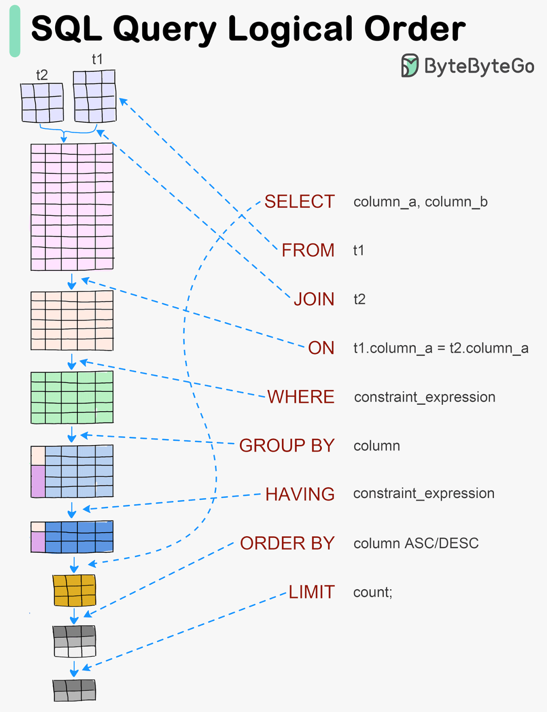
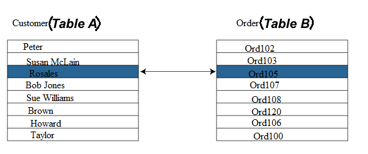
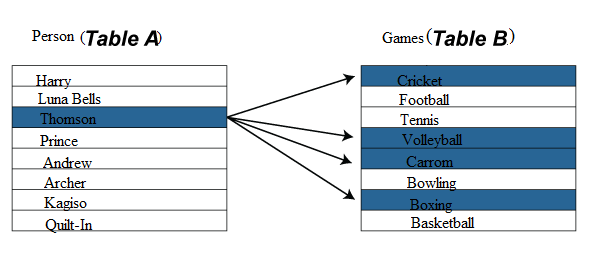
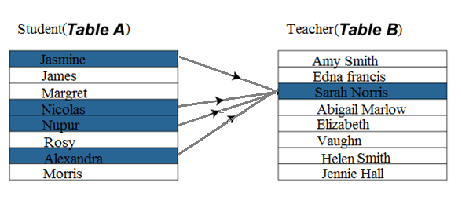
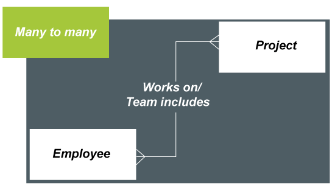
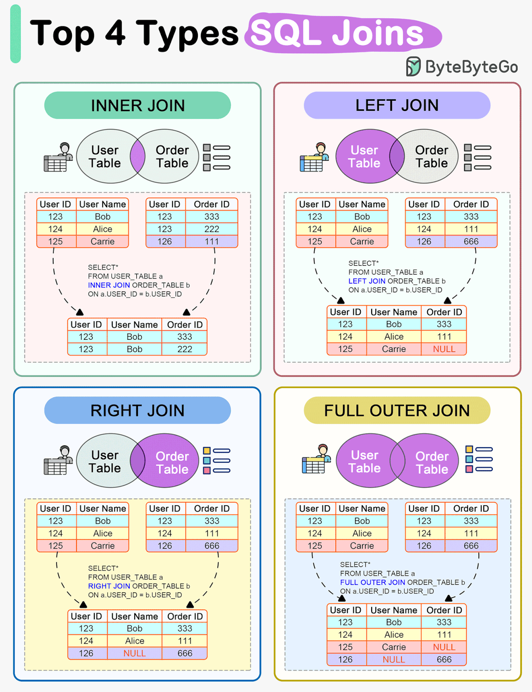

# 📘 SQL Interview Prep

> ✅ Bookmark: [All SQL Commands](https://www.educba.com/mysql-query-commands/)

---



<details open>
<summary><strong>🔢 1. Max & Nth Max Salary</strong></summary>

### ❓ Query to Get Max or Nth Max Salary

| Description        | Query Example                                                                       |
| ------------------ | ----------------------------------------------------------------------------------- |
| Nth Highest Salary | `SELECT DISTINCT(Salary) FROM table ORDER BY Salary DESC LIMIT n,1;`                |
| 3rd Highest Salary | `SELECT DISTINCT(column_name) FROM table_name ORDER BY column_name DESC LIMIT 2,1;` |

🔗 [Reference](https://stackoverflow.com/a/21520159/11962586)

</details>

---

<details open>
<summary><strong>🏢 2. Highest Salary in Each Department</strong></summary>

### 🔍 Queries

```sql
-- Get max salary per department
SELECT DeptID, MAX(Salary) FROM EmpDetails GROUP BY DeptID;

-- Get employee details with max salary per department
SELECT DeptID, EmpName, Salary 
FROM EmpDetails 
WHERE (DeptID, Salary) IN (
  SELECT DeptID, MAX(Salary) 
  FROM EmpDetails 
  GROUP BY DeptID
);
```

**Highest Salary from each Department**

```
  SELECT dep, MAX(salary) AS highest_salary
  FROM employee
  GROUP BY dep;
```


🔗 [Reference](https://stackoverflow.com/a/8477093/11962586)


We want: **employees whose salary is greater than their manager’s salary**.
That means we need a **self-join** on the same employee table.

---

### Example table: `employee`

| emp\_id | emp\_name | salary | manager\_id |
| ------- | --------- | ------ | ----------- |
| 123     | abc       | 10     | 0           |
| 0       | cde       | 9      | 231         |

---

### SQL Query

```sql
SELECT e.emp_id,
       e.emp_name,
       e.salary,
       m.emp_name AS manager_name,
       m.salary AS manager_salary
FROM employee e
JOIN employee m
  ON e.manager_id = m.emp_id
WHERE e.salary > m.salary;
```

---

### ✅ What this does:

* `employee e` → employees
* `employee m` → managers (same table, self-join)
* `e.manager_id = m.emp_id` → link employee to their manager
* `e.salary > m.salary` → filter only employees earning more than their manager

---

### Output (for your sample data):

| emp\_id | emp\_name | salary | manager\_name | manager\_salary |
| ------- | --------- | ------ | ------------- | --------------- |
| 123     | abc       | 10     | cde           | 9               |

</details>

---


<details>
<summary><strong>🔗 3. Types of Relationships in DBMS</strong></summary>

| Type                      | Description         | Image                                                      |
| ------------------------- | ------------------- | ---------------------------------------------------------- |
| One to One                | 1 record ↔ 1 record |                                 |
| One to Many / Many to One | 1 record ↔ many     | <br> |
| Many to Many              | many ↔ many         |                                 |

🔗 [Javatpoint Article](https://www.javatpoint.com/types-of-relationship-in-database-table)

</details>

---

<details>
<summary><strong>👓 4. Views in SQL</strong></summary>

### 📄 What is a View?

* A virtual table based on SQL result-set.
* Can join multiple tables and abstract data.
* Created using `CREATE VIEW`.

### 🛠️ Syntax

```sql
CREATE VIEW view_name AS
SELECT column1, column2, ...
FROM table_name
WHERE condition;
```

</details>

---

<details>
<summary><strong>⚖️ 5. Predicates in SQL</strong></summary>

### 📌 Predicates = Expressions that evaluate to TRUE / FALSE / UNKNOWN

| Predicate   | Use Case            |
| ----------- | ------------------- |
| `=` `<` `>` | Comparison          |
| `LIKE`      | Pattern match       |
| `BETWEEN`   | Range check         |
| `IN`        | Check value in list |
| `EXISTS`    | Subquery check      |
| `IS NULL`   | Null check          |

🔗 [Predicates Explained](https://www3.navicat.com/en/company/aboutus/blog/1895-predicates-in-sql#)

</details>

---

<details open>
<summary><strong>🧱 6. SQL Constraints</strong></summary>

### ✅ What Are Constraints?

Constraints enforce rules at the column level for data integrity.

| Constraint  | Purpose                          | Notes                           |
| ----------- | -------------------------------- | ------------------------------- |
| Primary Key | Uniquely identifies each row     | Only one allowed per table      |
| Foreign Key | Enforces referential integrity   | Refers to a PK in another table |
| Unique      | Ensures all values are unique    | Multiple allowed per table      |
| Not Null    | Prevents null values             | Mandatory values                |
| Check       | Validates data using a condition | e.g. `Age >= 18`                |
| Default     | Provides default value           | Reduces NULLs                   |

---

### 🔍 Examples

#### 1. **Primary Key**

```sql
CREATE TABLE Employees (
  EmployeeID INT PRIMARY KEY,
  FirstName VARCHAR(50)
);
```

#### 2. **Foreign Key**

```sql
CREATE TABLE Orders (
  OrderID INT PRIMARY KEY,
  EmployeeID INT,
  FOREIGN KEY (EmployeeID) REFERENCES Employees(EmployeeID)
);
```

#### 3. **Unique**

```sql
CREATE TABLE Customers (
  CustomerID INT PRIMARY KEY,
  Email VARCHAR(100) UNIQUE
);
```

#### 4. **Not Null**

```sql
CREATE TABLE Products (
  ProductID INT PRIMARY KEY,
  ProductName VARCHAR(100) NOT NULL
);
```

#### 5. **Check**

```sql
CREATE TABLE Employees (
  EmployeeID INT PRIMARY KEY,
  Age INT CHECK (Age >= 18)
);
```

#### 6. **Default**

```sql
CREATE TABLE Orders (
  OrderID INT PRIMARY KEY,
  OrderDate DATE DEFAULT GETDATE()
);
```

</details>

---

<details>
<summary><strong>🔗 7. SQL Joins</strong></summary>

### 📌 Types of Joins



| Join Type          | Description                                                                 |
| ------------------ | --------------------------------------------------------------------------- |
| `INNER JOIN`       | Returns only matching records from both tables                              |
| `LEFT OUTER JOIN`  | Returns all records from the left table, and matched records from the right |
| `RIGHT OUTER JOIN` | Returns all records from the right table, and matched from the left         |
| `FULL OUTER JOIN`  | Returns all records where there is a match in either left or right table    |

**Example Tables**: `Products`, `Categories`

```sql
SELECT productId, productName, categoryName 
FROM Products 
INNER JOIN Categories 
ON Products.CategoryID = Categories.CategoryID;
```

</details>

---

<details>
<summary><strong>🔑 8. SQL Keywords</strong></summary>

🔗 [W3Schools SQL Keywords Reference](https://www.w3schools.com/sql/sql_ref_keywords.asp)

Examples include:

* `CREATE`, `ALTER`, `DROP`, `INSERT`, `UPDATE`, `DELETE`
* `SELECT`, `DISTINCT`, `WHERE`, `GROUP BY`, `ORDER BY`
* `AND`, `OR`, `NOT`, `NULL`, `IN`, `EXISTS`, `BETWEEN`, `LIKE`

</details>

---

<details>
<summary><strong>🔧 9. SQL Functions</strong></summary>

🔗 [Function Reference - MySQL](https://www.w3schools.com/sql/sql_ref_mysql.asp)

### Types of Functions

| Type        | Examples                                      |
| ----------- | --------------------------------------------- |
| Numeric     | `ABS()`, `CEIL()`, `FLOOR()`, `ROUND()`       |
| String      | `CONCAT()`, `LENGTH()`, `UPPER()`, `LOWER()`  |
| Date & Time | `NOW()`, `CURDATE()`, `DATEDIFF()`            |
| Aggregate   | `COUNT()`, `SUM()`, `AVG()`, `MAX()`, `MIN()` |

</details>

---

<details>
<summary><strong>⚡ 10. Indexing in SQL</strong></summary>

### 🔍 What is Indexing?

Indexing improves data retrieval performance by creating a fast lookup reference for certain columns.

| Benefit           | Trade-off                       |
| ----------------- | ------------------------------- |
| Faster SELECTs    | Slower INSERT/UPDATE/DELETE ops |
| Better JOIN/WHERE | Extra storage required          |

> Index only when queries frequently filter or sort by the column.

### Example

```sql
CREATE INDEX idx_employee_name
ON Employees (FirstName, LastName);
```

</details>

---

<details>
<summary><strong>🔐 11. Primary Key vs Foreign Key</strong></summary>

### 📌 Definitions

| Key Type    | Description                                            |
| ----------- | ------------------------------------------------------ |
| **Primary** | Uniquely identifies each row, cannot be NULL           |
| **Foreign** | References a primary key in another table, can be NULL |

### ✅ Primary Key Example

```sql
CREATE TABLE Employees (
    EmployeeID INT PRIMARY KEY,
    FirstName VARCHAR(50)
);
```

### 🔗 Foreign Key Example

```sql
CREATE TABLE Orders (
    OrderID INT PRIMARY KEY,
    EmployeeID INT,
    FOREIGN KEY (EmployeeID) REFERENCES Employees(EmployeeID)
);
```

### 🔄 Differences

| Feature      | Primary Key      | Foreign Key            |
| ------------ | ---------------- | ---------------------- |
| Uniqueness   | Must be unique   | Can have duplicates    |
| Nullability  | Cannot be NULL   | Can be NULL            |
| Auto Indexed | Yes              | Not by default         |
| Purpose      | Identifies a row | Links to another table |

</details>

---

<details>
<summary><strong>📦 12. Stored Procedures</strong></summary>

### 📘 What is a Stored Procedure?

A **stored procedure** is a saved set of SQL commands, stored in the DB and executed as needed. Helps enforce business logic and reduce duplication.

### ✅ Benefits

* Faster via **precompiled execution**
* Improves **security & maintainability**
* Allows **input/output parameters**
* Supports **transactions (BEGIN/COMMIT/ROLLBACK)**

---

### 🔨 Example: Input Parameter

```sql
CREATE PROCEDURE GetEmployeesByDepartment
    @DepartmentID INT
AS
BEGIN
    SELECT EmployeeID, FirstName, LastName
    FROM Employees
    WHERE DepartmentID = @DepartmentID;
END;
```

```sql
EXEC GetEmployeesByDepartment @DepartmentID = 5;
```

---

### 📤 Example: Output Parameter

```sql
CREATE PROCEDURE GetEmployeeCountByDepartment
    @DepartmentID INT,
    @EmployeeCount INT OUTPUT
AS
BEGIN
    SELECT @EmployeeCount = COUNT(*)
    FROM Employees
    WHERE DepartmentID = @DepartmentID;
END;
```

```sql
DECLARE @Count INT;
EXEC GetEmployeeCountByDepartment @DepartmentID = 5, @EmployeeCount = @Count OUTPUT;
PRINT @Count;
```

</details>

---

<details>
<summary><strong>🧑‍💼 13. Query: Employees with Age > 40</strong></summary>

### 📌 SQL Query

```sql
SELECT * FROM Employees
WHERE Age > 40;
```

🧠 Assumes a column named `Age` exists in the `Employees` table.

</details>

---

<details>
<summary><strong>🔁 14. Referential Constraint</strong></summary>

### 📘 What Is a Referential Constraint?

A **referential constraint** enforces a link between two tables using a **foreign key**, ensuring consistency and **referential integrity**.

| Component        | Description                                            |
| ---------------- | ------------------------------------------------------ |
| **Parent Table** | Has a primary key                                      |
| **Child Table**  | Has a foreign key that references the parent's PK      |
| **Purpose**      | Prevents orphan records, maintains valid relationships |

### 🔗 Example

```sql
CREATE TABLE Departments (
    DepartmentID INT PRIMARY KEY,
    DepartmentName VARCHAR(50)
);

CREATE TABLE Employees (
    EmployeeID INT PRIMARY KEY,
    DepartmentID INT,
    FOREIGN KEY (DepartmentID) REFERENCES Departments(DepartmentID)
);
```

</details>

---

<details>
<summary><strong>🔑 15. Composite Key vs Foreign Key</strong></summary>

### 🧩 Composite Key

A **composite key** is made up of two or more columns that together uniquely identify a record.

```sql
CREATE TABLE ProjectAssignments (
    EmployeeID INT,
    ProjectID INT,
    PRIMARY KEY (EmployeeID, ProjectID)
);
```

---

### 🔗 Foreign Key

A **foreign key** is used to reference a column in another table, establishing a relationship.

```sql
FOREIGN KEY (EmployeeID) REFERENCES Employees(EmployeeID)
```

---

### 🧠 Summary Table

| Feature         | Composite Key                         | Foreign Key                         |
| --------------- | ------------------------------------- | ----------------------------------- |
| Definition      | Combination of columns as primary key | Column(s) referencing a primary key |
| Purpose         | Uniquely identifies rows              | Maintains referential integrity     |
| Can Be Combined | Yes (2+ columns)                      | Often references single column      |
| Used In         | Many-to-many join tables              | Parent-child relationships          |

</details>

---

<details open>
<summary><strong>🧮 16. Database Normalization</strong></summary>

### ✅ What Is Normalization?

Normalization minimizes redundancy and organizes data efficiently by splitting tables and defining relationships between them.

---

### 🔢 Normal Forms Overview

| Form | Rule Summary                                  | Focus Area                |
| ---- | --------------------------------------------- | ------------------------- |
| 1NF  | Atomic columns (no arrays or repeated groups) | Column structure          |
| 2NF  | Full functional dependency on primary key     | Remove partial dependency |
| 3NF  | No transitive dependency (non-key ➝ non-key)  | Data independence         |
| BCNF | Every determinant is a candidate key          | Stronger 3NF              |
| 4NF  | No multi-valued dependencies                  | Eliminate MVDs            |
| 5NF  | No join dependency without loss               | Table decomposition       |

---

### 📊 Example: 1NF to 5NF Progression

```sql
-- 1NF: Atomic columns
CREATE TABLE Employees (
    EmployeeID INT PRIMARY KEY,
    FirstName VARCHAR(50),
    ContactNumber VARCHAR(15)
);

-- 2NF: Split into Departments
CREATE TABLE Departments (
    DepartmentID INT PRIMARY KEY,
    DepartmentName VARCHAR(50)
);

-- 3NF: Remove indirect dependency
CREATE TABLE DepartmentLocations (
    DepartmentID INT PRIMARY KEY,
    Location VARCHAR(50),
    FOREIGN KEY (DepartmentID) REFERENCES Departments(DepartmentID)
);
```

---

### ✅ Benefits of Normalization

* ✅ Eliminates redundant data
* ✅ Ensures consistency and integrity
* ✅ Improves query performance

</details>

---

<details>
<summary><strong>⚙️ 17. Ways to Reduce Database Load</strong></summary>

### 💡 Key Techniques

| Strategy                | Description                                               |
| ----------------------- | --------------------------------------------------------- |
| **Query Optimization**  | Write efficient SQL using indexes, limits, and filters    |
| **Indexing**            | Create indexes on frequently filtered/joined columns      |
| **Caching**             | Store frequent results in memory (e.g., Redis, memcached) |
| **Sharding**            | Split large DB into smaller ones by key (e.g., user ID)   |
| **Load Balancing**      | Distribute DB traffic across multiple servers             |
| **Vertical Scaling**    | Upgrade hardware (CPU, RAM, SSD)                          |
| **Horizontal Scaling**  | Add more servers (DB clustering, read replicas)           |
| **Data Archiving**      | Move old/inactive data to archive tables or cold storage  |
| **Connection Pooling**  | Reuse connections for efficiency                          |
| **Schema Optimization** | Normalize or denormalize as per performance needs         |

⚠️ Balance read vs write performance based on use case.

</details>

---

<details open>
<summary><strong>🔐 18. Primary Key vs Unique Key</strong></summary>

### 🧠 Purpose

Both enforce **uniqueness** but differ in **nullability, count per table**, and **intended role**.

---

### 🧬 Key Differences

| Feature                | Primary Key                    | Unique Key                             |
| ---------------------- | ------------------------------ | -------------------------------------- |
| **Purpose**            | Main identifier for table rows | Enforce uniqueness in specific columns |
| **Uniqueness**         | Must be unique                 | Must be unique                         |
| **NULLs Allowed**      | ❌ Not allowed                  | ✅ Allowed (usually one)                |
| **How Many per Table** | Only one                       | Multiple allowed                       |
| **Index Type**         | Auto unique index              | Auto unique index                      |
| **Composite Allowed**  | ✅ Yes (multi-column)           | ✅ Yes                                  |

---

### ✅ Primary Key Example

```sql
CREATE TABLE Employees (
    EmployeeID INT PRIMARY KEY,
    FirstName VARCHAR(50),
    LastName VARCHAR(50)
);
```

* `EmployeeID` is the main identifier for each employee.

---

### 🔁 Unique Key Example

```sql
CREATE TABLE Employees (
    EmployeeID INT PRIMARY KEY,
    Email VARCHAR(100) UNIQUE,
    PhoneNumber VARCHAR(15) UNIQUE
);
```

* Ensures no two employees share the same email or phone number.
* You **can have multiple** unique keys in one table.

---

### 📌 Summary

| Key Type    | Enforces Uniqueness | Allows NULL   | Only One? | Composite Allowed |
| ----------- | ------------------- | ------------- | --------- | ----------------- |
| Primary Key | ✅                   | ❌             | ✅         | ✅                 |
| Unique Key  | ✅                   | ✅ (usually 1) | ❌         | ✅                 |

---

Understanding when and where to use **primary** vs **unique** keys helps enforce clean data design and maintain integrity across your database schema.

</details>

---

<details open>
<summary><strong>🔍 19. Find Duplicate Records by Email</strong></summary>

### 📧 Why Check for Duplicate Emails?

Email is often expected to be **unique** in employee records. Detecting duplicates helps:

* Ensure data accuracy
* Prevent login issues
* Maintain referential integrity

---

### 🧾 Table Structure

```sql
CREATE TABLE Employee (
    ID INT PRIMARY KEY,
    EmployeeName VARCHAR(100),
    Email VARCHAR(100),
    Department VARCHAR(50),
    Salary DECIMAL(10, 2),
    HireDate DATE
);
```

---

### 🧠 Query to Identify Duplicates by Email

```sql
SELECT Email, COUNT(*) AS Occurrences
FROM Employee
GROUP BY Email
HAVING COUNT(*) > 1;
```

* **`GROUP BY Email`**: Groups records with the same email
* **`HAVING COUNT(*) > 1`**: Filters only those emails that appear more than once

---

### 📥 Fetch All Duplicate Rows

To get full employee details where email is duplicated:

```sql
SELECT *
FROM Employee
WHERE Email IN (
    SELECT Email
    FROM Employee
    GROUP BY Email
    HAVING COUNT(*) > 1
);
```

---

### 🧪 Sample Output

| ID  | EmployeeName | Email                                         | Department | Salary   | HireDate   |
| --- | ------------ | --------------------------------------------- | ---------- | -------- | ---------- |
| 101 | Alice        | [alice@example.com](mailto:alice@example.com) | HR         | 50000.00 | 2020-01-10 |
| 108 | A. Smith     | [alice@example.com](mailto:alice@example.com) | Finance    | 52000.00 | 2021-04-22 |

---

### ✅ Use Case

* Detect accidental duplicates in data entry
* Audit external imports for conflicts
* Prepare for applying a **`UNIQUE` constraint** on `Email`

</details>

---

<details open>
<summary><strong>20. 📊 Count Male and Female Students in Grade 5</strong></summary>

To get the **count of male and female students** in **grade 5**, your SQL query should be properly structured.


### ✅ 1. Using `GROUP BY` (Recommended)

```sql
SELECT gender, COUNT(*) AS count
FROM student
WHERE grade = '5'
GROUP BY gender;
```

🧾 **Output Example:**

| gender | count |
| ------ | ----- |
| Male   | 10    |
| Female | 8     |

---

### ✅ 2. Using Conditional Aggregation (Pivot Style)

```sql
SELECT
    COUNT(CASE WHEN gender = 'Male' THEN 1 END) AS male_count,
    COUNT(CASE WHEN gender = 'Female' THEN 1 END) AS female_count
FROM student
WHERE grade = '5';
```

🧾 **Output Example:**

| male\_count | female\_count |
| ----------- | ------------- |
| 10          | 8             |

---

### ❌ Invalid Version (for comparison)

```sql
-- Incorrect syntax and logic
SELECT gender FROM student WHERE grade = '5' COUNT(gender) = Male AND COUNT(gender) = Female;
```

That won't work because:

* `COUNT()` is an aggregate function and cannot be used directly in a `WHERE` clause.
* String comparison (`Male`, `Female`) needs quotes.
* `COUNT(gender) = Male` is not valid SQL syntax.

---

### 🧠 Summary

| Task                         | Query Type          | Output Format       |
| ---------------------------- | ------------------- | ------------------- |
| Count by gender              | `GROUP BY`          | Rows by gender      |
| Count male/female as columns | Conditional `COUNT` | Pivot-style one row |

Use whichever output format fits your application/reporting need.

</details>

---

<details>
<summary>🐢 How do you optimize a slow login query using email?</summary>

👉 If the login query using **email** is slow, I would optimize it using a combination of **indexing, query tuning, and caching**.

---

<details>
<summary>1️⃣ Add Index on Email Column</summary>

* Create an **index** on the `email` column.
* Ensures lookups like `WHERE email = ?` are **faster**.

```sql
CREATE INDEX idx_users_email ON users(email);
```

</details>

---

<details>
<summary>2️⃣ Check Execution Plan</summary>

* Use `EXPLAIN` (MySQL/Postgres) to verify the query **uses the index**.
* If not, adjust schema or query hints.

```sql
EXPLAIN SELECT id, password FROM users WHERE email = 'test@example.com';
```

</details>

---

<details>
<summary>3️⃣ Optimize Schema</summary>

* Keep `email` column in proper format (e.g., `VARCHAR(255)`).
* Ensure correct **collation** for case-insensitive search if needed.

</details>

---

<details>
<summary>4️⃣ Avoid SELECT *</summary>

* Fetch only required columns (e.g., `id, password`).
* Reduces **I/O load** and speeds up query execution.

</details>

---

<details>
<summary>5️⃣ Introduce Caching</summary>

* Use **Redis or in-memory cache** for frequently accessed login data.
* Reduces database hits for repeated logins.

</details>

---

✅ **In short:**
**Indexing + Query Optimization + Caching = Faster Login Queries** 🚀

---

```text
🙋 User Login Request (email, password)
                |
                v
🧠 Check Cache (Redis/Memcached)
      ├── Hit? → ✅ Return User Data (fast)
      |
      └── Miss → Query Database
                     |
                     v
             🔍 Indexed Lookup on Email
                     |
                     v
          📦 Fetch Required Columns (id, password)
                     |
                     v
        📝 Store Result in Cache (for next time)
                     |
                     v
        🔑 Validate Password & Return Response
```

</details>

# Top Ways to Improve Database Performance


## 1. Indexing
Create the right indexes based on query patterns to speed up data retrieval.

## 2. Materialized Views
Store pre-computed query results for quick access, reducing the need to process complex queries repeatedly.

## 3. Vertical Scaling
Increase the capacity of the database server by adding more CPU, RAM, or storage.

## 4. Denormalization
Reduce complex joins by restructuring data, which can improve query performance.

## 5. Database Caching
Store frequently accessed data in a faster storage layer to reduce load on the database.

## 6. Replication
Create copies of the primary database on different servers to distribute read load and enhance availability.

## 7. Sharding
Divide the database into smaller, manageable pieces, or shards, to distribute load and improve performance.

## 8. Partitioning
Split large tables into smaller, more manageable pieces to improve query performance and maintenance.

## 9. Query Optimization
Rewrite and fine-tune queries to execute more efficiently.

## 10. Use of Appropriate Data Types
Select the most efficient data types for each column to save space and speed up processing.

## 11. Limiting Indexes
Avoid excessive indexing, which can slow down write operations; use indexes judiciously.

## 12. Archiving Old Data
Move infrequently accessed data to an archive to keep the active database smaller and faster.

