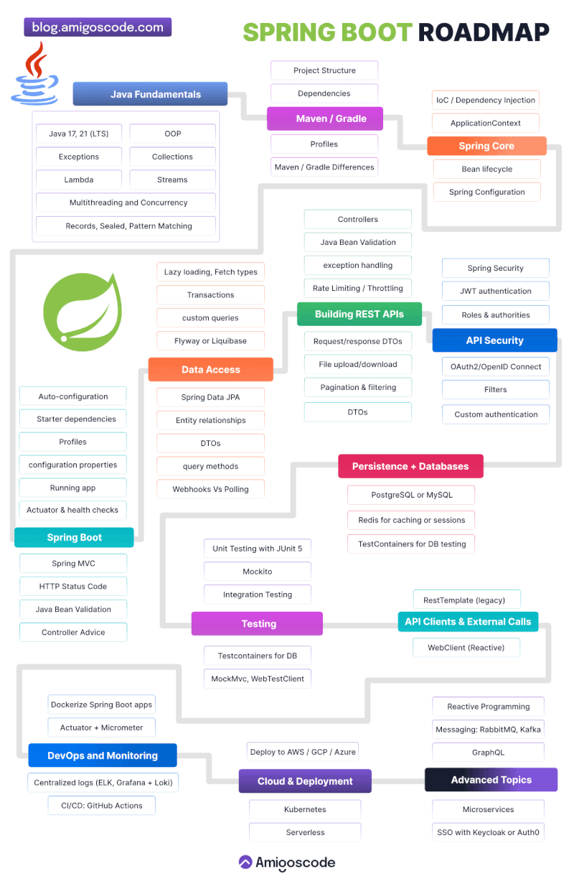
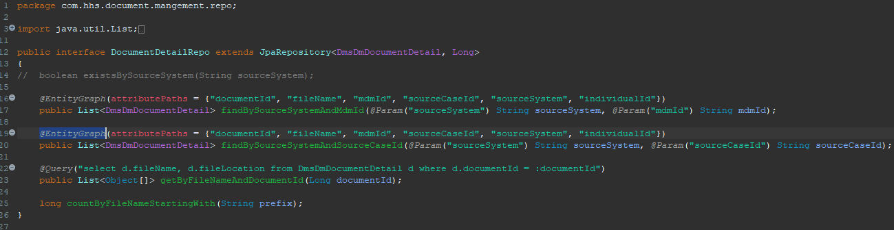
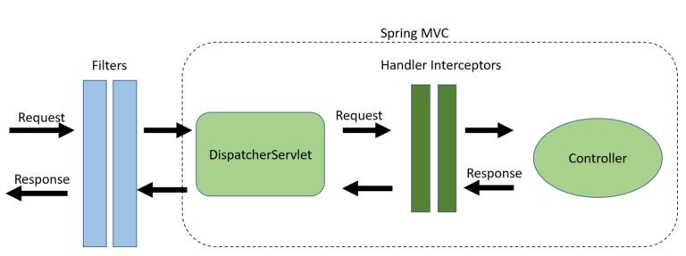
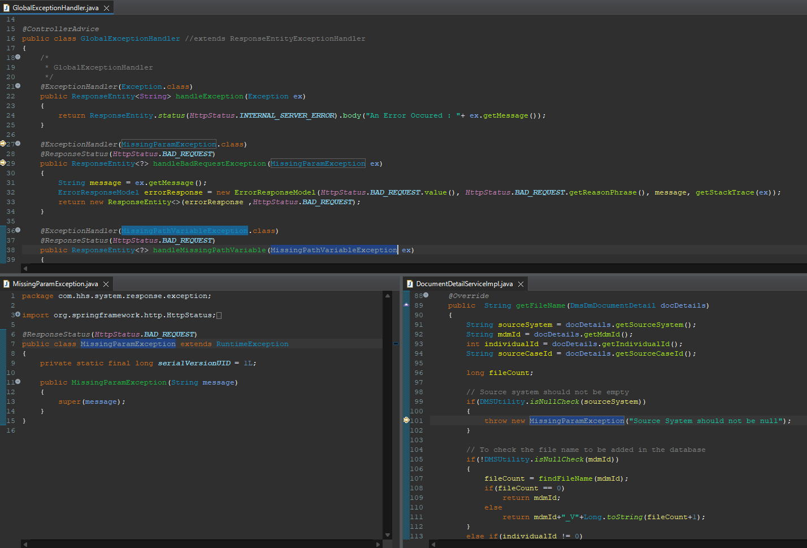
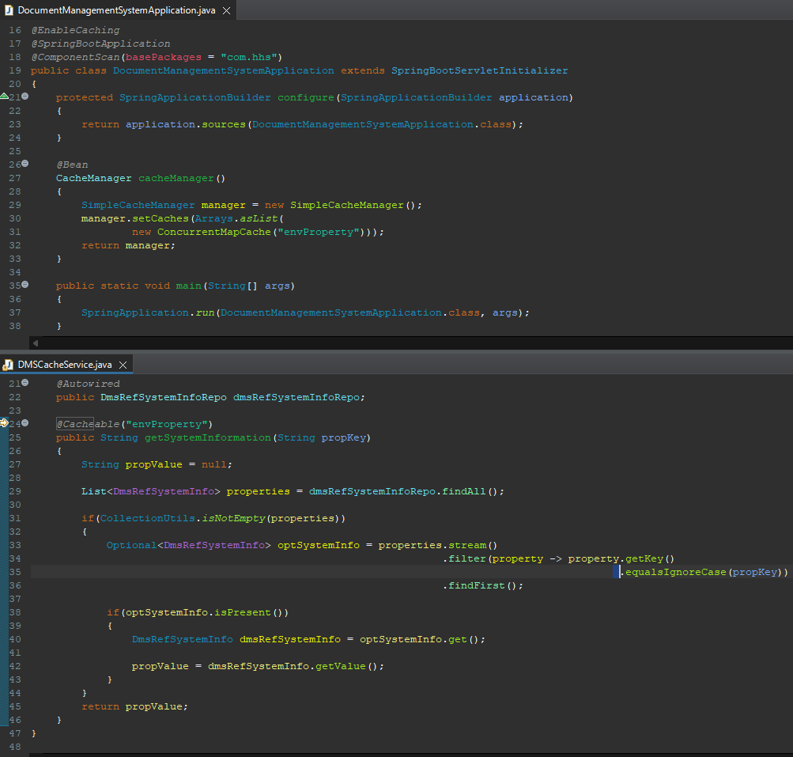
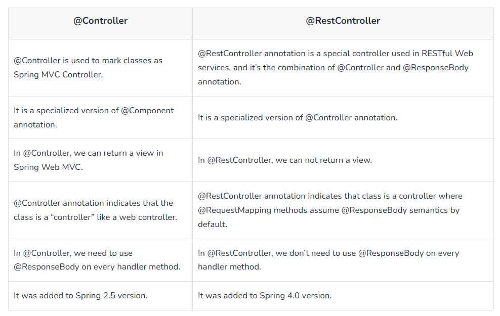
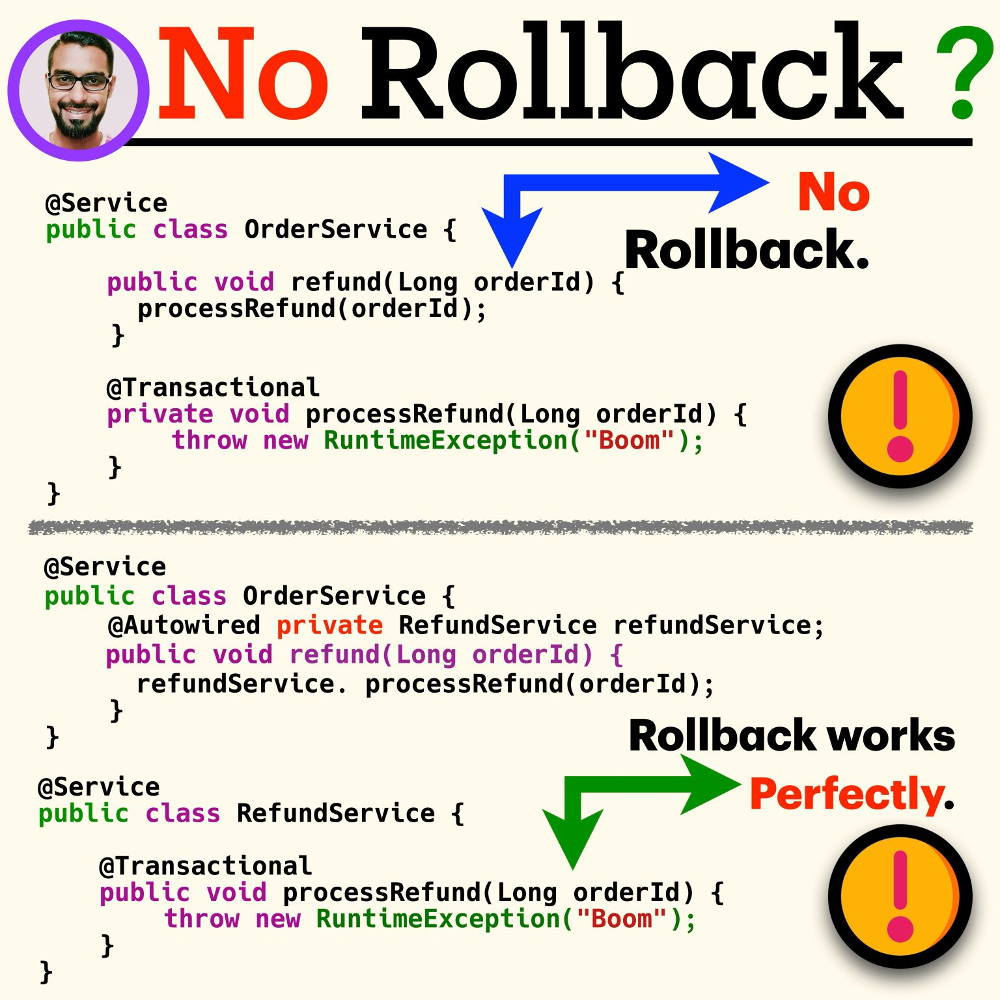
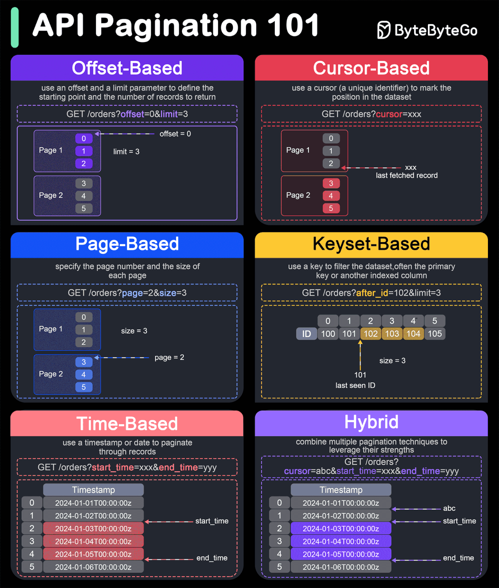
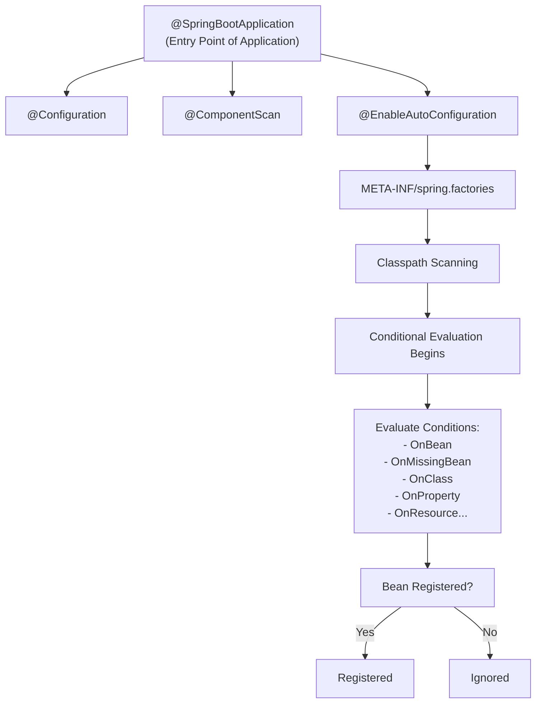
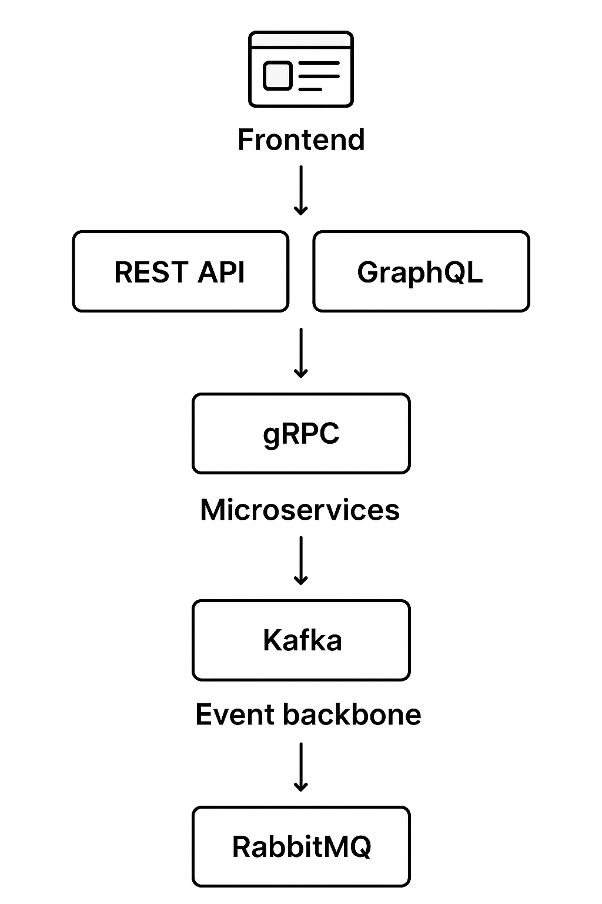

<!-- TOC -->
* [Spring Boot](#spring-boot)
  * [PHASE 1 - Basics](#phase-1---basics)
  * [PHASE 2 - Intermediate](#phase-2---intermediate)
  * [PHASE 3 - Advanced](#phase-3---advanced)
  * [Top 15 Q&A](#top-15-qa)
* [Annotations in Spring boot](#annotations-in-spring-boot)
* [⚙️ Bean Definitions & Dependency Injection - A Deep Dive](#-bean-definitions--dependency-injection---a-deep-dive)
  * [🔹 Field Injection](#-field-injection)
  * [🔹 Constructor Injection](#-constructor-injection)
  * [🔹 Which one should you use?](#-which-one-should-you-use)
    * [🔹 Example of Cyclic Dependency](#-example-of-cyclic-dependency)
    * [🔹 Causes of Cyclic Dependency](#-causes-of-cyclic-dependency)
    * [🔹 How to Fix It](#-how-to-fix-it)
    * [🔹 Key takeaway](#-key-takeaway)
  * [📝 Example: Cyclic Dependency in Spring Boot](#-example-cyclic-dependency-in-spring-boot)
    * [1. Create two services that depend on each other](#1-create-two-services-that-depend-on-each-other)
    * [2. Create the main Spring Boot application](#2-create-the-main-spring-boot-application)
    * [3. Run the app 🚀](#3-run-the-app-)
  * [🔹 How to Fix It](#-how-to-fix-it-1)
    * [🔁 Bean Scopes](#-bean-scopes)
    * [🌱 Bean Lifecycle Overview](#-bean-lifecycle-overview)
    * [🧷 Other Important Annotations](#-other-important-annotations)
    * [How to Enable Auditing](#how-to-enable-auditing)
    * [Core Auditing Annotations](#core-auditing-annotations)
    * [Example Implementation](#example-implementation)
    * [Advanced Auditing with Hibernate Envers](#advanced-auditing-with-hibernate-envers)
* [⚡ Spring Boot Caching Annotations – Complete Guide](#-spring-boot-caching-annotations--complete-guide)
    * [✅ Parameters](#-parameters)
    * [🛠️ Examples](#-examples)
    * [🛠️ Examples](#-examples-1)
    * [⏱ Scheduled Eviction](#-scheduled-eviction)
    * [🛠️ Examples](#-examples-2)
    * [✅ Implementation Steps](#-implementation-steps)
    * [🛠️ Example](#-example)
    * [1. Caffeine Cache Configuration](#1-caffeine-cache-configuration)
    * [2. EhCache (JCache - JSR-107) Configuration](#2-ehcache-jcache---jsr-107-configuration)
    * [3. Redis Cache Configuration](#3-redis-cache-configuration)
    * [1. Defining Profile-Specific Properties](#1-defining-profile-specific-properties)
    * [2. Using the `@Profile` Annotation](#2-using-the-profile-annotation)
    * [3. Activating Profiles](#3-activating-profiles)
    * [1. Profile-Specific Properties Files](#1-profile-specific-properties-files)
    * [2. Profile Groups (Spring Boot 2.4+)](#2-profile-groups-spring-boot-24)
    * [3. The `default` Profile](#3-the-default-profile)
    * [4. Best Practices](#4-best-practices)
  * [❓ Why Use Spring Boot?](#-why-use-spring-boot)
  * [✨ Key Features of Spring Boot](#-key-features-of-spring-boot)
    * [1. Starter Dependencies](#1-starter-dependencies)
    * [2. Auto-Configuration](#2-auto-configuration)
    * [3. Embedded Servers](#3-embedded-servers)
    * [4. Spring Actuator](#4-spring-actuator)
    * [5. Externalized Configuration](#5-externalized-configuration)
  * [⚙️ External Configuration Sources](#-external-configuration-sources)
  * [Design Patterns](#design-patterns)
    * [🔁 1. Singleton Pattern](#-1-singleton-pattern)
    * [🧩 2. Dependency Injection (DI)](#-2-dependency-injection-di)
    * [📦 3. Factory Pattern](#-3-factory-pattern)
    * [🏭 4. Prototype Pattern](#-4-prototype-pattern)
    * [🧵 5. Proxy Pattern (AOP)](#-5-proxy-pattern-aop)
    * [⚙️ 6. Template Method Pattern](#-6-template-method-pattern)
    * [🧠 7. Observer Pattern (Events)](#-7-observer-pattern-events)
    * [🔐 8. Strategy Pattern](#-8-strategy-pattern)
  * [📚 Spring Boot Advanced Concepts](#-spring-boot-advanced-concepts)
    * [🔄 Bean Lifecycle Phases](#-bean-lifecycle-phases)
    * [🔧 Configure Bean Lifecycle Using](#-configure-bean-lifecycle-using)
* [JPA](#jpa)
  * [🧠 Java Persistence API (JPA) – Custom Queries](#-java-persistence-api-jpa--custom-queries)
    * [1. **Named Queries**](#1-named-queries)
    * [2. **Dynamic Queries (Criteria API)**](#2-dynamic-queries-criteria-api)
    * [3. **Native SQL Queries**](#3-native-sql-queries)
    * [4. **JPQL (Java Persistence Query Language)**](#4-jpql-java-persistence-query-language)
    * [5. **Criteria API**](#5-criteria-api)
  * [🔎 Query Types in @Repository](#-query-types-in-repository)
    * [1. **Basic Derived Query**](#1-basic-derived-query)
    * [2. **Derived Query with Parameters**](#2-derived-query-with-parameters)
    * [3. **Custom JPQL Query**](#3-custom-jpql-query)
    * [4. **Native SQL Query**](#4-native-sql-query)
    * [5. **Query with Sorting**](#5-query-with-sorting)
  * [💾 Database Transaction Approaches in Java](#-database-transaction-approaches-in-java)
    * [✅ Summary Table](#-summary-table)
* [Spring Configuration & REST API Client Overview](#spring-configuration--rest-api-client-overview)
    * [Common Methods for GET Requests](#common-methods-for-get-requests)
    * [Basic Setup](#basic-setup)
    * [Usage in Service](#usage-in-service)
    * [Or Without Bean Injection](#or-without-bean-injection)
    * [Key Methods in `WebClient`](#key-methods-in-webclient)
    * [Example with headers](#example-with-headers)
    * [When to choose?](#when-to-choose)
    * [1. Dependencies (`pom.xml`)](#1-dependencies-pomxml)
    * [2. Configuration (`application.properties`)](#2-configuration-applicationproperties)
    * [3. The Declarative HTTP Client (`@HttpExchange`)](#3-the-declarative-http-client-httpexchange)
    * [4. Client and Resilience Configuration](#4-client-and-resilience-configuration)
    * [5. The Resilient and Observable Service](#5-the-resilient-and-observable-service)
    * [Aspect Order](#aspect-order)
    * [🔄 Execution Order with Both Bulkheads](#-execution-order-with-both-bulkheads)
    * [6. Global Exception Handling with Problem Details](#6-global-exception-handling-with-problem-details)
    * [Summary of the Flow](#summary-of-the-flow)
    * [Useful Resources](#useful-resources)
* [Spring MVC Concepts & Exception Handling](#spring-mvc-concepts--exception-handling)
    * [Overview](#overview)
    * [Lifecycle Methods of HandlerInterceptor](#lifecycle-methods-of-handlerinterceptor)
    * [References](#references)
    * [Key Annotations](#key-annotations)
* [Spring Boot Annotations for Extracting Values from URI and Requests](#spring-boot-annotations-for-extracting-values-from-uri-and-requests)
    * [Common Spring Boot annotations](#common-spring-boot-annotations)
* [Spring Dependency Injection & Controller Annotations](#spring-dependency-injection--controller-annotations)
      * [Qualifier usage at method level example](#qualifier-usage-at-method-level-example)
    * [Field Injection](#field-injection)
    * [Setter Injection](#setter-injection)
    * [Constructor Injection (Recommended)](#constructor-injection-recommended)
    * [With @Qualifier for multiple beans](#with-qualifier-for-multiple-beans)
    * [Optional dependencies](#optional-dependencies)
* [Spring Transaction Management & Pagination with JPA](#spring-transaction-management--pagination-with-jpa)
    * [Propagation Types](#propagation-types)
    * [Useful Methods](#useful-methods)
  * [Pagination](#pagination)
    * [📄 𝐏𝐚𝐠𝐢𝐧𝐚𝐭𝐢𝐨𝐧 𝐓𝐞𝐜𝐡𝐧𝐢𝐪𝐮𝐞𝐬 𝐢𝐧 𝐀𝐏𝐈𝐬](#-𝐏𝐚𝐠𝐢𝐧𝐚𝐭𝐢𝐨𝐧-𝐓𝐞𝐜𝐡𝐧𝐢𝐪𝐮𝐞𝐬-𝐢𝐧-𝐀𝐏𝐈𝐬)
    * [📘 Summary Table](#-summary-table-1)
    * [🚀 Modern High-Performance Pagination: Keyset, Slices, and Projections](#-modern-high-performance-pagination-keyset-slices-and-projections)
* [Dependency Injection (DI) in Spring Boot](#dependency-injection-di-in-spring-boot)
  * [✅ Spring Boot Auto-Configuration - Structured Guide](#-spring-boot-auto-configuration---structured-guide)
    * [Common Conditional Variants](#common-conditional-variants)
    * [Steps to Create](#steps-to-create)
    * [Notes](#notes)
    * [Drawbacks](#drawbacks)
  * [🔄 Load Balancing in Spring Boot](#-load-balancing-in-spring-boot)
    * [✅ Nginx Example Configuration](#-nginx-example-configuration)
    * [✅ Dependencies](#-dependencies)
    * [✅ Configuration (application.properties)](#-configuration-applicationproperties)
    * [✅ LoadBalanced `RestTemplate` Bean](#-loadbalanced-resttemplate-bean)
    * [✅ Example `spring-boot-service.yaml`](#-example-spring-boot-serviceyaml)
    * [📌 Final Thoughts](#-final-thoughts)
* [⚙️ Aspect-Oriented Programming (AOP) in Spring Boot](#-aspect-oriented-programming-aop-in-spring-boot)
  * [🛠️ How AOP Works in Spring Boot](#-how-aop-works-in-spring-boot)
    * [1. **Add Spring AOP Dependency**](#1-add-spring-aop-dependency)
    * [2. **Enable Aspect Support**](#2-enable-aspect-support)
    * [3. **Create an Aspect Class**](#3-create-an-aspect-class)
    * [4. **Define Pointcuts**](#4-define-pointcuts)
    * [5. **Use AOP with Your Services**](#5-use-aop-with-your-services)
    * [🔐 Security](#-security)
    * [🧾 Auditing](#-auditing)
    * [🔁 Retry Logic (Custom)](#-retry-logic-custom)
    * [@Around("@annotation(Retryable)")](#aroundannotationretryable)
      * [1. **Calling Unreliable External Services or APIs**](#1-calling-unreliable-external-services-or-apis)
      * [2. **Handling Transient Database Errors**](#2-handling-transient-database-errors)
      * [3. **Consuming Messages from a Queue**](#3-consuming-messages-from-a-queue)
      * [Why Use `@Around` Advice for This?](#why-use-around-advice-for-this)
      * [Summary of Roles](#summary-of-roles)
      * [Execution Order and Layering](#execution-order-and-layering)
      * [Good Practice vs. Bad Practice](#good-practice-vs-bad-practice)
      * [Which Tool Should You Use? A Scenario-Based Guide](#which-tool-should-you-use-a-scenario-based-guide)
  * [**11️⃣ How does Spring Boot auto-configuration work behind the scenes?**](#11-how-does-spring-boot-auto-configuration-work-behind-the-scenes)
    * [💡 Concept](#-concept)
    * [⚙️ **How It Works Internally**](#-how-it-works-internally)
    * [✅ Example](#-example-1)
    * [🧠 In short](#-in-short)
  * [**12️⃣ How do you handle circular dependencies between Spring beans?**](#12-how-do-you-handle-circular-dependencies-between-spring-beans)
    * [🔁 Problem](#-problem)
    * [🧩 Solutions](#-solutions)
  * [**13️⃣ What’s the use of `ApplicationContextAware` and `BeanPostProcessor`?**](#13-whats-the-use-of-applicationcontextaware-and-beanpostprocessor)
    * [**`ApplicationContextAware`**](#applicationcontextaware)
    * [**`BeanPostProcessor`**](#beanpostprocessor)
  * [**14️⃣ How would you implement dynamic bean creation at runtime?**](#14-how-would-you-implement-dynamic-bean-creation-at-runtime)
    * [🧩 1. Using `BeanDefinitionRegistryPostProcessor`](#-1-using-beandefinitionregistrypostprocessor)
    * [🧩 2. Using `ApplicationContext` + `ConfigurableListableBeanFactory`](#-2-using-applicationcontext--configurablelistablebeanfactory)
    * [🧩 3. Using `BeanDefinitionBuilder`](#-3-using-beandefinitionbuilder)
  * [**15️⃣ How can you handle async REST calls in Spring Boot effectively?**](#15-how-can-you-handle-async-rest-calls-in-spring-boot-effectively)
    * [💡 Goal](#-goal)
    * [✅ 1. Using `@Async`](#-1-using-async)
    * [✅ 2. Using `WebClient` (Reactive, non-blocking)](#-2-using-webclient-reactive-non-blocking)
    * [✅ 3. Combining `@Async` with `CompletableFuture`](#-3-combining-async-with-completablefuture)
    * [✅ 4. Using `DeferredResult` or `WebAsyncTask`](#-4-using-deferredresult-or-webasynctask)
    * [⚙️ Key differences](#-key-differences)
    * [✅ **Summary Table**](#-summary-table-2)
  * [**21️⃣ How do you optimize queries when using JPA with large datasets?**](#21-how-do-you-optimize-queries-when-using-jpa-with-large-datasets)
    * [💡 Problem](#-problem-1)
    * [🧩 Key Optimization Strategies](#-key-optimization-strategies)
      * [1. **Use `JOIN FETCH` to avoid N+1**](#1-use-join-fetch-to-avoid-n1)
      * [2. **Batch fetching / entity graph**](#2-batch-fetching--entity-graph)
      * [3. **Use projections instead of full entities**](#3-use-projections-instead-of-full-entities)
      * [4. **Pagination + streaming**](#4-pagination--streaming)
      * [5. **Disable dirty checking when reading only**](#5-disable-dirty-checking-when-reading-only)
      * [6. **Second-level cache**](#6-second-level-cache)
  * [**22️⃣ What’s the difference between `EntityManager.persist()` and `merge()`?**](#22-whats-the-difference-between-entitymanagerpersist-and-merge)
    * [🔹 Example](#-example-2)
    * [🧠 Notes](#-notes)
  * [**23️⃣ How do you handle pagination efficiently in Spring Data JPA?**](#23-how-do-you-handle-pagination-efficiently-in-spring-data-jpa)
    * [💡 Use `Pageable` and `Page<T>` API](#-use-pageable-and-paget-api)
    * [🧩 Why it’s efficient:](#-why-its-efficient)
    * [⚙️ Optimization Tips](#-optimization-tips)
  * [**24️⃣ How do you manage schema migrations across microservices?**](#24-how-do-you-manage-schema-migrations-across-microservices)
    * [💡 Problem](#-problem-2)
    * [🧩 Best Practices](#-best-practices)
      * [1. **Use database migration tools**](#1-use-database-migration-tools)
      * [2. **Each microservice manages its own schema**](#2-each-microservice-manages-its-own-schema)
      * [3. **Schema versioning per service**](#3-schema-versioning-per-service)
      * [4. **Pipeline integration**](#4-pipeline-integration)
      * [5. **Avoid cross-service joins**](#5-avoid-cross-service-joins)
    * [✅ Key idea:](#-key-idea)
  * [**25️⃣ What’s the best approach for auditing (`createdBy`, `updatedBy`) in JPA?**](#25-whats-the-best-approach-for-auditing-createdby-updatedby-in-jpa)
    * [💡 Goal](#-goal-1)
    * [🧩 Option 1: **Spring Data JPA Auditing**](#-option-1-spring-data-jpa-auditing)
    * [🧩 Option 2: **Custom entity listener**](#-option-2-custom-entity-listener)
    * [🧠 Best Practices](#-best-practices-1)
    * [✅ **Summary Table**](#-summary-table-3)
* [📦 AOP in Spring Boot – Explained (with Custom Annotations + Logging)](#-aop-in-spring-boot--explained-with-custom-annotations--logging)
    * [Corresponding Aspect](#corresponding-aspect)
    * [Retry Logic Aspect](#retry-logic-aspect)
    * [SLF4J is used for logging with support from Logback](#slf4j-is-used-for-logging-with-support-from-logback)
* [Spotless lint](#spotless-lint)
* [Zipkin](#zipkin)
* [Traceable](#traceable)
  * [🔎 Elasticsearch in Spring Boot](#-elasticsearch-in-spring-boot)
  * [⚡ Redis in Spring Boot](#-redis-in-spring-boot)
  * [✅ When to Use What](#-when-to-use-what)
  * [🚀 Combined Usage in Spring Boot](#-combined-usage-in-spring-boot)
* [📊 Detailed Comparison Table](#-detailed-comparison-table)
* [🔑 When to Use (with examples)](#-when-to-use-with-examples)
    * [✅ gRPC](#-grpc)
    * [✅ Kafka](#-kafka)
    * [✅ RabbitMQ](#-rabbitmq)
    * [✅ GraphQL](#-graphql)
    * [✅ REST API](#-rest-api)
* [🌐 Together (Common Architecture)](#-together-common-architecture)
* [✅ Rule of Thumb (Expanded)](#-rule-of-thumb-expanded)
* [📊 HTTP Status Codes](#-http-status-codes)
  * [🔵 **1xx — Informational**](#-1xx--informational)
  * [🟢 **2xx — Success**](#-2xx--success)
  * [🟡 **3xx — Redirection**](#-3xx--redirection)
  * [🟠 **4xx — Client Errors**](#-4xx--client-errors)
  * [🔴 **5xx — Server Errors**](#-5xx--server-errors)
* [🔑 Idempotency in REST API Methods](#-idempotency-in-rest-api-methods)
  * [✅ Idempotent HTTP Methods](#-idempotent-http-methods)
  * [❌ Non-Idempotent HTTP Methods](#-non-idempotent-http-methods)
* [🧭 Why Idempotency Matters](#-why-idempotency-matters)
* [GraphQL](#graphql)
  * [⚔️ REST API vs. GraphQL](#-rest-api-vs-graphql)
* [Top 6 API Styles: Choosing the Best Fit for Your Project](#top-6-api-styles-choosing-the-best-fit-for-your-project)
    * [1. **SOAP (Simple Object Access Protocol)**](#1-soap-simple-object-access-protocol)
    * [2. **RESTful (Representational State Transfer)**](#2-restful-representational-state-transfer)
    * [3. **GraphQL**](#3-graphql)
    * [4. **gRPC**](#4-grpc)
    * [5. **WebSockets**](#5-websockets)
    * [6. **Webhooks**](#6-webhooks)
    * [🧭 **Conclusion**](#-conclusion)
* [🧠 Mastering APIs](#-mastering-apis)
<!-- TOC -->

# Spring Boot

<https://www.interviewbit.com/rest-api-interview-questions/>
<https://www.interviewbit.com/spring-boot-interview-questions/>
<https://www.baeldung.com/spring-mvc-session-attributes>
<https://www.digitalocean.com/community/tutorials/spring-bean-scopes>

<https://www.marcobehler.com/guides/spring-and-spring-boot-versions>

- 🔹 Java + Spring → Enterprise Applications
- 🔹 Java + Hibernate → Object-Relational Mapping
- 🔹 Java + Android → Mobile App Development
- 🔹 Java + Swing → Desktop GUI Applications
- 🔹 Java + JavaFX → Modern GUI Applications
- 🔹 Java + JUnit → Unit Testing
- 🔹 Java + Maven → Project Management
- 🔹 Java + Jenkins → Continuous Integration
- 🔹 Java + Apache Kafka → Stream Processing
- 🔹 Java + Apache Hadoop → Big Data Processing
- 🔹 Java + Microservices → Scalable Services
- 🔹 Java + Spring AI → AI-powered Applications 🤖

## PHASE 1 - Basics

- • Creating a spring boot project using spring initializr
- • Maven and gradle build tools
- • Annotations
- • Profiles and environment-specific configurations
- • @getmapping, @postmapping, @putmapping, @deletemapping
- • Handling path variables and request parameters
- • Setting up database connection (h2, mysql, postgresql)
- • Using jparepository and crudrepository
- • Introduction to spring boot devtools
- • Enabling hot reloading
- • Spring batch, scheduling and cron expressions


## PHASE 2 - Intermediate

- • Using @controlleradvice and @exceptionhandler
- • Custom error responses and exception classes
- • Global exception handling
- • Basic authentication
- • Configuring security for apis
- • Implementing jwt (json web tokens) for stateless authentication
- • Introduction to hateoas
- • Versioning rest apis (uri, parameter, headers)
- • Unit testing with junit and mockito
- • Writing integration tests with spring boot test
- • Testing restful services with mockmvc
- • Exploring actuator endpoints
- • Creating custom health indicators


## PHASE 3 - Advanced

- • Using @profile annotation
- • Configuring environment-specific beans
- • Switching profiles for different environments
- • Setting up a spring cloud project
- • Key components of spring cloud
- • Setting up eureka server
- • Registering microservices with eureka
- • Service discovery in action
- • Introduction to api gateway
- • Setting up spring cloud gateway
- • Configuring routes and filters
- • Setting up spring cloud config server
- • Managing configuration in a centralized repository
- • Configuring spring boot applications to use config server



---

### [Top 15 Q&A](https://www.java67.com/2018/06/top-15-spring-boot-interview-questions-answers-java-jee-programmers.html)

<details>
<summary><strong>1. What is Spring Boot and why is it used?</strong></summary>

Spring Boot is a framework that makes it easy to create stand-alone, production-grade Spring-based Applications that you can "just run". It takes an opinionated view of the Spring platform, which paves the way for a faster and more efficient development experience.

| Feature                  | Description                                                                                       |
|--------------------------|---------------------------------------------------------------------------------------------------|
| **Auto-Configuration**   | Automatically configures the application based on JARs in the classpath.                          |
| **Starter Dependencies** | Simplifies dependency management with pre-configured bundles (e.g., `spring-boot-starter-web`).   |
| **Embedded Servers**     | Includes embedded servers like Tomcat, Jetty, or Undertow, so you don't need to deploy WAR files. |
| **Production-Ready**     | Provides production-ready features like metrics, health checks, and externalized configuration.   |

</details>

<details>
<summary><strong>2. What is the difference between `@SpringBootApplication`, `@EnableAutoConfiguration`, and `@Configuration`?</strong></summary>

These annotations work together to configure a Spring Boot application.

| Annotation                  | Purpose                                                                      |
| --------------------------- | ---------------------------------------------------------------------------- |
| **`@Configuration`**        | Marks a class as a source of bean definitions.                               |
| **`@EnableAutoConfiguration`**| Enables Spring Boot's auto-configuration mechanism, which configures the application based on dependencies. |
| **`@ComponentScan`**        | Scans for Spring components (like `@Service`, `@Controller`) in the specified packages. |
| **`@SpringBootApplication`**| A convenience annotation that combines all three: `@Configuration`, `@EnableAutoConfiguration`, and `@ComponentScan`. |

</details>

<details>
<summary><strong>3. What are Spring Boot Starters?</strong></summary>

Spring Boot Starters are a set of convenient dependency descriptors that you can include in your application. They simplify your build configuration by providing a one-stop-shop for all the Spring and related technologies that you need, without having to hunt down and configure compatible versions yourself.

| Starter Example                | Purpose                                                                |
|--------------------------------|------------------------------------------------------------------------|
| `spring-boot-starter-web`      | For building web applications, including RESTful APIs with Spring MVC. |
| `spring-boot-starter-data-jpa` | For using Spring Data JPA with Hibernate for database access.          |
| `spring-boot-starter-test`     | For testing Spring Boot applications with JUnit, Mockito, etc.         |
| `spring-boot-starter-security` | For adding authentication and authorization to your application.       |

</details>

<details>
<summary><strong>4. How can you change the port of the embedded Tomcat server in Spring Boot?</strong></summary>

You can change the port by setting the `server.port` property.

| Method                       | Example                                |
|------------------------------|----------------------------------------|
| **`application.properties`** | `server.port=8090`                     |
| **`application.yml`**        | `server: port: 8090`                   |
| **Command-line argument**    | `java -jar app.jar --server.port=8090` |

</details>

<details>
<summary><strong>5. What is Spring Actuator? What are its advantages?</strong></summary>

Spring Actuator is a sub-project of Spring Boot that adds production-ready features to your application. It exposes a series of endpoints to help you monitor and manage your application in a production environment.

| Advantage                   | Description                                                                        |
|-----------------------------|------------------------------------------------------------------------------------|
| **Monitoring & Management** | Exposes endpoints like `/health`, `/metrics`, `/info` to check application status. |
| **Extensibility**           | Allows you to create custom Actuator endpoints.                                    |
| **Integration**             | Integrates with external monitoring systems like Prometheus and Grafana.           |

</details>

## [Annotations in Spring boot](https://www.javatpoint.com/spring-boot-annotations)

<details>
<summary><strong>Core Application Annotations</strong></summary>

| Annotation                 | Description                                                                                                                                         |
|----------------------------|-----------------------------------------------------------------------------------------------------------------------------------------------------|
| `@SpringBootApplication`   | A convenience annotation that combines `@Configuration`, `@EnableAutoConfiguration`, and `@ComponentScan`. It's the entry point of the application. |
| `@Configuration`           | Marks a class as a source of bean definitions.                                                                                                      |
| `@EnableAutoConfiguration` | Enables Spring Boot's auto-configuration, attempting to configure the application based on classpath dependencies.                                  |
| `@ComponentScan`           | Configures component scanning directives. It tells Spring where to look for components (`@Service`, `@Controller`, etc.).                           |

</details>

## ⚙️ Bean Definitions & Dependency Injection - A Deep Dive

<details>
<summary><strong>🧩 Bean Definitions & Dependency Injection</strong></summary>

In Spring, the concepts of **Beans** and **Dependency Injection (DI)** are fundamental. They are the core principles of the Inversion of Control (IoC) container.

</details>

---

<details>
<summary><strong>🌱 What is a Spring Bean?</strong></summary>

A **Spring Bean** is an object that is instantiated, assembled, and otherwise managed by a Spring IoC container. These are the fundamental building blocks of any Spring application. Instead of creating objects yourself (e.g., `new MyService()`), you delegate this responsibility to the Spring framework.

</details>

---

<details>
<summary><strong>🧩 What is Dependency Injection (DI)?</strong></summary>

**Dependency Injection** is a design pattern where an object receives other objects that it depends on (its dependencies) rather than creating them itself. This is the primary way Spring manages relationships between beans.

* **Without DI:**

```java

  public class MyService {
      private final MyRepository repository = new MyRepository(); // Hard-coded dependency
  }
  
```

* **With DI:**

```java

  @Service
  public class MyService {
      private final MyRepository repository;

      // Spring injects the dependency
      public MyService(MyRepository repository) {
          this.repository = repository;
      }
  }
  
```

**Benefits of DI:**

* **Loose Coupling:** Components are not tightly bound to each other.
* **Easier Testing:** You can easily inject mock objects in tests.
* **Flexibility & Maintainability:** It's easy to swap implementations of a dependency.

</details>

---

<details>
<summary><strong>🔧 How to Define Beans</strong></summary>

There are two primary ways to define a bean:

**1. Using Stereotype Annotations:**
The easiest way is to annotate your class with one of Spring's stereotype annotations. Spring's component scanning will automatically detect and register them as beans.

| Annotation        | Purpose                                              |
|-------------------|------------------------------------------------------|
| `@Component`      | Generic stereotype for any Spring-managed component. |
| `@Service`        | For service layer classes (business logic).          |
| `@Repository`     | For persistence layer classes (data access).         |
| `@Controller`     | For Spring MVC controllers.                          |
| `@RestController` | For RESTful controllers in Spring MVC.               |
| `@Configuration`  | For classes that define other beans.                 |

**Example:**

```java
@Service
public class UserServiceImpl implements UserService {
    // ...
}
```

**2. Using `@Bean` methods:**
You can explicitly declare a bean in a `@Configuration` class. This is useful for beans from third-party libraries where you cannot annotate the class directly.

```java
@Configuration
public class AppConfig {

    @Bean
    public RestTemplate restTemplate() {
        return new RestTemplate();
    }
}
```

</details>

---

<details>
<summary><strong>💉 How to Inject Dependencies</strong></summary>

Spring offers several ways to inject dependencies into a bean.

**1. Constructor Injection (Recommended)**
Dependencies are provided through the class constructor.

* **Pros:** Ensures required dependencies are set, promotes immutability.
* **Cons:** Can lead to large constructors if a class has too many dependencies (which is a sign of a design problem).

```java
@Service
public class MyService {
    private final MyRepository repository;

    @Autowired // Optional in Spring since 4.3 if there's only one constructor
    public MyService(MyRepository repository) {
        this.repository = repository;
    }
}
```

**2. Setter Injection**
Dependencies are injected through setter methods.

* **Pros:** Good for optional dependencies.
* **Cons:** Can lead to partially configured objects.

```java
@Service
public class MyService {
    private MyRepository repository;

    @Autowired
    public void setRepository(MyRepository repository) {
        this.repository = repository;
    }
}
```

**3. Field Injection**
Dependencies are injected directly into fields.

* **Pros:** Very concise.
* **Cons:** Hides dependencies, makes testing harder, can lead to circular dependency issues. **Generally discouraged.**

```java
@Service
public class MyService {
    @Autowired
    private MyRepository repository;
}
```

---

## 🔹 Field Injection

```java
@Service
public class OrderService {

    @Autowired
    private PaymentService paymentService;  // field injection

    public void placeOrder() {
        paymentService.pay(100.0);
    }
}

```

✅ Pros:

* Short, minimal code
* Easy for beginners

❌ Cons:

* **Hidden dependencies** → you can’t see from the constructor what this class needs.
* **Harder to test** (you can’t easily mock dependencies without reflection).
* Breaks **immutability** (dependencies can be `null` if something goes wrong in Spring).
* Doesn’t allow you to create required dependencies outside of Spring context.

---

## 🔹 Constructor Injection

```java
@Service
public class OrderService {

    private final PaymentService paymentService;

    public OrderService(PaymentService paymentService) {  // constructor injection
        this.paymentService = paymentService;
    }

    public void placeOrder() {
        paymentService.pay(100.0);
    }
}
```

✅ Pros:

* **Dependencies are explicit** → you know what’s required just by looking at the constructor.
* **Immutable** → `final` fields, cannot be reassigned.
* **Easier testing** → you can pass in mocks manually.
* Works well with **Spring Boot autowiring** (since Spring 4.3+, if a class has only one constructor, `@Autowired` is optional).
* Encourages **good design** (fewer, smaller constructors = fewer responsibilities).

❌ Cons:

* Slightly more boilerplate code compared to field injection.
* If many dependencies are required, the constructor becomes large (but this is actually a **design smell**, meaning your class is doing too much).

---

## 🔹 Which one should you use?

* **Best practice (recommended)**: ✅ **Constructor injection**
* **Avoid (unless quick prototype)**: ❌ **Field injection**
* **Optional**: Setter injection (used when dependency is optional / can change after construction)

---

👉 In fact, the **Spring team itself recommends constructor injection** because:

1. It makes your beans immutable.
2. It makes dependencies obvious.
3. It plays nicely with testing and clean architecture.

---

</details>

---

<details>
<summary><strong>🤔 Resolving Ambiguous Dependencies</strong></summary>

What happens if you have multiple beans of the same type? Spring will throw an exception. You can resolve this ambiguity using `@Qualifier` or `@Primary`.

**1. `@Qualifier`**
Specifies which bean to inject by name.

```java
@Service
public class MyService {
    private final PaymentService paymentService;

    public MyService(@Qualifier("creditCardPaymentService") PaymentService paymentService) {
        this.paymentService = paymentService;
    }
}

@Service("creditCardPaymentService")
public class CreditCardPaymentService implements PaymentService {}

@Service("payPalPaymentService")
public class PayPalPaymentService implements PaymentService {}
```

**2. `@Primary`**
Marks one bean as the default choice. If `@Qualifier` is not used, the `@Primary` bean will be injected.

```java
@Primary
@Service
public class CreditCardPaymentService implements PaymentService {}

@Service
public class PayPalPaymentService implements PaymentService {}
```

Now, any injection of `PaymentService` will receive `CreditCardPaymentService` by default.

</details>

---

**cyclic dependency** (also called a *circular dependency*) happens when two or more beans in Spring depend on each other in a loop.

---

### 🔹 Example of Cyclic Dependency

```java
@Service
public class AService {
    private final BService bService;

    public AService(BService bService) {
        this.bService = bService;
    }
}
```

```java
@Service
public class BService {
    private final AService aService;

    public BService(AService aService) {
        this.aService = aService;
    }
}
```

Here:

* `AService` depends on `BService`.
* `BService` depends on `AService`.

When Spring tries to create `AService`, it first needs `BService`, but `BService` itself needs `AService`. 👉 Infinite loop = **`BeanCurrentlyInCreationException`**.

---

### 🔹 Causes of Cyclic Dependency

1. **Bad design / tight coupling** — classes rely too much on each other.
2. **Constructor injection with circular references** (Spring can’t resolve this).
3. **Mutual `@Autowired` fields** without clear direction.

---

### 🔹 How to Fix It

1. **Refactor dependencies**

  * Usually, the cycle means your design isn’t clean. Extract a third class (`CService`) to handle shared logic.

```java

@Service
public class CommonService {
   // shared logic
}

```

   Then both `AService` and `BService` depend on `CommonService`, breaking the loop.

2. **Use `@Lazy` injection** (last resort, not best practice)

  * Tells Spring to create the bean later, only when it’s needed.

```java
@Service
public class AService {
   private final BService bService;

   public AService(@Lazy BService bService) {
       this.bService = bService;
   }
}
```

   This defers the creation and avoids the immediate cycle.

3. **Use setter injection** (also not ideal, but can break the loop)

  * Makes dependencies optional and set after construction.

---

🔹**Key takeaway**

* **Cyclic dependency = bean A needs bean B, and bean B needs bean A.**
* Usually indicates **poor architecture** — classes should not be so tightly coupled.
* Preferred fix → **refactor** instead of relying on `@Lazy`.

---

## 📝 Example: Cyclic Dependency in Spring Boot

### 1. Create two services that depend on each other

```java
import org.springframework.stereotype.Service;

@Service
public class AService {
    private final BService bService;

    public AService(BService bService) {
        this.bService = bService;
    }

    public String callB() {
        return "A calling -> " + bService.callA();
    }
}
```

```java
import org.springframework.stereotype.Service;

@Service
public class BService {
    private final AService aService;

    public BService(AService aService) {
        this.aService = aService;
    }

    public String callA() {
        return "B calling -> " + aService.toString();
    }
}
```

---

### 2. Create the main Spring Boot application

```java
import org.springframework.boot.SpringApplication;
import org.springframework.boot.autoconfigure.SpringBootApplication;

@SpringBootApplication
public class CyclicDependencyDemoApp {
    public static void main(String[] args) {
        SpringApplication.run(CyclicDependencyDemoApp.class, args);
    }
}
```

---

### 3. Run the app 🚀

When you run it, Spring tries to create `AService`, which needs `BService`, which again needs `AService`.

You’ll see something like:

```
***************************
APPLICATION FAILED TO START
***************************

Description:

The dependencies of some of the beans in the application context form a cycle:

┌─────┐
|  aService defined in file [AService.class]
↑     ↓
|  bService defined in file [BService.class]
└─────┘

Action:

Relying upon circular references is discouraged and they are prohibited by default.
Update your application to remove the dependency cycle.
```

---

## 🔹 How to Fix It

✅ **Option 1 (Best): Refactor design**

Introduce a `CommonService` that handles shared logic instead of making A and B depend on each other.

✅ **Option 2 (Workaround): Use `@Lazy`**

```java
public BService(@Lazy AService aService) {
    this.aService = aService;
}
```

This defers the dependency until it’s actually needed.

✅ **Option 3: Allow circular references** (not recommended, but possible)

In `application.properties`:

```properties
spring.main.allow-circular-references=true
```

This is discouraged because it hides bad design.

---

<details>
<summary><strong>🌱 Bean Lifecycle Callbacks</strong></summary>

You can execute custom logic at specific points in a bean's lifecycle.

* **`@PostConstruct`**: The annotated method is executed after the bean has been created and dependencies have been injected.
* **`@PreDestroy`**: The annotated method is executed just before the bean is removed from the container.

**Example:**

```java
@Component
public class MyBean {

    @PostConstruct
    public void initialize() {
        System.out.println("MyBean has been initialized.");
  }

    @PreDestroy
    public void cleanup() {
        System.out.println("MyBean is about to be destroyed.");
    }
}
```

</details>

<details>
<summary><strong>🧩 Bean Definitions & Dependency Injection</strong></summary>
- `@Bean` – Declares a method as a Spring bean definition. The return value is managed by the Spring container.

---

### 🔁 Bean Scopes

<details>
<summary><strong>🔁 Bean Scopes</strong></summary>

The scope of a bean defines its lifecycle and visibility.

| Scope         | Description                                                              |
|---------------|--------------------------------------------------------------------------|
| `singleton`   | (Default) Only one instance of the bean is created per container.        |
| `prototype`   | A new instance is created every time the bean is requested.              |
| `request`     | (Web-aware) A new instance for each HTTP request.                        |
| `session`     | (Web-aware) A new instance for each HTTP session.                        |
| `application` | (Web-aware) A single instance for the lifecycle of the `ServletContext`. |

**Example:**

```java
@Component
@Scope("prototype")
public class MyPrototypeBean {
    // ...
}
```

</details>

> The scope of a bean defines the lifecycle and visibility of that bean. Spring supports several scopes, which determine how many instances of a bean are created and how they are shared.

* **`singleton`** *(Default)*  
  ➤ **Description:** Only one shared instance of the bean is created and managed by the Spring container. This single instance is returned every time the bean is requested.  
  ➤ **Use Case:** Ideal for stateless services, repositories, and configuration classes.  
  ➤ ⚠️ **Warning:** Avoid storing shared, mutable state in singleton beans to prevent thread-safety issues in multi-threaded environments.

* **`prototype`**  
  ➤ **Description:** A new instance of the bean is created every time it is requested from the container. Spring creates, configures, and assembles the bean, but does not manage its complete lifecycle. The client code is responsible for cleaning up prototype-scoped beans.  
  ➤ **Use Case:** Suitable for stateful beans, where each user or thread needs its own independent object (e.g., a shopping cart object).

* **`request`** *(Web only)*  
  ➤ **Description:** A new bean instance is created for each incoming HTTP request. The bean is destroyed when the request is completed. This scope is only valid in the context of a web-aware Spring `ApplicationContext`.  
  ➤ **Use Case:** Useful for holding request-specific data, such as user authentication information or request-specific state.

* **`session`** *(Web only)*  
  ➤ **Description:** A new bean instance is created for each HTTP user session. The bean lives as long as the user's session. This scope is only valid in a web-aware Spring `ApplicationContext`.  
  ➤ **Use Case:** Perfect for storing user-specific data that needs to persist across multiple requests, like a user's profile or shopping cart.

* **`application`** *(Web only)*  
  ➤ **Description:** A single bean instance is created for the entire lifecycle of the `ServletContext`. It's similar to a singleton but is specific to the web application's lifecycle.  
  ➤ **Use Case:** For application-wide data that needs to be shared across all sessions and requests, like application configuration or a cache of common data.

* **`global-session`** *(Portlet only)*  
  ➤ **Description:** This scope is typically used in portlet-based web applications. It creates a single bean instance for a global HTTP session. If you are not working with portlets, this scope is effectively the same as the `session` scope.

---

### 🌱 Bean Lifecycle Overview

> The bean lifecycle describes the process of how a Spring bean is created, managed within the Spring container, and finally destroyed. Understanding this lifecycle is crucial for customizing bean behavior and managing resources effectively.

The lifecycle of a Spring bean follows these main phases:

1. **Instantiation:** The Spring container creates an instance of the bean.
2. **Populating Properties (Dependency Injection):** The container injects dependencies into the bean through mechanisms like setter injection or constructor injection.
3. **Bean Name Awareness:** If the bean implements the `BeanNameAware` interface, the container calls the `setBeanName()` method, passing the bean's ID.
4. **Bean Factory Awareness:** If the bean implements the `BeanFactoryAware` interface, the container calls the `setBeanFactory()` method, providing it with a reference to the bean factory.
5. **Application Context Awareness:** If the bean implements the `ApplicationContextAware` interface, the container calls the `setApplicationContext()` method, passing a reference to the enclosing application context.
6. **Pre-initialization (BeanPostProcessors):** The `postProcessBeforeInitialization()` method of any registered `BeanPostProcessor` interfaces is called before the bean's initialization methods.
7. **Initialization:**
    * If the bean is annotated with `@PostConstruct`, the annotated method is called.
    * If the bean implements the `InitializingBean` interface, the `afterPropertiesSet()` method is called.
    * If a custom `init-method` is defined in the bean's configuration, it is invoked.
8. **Post-initialization (BeanPostProcessors):** The `postProcessAfterInitialization()` method of any registered `BeanPostProcessor` interfaces is called.
9. **Bean is Ready:** The bean is now ready to be used by the application.
10. **Destruction:** When the container is shut down, the destruction phase begins.
    * If the bean is annotated with `@PreDestroy`, the annotated method is called.
    * If the bean implements the `DisposableBean` interface, the `destroy()` method is called.
    * If a custom `destroy-method` is defined, it is invoked.


---

### 🧷 Other Important Annotations

* `@Primary` – When you have multiple beans of the same type, this annotation designates one as the primary candidate to be injected. It's a way to resolve ambiguity without having to use `@Qualifier` everywhere.
  * Marks a bean as the **default choice**.
  * Used when **multiple beans of the same type** exist
  * Picked automatically unless `@Qualifier` is used

* `@Autowired` – This is the most common annotation for dependency injection. It allows Spring to automatically inject a bean of the required type. It can be used on constructors, setters, or fields.
  * Injects **by type**
  * ❌ Fails if multiple beans exist
  * Works best with **constructor injection** (recommended)

* `@Qualifier("beanName")` – Used in conjunction with `@Autowired` to resolve ambiguity when there are multiple beans of the same type. You specify which bean to inject by providing its name.
  * Used with `@Autowired` / `@Inject`.
  * Selects **one specific bean by name**
  * Solves multiple-bean conflicts

* `@Lazy` – By default, Spring creates and initializes all singleton beans at startup. The `@Lazy` annotation on a bean will delay its initialization until it is first requested by another bean. This can be useful for speeding up application startup time if some beans are not immediately needed.

* `@Value("${property.key}")` – Injects values from property files (`application.properties` or `application.yml`), environment variables, or other configuration sources directly into a field. It also supports Spring Expression Language (SpEL) for more complex value injections.

* `@Required` *(legacy)* – This annotation was used on setter methods to indicate that the dependency must be injected. If the dependency was not available, a `BeanInitializationException` would be thrown. It is considered legacy and has been largely replaced by constructor injection, which naturally enforces required dependencies.

* `@Inject` / `@Resource` – Java-standard alternatives to `@Autowired` from the Java EE world (JSR-330 and JSR-250, respectively).
  * `@Inject`: Works similarly to `@Autowired` but does not have the `required` attribute. Injects **by type**. ❌ Fails if multiple beans exist (use `@Named`).
  * `@Resource`: Can inject beans by name or by type. Injects **by name first**, if a name is provided (`@Resource(name="myBean")`);,  otherwise, it falls back to **by type**.

* `@Scope("scopeName")` – Sets the scope of a bean. The most common scopes are `singleton` (one instance per container, the default) and `prototype` (a new instance every time it's requested). Other web-aware scopes include `request`, `session`, and `application`.

* `@DependsOn` – Specifies that a bean must be initialized before the current bean. This is useful for controlling the startup order, especially when one bean relies on another being fully initialized but doesn't have a direct dependency on it.

* `@Order` – Defines the sort order for a component when multiple beans of the same type are collected into a list (e.g., `@Autowired private List<MyInterface> myBeans`). Components with lower values have higher priority and will appear earlier in the list.

* **Multiple beans summary**

  * `@Autowired` / `@Inject` → ❌ ambiguity
  * `@Qualifier` → ✅ explicit choice
  * `@Primary` → ✅ default choice
  * `@Resource` → ✅ works if name matches

---

* **`NoSuchBeanDefinitionException`** – Spring can’t find a bean.

  * Not in component scan
  * Wrong bean name
  * No implementation
  * Missing `@Component` / `@Service`
  * Using `new` instead of Spring


</details>

<details>
<summary><strong>🧪 Testing Annotations</strong></summary>

* `@SpringBootTest` – This annotation is used for integration testing. It loads the full application context, which means it starts up your entire Spring Boot application, including all beans, services, and data sources. It's powerful but can be slower than more focused test slices.

* `@WebMvcTest` – This is a test slice annotation that focuses only on the web layer. It auto-configures the Spring MVC infrastructure and limits the scanned beans to controllers (`@Controller`, `@RestController`, etc.). It does not load the full application context, making it much faster for testing web controllers in isolation. Services and repositories are not loaded unless explicitly included.

* `@DataJpaTest` – This test slice is used for testing the persistence layer. It focuses on JPA components, configuring an in-memory database (like H2) by default and scanning for `@Entity` classes and Spring Data JPA repositories. It is ideal for testing repository logic without loading the entire application.

* `@MockBean` – This annotation is used to add a Mockito mock to the Spring `ApplicationContext`. It replaces any existing bean of the same type with a mock. This is extremely useful for integration tests where you want to mock external services or specific components.

* `@SpyBean` – Similar to `@MockBean`, this annotation adds a Mockito spy to the `ApplicationContext`. A spy wraps a real instance of the bean, allowing you to call the actual methods of the object while also being able to stub or verify specific methods.

* `@AutoConfigureMockMvc` – This annotation is used to auto-configure a `MockMvc` instance, which is the main entry point for server-side Spring MVC testing. It allows you to send HTTP requests to your controllers and assert the responses without needing a running server.

* `@TestPropertySource` – This annotation is used to load a properties file or define inline properties for a test class. It allows you to override application properties for a specific test, which is useful for configuring test-specific settings like a test database connection.

* `@Sql` – This annotation is used to execute SQL scripts against a database before or after a test method. It's a convenient way to set up or clean up the database state for your tests, ensuring they run in a predictable environment.

</details>

<details>
<summary><strong>Stereotype Annotations</strong></summary>

Stereotype annotations are used to mark classes as Spring components. They are specializations of the generic `@Component` annotation, each carrying a specific meaning for the layer it represents.

* `@Component` – This is the most generic Spring-managed component. Any class annotated with `@Component` will be detected during component scanning and registered as a bean in the Spring container.

* `@Controller` – This annotation marks a class as a Spring MVC controller. It is typically used in combination with `@RequestMapping` to handle incoming web requests. Controllers are responsible for processing user input and returning a view or data.

* `@RestController` – This is a convenience annotation that combines `@Controller` and `@ResponseBody`. It is used for creating RESTful web services. It simplifies the controller implementation by automatically serializing the return object into JSON or XML and writing it to the response body.

* `@Service` – This annotation marks a class as a service layer component. The service layer is where the business logic of the application resides. While it is technically the same as `@Component`, using `@Service` makes the intent clearer and allows for better separation of concerns.

* `@Repository` – This annotation is used to mark a class as a Data Access Object (DAO). It is used on classes that are responsible for accessing the database. One of the key features of `@Repository` is that it enables exception translation, which means it catches platform-specific exceptions (like `SQLException`) and re-throws them as Spring's unified, unchecked exceptions.

</details>

<details>
<summary><strong>Web Annotations</strong></summary>

Web annotations are used to handle web requests, bind data from requests, and manage web-related configurations in a Spring MVC or Spring WebFlux application.

* `@RequestMapping` – This is a versatile annotation used to map HTTP requests to handler methods of MVC and REST controllers. It can be configured with the path, HTTP method (GET, POST, etc.), headers, and parameters.

* `@GetMapping` / `@PostMapping` / etc. – These are shortcut annotations for `@RequestMapping` that are specific to a particular HTTP method. For example, `@GetMapping` is equivalent to `@RequestMapping(method = RequestMethod.GET)`. They make the code more readable and less verbose.

* `@PathVariable` – This annotation is used to bind a method parameter to a URI template variable. For example, in a URL like `/users/{id}`, `@PathVariable("id")` can be used to extract the `id` value from the path.

* `@RequestParam` – This annotation binds a method parameter to a web request parameter from the query string (e.g., `/users?name=John`). It can also be used to extract parameters from form data.

* `@RequestBody` / `@ResponseBody` –
  * `@RequestBody`: This annotation indicates that a method parameter should be bound to the body of the HTTP request. Spring's `HttpMessageConverter`s will deserialize the request body (e.g., a JSON payload) into a Java object.
  * `@ResponseBody`: This annotation, when used on a method, indicates that the return value should be serialized directly to the HTTP response body. It is commonly used in REST controllers to return JSON or XML data.

* `@ModelAttribute` – This annotation is used to bind a method parameter or method return value to a named model attribute, which is then exposed to a web view. It is often used for binding form data to an object.

* `@CrossOrigin` – This annotation is used to enable Cross-Origin Resource Sharing (CORS) on a per-method or per-class basis. It allows you to control which origins, headers, and methods are allowed to access your endpoints from a different domain.

* `@SessionAttributes` – This annotation is used to store model attributes in the HTTP session between requests. This is useful for maintaining state across a series of requests, such as in a multi-step wizard form.

</details>

<details>
<summary><strong>JPA & Data Access</strong></summary>

These annotations are fundamental for working with data persistence in Spring applications using the Java Persistence API (JPA).

* **`@Entity`**: Marks a Java class as a JPA entity, which means it represents a table in a relational database.
* **`@Table`**: Specifies the details of the table that an entity maps to. You can define the table name, schema, and unique constraints.
* **`@Id`**: Declares the primary key field of an entity.
* **`@GeneratedValue`**: Configures the way the primary key value is generated (e.g., auto-increment, sequence).
* **`@SequenceGenerator`**: Defines a primary key generator that uses a database sequence.
* **`@Column`**: Specifies the mapping for a persistent property or field. You can define the column name, length, and whether it's nullable.
* **`@Transient`**: Marks a field to be ignored by the persistence provider, so it won't be saved to the database.
* **`@Enumerated`**: Specifies how an `Enum` type should be persisted in the database (either as a string or an integer).
* **`@Lob`**: Indicates that a property should be persisted as a Large Object (LOB) type in the database (e.g., `CLOB` or `BLOB`).
* **`@Query`**: Allows you to define custom queries (using JPQL or native SQL) directly on a repository method.
* **`@Modifying`**: Used with `@Query` to indicate that a query will modify the database (e.g., an `UPDATE` or `DELETE` operation).
* **`@Transactional`**: Declares that a method or class should be executed within a database transaction.
* **`@OneToOne`, `@ManyToOne`, `@OneToMany`, `@ManyToMany`**: These annotations define the relationships between entities (e.g., one-to-one, many-to-one, etc.).
* **`@JoinColumn`**: Specifies the foreign key column in a relationship.
* **`@DynamicInsert`, `@DynamicUpdate`**: Hibernate-specific annotations that optimize `INSERT` and `UPDATE` statements by only including non-null or modified fields.
* **`@Embedded`, `@EmbeddedId`, `@Embeddable`**: Used for embedding one class within another entity, which is useful for grouping related properties.
* **`@MappedSuperclass`**: Designates a class whose mapping information is applied to the entities that inherit from it.
* **`@EntityListeners`**: Registers listener classes for an entity to respond to lifecycle events (e.g., for auditing).
* **`@EntityGraph`**: Allows you to define a graph of associations to fetch eagerly, helping to solve the N+1 query problem.
    
* **`@EnableJpaRepositories`**: Enables Spring Data JPA repositories and scans for repository interfaces.
* **`@EntityScan`**: Scans for entity classes.
* **`@NamedQuery`**: Defines a static, named query that can be referenced by its name.
* **`@Version`**: Used for optimistic locking to prevent concurrent modifications.
* **`@PersistenceContext`**: Injects an `EntityManager` instance, which is the main interface for interacting with the persistence context.
* **`@PrePersist`**: Marks a method as a callback that is executed before an entity is first saved (persisted) to the database. It's ideal for setting default values, such as creation timestamps or UUIDs, right before the `INSERT` operation.
* **`@PostPersist`**: Marks a method as a callback that is executed after an entity has been saved to the database. This is useful for logging, sending notifications, or triggering subsequent processes after a successful `INSERT`.

</details>

<details>
<summary><strong>JPA Auditing Annotations</strong></summary>

Spring Data JPA provides powerful auditing capabilities to automatically track creation and modification details for entities.

### How to Enable Auditing

1. **Enable JPA Auditing:** Add `@EnableJpaAuditing` to your main Spring Boot application class.
2. **Add Entity Listener:** Annotate your entity with `@EntityListeners(AuditingEntityListener.class)`.

### Core Auditing Annotations

| Annotation          | Purpose                                       | When Set  |
|---------------------|-----------------------------------------------|-----------|
| `@CreatedDate`      | Stores the creation timestamp of an entity.   | On INSERT |
| `@CreatedBy`        | Stores the user who created the entity.       | On INSERT |
| `@LastModifiedDate` | Stores the last modification timestamp.       | On UPDATE |
| `@LastModifiedBy`   | Stores the user who last modified the entity. | On UPDATE |

### Example Implementation

**1. Add Auditing Fields to Your Entity:**

```java
@Entity
@EntityListeners(AuditingEntityListener.class)
public class AuditableEntity {

    @Id
    @GeneratedValue
    private Long id;

    @CreatedDate
    @Column(nullable = false, updatable = false)
    private LocalDateTime createdDate;

    @LastModifiedDate
    @Column(nullable = false)
    private LocalDateTime lastModifiedDate;

    @CreatedBy
    @Column(nullable = false, updatable = false)
    private String createdBy;

    @LastModifiedBy
    @Column(nullable = false)
    private String lastModifiedBy;

    // Getters and setters
}
```

**2. Implement `AuditorAware`:**

To automatically populate `@CreatedBy` and `@LastModifiedBy`, you need to provide a bean that implements `AuditorAware`. This bean tells Spring Security who the current user is.

```java
@Configuration
public class JpaAuditConfig {

    @Bean
    public AuditorAware<String> auditorProvider() {
        // Return a lambda that gets the current user from the security context
        // For example, using Spring Security:
        return () -> Optional.ofNullable(SecurityContextHolder.getContext().getAuthentication())
                             .map(Authentication::getName);
        // If security is not in place, you can return a default value:
        // return () -> Optional.of("system");
    }
}
```

**3. Enable Auditing in Main Application:**

```java
@SpringBootApplication
@EnableJpaAuditing(auditorAwareRef = "auditorProvider")
public class DemoApplication {
    // ...
}
```

### Advanced Auditing with Hibernate Envers

For more complex auditing requirements, such as maintaining a full revision history of your entities (i.e., an audit log), consider using **Hibernate Envers**. It automatically creates audit tables and tracks every change, deletion, and insertion.

* **Setup:** Add the `spring-data-envers` dependency.
* **Usage:** Annotate your entity with `@Audited`.

</details>

<details>
<summary><strong>Lifecycle Callback Example: `@PrePersist` and `@PostPersist`</strong></summary>

These annotations are used to trigger methods at specific lifecycle events of an entity.

**Use Case:** Automatically setting `createdAt` and `updatedAt` timestamps.

```java
@Entity
public class User {

    @Id
    @GeneratedValue
    private Long id;

    private String name;

    @Column(updatable = false)
    private LocalDateTime createdAt;

    private LocalDateTime updatedAt;

    @PrePersist
    public void onPrePersist() {
        createdAt = LocalDateTime.now();
        updatedAt = LocalDateTime.now();
    }

    @PostPersist
    public void onPostPersist() {
        System.out.println("User saved with ID: " + id);
    }
}
```

* **`@PrePersist`**: Before a new `User` entity is saved, the `onPrePersist` method is called, setting the initial `createdAt` and `updatedAt` values.
* **`@PostPersist`**: After the `User` has been saved and the ID has been generated, `onPostPersist` is called, allowing you to perform actions like logging.

</details>

<details>
<summary><strong>MongoDB Annotations</strong></summary>

* `@Document` – Maps Java class to MongoDB collection
* `@EnableMongoAuditing` – Enables auditing features
* `@LastModifiedDate` – Sets last modified timestamp automatically

</details>

<details>
<summary><strong>Lombok & Entity Model Helpers</strong></summary>

* `@Data` – Combines getter/setter/constructor annotations
* `@Builder`, `@NoArgsConstructor`, `@AllArgsConstructor`, `@Singular`
* `@CreatedDate`, `@CreatedBy`, `@LastModifiedDate`, `@LastModifiedBy`

</details>

<details>
<summary><strong>AOP & Asynchronous</strong></summary>

* `@Aspect`, `@Before`, `@After`, `@Around`, `@Pointcut`
* `@Async` – Executes method asynchronously
* `@EnableAsync` – Enables asynchronous processing

</details>

<details>
<summary><strong>Scheduling & Events</strong></summary>

* `@Scheduled` – Schedules method execution
* `@EnableScheduling` – Enables scheduling support
* `@EventListener` – Handles application events

</details>

<details>
<summary><strong>Lifecycle Hooks</strong></summary>

* `@PostConstruct` – Method after bean creation
* `@PreDestroy` – Method before bean destruction

</details>

<details>
<summary><strong>Configuration & Property Binding</strong></summary>

* `@ConfigurationProperties` – Binds config to POJO
* `@Value` – Injects properties or SpEL
* `@PropertySource` – Loads external properties
* `@Import` – Imports other config classes

</details>

<details>
<summary><strong>Conditional Bean Registration</strong></summary>

* `@Conditional` – Generic conditional configuration
* `@Profile` – Conditionally loads beans by profile
* Spring Boot Specific:
  * `@ConditionalOnBean`, `@ConditionalOnMissingBean`
  * `@ConditionalOnClass`, `@ConditionalOnMissingClass`
  * `@ConditionalOnProperty`, `@ConditionalOnResource`
  * `@ConditionalOnWebApplication`, `@ConditionalOnNotWebApplication`
  * `@ConditionalOnJava`, `@ConditionalOnExpression`

</details>

<details>
<summary><strong>🔐 Security Annotations</strong></summary>

* `@EnableWebSecurity` – Enables Spring Security’s web security support.
* `@EnableGlobalMethodSecurity` – Enables method-level security with annotations like `@PreAuthorize`.
* `@PreAuthorize` / `@PostAuthorize` – Secures methods with SpEL expressions before/after execution.
* `@Secured` – JSR-250 standard annotation to secure methods based on roles.
* `@RolesAllowed` – Another JSR-250 annotation for role-based security.
* `@AuthenticationPrincipal` – Injects the current authenticated user (`Principal`) into a controller method.
* `@EnableWebFluxSecurity` – Enables security for reactive web applications (WebFlux).

</details>

✅ `@Cacheable` — to retrieve from cache
✅ `@CacheEvict` — to remove from cache
✅ `@CachePut` — to update the cache forcibly

---

# ⚡ Spring Boot Caching Annotations – Complete Guide

This guide covers:

* ✅ `@Cacheable`
* 🧹 `@CacheEvict`
* 🔁 `@CachePut`

---

<details>
<summary>🔍 1. Overview of Spring Caching Annotations</summary>

Spring's caching abstraction provides a powerful and easy way to improve application performance by caching the results of expensive operations. It is driven by a few key annotations that you can add to your methods.

| Annotation    | Purpose                                          | How it Works                                                                                             | Typical Use Case                          |
|---------------|--------------------------------------------------|----------------------------------------------------------------------------------------------------------|-------------------------------------------|
| `@Cacheable`  | Caches the result of a method call.              | Before executing the method, Spring checks if a result for the given arguments is already in the cache. If yes, the cached result is returned without executing the method. If no, the method is executed, and its result is stored in the cache. | Read operations, fetching data (e.g., `GET` endpoints). |
| `@CacheEvict` | Removes an entry or all entries from a cache.    | This annotation is used to signal that a cache entry (or all entries) should be removed. It is typically used on methods that change the state of the data being cached. | `DELETE` or `UPDATE` operations that invalidate cached data. |
| `@CachePut`   | Forces a method execution and then updates the cache with the result. | Unlike `@Cacheable`, this annotation does not cause the method execution to be skipped. Instead, it always executes the method and then places its result into the cache. | `UPDATE` operations where you want to refresh the cache with the new state of an object (write-through caching). |

</details>

---

<details>
<summary>🚀 2. @Cacheable – Read from Cache</summary>

**🧠 Description**

The `@Cacheable` annotation is used on a method to indicate that its result should be cached. When a method annotated with `@Cacheable` is called, Spring first checks the cache to see if a result for the given arguments already exists.

* **If a result is found in the cache**, the cached value is returned immediately, and the method is **not executed**.
* **If no result is found**, the method is executed, and its return value is stored in the cache before being returned.

### ✅ Parameters

| Parameter      | Description |
|----------------|-------------|
| `value` or `cacheNames` | **(Required)** The name of the cache(s) where the result will be stored. You can specify multiple cache names. |
| `key`          | A Spring Expression Language (SpEL) expression used to compute a custom cache key. By default, Spring uses the method parameters to generate a key. Example: `key = "#id"` to use the `id` parameter as the key. |
| `keyGenerator` | The name of a custom `KeyGenerator` bean to use for creating the cache key. This is an alternative to using the `key` parameter. |
| `cacheManager` | The name of a specific `CacheManager` bean to use, which is useful if you have multiple cache managers configured. |
| `cacheResolver`| A reference to a custom `CacheResolver` bean, which provides more advanced logic for resolving the cache(s) to use at runtime. |
| `condition`    | A SpEL expression that must evaluate to `true` for the result to be cached. For example, `condition = "#user.isActive()"` will only cache the result if the user is active. |
| `unless`       | A SpEL expression that, if it evaluates to `true`, will prevent the result from being cached. This is checked *after* the method has been executed. For example, `unless = "#result == null"` prevents caching of null results. |
| `sync`         | If set to `true`, it ensures that only one thread builds the cache value for a specific key. Other threads will be blocked until the value is computed and added to the cache. This prevents multiple threads from executing the same method for the same key concurrently. |

### 🛠️ Examples

**1. Basic Caching:**
Caches the `Product` object in the "products" cache. The default key will be based on the `id` parameter.

```java
@Cacheable(value = "products")
public Product getProduct(String id) {
    // Simulates a slow data fetch
    return productRepository.findById(id).orElse(null);
}
```

**2. Conditional Caching with a Custom Key:**
Caches a `User` object only if the user is active. The key is explicitly set to the user's ID.

```java
@Cacheable(value = "users", key = "#user.id", condition = "#user.active")
public User findUser(User user) {
    return userRepository.findById(user.getId()).orElse(null);
}
```

**3. Preventing Null Values from Being Cached:**
Uses the `unless` parameter to avoid caching if the method returns `null`.

```java
@Cacheable(value = "inventory", key = "#sku", unless = "#result == null")
public Inventory fetchInventory(String sku) {
    return inventoryService.getInventory(sku);
}
```

**4. Synchronized Caching:**
Prevents multiple threads from calculating the price for the same item at the same time.

```java
@Cacheable(value = "pricing", key = "#itemId", sync = true)
public Price calculatePrice(String itemId) {
    // Expensive price calculation logic
    return pricingEngine.calculate(itemId);
}
```

</details>

---

<details>
<summary>🧹 3. @CacheEvict – Remove from Cache</summary>

**🧠 Description**

The `@CacheEvict` annotation is used to remove entries from a cache. This is useful when the underlying data has changed (e.g., after a delete or update operation), and you need to clear out the old, stale data from the cache.

You can evict a single entry based on a key, or clear all entries in a cache.

**✅ Parameters**

| Parameter                | Description                                                                                                                                                                                                                                                                   |
|--------------------------|-------------------------------------------------------------------------------------------------------------------------------------------------------------------------------------------------------------------------------------------------------------------------------|
| `value` or `cacheNames`  | **(Required)** The name of the cache(s) to evict from.                                                                                                                                                                                                                        |
| `key`                    | A SpEL expression to identify the specific entry to evict.                                                                                                                                                                                                                    |
| `allEntries`             | If `true`, all entries in the specified cache(s) will be removed. Defaults to `false`.                                                                                                                                                                                        |
| `beforeInvocation`       | If `true`, the eviction happens *before* the method is called. The default is `false`, meaning eviction occurs *after* a successful method execution. Setting this to `true` is useful if the method might throw an exception, as the cache entry will be removed regardless. |
| `condition`              | A SpEL expression that must be `true` for the eviction to occur.                                                                                                                                                                                                              |

### 🛠️ Examples

**1. Evicting a Single Entry:**
Removes a single product from the "products" cache when it is deleted.

```java
@CacheEvict(value = "products", key = "#productId")
public void deleteProduct(String productId) {
    productRepository.deleteById(productId);
}
```

**2. Evicting All Entries:**
Clears the entire "products" cache.

```java
@CacheEvict(value = "products", allEntries = true)
public void refreshAllProducts() {
    // Logic to reload products if needed
}
```

**3. Conditional Eviction:**
Only evicts the user from the cache if the `deactivated` flag is true.

```java
@CacheEvict(value = "users", key = "#user.id", condition = "#user.isDeactivated()")
public void updateUserStatus(User user) {
    // ... update user logic
}
```

### ⏱ Scheduled Eviction

You can combine `@CacheEvict` with `@Scheduled` to periodically clear a cache. This is useful for data that becomes stale after a certain amount of time.

```java
// Evicts the "reports" cache every 15 minutes
@CacheEvict(value = "reports", allEntries = true)
@Scheduled(fixedRateString = "900000") // 15 * 60 * 1000 ms
public void clearReportsCache() {
    log.info("Clearing the reports cache.");
}
```

</details>

---

<details>
<summary>🔁 4. @CachePut – Force Update Cache</summary>

**🧠 Description**

The `@CachePut` annotation is used to update the cache with the result of a method, without interfering with the method's execution.

Unlike `@Cacheable`, `@CachePut` **always executes the method**. After the method completes successfully, its result is placed into the cache, either adding a new entry or updating an existing one. This is useful for "write-through" caching, where you want to ensure the cache is always up-to-date after an item is modified.

**✅ Parameters**

| Parameter       | Description                                                                                                                 |
| --------------- |-----------------------------------------------------------------------------------------------------------------------------|
| `value` or `cacheNames` | **(Required)** The name of the cache(s) to update.                                                                          |
| `key`           | A SpEL expression to compute the key for the cache entry. This should typically match the key used for `@Cacheable`.        |
| `condition`     | A SpEL expression that must be `true` for the cache to be updated.                                                          |
| `unless`        | A SpEL expression that, if `true`, will prevent the cache from being updated. This is checked *after* the method execution. |

### 🛠️ Examples

**1. Updating a Product:**
When a product is updated, this method ensures the "products" cache is updated with the new product data.

```java
@CachePut(value = "products", key = "#product.id")
public Product updateProduct(Product product) {
    return productRepository.save(product);
}
```

**2. Conditional Update:**
Only updates the inventory in the cache if the result is not null.

```java
@CachePut(value = "inventory", key = "#sku", unless = "#result == null")
public Inventory refreshStock(String sku) {
    // Logic to refresh and return inventory
    return inventoryService.updateStock(sku);
}
```

📌 **Key Difference:** Use `@Cacheable` for read operations to avoid method execution. Use `@CachePut` for write/update operations to force method execution and refresh the cache.

</details>

---

<details>
<summary><strong>📁 5. Common Setup – Spring Boot Project</strong></summary>

To enable caching in a Spring Boot application, you need to follow two simple steps:

**Step 1: Add Dependencies**

First, add the `spring-boot-starter-cache` dependency to your `pom.xml` (for Maven) or `build.gradle` (for Gradle). This brings in the core caching abstractions.

```xml
<!-- pom.xml -->
<dependency>
    <groupId>org.springframework.boot</groupId>
    <artifactId>spring-boot-starter-cache</artifactId>
</dependency>
```

Next, you need to add a caching provider. **Caffeine** is a popular, high-performance choice and is recommended by the Spring team.

```xml
<!-- pom.xml -->
<dependency>
    <groupId>com.github.ben-manes.caffeine</groupId>
    <artifactId>caffeine</artifactId>
</dependency>
```

**Step 2: Enable Caching**

Finally, add the `@EnableCaching` annotation to one of your configuration classes, typically your main application class.

```java
@SpringBootApplication
@EnableCaching
public class YourApplication {
    public static void main(String[] args) {
        SpringApplication.run(YourApplication.class, args);
    }
}
```

That's it! Spring Boot will auto-configure the Caffeine cache manager, and you can start using caching annotations like `@Cacheable`, `@CachePut`, and `@CacheEvict` in your components.

</details>

---

<details>
<summary><strong>🧩 6. Custom Key Generator</strong></summary>

**🧠 Description**

By default, Spring's caching mechanism generates keys based on the method parameters. However, for more complex scenarios, you might need a custom key generation strategy. For example, you might want to generate a key based on a specific field of an object passed as a parameter.

To do this, you create a bean that implements the `KeyGenerator` interface and specify it in your caching annotations.

### ✅ Implementation Steps

**1. Create a Custom Key Generator Class:**
Create a class that implements `KeyGenerator` and overrides the `generate` method.

```java
import org.springframework.cache.interceptor.KeyGenerator;
import org.springframework.stereotype.Component;
import java.lang.reflect.Method;

@Component("customKeyGenerator")
public class CustomKeyGenerator implements KeyGenerator {

    @Override
    public Object generate(Object target, Method method, Object... params) {
        // A simple key generation strategy: ClassName.MethodName.Param0.Param1
        StringBuilder key = new StringBuilder();
        key.append(target.getClass().getSimpleName());
        key.append(".");
        key.append(method.getName());
        for (Object param : params) {
            key.append(".");
            key.append(param.toString());
        }
        return key.toString();
    }
}
```

**2. Use the Custom Key Generator:**
In your caching annotation, reference the bean name of your custom key generator using the `keyGenerator` attribute.

```java
@Service
public class ProductService {

    @Cacheable(value = "products", keyGenerator = "customKeyGenerator")
    public Product findProduct(String productId, String storeId) {
        // ... logic to find a product
    }
}
```

In this example, instead of relying on the default key, the `customKeyGenerator` bean will be used to create a key like `ProductService.findProduct.someProductId.someStoreId`.

</details>

<details>
<summary><strong>🔄 7. Grouping Caching Annotations with @Caching</strong></summary>

**🧠 Description**

The `@Caching` annotation allows you to group multiple caching annotations on a single method. This is useful when you need to apply different caching rules or interact with multiple caches at the same time.

For example, you might want to evict several entries from different caches and also put a new value into another cache when a method is called.

**✅ Parameters**

The `@Caching` annotation has one main attribute, which is an array of other caching annotations:

* `evict`: An array of `@CacheEvict` annotations.
* `put`: An array of `@CachePut` annotations.
* `cacheable`: An array of `@Cacheable` annotations.

### 🛠️ Example

In this example, when `updateProduct` is called:

1. It evicts the product from the `products` cache.
2. It evicts all entries from the `productSummaries` cache.
3. It puts the updated product back into the `products` cache.

```java
@Service
public class ProductService {

    @Caching(
        evict = {
            @CacheEvict(value = "products", key = "#product.id"),
            @CacheEvict(value = "productSummaries", allEntries = true)
        },
        put = {
            @CachePut(value = "products", key = "#product.id")
        }
    )
    public Product updateProduct(Product product) {
        // ... logic to update the product in the database
        return productRepository.save(product);
    }
}
```

This ensures that related caches are consistently managed in a single, atomic operation tied to the method execution.

</details>

<details>
<summary><strong>⚙️ 8. Advanced Cache Configuration</strong></summary>

While Spring Boot's auto-configuration for caching is convenient, you often need to customize cache behavior, such as setting expiration policies or configuring multiple cache managers.

### 1. Caffeine Cache Configuration

You can define cache-specific configurations, like TTL (Time to Live) or maximum size, in your `application.yml`.

* **Dependency:** `spring-boot-starter-cache` and `com.github.ben-manes.caffeine:caffeine`.
* **Configuration (`application.yml`):**

    ```yml
    spring:
      cache:
        cache-names:
          - products
          - customer-details
        caffeine:
          spec: >
            initialCapacity=10,
            maximumSize=500,
            expireAfterAccess=600s
    ```

    This configures two caches (`products` and `customer-details`) with a default Caffeine spec.

### 2. EhCache (JCache - JSR-107) Configuration

* **Dependency:** `spring-boot-starter-cache` and `javax.cache:cache-api`, `org.ehcache:ehcache`.
* **Configuration:** Requires an `ehcache.xml` file on the classpath.

    ```xml
    <!-- src/main/resources/ehcache.xml -->
    <config xmlns:xsi="http://www.w3.org/2001/XMLSchema-instance"
            xmlns="http://www.ehcache.org/v3"
            xsi:schemaLocation="http://www.ehcache.org/v3 http://www.ehcache.org/schema/ehcache-core-3.0.xsd">

        <cache alias="products">
            <key-type>java.lang.String</key-type>
            <value-type>com.example.model.Product</value-type>
            <expiry>
                <ttl unit="minutes">10</ttl>
            </expiry>
            <resources>
                <heap unit="entries">100</heap>
            </resources>
        </cache>
    </config>
    ```

* **`application.yml`:**

    ```yml
    spring:
      cache:
        jcache:
          config: classpath:ehcache.xml
    ```

### 3. Redis Cache Configuration

Using Redis for caching is ideal for distributed systems where the cache needs to be shared across multiple service instances.

* **Dependency:** `spring-boot-starter-data-redis` and `spring-boot-starter-cache`.
* **Configuration (`application.yml`):**

    ```yml
    spring:
      cache:
        type: redis
      redis:
        host: localhost
        port: 6379
    ```

    You can also set a default TTL for all Redis caches:

    ```yml
    spring:
      cache:
        redis:
          time-to-live: 600000 # 10 minutes in milliseconds
    ```

</details>

---

<details>
<summary><strong>🌱 Spring vs Spring Boot</strong></summary>

<details>
<summary><strong>🔍 Difference between Spring and Spring Boot</strong></summary>

While Spring Boot is built on top of the Spring Framework, they serve different purposes. The Spring Framework provides a comprehensive programming and configuration model for modern Java-based enterprise applications. It focuses on flexibility and providing all the necessary tools for dependency injection, data access, transaction management, and more.

Spring Boot, on the other hand, is an extension of the Spring Framework that aims to simplify the development of production-ready applications. It takes an "opinionated" view of the Spring platform, which means it makes assumptions about the best way to configure and set up an application, drastically reducing boilerplate code and configuration.

Here’s a summary of the key differences:

| Feature                  | Spring Framework                                       | Spring Boot                                                 |
| ------------------------ | ------------------------------------------------------ | ----------------------------------------------------------- |
| **Primary Goal**         | To provide a flexible and comprehensive framework.     | To simplify the development of Spring applications.         |
| **Configuration**        | Requires explicit, manual configuration (XML or Java). | Emphasizes "convention over configuration" with auto-configuration. |
| **Boilerplate Code**     | Often involves significant boilerplate code.           | Drastically reduces boilerplate code.                       |
| **Embedded Server**      | Requires manual setup of a web server (e.g., Tomcat).  | Includes embedded servers (Tomcat, Jetty, Undertow) out-of-the-box. |
| **Dependency Management**| Dependencies must be managed manually.                 | Simplifies dependency management via "starters".            |
| **Ease of Use**          | Has a steeper learning curve due to its flexibility.   | Designed to be easy to learn and quick to get started with. |

In short, **Spring** gives you the tools and flexibility to build an application from the ground up, while **Spring Boot** gives you a pre-configured, production-ready starting point to build on top of.

</details>

</details>

<details>
<summary><strong>🔧 Spring Boot Profiles</strong></summary>

Spring Boot Profiles allow you to register different beans and configurations for different environments, such as `dev`, `test`, and `prod`. This ensures that your application behaves correctly based on the context it's running in.

<details>
<summary><strong>📂 How to Define and Activate Profiles</strong></summary>

### 1. Defining Profile-Specific Properties

The most common way to manage configurations for different environments is by using profile-specific property files. Spring Boot automatically loads the correct file based on the active profile.

The naming convention is `application-{profile}.properties` or `application-{profile}.yml`.

* `application.properties`: Default properties, loaded for all profiles.
* `application-dev.properties`: Loaded when the `dev` profile is active.
* `application-prod.properties`: Loaded when the `prod` profile is active.

**Example:**

`application-dev.properties`:

```properties
server.port=9090
logging.level.com.example=DEBUG
```

`application-prod.properties`:

```properties
server.port=8080
logging.level.com.example=INFO
```

### 2. Using the `@Profile` Annotation

The `@Profile` annotation allows you to conditionally register beans or entire configuration classes.

* **On a `@Bean` method:** The bean is created only if the specified profile is active.
* **On a `@Configuration` class:** The entire class and all its `@Bean` definitions are processed only if the profile is active.

**Example:**
This configuration creates an in-memory H2 database for development but connects to a PostgreSQL database in production.

```java
@Configuration
public class DataSourceConfig {

    @Bean("dataSource")
    @Profile("dev")
    public DataSource devDataSource() {
        // In-memory database for development
        return new EmbeddedDatabaseBuilder().setType(EmbeddedDatabaseType.H2).build();
    }

    @Bean("dataSource")
    @Profile("prod")
    public DataSource prodDataSource() {
        // Production database connection pool
        return DataSourceBuilder.create()
            .url("jdbc:postgresql://prod-db:5432/mydatabase")
            .username("user")
            .password("secret")
            .build();
    }
}
```

### 3. Activating Profiles

You can activate a profile in several ways. Here are the most common methods:

* **In `application.properties`:**

    ```properties
    spring.profiles.active=dev
    ```

* **As a command-line argument (overrides properties file):**

    ```shell
    java -jar my-app.jar --spring.profiles.active=prod
    ```

* **For tests (most common for testing):**

    ```java
    @SpringBootTest
    @ActiveProfiles("test")
    class MyServiceTests {
        // ... tests
    }
    ```

</details>

<details>
<summary><strong>✨ Advanced Features & Best Practices</strong></summary>

### 1. Profile-Specific Properties Files

Instead of one large YAML file, you can create separate properties files for each profile. This approach is often cleaner for managing a large number of properties.

* `application.properties`: Contains common properties loaded for all profiles.
* `application-dev.properties`: Contains properties specific to the `dev` environment.
* `application-prod.properties`: Contains properties specific to the `prod` environment.

When a profile is active (e.g., `dev`), Spring Boot loads `application.properties` first, and then `application-dev.properties`. Any properties in the `dev` file will override those in the default file.

### 2. Profile Groups (Spring Boot 2.4+)

Profile groups allow you to activate a set of related profiles with a single profile name. This is useful for organizing complex configurations.

**Example (`application.yml`):**

```yml
spring:
  profiles:
    group:
      "production":
        - "prod-db"
        - "prod-api"
        - "prod-metrics"
```

Activating the `production` profile will automatically activate `prod-db`, `prod-api`, and `prod-metrics` as well.

### 3. The `default` Profile

If no profile is explicitly activated, Spring Boot uses the `default` profile. Any properties defined outside a profile-specific document in `application.yml` or in the main `application.properties` file are considered part of the `default` profile.

### 4. Best Practices

* **Use Meaningful Names:** Adopt a consistent naming convention for profiles, such as `local`, `dev`, `test`, `qa`, `staging`, and `prod`.
* **Externalize Secrets:** Never commit sensitive data like database passwords or API keys to version control. Use environment variables, a secrets manager (like HashiCorp Vault), or Spring Cloud Config for production secrets.
* **Avoid Complex Logic:** Use profile negation (e.g., `@Profile("!prod")`) sparingly, as it can make your configuration difficult to understand and debug.
* **Leverage Profile Groups:** For applications with many configuration facets (e.g., feature flags, different database types), use profile groups to simplify management.

</details>
</details>

---

## ❓ Why Use Spring Boot?

<details>
<summary><strong>💡 Why Spring Boot was Created</strong></summary>

Before Spring Boot, setting up a Spring application was a complex and time-consuming process. Developers had to manually:

1. **Configure Dependencies:** Find and add compatible versions of Spring modules and third-party libraries to their `pom.xml` or `build.gradle`. Version mismatches often led to conflicts.
2. **Set Up a Web Server:** Download, configure, and deploy the application to an external web server like Tomcat or Jetty.
3. **Write Boilerplate Configuration:** Create extensive XML or Java-based configuration files to wire up components like `DispatcherServlet`, `ViewResolver`, and data sources.

This "configuration burden" made it difficult to get a simple application running quickly.

**Spring Boot was created to solve these problems.** It provides a highly opinionated, "convention over configuration" approach that simplifies the setup process, allowing developers to create standalone, production-grade Spring applications with minimal effort.

</details>

---

## ✨ Key Features of Spring Boot

<details>
<summary><strong>🚀 Key Features of Spring Boot</strong></summary>

Spring Boot offers several powerful features that accelerate application development and simplify configuration.

### 1. Starter Dependencies

Starters are a set of convenient dependency descriptors that you can include in your application. They bundle common dependencies into single, one-stop-shop starters, simplifying your build configuration.

* **`spring-boot-starter-web`**: For building RESTful web applications with Spring MVC and an embedded Tomcat server.
* **`spring-boot-starter-data-jpa`**: For using Spring Data JPA with Hibernate.
* **`spring-boot-starter-test`**: For testing Spring Boot applications with libraries like JUnit, Mockito, and Spring Test.

### 2. Auto-Configuration

Spring Boot automatically configures your application based on the JAR dependencies you have added. For example, if `spring-boot-starter-web` is on the classpath, it auto-configures Tomcat, a `DispatcherServlet`, and other web-related components without requiring any manual XML or Java configuration.

### 3. Embedded Servers

Spring Boot includes embedded HTTP servers like Tomcat, Jetty, and Undertow. This allows you to run your application as a standalone JAR file using `java -jar my-app.jar`, without needing to deploy it to an external web server.

### 4. Spring Actuator

The Actuator module provides production-ready features to help you monitor and manage your application. It exposes a set of endpoints over HTTP or JMX.

* **`/health`**: Shows application health information.
* **`/metrics`**: Displays a variety of application metrics, such as memory usage and HTTP request counts.
* **`/info`**: Provides arbitrary application info.
* **`/env`**: Shows the current environment properties.

### 5. Externalized Configuration

Spring Boot allows you to externalize your configuration so you can work with the same application code in different environments. You can use properties files, YAML files, environment variables, and command-line arguments to specify configuration properties.

</details>

---

## ⚙️ External Configuration Sources

<details>
<summary><strong>📦 Sources of External Configuration</strong></summary>

* `application.properties` / `application.yml`  
* **Profile-specific config files**  
  * `application-dev.properties`  
  * `application-prod.yml`
* **Command line arguments**  
  ➤ `--server.port=8081`
* **Environment variables**
* **JNDI properties**
* **Servlet context parameters**

</details>

---

## Design Patterns

<details>
<summary><strong>🎯 Common Design Patterns Used in Spring Boot</strong></summary>

### 🔁 1. Singleton Pattern

* **Definition**: Ensures a class has only one instance and provides a global point of access to it.
* **Spring Use**: By default, all Spring beans are singleton scoped.
* **Example**: Service beans (`@Service`), DAO beans (`@Repository`) – only one instance created and reused.
* **Benefit**: Saves memory and ensures consistent state across the application.

---

### 🧩 2. Dependency Injection (DI)

* **Definition**: A design pattern that removes hard-coded dependencies and makes it possible to change them.
* **Spring Use**: Core to Spring. Spring injects dependencies into beans using:
  * Constructor injection
  * Field injection (`@Autowired`)
  * Setter injection
* **Benefit**: Loose coupling, better testability, and flexibility.

---

### 📦 3. Factory Pattern

* **Definition**: Creates objects without exposing the instantiation logic to the client.
* **Spring Use**: `ApplicationContext.getBean()` acts like a factory.
* **Example**: Bean creation via `@Bean` methods or component scanning.
* **Benefit**: Centralizes object creation logic.

---

### 🏭 4. Prototype Pattern

* **Definition**: Creates new object instances every time they are requested.
* **Spring Use**: Achieved using `@Scope("prototype")`.
* **Use case**: When beans are stateful or thread-unsafe and must not be reused.

---

### 🧵 5. Proxy Pattern (AOP)

* **Definition**: Provides a surrogate or placeholder for another object to control access to it.
* **Spring Use**: Used in AOP for method interception (`@Aspect`, `@Around`, etc.).
* **Use case**: Logging, transactions, security.

---

### ⚙️ 6. Template Method Pattern

* **Definition**: Defines the skeleton of an algorithm in a method, deferring some steps to subclasses.
* **Spring Use**: Seen in `JdbcTemplate`, `RestTemplate`, `JpaTemplate`.
* **Benefit**: Avoids duplicate boilerplate logic and allows for customization.

---

### 🧠 7. Observer Pattern (Events)

* **Definition**: One-to-many dependency between objects so that when one object changes state, all dependents are notified.
* **Spring Use**: Application events using `@EventListener`.
* **Example**: Domain events, custom app events like `UserRegisteredEvent`.

---

### 🔐 8. Strategy Pattern

* **Definition**: Enables selecting an algorithm’s behavior at runtime.
* **Spring Use**: Autowire a list of strategy beans and select based on context or config.
* **Example**: Payment processing, file parsers.

</details>

---

## 📚 Spring Boot Advanced Concepts

* 🌱 Bean Lifecycle
* 🔄 JPARepository vs CrudRepository
* 📊 Custom Queries in JPA
* 🧠 Query Types in `@Repository`-annotated interfaces

<details>
<summary><strong>🔁 Bean Lifecycle in Spring</strong></summary>

### 🔄 Bean Lifecycle Phases

* Instantiation
* Dependency Injection
* Custom Initialization
* Ready for Use
* Destruction

### 🔧 Configure Bean Lifecycle Using

1. **XML Configuration**
2. **Spring Interfaces**
   * `InitializingBean` and `DisposableBean`
3. **Annotations**
   * `@PostConstruct`
   * `@PreDestroy`

👉 [Reference](https://bushansirgur.in/spring-boot-bean-annotation-with-example/)

</details>

---

# JPA

<details>
<summary><strong>📊 JPARepository vs CrudRepository</strong></summary>

| `JpaRepository`                                                                                                          | `CrudRepository`                                 |
|--------------------------------------------------------------------------------------------------------------------------|--------------------------------------------------|
| Extends `PagingAndSortingRepository` + more features like batch operations, flush, etc.                                 | Provides only basic CRUD operations              |
| Suitable for complex JPA-based applications with paging, sorting, and bulk update support                               | Simple interface for CRUD operations             |
| Includes methods like `flush()`, `saveAndFlush()`, `deleteInBatch()`                                                    | Contains methods like `save()`, `findById()`, etc. |

</details>

---

## 🧠 Java Persistence API (JPA) – Custom Queries

<details>
<summary><strong>Java Persistence API (JPA) – Custom Queries</strong></summary>

### 1. **Named Queries**

Predefined JPQL inside entity classes or XML.

```java
@NamedQuery(name = "User.findByAgeGreaterThan", query = "SELECT u FROM User u WHERE u.age > :age")
````

### 2. **Dynamic Queries (Criteria API)**

Programmatically constructed based on conditions.

```java
CriteriaBuilder cb = em.getCriteriaBuilder();
CriteriaQuery<User> q = cb.createQuery(User.class);
Root<User> root = q.from(User.class);
q.select(root).where(cb.gt(root.get("age"), 25));
```

### 3. **Native SQL Queries**

Uses plain SQL, database-specific.

```java
@Query(value = "SELECT * FROM users WHERE age > :age", nativeQuery = true)
```

### 4. **JPQL (Java Persistence Query Language)**

Object-oriented SQL-like language for entities.

```java
@Query("SELECT u FROM User u WHERE u.age > :age")
```

### 5. **Criteria API**

Type-safe, dynamic query builder.

```java
CriteriaBuilder cb = em.getCriteriaBuilder();
...
query.where(cb.gt(root.get("age"), 25));
```

</details>

---

## 🔎 Query Types in @Repository

<details>
<summary><strong>Query Types in @Repository-annotated Interfaces</strong></summary>

### 1. **Basic Derived Query**

```java
List<User> findByLastName(String lastName);
```

### 2. **Derived Query with Parameters**

```java
List<User> findByAgeGreaterThan(int age);
```

### 3. **Custom JPQL Query**

```java
@Query("SELECT u FROM User u WHERE u.age > :age")
List<User> findByAgeGreaterThan(@Param("age") int age);
```

### 4. **Native SQL Query**

```java
@Query(value = "SELECT * FROM users WHERE age > ?1", nativeQuery = true)
List<User> findByAgeGreaterThan(int age);
```

### 5. **Query with Sorting**

```java
List<User> findByAgeGreaterThanOrderByLastNameAsc(int age);
```

</details>

---

## Projection interface

<details>
<summary>📘 What is a Projection Interface?</summary>

A **Projection Interface** in Spring Data JPA allows you to define an **interface** with **getter methods** for only the fields you want from the entity — instead of fetching the entire entity object.

This helps:

* Improve performance (fetches only required columns)
* Simplify DTO creation (no manual mapping)

> 1️⃣ Entity Class

```java
@Entity
public class Employee {
    @Id
    private Long id;
    private String name;
    private String department;
    private Double salary;

    // Getters and Setters
}
```

> 2️⃣ Projection Interface

```java
public interface EmployeeNameProjection {
    String getName();
    String getDepartment();
}
```

- 💡 The method names must match the **entity field names** (case-insensitive).

> 3️⃣ Repository

```java
public interface EmployeeRepository extends JpaRepository<Employee, Long> {
    
    // Use projection in query method
    List<EmployeeNameProjection> findByDepartment(String department);
}
```

> 4️⃣ Usage

```java
@Autowired
private EmployeeRepository repo;

public void showEmployees() {
    List<EmployeeNameProjection> employees = repo.findByDepartment("IT");
    employees.forEach(e -> 
        System.out.println(e.getName() + " - " + e.getDepartment())
    );
}
```

<summary><strong>🔍 Types of Projections</strong></summary>

1. **Interface-based projection** → uses getter methods.
   ✅ Most common and efficient.

2. **Class-based projection (DTO projection)** → uses constructor expressions.
   Example:

   ```java
   @Query("SELECT new com.example.EmployeeDTO(e.name, e.department) FROM Employee e")
   List<EmployeeDTO> findEmployeeDetails();
   ```

3. **Dynamic projections** → choose projection type at runtime.

   ```java
   <T> List<T> findByDepartment(String department, Class<T> type);
   ```

   Usage:

   ```java
   repo.findByDepartment("IT", EmployeeNameProjection.class);
   ```

<summary>💡 When to Use Projection</summary>

✅ When you only need **partial data** from a table.
✅ When you want to **optimize performance** by avoiding fetching unnecessary columns.
✅ When creating **lightweight API responses** without exposing entire entities.

</details>

---

## 💾 Database Transaction Approaches in Java

<details>
<summary><strong>1️⃣ Spring Data JPA (with JpaRepository)</strong></summary>

* Simplifies data access using repository interfaces.
* Built-in transaction management using `@Transactional`.

```java
@Repository
public interface UserRepository extends JpaRepository<User, Long> {}

@Service
public class UserService {
    @Autowired private UserRepository userRepository;

    @Transactional
    public User saveUser(User user) {
        return userRepository.save(user);
    }
}
```

</details>

---

<details>
<summary><strong>2️⃣ JdbcTemplate</strong></summary>

* Lightweight alternative using raw SQL.
* Simplifies JDBC boilerplate code.

```java
@Repository
public class UserRepository {
    @Autowired private JdbcTemplate jdbcTemplate;

    public void saveUser(User user) {
        jdbcTemplate.update("INSERT INTO users (name, age) VALUES (?, ?)", user.getName(), user.getAge());
    }
}
```

</details>

---

<details>
<summary><strong>3️⃣ EntityManager (JPA)</strong></summary>

* Provides low-level control over entity persistence.

```java
@Repository
public class UserRepository {
    @PersistenceContext 
    private EntityManager entityManager;

    @Transactional
    public void saveUser(User user) {
        entityManager.persist(user);
    }
}
```

</details>

---

<details>
<summary><strong>4️⃣ Criteria API</strong></summary>

* Type-safe, programmatic query building (for complex queries).

```java
public List<User> findUsersWithAgeGreaterThan(int age) {
    CriteriaBuilder cb = entityManager.getCriteriaBuilder();
    CriteriaQuery<User> query = cb.createQuery(User.class);
    Root<User> root = query.from(User.class);
    query.select(root).where(cb.gt(root.get("age"), age));
    return entityManager.createQuery(query).getResultList();
}
```

</details>

---

<details>
<summary><strong>5️⃣ Spring Data JDBC</strong></summary>

* Simplified alternative to JPA for direct data mapping.

```java
@Repository
public interface UserRepository extends CrudRepository<User, Long> {
    @Query("SELECT * FROM users WHERE age > :age")
    List<User> findByAgeGreaterThan(int age);
}
```

</details>

---

<details>
<summary><strong>6️⃣ MyBatis</strong></summary>

* SQL Mapper framework using XML or annotations.

```java
@Mapper
public interface UserMapper {
    @Select("SELECT * FROM users WHERE age > #{age}")
    List<User> findByAgeGreaterThan(int age);
}
```

</details>

---

<details>
<summary><strong>7️⃣ Hibernate Session API</strong></summary>

* Offers native access to Hibernate sessions from JPA.

```java
public List<User> findUsersWithAgeGreaterThan(int age) {
    Session session = entityManager.unwrap(Session.class);
    return session.createQuery("FROM User WHERE age > :age", User.class)
                  .setParameter("age", age)
                  .getResultList();
}
```

</details>

---

<details>
<summary><strong>8️⃣ Spring TransactionTemplate</strong></summary>

* Programmatic transaction control when declarative is not enough.

```java
@Repository
public class UserRepository {
    @Autowired private JdbcTemplate jdbcTemplate;
    @Autowired private TransactionTemplate transactionTemplate;

    public void saveUser(User user) {
        transactionTemplate.execute(status -> {
            jdbcTemplate.update("INSERT INTO users (name, age) VALUES (?, ?)", user.getName(), user.getAge());
            return null;
        });
    }
}
```

</details>

---

### ✅ Summary Table

| Approach              | Use Case                                      | Spring Support |
| --------------------- | --------------------------------------------- | -------------- |
| `JpaRepository`       | Standard CRUD with abstraction                | ✅              |
| `JdbcTemplate`        | Raw SQL, fast and simple                      | ✅              |
| `EntityManager`       | Fine-grained control with JPA                 | ✅              |
| `Criteria API`        | Type-safe dynamic queries                     | ✅              |
| `Spring Data JDBC`    | Lightweight mapping with simple domain models | ✅              |
| `MyBatis`             | Full SQL control with XML or annotations      | 🔶 (external)  |
| `Hibernate Session`   | Native Hibernate capabilities                 | 🔶 (low-level) |
| `TransactionTemplate` | Programmatic transaction flow                 | ✅              |

---

# Spring Configuration & REST API Client Overview

<details>
<summary><strong>How configuration works in Spring</strong></summary>

* `@Configuration` is a Spring Core annotation indicating the class declares one or more `@Bean` methods.
* It allows the Spring container to process the class and generate Spring-managed beans.
* Helps with modular and reusable configuration.

🔗 [Learn more](https://www.digitalocean.com/community/tutorials/spring-configuration-annotation)
</details>

---

<details>
<summary><strong>Is REST API stateless or stateful?</strong></summary>

* REST APIs are **stateless**.
* Each request must contain all information needed by the server to understand and process it.
* Server does **not** keep any client state between requests.

</details>

---

<details>
<summary><strong>Spring Integration using <code>RestTemplate</code></strong></summary>

### Common Methods for GET Requests

* `getForObject(url, classType)`  
  Retrieves response and unmarshals it to the specified class type.

* `getForEntity(url, responseType)`  
  Retrieves response wrapped in a `ResponseEntity`.

* `exchange(url, httpMethod, requestEntity, responseType)`  
  Executes HTTP request with specified entity and returns response.

* `execute(url, httpMethod, requestCallback, responseExtractor)`  
  Execute HTTP method with callbacks for request and response handling.

🔗 [Example & details](https://howtodoinjava.com/spring-boot2/resttemplate/spring-restful-client-resttemplate-example/)
</details>

---

<details>
<summary><strong>Spring Integration using <code>WebClient</code></strong></summary>

* Introduced in Spring WebFlux; supports both synchronous and reactive models.
* More modern and flexible than `RestTemplate`.
* Requires adding the dependency:

```xml
<dependency>
    <groupId>org.springframework.boot</groupId>
    <artifactId>spring-boot-starter-webflux</artifactId>
</dependency>
````

### Basic Setup

```java
@Configuration
public class WebClientConfig {
    @Bean
    public WebClient.Builder webClientBuilder() {
        return WebClient.builder();
    }
}
```

### Usage in Service

```java
@Service
public class MyService {
    private final WebClient webClient;

    public MyService(WebClient.Builder webClientBuilder) {
        this.webClient = webClientBuilder.baseUrl("https://api.example.com").build();
    }

    public String fetchData() {
        return webClient.get()
                        .uri("/endpoint")
                        .retrieve()
                        .bodyToMono(String.class)
                        .block(); // Blocking for simplicity; prefer reactive approach
    }
}
```

### Or Without Bean Injection

```java
@Service
public class MyService {
    private final WebClient webClient = WebClient.builder()
                                                .baseUrl("https://api.example.com")
                                                .build();

    public String fetchData() {
        return webClient.get()
                        .uri("/endpoint")
                        .retrieve()
                        .bodyToMono(String.class)
                        .block();
    }
}
```

### Key Methods in `WebClient`

* HTTP methods: `get()`, `post()`, `put()`, `delete()`, `patch()`, etc.
* `uri(...)`: set request URI.
* `header(...)`: add headers.
* `body(...)`: set request body.
* `retrieve()`: execute request and retrieve response body.
* `bodyToMono(Class<T>)` / `bodyToFlux(Class<T>)`: map response to reactive types.
* Error handling: `onStatus(...)`
* Additional: filters, timeouts, exchange(), etc.

### Example with headers

```java
WebClient webClient = WebClient.builder()
        .baseUrl("https://api.example.com")
        .defaultHeader("Authorization", "Bearer yourAccessToken")
        .build();
```

</details>

---

<details>
<summary><strong>WebClient vs Feign Client</strong></summary>

| Aspect                | WebClient                             | Feign Client                                    |
| --------------------- | ------------------------------------- | ----------------------------------------------- |
| **Programming Model** | Reactive & non-reactive               | Declarative interface-based                     |
| **API Style**         | Fluent, builder pattern               | Annotation-driven interfaces                    |
| **Reactive Support**  | Yes, returns `Mono` and `Flux`        | No, synchronous by default                      |
| **Integration**       | Spring WebFlux, reactive apps         | Spring Cloud (microservices, load balancing)    |
| **Use Cases**         | Fine-grained control, async, reactive | Simple, declarative clients in microservices    |
| **Load Balancing**    | Manual or Spring Cloud integration    | Built-in Ribbon integration (with Spring Cloud) |
| **Fallback Support**  | Custom filters and error handling     | Built-in circuit breaker and fallback support   |
| **Complexity**        | More flexible, but more code          | Easier to use, less boilerplate                 |

### When to choose?

* **WebClient:** Reactive apps, fine-grained HTTP control, non-blocking async calls.
* **Feign:** Simpler, declarative clients for microservices, synchronous calls, Spring Cloud integration.

</details>

---

<details>
<summary><strong>🚀 Building Modern, Resilient, and Observable Microservices in Spring Boot 3.2+</strong></summary>

This guide integrates several modern Spring Boot features to build a robust microservice client that is scalable, observable, and resilient to failures. We'll combine:

* **Virtual Threads:** For high-throughput, non-blocking I/O with simple, synchronous code.
* **Declarative HTTP Client (`@HttpExchange`):** For a clean, interface-based REST client.
* **`RestClient`:** The synchronous, modern alternative to `RestTemplate`.
* **Observability (`@Observed`):** For automatic metrics and tracing.
* **Retry Pattern (Resilience4j):** To handle transient, temporary failures.
* **Circuit Breaker (Resilience4j):** To prevent cascading failures after retries fail.
* **Rate Limiter (Resilience4j)** – throttles excessive requests.
* **Bulkhead (Resilience4j)** – isolates concurrent calls. For bulk head we need Redis.
* **Problem Details (RFC 7807):** For standardized API error responses.
* **Aspect Order** – ensures predictable execution order of resilience patterns.

### 1. Dependencies (`pom.xml`)

You need starters for web, actuator (for observability), AOP (for annotations to work), and Resilience4j (for circuit breaking and retries).

```xml
<dependencies>
    <!-- For web server and virtual threads -->
    <dependency>
        <groupId>org.springframework.boot</groupId>
        <artifactId>spring-boot-starter-web</artifactId>
    </dependency>

    <!-- For @Observed and other Actuator features -->
    <dependency>
        <groupId>org.springframework.boot</groupId>
        <artifactId>spring-boot-starter-actuator</artifactId>
    </dependency>

    <!-- Enables @AspectJ support for @Observed, @Retry, and @CircuitBreaker -->
    <dependency>
        <groupId>org.springframework.boot</groupId>
        <artifactId>spring-boot-starter-aop</artifactId>
    </dependency>

    <!-- Spring Cloud Circuit Breaker with Resilience4j implementation -->
    <dependency>
        <groupId>org.springframework.cloud</groupId>
        <artifactId>spring-cloud-starter-circuitbreaker-resilience4j</artifactId>
    </dependency>

    <!-- Resilience4j Annotations (RateLimiter, Bulkhead, etc.) -->
    <dependency>
        <groupId>io.github.resilience4j</groupId>
        <artifactId>resilience4j-spring-boot3</artifactId>
    </dependency>
    
    <!-- Micrometer tracing with Zipkin/Jaeger bridge -->
    <dependency>
        <groupId>io.micrometer</groupId>
        <artifactId>micrometer-tracing-bridge-brave</artifactId>
    </dependency>
    <dependency>
        <groupId>io.zipkin.reporter2</groupId>
        <artifactId>zipkin-reporter-brave</artifactId>
    </dependency>
</dependencies>

```

### 2. Configuration (`application.properties`)

Enable virtual threads, problem details, and configure both the retry and circuit breaker behaviors.

```properties
# Enable virtual threads for handling all web requests
spring.threads.virtual.enabled=true

# Enable RFC 7807 Problem Details for all exceptions
spring.mvc.problemdetails.enabled=true

# Configure tracing to always sample for demonstration purposes
management.tracing.sampling.probability=1.0

# --- Retry ---
resilience4j.retry.instances.todos-api.max-attempts=3
resilience4j.retry.instances.todos-api.wait-duration=500ms

# --- Circuit Breaker ---
resilience4j.circuitbreaker.instances.todos-api.failure-rate-threshold=50
resilience4j.circuitbreaker.instances.todos-api.sliding-window-size=10
resilience4j.circuitbreaker.instances.todos-api.wait-duration-in-open-state=10s
resilience4j.circuitbreaker.instances.todos-api.permitted-number-of-calls-in-half-open-state=2

# --- Rate Limiter ---
resilience4j.ratelimiter.instances.todos-api.limit-for-period=10
resilience4j.ratelimiter.instances.todos-api.limit-refresh-period=1s
resilience4j.ratelimiter.instances.todos-api.timeout-duration=0

# --- Bulkhead (Semaphore) ---
resilience4j.bulkhead.instances.todos-api.max-concurrent-calls=25
resilience4j.bulkhead.instances.todos-api.max-wait-duration=50ms

# --- ThreadPool Bulkhead (for async calls) ---
resilience4j.thread-pool-bulkhead.instances.todos-api.core-thread-pool-size=8
resilience4j.thread-pool-bulkhead.instances.todos-api.max-thread-pool-size=16
resilience4j.thread-pool-bulkhead.instances.todos-api.queue-capacity=50

# --- Aspect Order (higher number = wraps outermost) ---
resilience4j.bulkhead.bulkhead-aspect-order=1
resilience4j.ratelimiter.ratelimiter-aspect-order=2
resilience4j.circuitbreaker.circuit-breaker-aspect-order=3
resilience4j.retry.retry-aspect-order=4

```

### 3. The Declarative HTTP Client (`@HttpExchange`)

Define a Java interface to act as your HTTP client. Spring will create a proxy implementation at runtime, powered by `RestClient`.

```java
// Represents the external API contract
public interface TodoClient {
    @GetExchange("/todos/{id}")
    Todo getTodoById(@PathVariable("id") Integer id);
}
```

```java
// A simple record to map the JSON response
public record Todo(Integer id, String title, Boolean completed) {}
```

### 4. Client and Resilience Configuration

Create the `RestClient` and the `TodoClient` proxy beans. No changes are needed here.

```java
@Configuration
public class AppConfig {

    // 1. Create a RestClient bean pointing to the external service
    @Bean
    public RestClient restClient() {
        return RestClient.builder()
            .baseUrl("https://jsonplaceholder.typicode.com")
            .build();
    }

    @Bean
    public RestClient legacyAuthRestClient() {
        System.out.println("[LegacyAuthRestClientConfig] legacyAuthBaseUrl: " + legacyAuthBaseUrl);
        RestClient.Builder builder = RestClient.builder()
                .baseUrl(legacyAuthBaseUrl);

        // Add logging interceptor
        builder = builder.requestInterceptor((request, body, execution) -> {
            System.out.println("[RestClient] Request URI: " + request.getURI());
            System.out.println("[RestClient] Request Method: " + request.getMethod());
            System.out.println("[RestClient] Request Headers: " + request.getHeaders());
            if (body != null) {
                System.out.println("[RestClient] Request Body: " + new String(body, StandardCharsets.UTF_8));
            }
            ClientHttpResponse response = execution.execute(request, body);
            System.out.println("[RestClient] Response Status: " + response.getStatusCode());
            System.out.println("[RestClient] Response Headers: " + response.getHeaders());
            try (BufferedReader reader = new BufferedReader(new InputStreamReader(response.getBody(), StandardCharsets.UTF_8))) {
                StringBuilder out = new StringBuilder();
                String line;
                while ((line = reader.readLine()) != null) {
                    out.append(line);
                }
                System.out.println("[RestClient] Response Body: " + out);
            } catch (IOException e) {
                System.out.println("[RestClient] Error reading response body: " + e.getMessage());
            }
            return response;
        });

        return builder.build();
    }

    // 2. Create the declarative client proxy
    @Bean
    public TodoClient todoClient(RestClient restClient) {
        HttpServiceProxyFactory factory = HttpServiceProxyFactory
            .builderFor(RestClientAdapter.create(restClient))
            .build();
        return factory.createClient(TodoClient.class);
    }
}
```

### 5. The Resilient and Observable Service

The service layer now uses `@Retry` as the first line of defense and `@CircuitBreaker` as the second.

* **`@Retry`**: Intercepts the call first. If it fails, it will be re-attempted automatically based on the configuration.
* **`@CircuitBreaker`**: Only records a failure if all retry attempts fail. It then decides whether to open the circuit.

### [Aspect Order](https://resilience4j.readme.io/docs/getting-started-3#aspect-order)

**The Resilience4j Aspects order is the following:**

`Retry ( CircuitBreaker ( RateLimiter ( TimeLimiter ( Bulkhead ( Function ) ) ) ) )`

- so Retry is applied at the end (if needed).

```java
@Service
@Observed(name = "todo.service")
public class TodoService {

    private final TodoClient todoClient;

    public TodoService(TodoClient todoClient) {
        this.todoClient = todoClient;
    }

    // --- Sync path (Semaphore Bulkhead) ---
    @Observed(name = "get.todo.by.id.sync")
    @Retry(name = "todos-api")
    @CircuitBreaker(name = "todos-api", fallbackMethod = "getTodoFallback")
    @RateLimiter(name = "todos-api")
    @TimeLimiter(name = "flightReservationService")
    @Bulkhead(name = "todos-api", type = Bulkhead.Type.SEMAPHORE)  // explicit
    public Todo getTodoById(Integer id) {
        return todoClient.getTodoById(id);
    }

    private Todo getTodoFallback(Integer id, Throwable t) {
        System.err.println("Fallback (sync): " + t.getMessage());
        return new Todo(id, "Default Todo (fallback-sync)", false);
    }

    // --- Async path (ThreadPool Bulkhead) ---
    @Observed(name = "get.todo.by.id.async")
    @Retry(name = "todos-api")
    @CircuitBreaker(name = "todos-api", fallbackMethod = "getTodoAsyncFallback")
    @RateLimiter(name = "todos-api")
    @Bulkhead(name = "todos-api", type = Bulkhead.Type.THREADPOOL)
    public CompletableFuture<Todo> getTodoByIdAsync(Integer id) {
        return CompletableFuture.supplyAsync(() -> todoClient.getTodoById(id));
    }

    private CompletableFuture<Todo> getTodoAsyncFallback(Integer id, Throwable t) {
        System.err.println("Fallback (async): " + t.getMessage());
        return CompletableFuture.completedFuture(
            new Todo(id, "Default Todo (fallback-async)", false)
        );
    }
}
```

### 🔄 Execution Order with Both Bulkheads

With the **aspect order config** you already added:

```
Bulkhead (semaphore/threadpool)
  → RateLimiter
    → CircuitBreaker
      → Retry
```

So the request flow is:

1. Enter Bulkhead (reject if pool/concurrency full).
2. Pass RateLimiter (reject if too many calls/sec).
3. Pass CircuitBreaker (reject if open).
4. Retry logic wraps the chain if failure is retriable.

---

### 6. Global Exception Handling with Problem Details

The exception handler remains the same, as it correctly handles the final state of failure (e.g., `CallNotPermittedException` when the circuit is open).

```java
@ControllerAdvice
public class GlobalExceptionHandler {

    // Handles the exception when the circuit breaker is open
    @ExceptionHandler(CallNotPermittedException.class)
    public ProblemDetail handleCallNotPermittedException(CallNotPermittedException ex) {
        ProblemDetail problemDetail = ProblemDetail.forStatus(HttpStatus.SERVICE_UNAVAILABLE);
        problemDetail.setTitle("Service Unavailable");
        problemDetail.setDetail("The external service is currently unavailable. Please try again later.");
        problemDetail.setProperty("cause", "Circuit breaker is open");
        return problemDetail;
    }

    // Handles exceptions from the RestClient (e.g., 404 Not Found)
    @ExceptionHandler(HttpClientErrorException.class)
    public ProblemDetail handleHttpClientErrorException(HttpClientErrorException ex) {
        ProblemDetail problemDetail = ProblemDetail.forStatus(ex.getStatusCode());
        problemDetail.setTitle("External API Error");
        problemDetail.setDetail(ex.getMessage());
        return problemDetail;
    }
    
    // A catch-all for any other unexpected errors
    @ExceptionHandler(Exception.class)
    public ProblemDetail handleGenericException(Exception ex) {
        ProblemDetail problemDetail = ProblemDetail.forStatus(HttpStatus.INTERNAL_SERVER_ERROR);
        problemDetail.setTitle("An unexpected error occurred");
        problemDetail.setDetail(ex.getMessage());
        return problemDetail;
    }
}
```

---

### Summary of the Flow

The execution flow now has multiple layers of resilience and observability:

1. An HTTP request arrives at the `TodoController`. Spring uses a **virtual thread** to handle it.
2. The controller calls `TodoService.getTodoById()` (sync) or `getTodoByIdAsync()` (async).
3. **`@Observed`** starts a timer and creates a trace span for metrics and tracing.
4. **`@Retry`** is the outermost interceptor:

   * If the call fails, it will pause and retry up to the configured number of attempts.
   * Each retry re-enters the full chain (Bulkhead → RateLimiter → CircuitBreaker).
5. **`@CircuitBreaker`** executes next:

   * If retries succeed, the call continues.
   * If retries fail, the circuit records a single failure.
   * Once the failure threshold is reached, the circuit opens → further calls are short-circuited, and `getTodoFallback()` (or async fallback) is invoked.
6. **`@RateLimiter`** checks if the request can proceed within the allowed rate.

   * If no permit is available, the call is immediately rejected.
7. **`@Bulkhead`** controls concurrency/isolation:

   * **Semaphore Bulkhead** (sync calls): limits concurrent executions.
   * **ThreadPool Bulkhead** (async calls): offloads execution to a bounded thread pool with a queue.
   * If capacity is exceeded → call is rejected.
8. If the call passes all layers, it proceeds to the **`@HttpExchange` client (`TodoClient`)**, which uses **`RestClient`** to perform the external HTTP request.
9. If any unhandled exception still occurs, the **`GlobalExceptionHandler`** converts it into a standardized **`ProblemDetail`** JSON response (RFC 7807).
10. Finally, **`@Observed`** stops the timer and completes the trace span, exporting metrics and traces to your observability system (Micrometer, Zipkin/Jaeger, etc.).

This layered architecture ensures:

* **Bulkhead** → isolates failures & protects resources.
* **RateLimiter** → controls request throughput.
* **CircuitBreaker** → prevents cascading failures.
* **Retry** → transparently handles transient issues.
* **Observed** → gives full visibility into performance and failures.

---

### Useful Resources

* [Vinsguru GitHub Samples](https://github.com/vinsguru/vinsguru-blog-code-samples)
* [Udemy Spring RSocket Course](https://www.udemy.com/course/spring-rsocket/)
* [Vinsguru Blog](https://www.vinsguru.com/)
* [Spring Framework Docs - Rest Clients](https://github.com/spring-projects/spring-framework/blob/699f93fed71f7bfd73d94188dce6b849c92927cc/framework-docs/modules/ROOT/pages/integration/rest-clients.adoc)

</details>

---

# Spring MVC Concepts & Exception Handling

---

<details>
<summary><strong>Spring Architecture</strong></summary>

* **Model:** Encapsulates application data, typically as POJOs.
* **View:** Responsible for rendering model data; usually generates HTML output for the client's browser.
* **Controller:** Processes user requests, builds the model, and passes it to the view for rendering.

</details>

---

<details>
<summary><strong>HandlerInterceptor vs Filter</strong></summary>

### Overview

* **Filters** intercept requests **before** they reach the `DispatcherServlet`. Good for coarse-grained tasks like:

```

* Authentication
* Logging and auditing
* Image and data compression
* Any decoupled functionality outside Spring MVC

```

* **HandlerInterceptors** intercept requests **between** `DispatcherServlet` and Controllers, within Spring MVC, providing access to `Handler` and `ModelAndView`. Ideal for fine-grained tasks like:

```

* Cross-cutting concerns such as application logging
* Detailed authorization checks
* Manipulating Spring context or model

````

### Lifecycle Methods of HandlerInterceptor

```java
public class LogInterceptor implements HandlerInterceptor {

  private Logger logger = LoggerFactory.getLogger(LogInterceptor.class);

  @Override
  public boolean preHandle(HttpServletRequest request, HttpServletResponse response, Object handler)
          throws Exception {
      logger.info("preHandle");
      return true; // Continue processing
  }

  @Override
  public void postHandle(HttpServletRequest request, HttpServletResponse response, Object handler, ModelAndView modelAndView)
          throws Exception {
      logger.info("postHandle");
  }

  @Override
  public void afterCompletion(HttpServletRequest request, HttpServletResponse response, Object handler, Exception ex)
          throws Exception {
      logger.info("afterCompletion");
  }
}
```

### References

* [Baeldung: HandlerInterceptor vs Filter](https://www.baeldung.com/spring-mvc-handlerinterceptor-vs-filter)
* [Medium: Filter vs Interceptor in Spring Boot](https://senoritadeveloper.medium.com/filter-vs-interceptor-in-spring-boot-2e49089f682e)
* [StackOverflow Discussion](https://stackoverflow.com/q/35856454)



</details>

---

<details>
<summary><strong>Exception Handling in Spring Boot</strong></summary>

### Key Annotations

* `@ControllerAdvice`
  Used for **global exception handling** across controllers.

* `@ExceptionHandler`
  Used inside `@ControllerAdvice` or controllers to **handle specific exceptions** and send custom responses.



**Example usage**

```java
@ControllerAdvice
public class GlobalExceptionHandler {

    @ExceptionHandler(ResourceNotFoundException.class)
    public ResponseEntity<String> handleNotFound(ResourceNotFoundException ex) {
        return new ResponseEntity<>("Resource Not Found", HttpStatus.NOT_FOUND);
    }

    // Other handlers...
}
```

🔗 [TutorialsPoint: Spring Boot Exception Handling](https://www.tutorialspoint.com/spring_boot/spring_boot_exception_handling.htm)

</details>

---

# Spring Boot Annotations for Extracting Values from URI and Requests

<details>
<summary><strong>@PathVariable</strong></summary>

* Binds a method parameter to a URI template variable.
* Commonly used in RESTful APIs to capture path segments.

```java
@RequestMapping("/user/{id}")
public String getUser(@PathVariable("id") Long userId) {
    // Use userId here
}
````

🔗 [PathVariable vs PathParam](https://stackoverflow.com/a/49472078)

* `@PathVariable` — Spring MVC
* `@PathParam` — JAX-RS

</details>

---

<details>
<summary><strong>@ModelAttribute</strong></summary>

* Binds a method parameter or method return value to a named model attribute.
* Useful for form binding and passing data between controller and view.

```java
@RequestMapping("/addUser")
public String addUser(@ModelAttribute User user) {
    // User populated from form data
}
```

* Can also be used on methods to add common model attributes.

</details>

---

<details>
<summary><strong>@RequestParam</strong></summary>

* Binds a method parameter to a query parameter in the URL.

```java
@RequestMapping("/search")
public String searchUsers(@RequestParam("query") String searchQuery) {
    // Use searchQuery here
}
```

🔗 [RequestParam vs QueryParam](https://stackoverflow.com/a/55721061)

* `@RequestParam` — Spring MVC
* `@QueryParam` — JAX-RS

</details>

---

<details>
<summary><strong>@RequestBody</strong></summary>

* Binds the HTTP request body to a method parameter.
* Commonly used to receive JSON or XML payloads in REST APIs.

```java
@PostMapping("/createUser")
public ResponseEntity<User> createUser(@RequestBody User user) {
    // Use deserialized User object here
}
```

</details>

---

<details>
<summary><strong>@RequestHeader</strong></summary>

* Extracts values from HTTP headers.

```java
@GetMapping("/userAgent")
public String getUserAgent(@RequestHeader("User-Agent") String userAgent) {
    // Use userAgent string here
}
```

</details>

---

<details>
<summary><strong>@CookieValue</strong></summary>

* Extracts values from cookies sent by the client.

```java
@GetMapping("/getCookie")
public String getCookieValue(@CookieValue("sessionId") String sessionId) {
    // Use sessionId here
}
```

</details>

---

<details>
<summary><strong>@RequestAttribute</strong></summary>

* Accesses request attributes usually set by filters or interceptors.

```java
@GetMapping("/processData")
public String processData(@RequestAttribute("someData") String data) {
    // Use data set in request attribute
}
```

</details>

---

<details>
<summary><strong>@SessionAttribute</strong></summary>

* Binds a session attribute to a method parameter.

```java
@GetMapping("/getSessionData")
public String getSessionData(@SessionAttribute("userId") Long userId) {
    // Use userId stored in session
}
```

</details>

---

<details>
<summary><strong>Other useful annotations & notes</strong></summary>

* `@PathVariableMap` and `@RequestParamMap`: Access all path variables or request parameters as a `Map`.
* `@ModelAttribute` on methods: Add common attributes to the model across multiple handlers.
* You can create **custom annotations** to encapsulate common parameter bindings.

### Common Spring Boot annotations

* `@EnableAutoConfiguration`
* `@SpringBootApplication`
* `@EnableCaching`
* `@Cacheable("envProperty")`
  
* `@InitBinder` — to customize data binding, e.g., trimming strings from `@RequestParam` and `@ModelAttribute`.

</details>

---

# Spring Dependency Injection & Controller Annotations

---

<details>
<summary><strong>@Qualifier</strong></summary>

* Used to resolve ambiguity when multiple beans of the same type exist.
* Specifies exactly which bean to inject.

```java
public interface GreetingService {
    String sayHello();
}

@Service("frenchGreetingService")
public class FrenchGreetingService implements GreetingService {
    @Override
    public String sayHello() {
        return "Bonjour le monde!";
    }
}

@Service("englishGreetingService")
public class EnglishGreetingService implements GreetingService {
    @Override
    public String sayHello() {
        return "Hello World!";
    }
}

@Component
public class Application {
    private final GreetingService greetingService;

    @Autowired
    public Application(@Qualifier("englishGreetingService") GreetingService greetingService) {
        this.greetingService = greetingService;
    }

    public String greet() {
        return greetingService.sayHello();
    }
}
````

#### Qualifier usage at method level example

```java
@Bean
@Primary
@ConfigurationProperties(prefix = "spring.datasource")
public DataSourceProperties ds1DataSourceProperties() {
    return new DataSourceProperties();
}

@Bean
@Primary
@ConfigurationProperties(prefix = "spring.datasource.hikari")
public HikariDataSource ds1DataSource(@Qualifier("ds1DataSourceProperties") DataSourceProperties ds1DataSourceProperties) {
    return ds1DataSourceProperties.initializeDataSourceBuilder().type(HikariDataSource.class).build();
}
```

🔗 [Article on @Qualifier](https://medium.com/@AlexanderObregon/deciphering-dependency-management-exploring-qualifier-and-primary-annotations-in-spring-3864b2ec4382)
🎥 [YouTube - SimpleProgramming](https://www.youtube.com/watch?v=2YC5pIXR7e4&ab_channel=SimpleProgramming)
🎥 [YouTube - Educative](https://www.educative.io/courses/guide-spring-5-spring-boot-2/B1WwWk0pw5N#Why-is-@Qualifier-annotation-used?)

</details>

---

<details>
<summary><strong>@Primary</strong></summary>

* Indicates a bean to be preferred when multiple candidates are present.
* Used to avoid having to specify @Qualifier everywhere.

```java
@Service("frenchGreetingService")
public class FrenchGreetingService implements GreetingService {
    @Override
    public String sayHello() {
        return "Bonjour le monde!";
    }
}

@Primary
@Service("englishGreetingService")
public class EnglishGreetingService implements GreetingService {
    @Override
    public String sayHello() {
        return "Hello World!";
    }
}

@Component
public class Application {
    private final GreetingService greetingService;

    @Autowired
    public Application(GreetingService greetingService) { // injects EnglishGreetingService by default
        this.greetingService = greetingService;
    }

    public String greet() {
        return greetingService.sayHello();
    }
}
```

</details>

---

<details>
<summary><strong>@Autowired</strong></summary>

* Used for automatic dependency injection by type.
* Can be used on fields, setters, constructors.

### Field Injection

```java
@Autowired
private SomeBean someBean;
```

### Setter Injection

```java
private SomeBean someBean;

@Autowired
public void setSomeBean(SomeBean someBean) {
    this.someBean = someBean;
}
```

### Constructor Injection (Recommended)

```java
private final SomeBean someBean;

@Autowired
public MyService(SomeBean someBean) {
    this.someBean = someBean;
}
```

### With @Qualifier for multiple beans

```java
@Autowired
@Qualifier("someSpecificBean")
private SomeBean someBean;
```

### Optional dependencies

```java
@Autowired(required = false)
private SomeBean someBean;
```

or with Java 8 Optional:

```java
@Autowired
private Optional<SomeBean> someBean;
```

🔗 [Spring Boot Autowire Example](https://bushansirgur.in/spring-boot-autowire-annotation-with-example/)
🔗 [Autowiring types](http://javainsimpleway.com/autowiring-in-spring/)
🔗 [Interview questions on Autowiring](https://www.java2novice.com/java_interview_questions/spring-autowire-modes/)

</details>

---

<details>
<summary><strong>@Controller vs @RestController</strong></summary>

| Aspect               | @Controller                                   | @RestController                                   |
|----------------------|-----------------------------------------------|---------------------------------------------------|
| ResponseBody needed? | Yes, must add `@ResponseBody` to each method  | No, implicit on all methods                       |
| Return type          | Can return views (e.g., JSP, Thymeleaf pages) | Returns JSON/XML directly                         |
| Purpose              | Traditional Spring MVC controller             | REST API controller                               |
| Inheritance          | Specialization of `@Component`                | Specialization of `@Controller` + `@ResponseBody` |



</details>

# Spring Transaction Management & Pagination with JPA

---

<details>
<summary><strong>@EnableTransactionManagement</strong></summary>

* Applied at the **class level** to enable Spring's annotation-driven transaction management.
* Allows Spring to intercept methods annotated with `@Transactional`.
* Manages automatic **start**, **commit**, and **rollback** of database transactions based on method execution.

</details>

---

<details>
<summary><strong>@Transactional</strong></summary>

* Defines transactional boundaries on methods or classes.
* Automatically rolls back if exceptions occur (e.g., in money transfer, if debit from A fails, rollback to prevent inconsistency).

🔗 [StackOverflow explanation](https://stackoverflow.com/a/54326437/11962586)

### Propagation Types

* **`Propagation.REQUIRED`** (default):  
  Joins an existing transaction if available; otherwise, creates a new one.

* **`Propagation.REQUIRES_NEW`**:  
  Suspends the current transaction (if any) and starts a new, independent transaction.

### Useful Methods

* **`saveAndFlush()`**:  
  Saves an entity and immediately flushes changes to the database (committing within the transaction).

🔗 [Baeldung on Propagation & Isolation](https://www.baeldung.com/spring-transactional-propagation-isolation)



When we call processRefund() from inside the same class, this is a direct method call (self-invocation).

- It never goes through the Spring proxy.

- As a result, the @Transactional annotation is ignored.

- No rollback occurs when the exception is thrown.

So,

**Self-invocation problem:**

1. Transactional methods must be invoked via a Spring proxy.

2. Direct method calls inside the same class bypass transaction handling.

</details>

---

## Pagination



**KeySet is the best for large data files instead of offSet**

### 📄 𝐏𝐚𝐠𝐢𝐧𝐚𝐭𝐢𝐨𝐧 𝐓𝐞𝐜𝐡𝐧𝐢𝐪𝐮𝐞𝐬 𝐢𝐧 𝐀𝐏𝐈𝐬

Efficient pagination ensures scalable data access and optimal performance for APIs handling large datasets.  
Below are the major pagination strategies, their use cases, advantages, and drawbacks.

---

<details>
<summary><strong>🔹 Offset-based Pagination</strong></summary>

**Description:**  
Uses an **offset** and **limit** parameter to define the starting point and number of records to return.

- **Example:**  
  `GET /orders?offset=0&limit=3`

**✅ Pros:**
- Simple to implement and understand.
- Works well for small datasets.

**⚠️ Cons:**
- Inefficient for large offsets — the database must **scan and skip** many rows.
- Can produce **inconsistent results** if data changes between requests.

</details>

---

<details>
<summary><strong>🔹 Cursor-based Pagination</strong></summary>

**Description:**  
Uses a **cursor (unique identifier)** to mark a specific record position. The cursor is usually an encoded string.

- **Example:**  
  `GET /orders?cursor=xxx`

**✅ Pros:**
- Efficient for large datasets.
- Avoids the overhead of scanning skipped records.

**⚠️ Cons:**
- Slightly more complex to implement and maintain.
- Cursor encoding/decoding adds logic overhead.

</details>

---

<details>
<summary><strong>🔹 Page-based Pagination</strong></summary>

**Description:**  
Specifies the **page number** and the **page size** to fetch paginated data.

- **Example:**  
  `GET /items?page=2&size=3`

**✅ Pros:**
- Intuitive for end users.
- Easy to integrate into UI elements like pagination controls.

**⚠️ Cons:**
- Suffers from similar inefficiencies as offset-based pagination.
- Data may **shift between pages** if items are added or removed.

</details>

---

<details>
<summary><strong>🔹 Keyset-based Pagination</strong></summary>

**Description:**  
Uses a **key value** (like a primary key or indexed column) to fetch the next set of records.

- **Example:**  
  `GET /items?after_id=102&limit=3`

**✅ Pros:**
- Highly efficient for large datasets.
- Avoids performance issues caused by large offsets.

**⚠️ Cons:**
- Requires a **unique and indexed key**.
- Implementation can be more complex than offset or page-based methods.

</details>

---

<details>
<summary><strong>🔹 Time-based Pagination</strong></summary>

**Description:**  
Paginates records based on **timestamps** or **date ranges**.

- **Example:**  
  `GET /items?start_time=xxx&end_time=yyy`

**✅ Pros:**
- Ideal for **time-ordered datasets** (e.g., logs, events).
- Ensures **no missed records** when new data is added in real-time.

**⚠️ Cons:**
- Relies on consistent and reliable timestamps.
- Handling overlapping time ranges requires care.

</details>

---

<details>
<summary><strong>🔹 Hybrid Pagination</strong></summary>

**Description:**  
Combines multiple pagination techniques to balance efficiency and complexity.

- **Example:**  
  `GET /items?cursor=abc&start_time=xxx&end_time=yyy`

**✅ Pros:**
- Provides **flexibility** and **performance** for complex use cases.
- Useful for **infinite scrolling** or real-time event feeds.

**⚠️ Cons:**
- More complex design and implementation.
- Requires careful synchronization between mechanisms.

</details>

---

### 📘 Summary Table

| Technique    | Parameters               | Best For             | Pros                     | Cons                     |
|--------------|--------------------------|----------------------|--------------------------|--------------------------|
| Offset-based | `offset`, `limit`        | Simple datasets      | Easy to implement        | Slow for large offsets   |
| Cursor-based | `cursor`                 | Large dynamic data   | Efficient and consistent | Complex encoding         |
| Page-based   | `page`, `size`           | UI-driven pagination | User-friendly            | Data shifts possible     |
| Keyset-based | `after_id`, `limit`      | Large ordered data   | High performance         | Requires unique key      |
| Time-based   | `start_time`, `end_time` | Time-ordered logs    | Handles real-time data   | Timestamp accuracy       |
| Hybrid       | mixed                    | Complex datasets     | Flexible and powerful    | High implementation cost |

---

💡 **Tip:**  
Choose your pagination technique based on **dataset size**, **query frequency**, and **data volatility**.  
For modern scalable systems, **cursor-based or keyset-based pagination** is often preferred over offset-based methods.


---

<details>
<summary><strong>Pagination using Spring Data JPA</strong></summary>

* Used to handle large datasets efficiently by retrieving data in chunks (pages).
* Supports sorting and paging out-of-the-box.
* Commonly used methods include `findAll(Pageable pageable)`.

Example:

```java
Pageable pageable = PageRequest.of(pageNumber, pageSize, Sort.by("propertyName"));
Page<Entity> page = repository.findAll(pageable);
````

🔗 [Baeldung Pagination & Sorting Guide](https://www.baeldung.com/spring-data-jpa-pagination-sorting)

---

### 🚀 Modern High-Performance Pagination: Keyset, Slices, and Projections

For modern applications, especially those with "infinite scroll" UIs, traditional offset-based pagination can become a performance bottleneck. A combination of newer patterns provides a much more scalable solution.

<details>
<summary><strong>1. Keyset Pagination (The "Seek Method")</strong></summary>

**The Problem with `OFFSET`:**
Traditional pagination (`PageRequest.of(100, 10)`) generates SQL like `... LIMIT 10 OFFSET 1000`. The database has to scan and discard 1000 rows, which gets very slow on large tables.

**The Solution:**
Keyset pagination uses a `WHERE` clause to fetch rows that come *after* the last item you saw. This is extremely fast as it uses an index to "seek" to the starting point.

**How to Use It:**
You define a custom repository method that uses the last seen value as a bookmark.

```java
public interface ProductRepository extends JpaRepository<Product, Long> {

    // Keyset pagination: find the first 10 products with an ID greater than the last one seen
    List<Product> findFirst10ByIdGreaterThanOrderByIdAsc(Long lastSeenId);
}
```

</details>

---

<details>
<summary><strong>2. Using `Slice<T>` for Infinite Scroll</strong></summary>

For infinite scroll, you don't need the total page count. `Slice<T>` is a more efficient alternative to `Page<T>`.

* **`Page<T>`:** Runs an expensive `COUNT(*)` query to calculate `getTotalPages()`.
* **`Slice<T>`:** Avoids the `COUNT` query. It only checks if a *next* page exists, which is perfect for "Load More" buttons.

**How to Use It:**
Simply change the return type in your repository. Spring Data automatically fetches one extra record to determine if `hasNext()` should be true.

```java
public interface ProductRepository extends JpaRepository<Product, Long> {

    // Return a Slice instead of a List or Page for better performance
    Slice<Product> findFirst10ByIdGreaterThanOrderByIdAsc(Long lastSeenId);
}
```

Your service can then check `slice.hasNext()` to inform the UI.
</details>

---

<details>
<summary><strong>3. DTO Projections for Leaner Payloads</strong></summary>

You rarely need to send the entire entity to the client. DTO (Data Transfer Object) projections let you select only the necessary columns, reducing data transfer.

**How to Use It:**

1. **Create a DTO Record/Class:**

    ```java
    public record ProductSummaryDto(Long id, String name, BigDecimal price) {}
    ```

2. **Use it in your Repository:**

    ```java
    public interface ProductRepository extends JpaRepository<Product, Long> {

        @Query("SELECT new com.example.dto.ProductSummaryDto(p.id, p.name, p.price) FROM Product p WHERE p.id > :lastSeenId ORDER BY p.id ASC")
        Slice<ProductSummaryDto> findNextProducts(@Param("lastSeenId") Long lastSeenId, Pageable pageable);
    }
    ```

    *Note: We use `Pageable` here with `PageRequest.ofSize(10)` to control the limit dynamically.*

</details>

---

<details>
<summary><strong>✅ Summary: The Ultimate Combination</strong></summary>

For the most performant and modern pagination, you combine all three:

1. **Keyset Pagination Logic:** To avoid slow `OFFSET` queries.
2. **`Slice<T>`:** To avoid the unnecessary `COUNT` query.
3. **DTO Projections:** To fetch only the data you need.

This approach provides a superior user experience for features like infinite scrolling and is highly scalable for applications with very large datasets.
</details>

</details>

---

# Dependency Injection (DI) in Spring Boot

<details>
<summary><strong>Why use DI instead of <code>new</code>?</strong></summary>

* **Loose coupling:** DI separates object creation from usage, making code modular and easier to maintain.  
* **Inversion of Control (IoC):** Spring manages object creation and wiring, improving flexibility.  
* **Testability:** Enables easy mocking and unit testing.  
* **Scalability & Reusability:** Interfaces and abstractions let you swap implementations easily.  
* **Centralized configuration:** Manage dependencies in one place (annotations/config files).  
* **Less boilerplate:** No need to manually instantiate or wire dependencies.

</details>

<details>
<summary><strong>Types of Dependency Injection</strong></summary>

1. **Constructor Injection** (Recommended)

```java
@Service
public class MyService {
    private final MyRepository repo;

    @Autowired
    public MyService(MyRepository repo) {
        this.repo = repo;
    }
}
```

2. **Setter Injection**

```java
@Service
public class MyService {
    private MyRepository repo;

    @Autowired
    public void setRepo(MyRepository repo) {
        this.repo = repo;
    }
}
```

3. **Field Injection** (Less preferred)

```java
@Service
public class MyService {
    @Autowired
    private MyRepository repo;
}
```

4. **Method Injection**

```java
@Service
public class MyService {
    private MyRepository repo;

    @Autowired
    public void injectRepo(MyRepository repo) {
        this.repo = repo;
    }
}
```

</details>

<details>
<summary><strong>Handling Multiple Beans</strong></summary>

* Use **@Qualifier** to specify which bean to inject if multiple implementations exist:

```java
@Autowired
public MyService(@Qualifier("primaryRepo") MyRepository repo) {
    this.repo = repo;
}
```

* Use **@Primary** on a bean to make it the default injection candidate.

</details>

<details>
<summary><strong>Pros & Cons of Injection Types</strong></summary>

| Injection Type     | Pros                                     | Cons                               |
| ------------------ | ---------------------------------------- | ---------------------------------- |
| Constructor        | Ensures required dependencies; immutable | Can lead to long constructors      |
| Setter             | Flexible; good for optional dependencies | Can cause inconsistent states      |
| Field (@Autowired) | Concise and easy                         | Harder to test; hides dependencies |

</details>

<details>
<summary><strong>Summary</strong></summary>

Constructor injection is best practice for mandatory dependencies and promotes immutability.
Setter injection suits optional dependencies.
Avoid field injection for better maintainability and testability.

</details>

---

For more details:
[JavaTpoint - Dependency Injection in Spring](https://www.javatpoint.com/dependency-injection-in-spring)

---


---

## ✅ Spring Boot Auto-Configuration - Structured Guide

<details>
<summary><strong>🔹 1. Conditional Configuration with <code>@Conditional</code></strong></summary>

* Introduced in **Spring 4**
* Allows **conditional bean registration** in the Spring container
* Powered by the `Condition` interface

### Common Conditional Variants

| Annotation                     | Condition                           |
|-------------------------------|-------------------------------------|
| `@ConditionalOnBean`           | If a specific bean exists           |
| `@ConditionalOnMissingBean`    | If a bean is missing                |
| `@ConditionalOnClass`          | If a class exists on the classpath  |
| `@ConditionalOnProperty`       | If an environment property is set   |
| `@ConditionalOnResource`       | If a specific resource is available |
| `@ConditionalOnWebApplication` | If the application is a web app     |
| `@Profile`                     | Implemented using `@Conditional`    |

</details>

---

<details>
<summary><strong>🔹 2. Auto-Configuration Evaluation Order</strong></summary>

Spring Boot follows an internal evaluation order when applying auto-configuration:

1. **Servlet Detection** – Checks if servlet-related components exist
2. **Spring MVC Check** – Looks for Spring MVC setup
3. **Spring Security** – Checks for presence of security classes
4. **DataSource Check** – Determines if a `DataSource` bean is present
5. **JPA/Hibernate** – Validates JPA-related conditions
6. **AOP** – Verifies if Aspect-Oriented Programming is enabled

</details>

---

<details>
<summary><strong>🔹 3. Creating Custom Auto-Configuration Modules</strong></summary>

### Steps to Create

1. Create a standard Spring `@Configuration` class
2. Annotate with conditionals like `@ConditionalOnProperty`, `@ConditionalOnClass`, etc.
3. Register in `resources/META-INF/spring.factories`

```properties
org.springframework.boot.autoconfigure.EnableAutoConfiguration=\
com.example.MyAutoConfiguration
```

### Notes

* Spring Boot scans all `spring.factories` across JARs
* These configurations are auto-loaded at startup

### Drawbacks

* Hidden from view unless explicitly checked
* Difficult to test/debug what is actually applied

</details>

---

<details>
<summary><strong>🔹 <code>.properties</code> vs <code>.yml</code> Configuration Files</strong></summary>

* Both formats are **functionally equivalent**
* Use either for defining Spring Boot config
* Choose based on:

  * **Readability**
  * **Team preference**
  * **Tooling or CI compatibility**

</details>

---

<details>
<summary><strong>📊 5. Auto-Configuration Flow Diagram</strong></summary>



</details>

---

## 🔄 Load Balancing in Spring Boot

Load balancing in a Spring Boot application ensures high availability, fault tolerance, and efficient traffic distribution. Below are several strategies commonly used:

---

<details>
<summary><strong>🔹 1. Using a Reverse Proxy (Nginx / Apache)</strong></summary>

**Nginx and Apache** are popular tools to route traffic across multiple Spring Boot instances.

### ✅ Nginx Example Configuration

```nginx
http {
    upstream spring_boot_servers {
        server localhost:8080;
        server localhost:8081;
        # Add more servers as needed
    }

    server {
        listen 80;

        location / {
            proxy_pass http://spring_boot_servers;
        }
    }
}
````

* Nginx listens on port 80
* Routes requests to Spring Boot apps on ports `8080`, `8081`, etc.

</details>

---

<details>
<summary><strong>🔹 2. Using Spring Cloud (Eureka + Ribbon)</strong></summary>

Spring Cloud provides **Eureka** (Service Registry) and **Ribbon** (Client-side Load Balancer).

### ✅ Dependencies

```xml
<dependency>
    <groupId>org.springframework.cloud</groupId>
    <artifactId>spring-cloud-starter-netflix-eureka-client</artifactId>
</dependency>
<dependency>
    <groupId>org.springframework.cloud</groupId>
    <artifactId>spring-cloud-starter-netflix-ribbon</artifactId>
</dependency>
```

### ✅ Configuration (application.properties)

```properties
eureka.client.serviceUrl.defaultZone=http://eureka-server-url
```

### ✅ LoadBalanced `RestTemplate` Bean

```java
@Bean
@LoadBalanced
public RestTemplate restTemplate() {
    return new RestTemplate();
}
```

* Use service names instead of hard-coded URLs
* Ribbon performs client-side load balancing

</details>

---

<details>
<summary><strong>🔹 3. Using Kubernetes Service</strong></summary>

Kubernetes provides **built-in load balancing** using the Service abstraction.

### ✅ Example `spring-boot-service.yaml`

```yaml
apiVersion: v1
kind: Service
metadata:
  name: spring-boot-service
spec:
  selector:
    app: spring-boot-app
  ports:
    - protocol: TCP
      port: 8080
      targetPort: 8080
  type: LoadBalancer
```

* Routes requests to all pods matching `app: spring-boot-app`
* Exposes service on port `8080`
* Load-balanced by Kubernetes behind the scenes

</details>

---

### 📌 Final Thoughts

* Choose your load balancing strategy based on **deployment environment**:

  * ✅ **Nginx/Apache** – Best for on-prem or standalone deployments
  * ✅ **Spring Cloud** – Ideal for microservices with service discovery
  * ✅ **Kubernetes** – Preferred in containerized, cloud-native deployments


<details>
<summary><strong>❓ How do you ensure observability in microservices? 🔍🧩</strong></summary>

🧠 Answer:

Observability means having visibility into your system’s health and behavior — especially important in microservices, where everything is distributed and dynamic.

Here’s how I ensure strong observability in microservices:

⸻

🔸 1. Centralized Logging 📝
    •	Use tools like ELK Stack (Elasticsearch + Logstash + Kibana) or Fluentd + Loki + Grafana.
    •	Every service sends its logs in a structured format (JSON preferred).
    •	Helps trace issues across services using correlation IDs 🧵.

⸻

🔸 2. Metrics Monitoring 📊
	•	Use Prometheus to collect metrics from all services.
	•	Visualize with Grafana dashboards for:
	•	CPU/Memory usage 📈
	•	Request latency ⏱️
	•	Error rates ❌

⸻

🔸 3. Distributed Tracing 📍
	•	Tools like Jaeger or OpenTelemetry help trace a request as it flows through multiple services.
	•	Useful for diagnosing bottlenecks or latency issues in service-to-service calls 🔄.

⸻

🔸 4. Health Checks & Alerts 🚨
	•	Define readiness and liveness probes (especially in Kubernetes).
	•	Set up alerts via Grafana, PagerDuty, or Opsgenie when thresholds are crossed.
	•	Ensures fast response to failures ⚠️.

⸻

🔸 5. Correlation IDs 🧾
	•	Assign a unique ID to every request.
	•	Pass it through all services and logs — makes it easy to trace a full flow 🔄.

</details>

---

<details>
<summary>💳 How do you prevent data inconsistency in concurrent updates?</summary>

👉 When two threads try to update the same bank account balance, **data inconsistency** (lost updates, dirty reads, race conditions) can occur.
You can prevent this using **synchronization and locking mechanisms** in Java/Spring Boot.

---

<details>
<summary>1️⃣ Synchronized Blocks/Methods</summary>

* Ensure **only one thread** can update the balance at a time.
* Example:

```java
public synchronized void updateBalance(double amount) {
    this.balance += amount;
}
```

</details>

---

<details>
<summary>2️⃣ Reentrant Locks</summary>

* Provide **fine-grained control** over concurrent access.
* Can attempt timed locks, tryLock, or fairness policies.

```java
private final ReentrantLock lock = new ReentrantLock();

public void updateBalance(double amount) {
    lock.lock();
    try {
        this.balance += amount;
    } finally {
        lock.unlock();
    }
}
```

</details>

---

<details>
<summary>3️⃣ Database Transactions with Isolation Levels</summary>

* Use Spring’s `@Transactional` with proper **isolation levels**:

  * READ\_COMMITTED, REPEATABLE\_READ, SERIALIZABLE
* Prevent dirty reads, non-repeatable reads, and phantom reads.

```java
@Transactional(isolation = Isolation.SERIALIZABLE)
public void transferMoney(...) {
    // DB operations
}
```

</details>

---

<details>
<summary>4️⃣ Optimistic Locking (Versioning)</summary>

* Add a `@Version` field in JPA entity.
* Before commit, Spring checks version → if mismatch, throws `OptimisticLockException`.

```java
@Entity
public class BankAccount {
    @Id
    private Long id;

    private Double balance;

    @Version
    private Integer version;
}
```

</details>

---

<details>
<summary>5️⃣ Pessimistic Locking</summary>

* Lock the row in the database until transaction completes.
* Prevents two transactions from updating the same row concurrently.

```java
@Lock(LockModeType.PESSIMISTIC_WRITE)
BankAccount findById(Long id);
```

</details>

---

✅ **Conclusion**
Thread safety in financial transactions can be achieved by combining **synchronization (Java)** + **locking/transactions (DB level)**.
This prevents **lost updates** and guarantees **consistent balances**.

```text
🧵 Thread 1 Request        🧵 Thread 2 Request
        |                          |
        v                          v
   🔒 Acquire Lock  <-------->  Wait (blocked)
        |
        v
 💰 Read Current Balance
        |
        v
 ➕ Update Balance Safely
        |
        v
   💾 Commit Transaction
        |
        v
 🔓 Release Lock
        |
        v
 ✅ Consistent Account Balance
```

</details>

---

<details>
<summary>⚡ How would you implement request throttling in a REST API?</summary>

👉 Request throttling controls the number of requests a client can make in a given timeframe.
This ensures **stability, fairness, and abuse prevention** in APIs.

---

<details>
<summary>1️⃣ Token Bucket / Leaky Bucket Algorithm</summary>

* Maintain a **token bucket per client** (based on user ID, IP, or API key).
* Each request consumes a token.
* Tokens refill at a **fixed rate**.
* If no tokens are available → request is throttled.

💡 Efficient for APIs with **steady traffic** and allows **short bursts**.

</details>

---

<details>
<summary>2️⃣ Fixed Window Counter</summary>

* Count requests in a **fixed time window** (e.g., `100 requests/minute`).
* If the limit is exceeded → reject further requests until the next window starts.

⚠️ Problem: Can allow **burst traffic** at window boundaries.

</details>

---

<details>
<summary>3️⃣ Sliding Window</summary>

* Track **timestamps of requests** instead of fixed windows.
* Dynamically count requests in the **last N seconds/minutes**.
* More accurate and prevents the **burst problem** of fixed windows.

✅ Preferred for **high-precision rate limiting**.

</details>

---

<details>
<summary>4️⃣ Tech Stack Implementation (Spring Boot + Redis)</summary>

* Use a **Spring Boot Interceptor or Filter** to inspect requests.
* Store counters/tokens in **Redis** (fast in-memory).
* If request count exceeds the limit → return `HTTP 429 Too Many Requests`.

```java
if (requestCount > MAX_LIMIT) {
   response.setStatus(429);
   response.setHeader("Retry-After", "60");
   return;
}
```

</details>

---

<details>
<summary>5️⃣ API Gateway Throttling</summary>

* Use **built-in rate limiting** in gateways like:

  * Kong
  * NGINX
  * AWS API Gateway
  * Spring Cloud Gateway

👉 This offloads throttling logic from application code.

</details>

---

<details>
<summary>🎯 Example Response</summary>

```http
HTTP/1.1 429 Too Many Requests
Retry-After: 60
```

</details>

---

✅ **Why It’s Important?**

* Protects APIs from **DDoS / brute force attacks**.
* Ensures **fair usage** among clients.
* Keeps systems **reliable and performant**.

---

```text
🌐 Client Request
        |
        v
⚖️ Throttling Check
   ├── Token Bucket / Counter / Window
   |
   ├── Request Count <= Limit ?
   |         |
   |         v
   |     ✅ Allowed
   |         |
   |         v
   |     📦 Forward to API
   |
   └── Request Count > Limit ?
             |
             v
         ❌ Throttled
             |
             v
   🔙 HTTP 429 Too Many Requests
       Retry-After: <time>
```

</details>

---

<details>
<summary>⚡ Ways to Improve Image Upload Speed</summary>

👉 Image upload performance can be improved by combining **compression, efficient transfer methods, cloud storage, and async processing**.

---

<details>
<summary>1️⃣ Compression before Upload</summary>

* Reduce image size on the **client-side** before uploading.
* Tools: **Sharp (Node.js)**, **TinyPNG API**, or **browser-side compression**.
* Minimizes payload without noticeable quality loss.

</details>

---

<details>
<summary>2️⃣ Chunked Uploads</summary>

* Split large files into **smaller chunks**.
* Upload chunks in **parallel** for speed.
* If a chunk fails, retry only that part → no need to restart full upload.

</details>

---

<details>
<summary>3️⃣ Asynchronous Uploads</summary>

* Let uploads happen **in the background**.
* Improves UX since users aren’t blocked while upload completes.

</details>

---

<details>
<summary>4️⃣ Use a CDN / Cloud Storage</summary>

* Upload directly to **S3, Cloudinary, Firebase Storage, Azure Blob**.
* Offloads work from backend servers → faster and scalable.

</details>

---

<details>
<summary>5️⃣ Presigned URLs</summary>

* Backend generates a **presigned URL**.
* Client uploads directly to cloud storage.
* Avoids backend bottlenecks & improves security.

</details>

---

<details>
<summary>6️⃣ Lazy Processing</summary>

* Offload heavy tasks (resizing, thumbnails, AI tagging) to **async jobs**.
* Improves **upload completion time**; processing happens later.

</details>

---

<details>
<summary>7️⃣ Network Optimization</summary>

* Use **HTTP/2, WebSockets, or gRPC** for faster transfers.
* Enable **resumable uploads** for unreliable networks.

</details>

---

✅ **In short:**
**Compress + Chunk + Async + Cloud Storage + Presigned URLs + Lazy Processing + Network Optimizations = 🚀 Faster Image Uploads**

---

```text
🖼️ User Selects Image
        |
        v
📉 Client-side Compression
        |
        v
🔑 Request Presigned URL (from backend)
        |
        v
☁️ Direct Upload to Cloud Storage (S3 / Cloudinary / Firebase / Azure)
        |
        v
⚡ Chunked + Parallel Uploads (with retry on failure)
        |
        v
✅ Upload Complete → User notified
        |
        v
🛠️ Async Processing (resize, thumbnail, AI tagging)
        |
        v
🌍 Served via CDN for Fast Access
```

</details>

---

<details>
<summary>🌍 How do you handle millions of concurrent logins without crashing the system?</summary>

👉 To handle millions of users logging in simultaneously, combine **scaling, caching, throttling, async processing, and database optimizations**.

---

<details>
<summary>1️⃣ Load Balancing</summary>

* Distribute traffic across multiple servers.
* Tools: **NGINX, HAProxy, AWS ELB, GCP Load Balancer**.

</details>

---

<details>
<summary>2️⃣ Horizontal Scaling</summary>

* Add more **servers/pods dynamically** with auto-scaling.
* Kubernetes **HPA (Horizontal Pod Autoscaler)** or cloud autoscaling groups.

</details>

---

<details>
<summary>3️⃣ Caching</summary>

* Use **Redis/Memcached** to reduce DB load.
* Cache frequently accessed data like **user sessions, tokens, configs**.

</details>

---

<details>
<summary>4️⃣ Rate Limiting & Throttling</summary>

* Prevent abuse and ensure **fair resource usage**.
* Example: **100 requests/min per user**.
* Return `HTTP 429 Too Many Requests` when exceeded.

</details>

---

<details>
<summary>5️⃣ Asynchronous Processing</summary>

* Offload heavy tasks (logging, analytics, email notifications) to **message queues**.
* Tools: **Kafka, RabbitMQ, SQS**.

</details>

---

<details>
<summary>6️⃣ Database Optimization</summary>

* Use **connection pooling** (HikariCP).
* Add **read replicas** for read-heavy operations.
* Ensure **indexes** on frequently queried fields (like `email`).

</details>

---

<details>
<summary>7️⃣ CDN & Edge Caching</summary>

* Serve static assets (CSS, JS, images) via **CDN**.
* Reduce load on origin servers.

</details>

---

<details>
<summary>8️⃣ Chaos & Load Testing</summary>

* Run **stress tests** with tools like **JMeter, Locust, Gatling**.
* Use **Chaos Engineering** (Gremlin, Chaos Monkey) to test resilience.

</details>

---


<summary><strong>📊 ASCII Flow Diagram</strong></summary>

```text
🙋 Millions of Users Login
            |
            v
⚖️ Load Balancer → Distribute Traffic
            |
            v
📦 Auto-Scaling Pods/Servers
            |
            v
🧠 Cache Layer (Redis/Memcached)
            |
            v
🗄️ Database
   ├── Optimized Queries
   ├── Connection Pooling
   └── Read Replicas
            |
            v
⚡ Async Tasks via Queues (Kafka/RabbitMQ)
            |
            v
🌍 CDN Serves Static Content
            |
            v
✅ Stable & Scalable Login Experience
```

---

✅ **In short:**
**Load balancing + Auto-scaling + Caching + Throttling + Async processing + DB optimization + CDN = 🚀 handle millions of logins without crashing.**

<details>
<summary>📋 Strategies to Handle Millions of Concurrent Logins</summary>

| Mitigation Strategy            | Tools / Tech Examples                   | Purpose 🚀                                            |
|--------------------------------|-----------------------------------------|-------------------------------------------------------|
| **Load Balancing**             | NGINX, HAProxy, AWS ELB, GCP LB         | Distribute traffic evenly across servers              |
| **Horizontal Scaling**         | Kubernetes HPA, AWS ASG, GCP Autoscaler | Add/remove servers dynamically on demand              |
| **Caching**                    | Redis, Memcached                        | Reduce DB load by serving frequently accessed data    |
| **Rate Limiting & Throttling** | Kong, NGINX, Spring Cloud Gateway       | Prevent abuse, ensure fair usage                      |
| **Asynchronous Processing**    | Kafka, RabbitMQ, AWS SQS                | Offload heavy/non-critical tasks (logging, emails)    |
| **Database Optimization**      | HikariCP, Read Replicas, Indexing       | Improve query speed & handle more concurrent requests |
| **CDN & Edge Caching**         | Cloudflare, Akamai, AWS CloudFront      | Serve static content closer to users, reduce latency  |
| **Chaos & Load Testing**       | JMeter, Locust, Gatling, Chaos Monkey   | Test system resilience & identify bottlenecks         |

</details>

---


</details>

---

<details>
<summary>🔹 How do you handle shared data in a Microservices architecture?</summary>  

In a microservices world, **each service should own its data** to avoid tight coupling. But services often need to share or consume related data — here’s how to handle it:

---

<details>
<summary>1️⃣ Database per Microservice (Best Practice)</summary>

* Each microservice has its own **database/schema**.
* Prevents tight coupling and allows **independent scaling**.
* Example: `UserService → users table`, `OrderService → orders table`.

</details>

<details>
<summary>2️⃣ Data Sharing via APIs</summary>

* Services communicate via **REST/gRPC/GraphQL**.
* No direct DB access, instead use **well-defined APIs**.
* Example: `OrderService` calls `UserService API` to fetch customer details.

</details>

<details>
<summary>3️⃣ Event-Driven Architecture</summary>

* Use brokers like **Kafka, RabbitMQ, AWS SQS** for async communication.
* Example: `PaymentService` publishes "PaymentSuccess" event → `OrderService` & `NotificationService` consume it.

</details>

<details>
<summary>4️⃣ Shared Data via Caching</summary>

* Use distributed caches like **Redis, Hazelcast** for read-heavy data.
* Reduces synchronous API calls.
* Example: Cache `UserProfile` so multiple services can read quickly.

</details>

<details>
<summary>5️⃣ API Gateway for Aggregation</summary>

* API Gateway fetches & merges responses from multiple services.
* Example: Dashboard request → Gateway → pulls from `UserService + OrderService + PaymentService`.

</details>

<details>
<summary>6️⃣ Data Replication / CQRS</summary>

* Keep **read models** separate from **write models**.
* Use event sourcing or replication for reporting & analytics.
* Example: `ReportingService` maintains its own copy of transactional data.

</details>

---

<details>
<summary>📊 ASCII Flow Diagram</summary>

```text
🧑 User Request → API Gateway
        |
        v
🔄 Service Call or Event Trigger
        |
   -------------------------
   |           |           |
UserSvc     OrderSvc    PaymentSvc
   |           |           |
   v           v           v
📦 Own DB   📦 Own DB   📦 Own DB
   |           |           |
   ------ Async Events ------
        |
        v
🗄️ Cache / Reporting DB / Other Consumers
```

</details>

---

<details>
<summary>📋 Comparison Table</summary>

| Approach                    | Tools / Tech Examples             | Use Case 🚀                        |
|-----------------------------|-----------------------------------|------------------------------------|
| **DB per Service**          | MySQL, PostgreSQL, MongoDB        | Core best practice, full ownership |
| **Data via APIs**           | REST, gRPC, GraphQL               | Real-time synchronous data needs   |
| **Event-Driven**            | Kafka, RabbitMQ, AWS SQS, NATS    | Async updates, decoupling services |
| **Caching**                 | Redis, Hazelcast, Memcached       | Read-heavy data, low latency       |
| **API Gateway Aggregation** | Kong, NGINX, Spring Cloud Gateway | Dashboard or aggregated views      |
| **CQRS / Replication**      | Event Sourcing, Debezium, CDC     | Reporting, analytics, scalability  |

</details>

---

✅ **Summary**:
In microservices, **each service owns its DB**. For sharing, use **APIs, events, caching, or gateways** — never direct DB access.

</details>

---

<details>
<summary>🚀 How do you design a multi-threaded solution to process millions of records without blocking the main thread?</summary>

---

<details>
<summary>1️⃣ 🧵 Thread Pooling</summary>

* Use a **fixed/cached** pool (`ExecutorService`, `ForkJoinPool`) to cap concurrency and avoid resource exhaustion.
* Separate pools for **CPU-bound** vs **I/O-bound** work to prevent interference.

```java
ExecutorService pool = Executors.newFixedThreadPool(Runtime.getRuntime().availableProcessors());
```

</details>

---

<details>
<summary>2️⃣ 📦 Batching & Pagination</summary>

* Read/process in **chunks** (e.g., 10k items) rather than loading everything.
* Improves memory locality and enables **per-batch retries** without replaying the entire dataset.

</details>

---

<details>
<summary>3️⃣ ⚖️ Backpressure</summary>

* Use **bounded queues** (`LinkedBlockingQueue(capacity)`) or **reactive streams** to balance producer/consumer throughput.
* When queues fill, **throttle producers**, drop to DLQ, or apply smart backoff.

</details>

---

<details>
<summary>4️⃣ 🔄 Idempotency & Fault Tolerance</summary>

* Make tasks **idempotent** (safe to retry).
* Use **exponential backoff** + **circuit breaker**; send unrecoverable failures to a **Dead Letter Queue (DLQ)**.

</details>

---

<details>
<summary>5️⃣ ⚡ Non-blocking Execution</summary>

* Keep the main thread free by using **CompletableFuture**, **Project Reactor**, or **message queues** (Kafka/RabbitMQ).
* Prefer **async I/O** for network/disk work to maximize throughput.

```java
CompletableFuture<Void> f = CompletableFuture
    .supplyAsync(() -> fetchBatch(page), pool)
    .thenAcceptAsync(this::processBatch, pool);
```

</details>

---

<details>
<summary>6️⃣ 🖥️ Resource Awareness</summary>

* **CPU-bound**: pool size ≈ number of cores.
* **I/O-bound**: slightly larger pool or **virtual threads** (Project Loom) + non-blocking I/O for scalability.

</details>

---

<details>
<summary>7️⃣ 📊 Monitoring & Graceful Shutdown</summary>

* Track **throughput, lag, queue depth, error rates**, and **retry counts**.
* On shutdown: stop intake, **drain queues**, await task completion, persist offsets/checkpoints.

```java
pool.shutdown();
pool.awaitTermination(30, TimeUnit.SECONDS);
```

</details>

---

<details>
<summary>📊 ASCII Flow Diagram</summary>

```text
🧑‍💻 Main Thread (Trigger/Schedule)
            |
            v
      📥 Input Source (DB/API/Queue)
            |
            v
     📦 Batch & Paginate Records
            |
            v
   ⚖️ Submit Tasks to Thread Pool  --->  🧰 Bounded Queue / Backpressure
            |                                   ^
            v                                   |
   🧵 Workers Process Tasks (CPU/I/O) ----------- 
            |
            v
   🔄 Retry on Failure (Idempotent, Backoff)
            |
            v
   📨 DLQ for Poison Messages (if needed)
            |
            v
  ✅ Persist Results / Emit Events / Acknowledge
            |
            v
  📈 Metrics & Tracing | 🛑 Graceful Shutdown
```

</details>

---

<details>
<summary>📋 Strategy → Tools/Tech Table</summary>

| Area                   | Tools / APIs (Java/Spring)                                    | Purpose                      |
|------------------------|---------------------------------------------------------------|------------------------------|
| Thread Pooling         | `ExecutorService`, `ForkJoinPool`, Spring `@Async`            | Controlled concurrency       |
| Batching & Pagination  | JDBC pagination, Spring Data `Page<T>`                        | Memory safety & locality     |
| Backpressure           | `LinkedBlockingQueue(cap)`, Reactor (`Flux`/`onBackpressure`) | Balance producer/consumer    |
| Non-blocking Execution | `CompletableFuture`, Project Reactor, Loom virtual threads    | Keep main thread free        |
| Messaging / Async      | Kafka, RabbitMQ, SQS                                          | Decouple producers/consumers |
| Idempotency & Retries  | Spring Retry, custom backoff, outbox pattern                  | Safe retries & consistency   |
| Fault Handling         | DLQ (Kafka/RabbitMQ), Circuit Breaker (Resilience4j)          | Isolate failures             |
| Observability          | Micrometer, Prometheus, OpenTelemetry                         | Metrics & tracing            |
| Graceful Shutdown      | `shutdown()/awaitTermination()`, Spring lifecycle hooks       | Safe stop & draining         |

</details>

---

✅ **Summary:**
**Batch + thread pools + backpressure + idempotent retries + async I/O + observability** → processes **millions of records** efficiently while keeping the **main thread unblocked**.

</details>

---

<details>  
<summary>⚡ How do you scale a single microservice independently?</summary>  

Scaling a microservice means adjusting its **compute capacity, traffic management, storage, and resilience** without impacting other services.

---

<details>  
<summary>1️⃣ 🐳 Containerization</summary>  

* Package microservice in **Docker container**.
* Use **Kubernetes / Docker Swarm** to run multiple replicas.
* Horizontal scaling = increase **replica count**.

```yaml
apiVersion: apps/v1
kind: Deployment
metadata:
  name: user-service
spec:
  replicas: 3
  selector:
    matchLabels:
      app: user-service
  template:
    metadata:
      labels:
        app: user-service
    spec:
      containers:
      - name: user-service
        image: myrepo/user-service:latest
```

</details>  

---

<details>  
<summary>2️⃣ ⚖️ Load Balancing</summary>  

* Use **NGINX, AWS ALB, Istio, Envoy**.
* Distribute traffic across service instances.
* Ensures **high availability** + prevents overload.

</details>  

---

<details>  
<summary>3️⃣ 📈 Auto-Scaling Policies</summary>  

* Configure **HPA (Kubernetes)** or **AWS Auto Scaling Groups**.
* Metrics → CPU, memory, request latency, queue depth.
* Example: `if CPU > 70% for 5m → add 2 pods`.

```yaml
apiVersion: autoscaling/v2
kind: HorizontalPodAutoscaler
metadata:
  name: user-service-hpa
spec:
  scaleTargetRef:
    apiVersion: apps/v1
    kind: Deployment
    name: user-service
  minReplicas: 2
  maxReplicas: 10
  metrics:
  - type: Resource
    resource:
      name: cpu
      target:
        type: Utilization
        averageUtilization: 70
```

</details>  

---

<details>  
<summary>4️⃣ 🛠️ Stateless Design</summary>  

* No in-memory session data.
* Store state in **Redis, DB, external storage**.
* Allows **scale up/down** with no data loss.

</details>  

---

<details>  
<summary>5️⃣ 🗄️ Database & Cache Optimization</summary>  

* Use **read replicas, sharding** for DB scalability.
* Apply **caching** with Redis/Memcached/CDN.
* Reduces DB load, improves performance.

</details>  

---

<details>  
<summary>6️⃣ 🛡️ Failure Handling & Resilience</summary>  

* **Circuit Breaker**: Prevent cascading failures (Resilience4j, Istio).
* **Retries with Backoff**: Retry failed requests with exponential delay.
* **Bulkhead Pattern**: Isolate resources so one failure doesn’t sink the system.
* **Graceful Degradation**: Provide fallback responses if a service is down.
* **Health Checks + Auto-healing**: K8s liveness/readiness probes restart unhealthy pods.

```yaml
livenessProbe:
  httpGet:
    path: /health
    port: 8080
  initialDelaySeconds: 30
  periodSeconds: 10
```

```text
         🌍 Clients
             |
             v
      ⚖️ Load Balancer (NGINX/ALB/Istio)
             |
             v
   ┌─────────┴─────────┐
   |       |       |   |
🟦 Pod1   🟦 Pod2   🟦 Pod3 ... (K8s Deployment)
   |       |       |
   v       v       v
  DB <---- Cache (Redis/Memcached)
   |
   v
 Read Replicas / Shards
   |
   v
 🛡️ Resilience Layer (Circuit Breakers, Retries, Health Probes)
```

</details>  

---

<details>  
<summary>📋 Comparison Table</summary>  

| Strategy                  | Tools / Tech Examples                   | Purpose 🚀                              |
|---------------------------|-----------------------------------------|-----------------------------------------|
| **Containerization**      | Docker, Kubernetes, Docker Swarm        | Run multiple instances easily           |
| **Load Balancing**        | NGINX, AWS ALB, Istio, Envoy            | Distribute traffic across pods          |
| **Auto-Scaling**          | Kubernetes HPA, AWS ASG, GCP Autoscaler | Adjust capacity dynamically             |
| **Stateless Design**      | Redis, DB-backed sessions               | Enable free scaling up/down             |
| **Database Optimization** | Read Replicas, Sharding, Redis Cache    | Remove bottlenecks at persistence layer |
| **Failure Handling**      | Resilience4j, Istio, Retry/Backoff      | Keep service resilient under failure    |

</details>  

---

✅ **Summary:**
Scale a microservice independently by using **containers + load balancing + autoscaling**, keeping it **stateless**, optimizing **DB/cache**, and adding **resilience patterns** (circuit breaker, retries, health checks) for stability.

</details>  

---

<details>  
<summary>⚙️ How do you manage configurations across environments in Spring Boot microservices?</summary>  

Managing configs in microservices is about keeping them **centralized, secure, dynamic, and environment-specific**.

---

<details>  
<summary>1️⃣ 🎭 Profile-based Configuration</summary>  

* Use `application-dev.yml`, `application-qa.yml`, `application-prod.yml`.
* Activate with `--spring.profiles.active=prod`.
* Great for simple setups, but not scalable for large teams.

```yaml
# application-prod.yml
spring:
  datasource:
    url: jdbc:postgresql://prod-db:5432/mydb
    username: prod_user
    password: ${DB_PASSWORD}
```

</details>  

---

<details>  
<summary>2️⃣ ☁️ Spring Cloud Config Server</summary>  

* Centralized config server; configs stored in **Git/Repo**.
* All microservices **fetch configs dynamically**.
* Supports **versioning, auditing, and rollback**.

```properties
spring.cloud.config.uri=http://config-server:8888
spring.cloud.config.name=orderservice
```

</details>  

---

<details>  
<summary>3️⃣ 🔑 Environment Variables & Secrets</summary>  

* Store sensitive data (DB credentials, API keys) in **env vars**.
* Use **Vault, AWS Secrets Manager, K8s Secrets** for secure secret management.
* Avoid hardcoding credentials in config files.

```bash
export DB_PASSWORD=SuperSecret123
```

</details>  

---

<details>  
<summary>4️⃣ 🔄 Dynamic Refresh with @RefreshScope</summary>  

* Annotate beans with `@RefreshScope` to reload config without restart.
* Works with **Spring Cloud Config** + `/actuator/refresh` endpoint.

```java
@RefreshScope
@RestController
public class MessageController {
    @Value("${welcome.message}")
    private String message;
}
```

</details>

---

<details>  
<summary>5️⃣ 📦 Kubernetes ConfigMaps & Secrets</summary>  

* For cloud-native deployments:

  * **ConfigMaps** for non-sensitive configs.
  * **Secrets** for sensitive values.
* Mount as **volumes or environment variables**.

```yaml
env:
  - name: SPRING_DATASOURCE_PASSWORD
    valueFrom:
      secretKeyRef:
        name: db-secret
        key: password
```

</details>  

---

<details>  
<summary>📊 ASCII Flow Diagram</summary>  

```text
       🌍 Microservice (Spring Boot)
                  |
   ------------------------------------------
   |        |           |           |       |
🎭 Profiles ☁️ Config Server 🔑 Env Vars 📦 K8s ConfigMaps
                   |
                   v
         🔄 Dynamic Refresh (@RefreshScope)
```

</details>  

---

<details>  
<summary>📋 Comparison Table</summary>  

| Approach                       | Tools / Tech Examples                         | Purpose 🚀                   |
|--------------------------------|-----------------------------------------------|------------------------------|
| **Profiles**                   | `application-dev.yml`, `application-prod.yml` | Simple environment switching |
| **Spring Cloud Config Server** | Git-backed Config Server                      | Centralized, dynamic configs |
| **Environment Variables**      | Vault, AWS Secrets Manager, K8s Secrets       | Secure secrets mgmt          |
| **@RefreshScope**              | Spring Boot Actuator, Config Server           | Live config refresh          |
| **K8s ConfigMaps & Secrets**   | Kubernetes native configs                     | Cloud-native deployments     |

</details>  

---

✅ **Summary:**
In Spring Boot microservices, manage configs using **Profiles 🎭, Config Server ☁️, Env Vars 🔑, @RefreshScope 🔄, and K8s ConfigMaps 📦** to keep them **centralized, secure, and dynamic across environments**.

</details>  

---

<details>  
<summary>⚡ What happens when you run a Spring Boot application?</summary>  

When you start a Spring Boot app, several steps occur in sequence until your service is live 🚀.

---

<details>  
<summary>1️⃣ 🏁 SpringApplication.run() Executes</summary>  

* This is the entry point.
* It bootstraps the application, triggers Spring Boot’s startup process.

```java
public static void main(String[] args) {
    SpringApplication.run(MyApplication.class, args);
}
```

</details>  

---

<details>  
<summary>2️⃣ 📦 Application Context Created</summary>  

* Spring Boot creates an **ApplicationContext (IoC container)**.
* Responsible for managing lifecycle of beans, dependency injection.

</details>  

---

<details>  
<summary>3️⃣ ⚙️ Environment Setup</summary>  

* Loads profiles (`application-dev.yml`, `application-prod.yml`).
* Reads properties (from `.properties`, `.yml`, ENV vars, system props).

</details>  

---

<details>  
<summary>4️⃣ 🤖 Auto-Configuration Kicks In</summary>  

* Spring Boot checks dependencies on classpath.
* Auto-configures beans (e.g., Spring Web → sets up DispatcherServlet, Tomcat).

💡 Saves developers from writing boilerplate configs.

</details>  

---

<details>  
<summary>5️⃣ 🛠️ Bean Creation & Dependency Injection</summary>  

* Scans components (`@Component`, `@Service`, `@Repository`, `@Controller`).
* Instantiates them as beans and injects dependencies.

</details>  

---

<details>  
<summary>6️⃣ 🌐 Embedded Server Starts</summary>  

* Starts **Tomcat, Jetty, or Undertow** (default = Tomcat).
* Runs on port `8080` unless configured otherwise.

</details>  

---

<details>  
<summary>7️⃣ 📢 Application Ready Event</summary>  

* Once context is loaded, beans are created, server is running → Spring publishes **ApplicationReadyEvent**.
* Now your app is ready to accept requests 🚀.

</details>  

---

<details>  
<summary>📊 ASCII Flow Diagram</summary>  

```text
🏁 SpringApplication.run()
        |
        v
📦 ApplicationContext Created
        |
        v
⚙️ Load Properties & Profiles
        |
        v
🤖 Auto-Configuration
        |
        v
🛠️ Beans Created & Injected
        |
        v
🌐 Embedded Server Starts (Tomcat/Jetty/Undertow)
        |
        v
📢 ApplicationReadyEvent → 🚀 App Live
```

</details>  

---

<details>  
<summary>📋 Step Reference Table</summary>  

| Step | Action ⚡        | Example                                          |
|------|-----------------|--------------------------------------------------|
| 1️⃣  | Run Entry Point | `SpringApplication.run()`                        |
| 2️⃣  | IoC Container   | `ApplicationContext`                             |
| 3️⃣  | Load Configs    | `application.yml`, ENV vars                      |
| 4️⃣  | Auto Config     | Adds Tomcat if `spring-boot-starter-web` present |
| 5️⃣  | Beans Ready     | `@Service`, `@Controller` wired                  |
| 6️⃣  | Server Starts   | Tomcat @ port 8080                               |
| 7️⃣  | App Live        | `ApplicationReadyEvent`                          |

</details>  

---

✅ **Summary:**
When you run a Spring Boot app → it bootstraps via `SpringApplication.run()`, sets up the IoC container, loads properties, auto-configures beans, starts the embedded server, and finally publishes an event → your app is **live and ready** 🚀.

</details>  

---

<details>  
<summary>🔄 How do you introduce breaking changes in APIs without affecting existing clients?</summary>  

When evolving microservices, backward compatibility and smooth migration are key 🔑.

---

<details>  
<summary>1️⃣ 📌 Version Your APIs</summary>  

* Introduce breaking changes under a **new version** (e.g., `/v2/accounts`).
* Keep the old version (`/v1/accounts`) active until clients migrate.

```http
GET /api/v1/accounts   # Old clients  
GET /api/v2/accounts   # New clients with updated schema
```

</details>  

---

<details>  
<summary>2️⃣ 🛡️ Maintain Backward Compatibility</summary>  

* Keep **old contracts** until clients update.
* Provide **default values** or **ignore unknown fields** to prevent failures.

```json
# v1 client payload
{
  "username": "alex"
}

# v2 API expects email, but provides default if missing
{
  "username": "alex",
  "email": "unknown@example.com"
}
```

</details>  

---

<details>  
<summary>3️⃣ ⚙️ Feature Toggles</summary>  

* Use **feature flags** to enable/disable new features for selected users.
* Helps with **canary rollouts** & A/B testing.

```yaml
feature-flags:
  enable-new-account-api: true
```

</details>  

---

<details>  
<summary>4️⃣ 🚪 API Gateway Routing</summary>  

* Use API Gateway (Kong, NGINX, Spring Cloud Gateway).
* Route clients transparently to the right version.

```yaml
routes:
  - path: /v1/**
    service: account-service-v1
  - path: /v2/**
    service: account-service-v2
```

</details>  

---

<details>  
<summary>5️⃣ 📢 Clear Communication</summary>  

* Share **migration guides**, **deprecation timelines**, **sandbox environments**.
* Give clients enough time to migrate safely.

📅 Example:

* Announce `/v1` deprecation today.
* Allow 6 months before fully retiring `/v1`.

</details>  

---

<details>  
<summary>📊 ASCII Flow Diagram</summary>  

```text
Client ----> API Gateway ----> v1 Service (Legacy)
        \                    \
         \                    ---> v2 Service (New)
          \
           ----> Migration Guide + Deprecation Timeline 📢
```

</details>  

---

<details>  
<summary>📋 Comparison Table</summary>  

| Strategy                | Purpose 🚀                 | Example                |
|-------------------------|----------------------------|------------------------|
| **API Versioning** 📌   | Isolate breaking changes   | `/v1`, `/v2`           |
| **Backward Compat** 🛡️ | Avoid breaking old clients | Default values         |
| **Feature Toggles** ⚙️  | Gradual rollout            | Enable flag per client |
| **API Gateway** 🚪      | Seamless routing           | Kong, NGINX            |
| **Communication** 📢    | Smooth client migration    | Deprecation notice     |

</details>  

---

✅ **Summary:**
Handle breaking changes by **versioning APIs 📌, keeping backward compatibility 🛡️, using feature toggles ⚙️, leveraging API gateways 🚪, and clear client communication 📢**.

</details>  

---

<details>  
<summary>🏦 How do you secure a "Check Account Balance" API in banking apps?</summary>  

Protecting sensitive financial data requires **multi-layered security** ✅.

---

<details>  
<summary>1️⃣ 🔒 Enforce HTTPS</summary>  

* All communication must be over **TLS/SSL**.
* Prevents **MITM (man-in-the-middle)** attacks.

```yaml
server:
  ssl:
    enabled: true
    key-store: classpath:banking-keystore.p12
    key-store-password: changeit
```

</details>  

---

<details>  
<summary>2️⃣ 🔑 Strong Authentication</summary>  

* Use **OAuth 2.0 / OpenID Connect** for login.
* Enforce **MFA (Multi-Factor Authentication)** (SMS/Email OTP, authenticator apps).

```text
Login Flow:
Customer → Auth Service → MFA → Token Issued
```

</details>  

---

<details>  
<summary>3️⃣ 🎟️ Token-Based Access</summary>  

* After login, issue a **JWT or opaque token**.
* Token contains **claims** (userId, roles, expiry).
* Token is **signed** to prevent tampering.

```json
{
  "sub": "user123",
  "role": "CUSTOMER",
  "exp": 1725521000
}
```

</details>  

---

<details>  
<summary>4️⃣ 🛡️ Authorization Check</summary>  

* Verify **ownership** of account before returning balance.
* Example: user ID in token must match `account.ownerId`.

```java
if (!account.getOwnerId().equals(authenticatedUserId)) {
    throw new AccessDeniedException("Unauthorized access");
}
```

</details>  

---

<details>  
<summary>5️⃣ 📊 Rate Limiting & Monitoring</summary>  

* Apply **rate limits** (e.g., 10 requests/min per user).
* Monitor **access logs & anomalies** for fraud detection.

```yaml
spring:
  cloud:
    gateway:
      routes:
        - id: account-service
          uri: lb://ACCOUNT-SERVICE
          filters:
            - name: RequestRateLimiter
              args:
                redis-rate-limiter.replenishRate: 10
                redis-rate-limiter.burstCapacity: 20
```

</details>  

---

<details>  
<summary>📊 ASCII Security Flow</summary>  

```text
Customer → HTTPS 🔒 → Auth Service 🔑 → MFA ✔
          → Token 🎟️ → API Gateway 🚪 → Balance API
                                |
                                v
                   🛡️ Authorization Check (Owner Match)
                                |
                                v
                       ✅ Return Account Balance
```

</details>  

---

<details>  
<summary>📋 Security Checklist Table</summary>  

| Step | Security Measure              | Purpose 🚀                   |
| ---- | ----------------------------- | ---------------------------- |
| 1️⃣  | HTTPS (TLS/SSL) 🔒            | Encrypt data in transit      |
| 2️⃣  | OAuth2 + MFA 🔑               | Strong user verification     |
| 3️⃣  | Token-Based Access 🎟️        | Stateless, secure session    |
| 4️⃣  | Authorization Check 🛡️       | Ensure account ownership     |
| 5️⃣  | Rate Limiting + Monitoring 📊 | Prevent abuse & detect fraud |

</details>  

---

✅ **Summary:**
Secure a banking API by enforcing **HTTPS 🔒, strong authentication 🔑, token-based access 🎟️, strict authorization checks 🛡️, and API rate-limiting 📊**. Only the **authenticated account owner** can see their balance.

</details>  

---

<details>  
<summary>🔐 How do you manage authentication & authorization in a microservices architecture?</summary>  

Managing auth in microservices requires **centralized authentication** with **distributed enforcement** for scalability and security ✅.

---

<details>  
<summary>1️⃣ 🔑 Centralized Authentication Service</summary>  

* Use a **dedicated Auth Service** (OAuth 2.0 / OpenID Connect).
* Handles **login, signup, token generation, refresh**.
* Examples: **Keycloak, Auth0, Okta, AWS Cognito**.

```text
Client → Auth Service → Token Issued
```

</details>  

---

<details>  
<summary>2️⃣ 🎟️ Token-Based Authentication</summary>  

* Auth Service issues **JWT or opaque tokens**.
* Tokens contain **claims** (userId, roles, expiry).
* Signed with a secret/private key → prevents tampering.

```json
{
  "sub": "user123",
  "role": "ADMIN",
  "exp": 1725622000
}
```

</details>  

---

<details>  
<summary>3️⃣ 📌 Stateless Verification in Each Service</summary>  

* Each microservice validates tokens **locally**.
* For JWT: use **public key** to verify signature.
* Avoids calling Auth Service for every request.

```java
Claims claims = Jwts.parser()
   .setSigningKey(publicKey)
   .parseClaimsJws(token)
   .getBody();
```

</details>  

---

<details>  
<summary>4️⃣ 🛡️ Role-Based & Attribute-Based Authorization</summary>  

* Implement **RBAC (Role-Based Access Control)** or **ABAC (Attribute-Based Access Control)**.
* Enforce fine-grained permissions at endpoints.

```java
@PreAuthorize("hasRole('ADMIN') or #userId == authentication.principal.id")
public Account getAccount(String userId) { ... }
```

</details>  

---

<details>  
<summary>5️⃣ 🚪 API Gateway Integration</summary>  

* Gateway performs **token validation** before requests reach services.
* Can enforce **rate limiting, logging, token refresh**.
* Examples: **Kong, NGINX, Spring Cloud Gateway, AWS API Gateway**.

```yaml
filters:
  - name: JwtAuthFilter
  - name: RequestRateLimiter
```

</details>  

---

<details>  
<summary>📊 ASCII Security Flow</summary>  

```text
Client → Auth Service 🔑 → Token 🎟️
        |
        v
    API Gateway 🚪 → Validate Token → Route Request
                          |
                          v
        Microservices 📌 (Stateless Token Verification)
                          |
                          v
             🛡️ RBAC / ABAC Authorization
```

</details>  

---

<details>  
<summary>📋 Comparison Table</summary>  

| Step | Approach                    | Purpose 🚀                                     |
|------|-----------------------------|------------------------------------------------|
| 1️⃣  | Centralized Auth Service 🔑 | Single source of truth for authentication      |
| 2️⃣  | Token-Based Auth 🎟️        | Stateless, scalable session management         |
| 3️⃣  | Local Verification 📌       | Services validate tokens independently         |
| 4️⃣  | RBAC / ABAC 🛡️             | Granular access control                        |
| 5️⃣  | API Gateway 🚪              | Unified entry point, validation, rate-limiting |

</details>  

---

✅ **Summary:**
Secure microservices with **centralized authentication 🔑, token-based access 🎟️, stateless local verification 📌, granular RBAC/ABAC 🛡️, and API Gateway enforcement 🚪**.

</details>  

---

<details>  
<summary>🛠️ How to Troubleshoot Issues in a Distributed Microservices System</summary>  

Troubleshooting in microservices is complex because multiple services are involved. A **systematic, layered approach** is required ✅.

---

<details>  
<summary>1️⃣ 📝 Centralized Logging</summary>  

* Aggregate logs into **ELK (Elasticsearch, Logstash, Kibana)** or **EFK (Fluentd)**.
* Search with **correlation IDs, error codes, keywords**.
* Example:

```text
log.error("Payment failed", correlationId=abc123, orderId=789)
```

</details>  

---

<details>  
<summary>2️⃣ 🔍 Distributed Tracing</summary>  

* Use **Zipkin, Jaeger, OpenTelemetry**.
* Trace requests across all services.
* Identify **slowest span or failing call** in the request chain.

```text
TraceID: abc123
OrderService → PaymentService → NotificationService
```

</details>  

---

<details>  
<summary>3️⃣ 📌 Correlation IDs</summary>  

* Generate a unique **Correlation ID** at entry point (API Gateway).
* Pass it downstream via headers → log in every service.

```http
X-Correlation-ID: abc123
```

</details>  

---

<details>  
<summary>4️⃣ 📊 Metrics & Health Monitoring</summary>  

* Collect metrics with **Prometheus + Grafana**.
* Track:

  * CPU / Memory
  * Response time / Error rate
  * Service uptime
* Set **alerts** for threshold breaches.

</details>  

---

<details>  
<summary>5️⃣ 🔗 Service Dependencies</summary>  

* Use a **service map / dependency graph** (e.g., Kiali with Istio).
* Identify **cascading failures**.
* Example: If PaymentService fails → OrderService errors → API Gateway shows 500.

</details>  

---

<details>  
<summary>6️⃣ ⚙️ Configuration & Environment Checks</summary>  

* Validate:

  * Config files
  * Env variables
  * Expired secrets/tokens
  * Deployment mismatches (Dev vs Prod).

</details>  

---

<details>  
<summary>7️⃣ 🧪 Reproduce in Staging</summary>  

* Reproduce issue in **staging/local**.
* Use **mocking/stubbing** for dependent services.
* Helps isolate the root cause.

</details>  

---

<details>  
<summary>📊 ASCII Troubleshooting Flow</summary>  

```text
   🚨 Error Reported
         |
         v
  Centralized Logs 📝
         |
         v
Distributed Tracing 🔍
         |
         v
 Correlation ID 📌
         |
         v
  Metrics & Health 📊
         |
         v
 Service Dependencies 🔗
         |
         v
 Config & Env Checks ⚙️
         |
         v
 Reproduce in Staging 🧪
```

</details>  

---

<details>  
<summary>📋 Comparison Table</summary>  

| Step                | Tooling               | Purpose 🚀                    |
| ------------------- | --------------------- | ----------------------------- |
| 1️⃣ Logging         | ELK / EFK             | Central log aggregation       |
| 2️⃣ Tracing         | Jaeger / Zipkin       | Trace request lifecycle       |
| 3️⃣ Correlation IDs | API Gateway + headers | Log stitching across services |
| 4️⃣ Metrics         | Prometheus + Grafana  | Monitor health & performance  |
| 5️⃣ Dependencies    | Kiali, Service Mesh   | Visualize service impact      |
| 6️⃣ Config Checks   | Vault, GitOps         | Fix misconfigurations         |
| 7️⃣ Reproduce       | Mocks/Stubs           | Isolate & confirm issue       |

</details>  

---

✅ **Summary:**
To troubleshoot in microservices → **Centralized Logs 📝, Distributed Tracing 🔍, Correlation IDs 📌, Metrics 📊, Dependency Graphs 🔗, Config Checks ⚙️, and Reproduction in Staging 🧪**.

</details>  

---

<details>  
<summary>🔍 How to Trace a Request Across Multiple Microservices</summary>  

In microservices, a single request flows through multiple services. To debug in production, use **Correlation IDs, Distributed Tracing, Centralized Logging, and Monitoring** ✅

---

<details>  
<summary>1️⃣ 📌 Correlation ID</summary>  

* Generate a **unique Correlation ID** at the entry point (e.g., API Gateway).
* Pass it across all microservices via `X-Correlation-ID` header.
* Log this ID consistently → enables **end-to-end tracking**.

```http
GET /orders/123
X-Correlation-ID: abc123
```

</details>  

---

<details>  
<summary>2️⃣ 🔍 Distributed Tracing</summary>  

* Use tools like **Zipkin, Jaeger, OpenTelemetry**.
* Provides visualization of:

  * Request flow between services
  * Latency per hop
  * Failures/slow components

```text
TraceID: abc123
UserService → OrderService → PaymentService → NotificationService
```

</details>  

---

<details>  
<summary>3️⃣ 📝 Centralized Logging</summary>  

* Aggregate logs with **ELK (Elasticsearch, Logstash, Kibana)** or **EFK (Fluentd)**.
* Search logs by **Correlation ID** to trace full request lifecycle.

```text
[abc123] OrderService: Received order request
[abc123] PaymentService: Payment processed
[abc123] NotificationService: Email sent
```

</details>  

---

<details>  
<summary>4️⃣ 📊 Monitoring & Alerting</summary>  

* Use **Prometheus + Grafana** to track metrics:

  * Response time, latency, error rates
  * Service uptime
* Configure **alerts** for high latency or failures.

</details>  

---

<details>  
<summary>📊 ASCII Flow</summary>  

```text
   🚀 Incoming Request
           |
           v
  [API Gateway] → Generate Correlation ID
           |
           v
   ┌─────────────────────────────┐
   |   Microservice Chain         |
   |  User → Order → Payment → Notification
   └─────────────────────────────┘
           |
           v
 Distributed Tracing 🔍 + Logs 📝
           |
           v
Monitoring & Alerts 📊
```

</details>  

---

<details>  
<summary>📋 Quick Comparison Table</summary>  

| Step               | Tool                            | Purpose                              |
| ------------------ | ------------------------------- | ------------------------------------ |
| 1️⃣ Correlation ID | API Gateway + HTTP Headers      | End-to-end request tracking          |
| 2️⃣ Tracing        | Jaeger / Zipkin / OpenTelemetry | Visualize flow & latency             |
| 3️⃣ Logging        | ELK / EFK                       | Central log search with IDs          |
| 4️⃣ Monitoring     | Prometheus + Grafana            | Detect failures & performance issues |

</details>  

---

✅ **Summary**:
To trace requests in microservices:

1. **Assign & propagate Correlation IDs** 📌
2. **Use Distributed Tracing tools** 🔍
3. **Aggregate logs centrally** 📝
4. **Monitor & alert on metrics** 📊

</details>  

---

<details>  
<summary>🔐 How to Secure Sensitive Data in Request and Response Bodies?</summary>  

Securing sensitive fields like **passwords, credit card numbers, Aadhaar, tokens, etc.** requires **masking, encryption, logging control, and access filtering** ✅

---

<details>  
<summary>1️⃣ 🔍 Data Masking in Responses</summary>  

* Mask/redact sensitive fields before sending them to clients.
* Use **Jackson annotations** (`@JsonIgnore`, `@JsonProperty`, MixIns) or custom serializers.

```java
@JsonProperty("cardNumber")
@JsonSerialize(using = MaskingSerializer.class)
private String cardNumber;
```

</details>  

---

<details>  
<summary>2️⃣ 🚫 Avoid Logging Sensitive Data</summary>  

* Configure logging frameworks (**Logback, Log4j2**) to filter out sensitive info.
* Use **log masking utilities** to sanitize before persisting logs.

```text
[INFO] User login request: username=alice, password=**** (masked)
```

</details>  

---

<details>  
<summary>3️⃣ ✅ Input Validation & Sanitization</summary>  

* Validate inputs using **Hibernate Validator (`@NotNull`, `@Pattern`)**.
* Sanitize strings to prevent SQL/HTML/Script injection.

```java
@Pattern(regexp="^[a-zA-Z0-9_]+$")
private String username;
```

</details>  

---

<details>  
<summary>4️⃣ 🧊 Encrypt Sensitive Fields</summary>  

* Use **Jasypt** or Java **AES encryption** for PII at rest.
* Encrypt/decrypt transparently in entities or DTOs.

```java
@Column
@Convert(converter = EncryptDecryptConverter.class)
private String ssn;
```

</details>  

---

<details>  
<summary>5️⃣ 🎯 Role-Based Field-Level Access Control</summary>  

* Restrict field visibility by role (Admin vs. User).
* Combine **Spring Security + Jackson Views**.

```java
@JsonView(AdminView.class)
private String fullSSN;

@JsonView(UserView.class)
private String maskedSSN;
```

</details>  

---

<details>  
<summary>6️⃣ 🛡️ API Gateway Filtering</summary>  

* Apply **response filters** at API Gateway (e.g., Spring Cloud Gateway).
* Strip, mask, or redact sensitive headers/fields **before sending to client**.

</details>  

---

<details>  
<summary>📊 ASCII Flow</summary>  

```text
   🚀 Incoming Request
          |
          v
  🧹 Input Validation & Sanitization
          |
          v
 🔐 Field Encryption (at-rest/in-transit)
          |
          v
 🛡️ API Gateway → Response Filters
          |
          v
 🔍 Data Masking & Role-Based Access
          |
          v
   ✅ Safe Response to Client
```

</details>  

---

<details>  
<summary>📋 Quick Comparison Table</summary>  

| Step                   | Technique            | Purpose                                |
| ---------------------- | -------------------- | -------------------------------------- |
| 1️⃣ Masking            | Custom serializers   | Hide sensitive fields in response      |
| 2️⃣ No Logging         | Log filters/masking  | Prevent sensitive data leakage in logs |
| 3️⃣ Validation         | Hibernate Validator  | Block malicious input                  |
| 4️⃣ Encryption         | Jasypt, AES          | Protect PII at-rest/in-transit         |
| 5️⃣ Field-Level Access | Jackson Views + RBAC | Show data based on user role           |
| 6️⃣ Gateway Filtering  | Spring Cloud Gateway | Strip/redact at API edge               |

</details>  

---

✅ **Summary**:
To secure request & response data:

* **Mask sensitive fields** before sending.
* **Avoid logging** secrets.
* **Validate inputs** against attacks.
* **Encrypt data** at rest/in transit.
* Apply **field-level access control** per role.
* Use **gateway filters** for extra safety.

</details>  

---

# ⚙️ Aspect-Oriented Programming (AOP) in Spring Boot

Aspect-Oriented Programming (**AOP**) is a programming paradigm used to **separate cross-cutting concerns** from core business logic. In large applications, certain functionalities like logging, security, transactions, etc., appear across many parts of the code — AOP allows us to **modularize** and **centralize** such concerns.

---

<details>
<summary><strong>🎯 What Are Cross-Cutting Concerns?</strong></summary>

Cross-cutting concerns are functionalities that span across multiple layers or modules of an application and are **not part of core business logic**, but are still essential.

**Examples:**

* Logging
* Security (authentication/authorization)
* Caching
* Performance monitoring
* Error handling
* Transaction management

Using AOP, these concerns can be **injected transparently**, rather than duplicated in multiple classes.

</details>

---

<details>
<summary><strong>💡 Why Use AOP in Spring Boot?</strong></summary>

| Concern                | Without AOP                                         | With AOP                                                     |
| ---------------------- | --------------------------------------------------- | ------------------------------------------------------------ |
| **Logging**            | You manually add logs in every method.              | A logging aspect can log method entry/exit automatically.    |
| **Security**           | You check user roles in each method.                | A security aspect can enforce roles before method execution. |
| **Transactions**       | You write boilerplate code in every service method. | Spring AOP + `@Transactional` handles it declaratively.      |
| **Exception Handling** | You handle exceptions in each class.                | A centralized aspect can catch and log exceptions.           |

✅ **Benefits of Using AOP**:

* Cleaner, more modular code
* Easier testing and debugging
* Better separation of concerns
* Improved maintainability

</details>

---

## 🛠️ How AOP Works in Spring Boot

Spring Boot uses **AspectJ (runtime weaving)** to implement AOP. You define aspects (classes) that contain advice (code to run) which are triggered by **pointcuts** (method matching rules).

---

<details>
<summary><strong>📦 Step-by-Step Implementation</strong></summary>

### 1. **Add Spring AOP Dependency**

```xml
<dependency>
    <groupId>org.springframework.boot</groupId>
    <artifactId>spring-boot-starter-aop</artifactId>
</dependency>
```

---

### 2. **Enable Aspect Support**

Create a config class to enable proxy-based AOP:

```java
@Configuration
@EnableAspectJAutoProxy
public class AopConfig {
}
```

---

### 3. **Create an Aspect Class**

Use `@Aspect` and define **advice** methods:

```java
@Aspect
@Component
public class LoggingAspect {

    @Before("execution(* com.example.service.*.*(..))")
    public void logBefore(JoinPoint joinPoint) {
        System.out.println("Method Invoked: " + joinPoint.getSignature().getName());
    }

    @AfterReturning(pointcut = "execution(* com.example.service.*.*(..))", returning = "result")
    public void logAfter(Object result) {
        System.out.println("Returned Value: " + result);
    }

    @AfterThrowing(pointcut = "execution(* com.example.service.*.*(..))", throwing = "ex")
    public void logException(Exception ex) {
        System.out.println("Exception Occurred: " + ex.getMessage());
    }
}
```

---

### 4. **Define Pointcuts**

* `execution(* com.example.service.*.*(..))`
  → Targets **all methods** in the `service` package.
* You can create reusable pointcuts:

```java
@Pointcut("within(@org.springframework.stereotype.Service *)")
public void serviceLayer() {}
```

---

### 5. **Use AOP with Your Services**

```java
@Service
public class MyService {
    public String sayHello(String name) {
        return "Hello, " + name;
    }
}
```

Any call to `sayHello()` will now be intercepted by your logging aspect.

</details>

---

<details>
<summary><strong>📌 Common AOP Annotations</strong></summary>

| Annotation        | Purpose                                                   |
| ----------------- | --------------------------------------------------------- |
| `@Aspect`         | Declares the class as an Aspect                           |
| `@Before`         | Runs advice **before** the target method                  |
| `@AfterReturning` | Runs advice **after** the method returns normally         |
| `@AfterThrowing`  | Runs advice if the method throws an exception             |
| `@Around`         | Runs **before and after** method execution (full control) |
| `@Pointcut`       | Defines reusable expressions for target methods           |

</details>

---

<details>
<summary><strong>📈 Real-World Use Cases</strong></summary>

### 🔐 Security

```java
@Before("@annotation(AdminOnly)")
public void checkAdminAccess() {
    // throw exception if user is not admin
}
```

### 🧾 Auditing

```java
@AfterReturning("execution(* com.app.*.*(..))")
public void logAuditTrail() {
    // store user action in audit logs
}
```

### 🔁 Retry Logic (Custom)

```java
@Around("@annotation(Retryable)")
public Object retry(ProceedingJoinPoint joinPoint) {
    // Retry method execution 3 times if it fails
}
```

### @Around("@annotation(Retryable)")

The `@Around("@annotation(Retryable)")` AOP advice is incredibly helpful for building resilient applications. It allows you to create a custom, declarative retry mechanism for handling transient (temporary) failures.

Here are the key scenarios where this approach is beneficial:

#### 1. **Calling Unreliable External Services or APIs**

This is the most common use case. When your application communicates with other microservices, third-party APIs (like payment gateways, social media APIs, or weather services), or any network resource, failures can happen for many reasons:

* Temporary network glitches.
* The external service is briefly down for a restart.
* The service is overloaded and returns a rate-limiting error (e.g., HTTP 429).
* Request timeouts.

Instead of failing the entire operation immediately, you can annotate the client method with `@Retryable` to automatically re-attempt the call a few times.

**Example:**

```java
@Service
public class PaymentGatewayClient {

    @Retryable(attempts = 3, delay = 200) // Retry 3 times, with a 200ms delay
    public PaymentStatus processPayment(Order order) {
        // ... logic to call the external payment API
        // This might throw a RestClientException or TimeoutException
    }
}
```

#### 2. **Handling Transient Database Errors**

Database operations can sometimes fail due to temporary issues that resolve themselves quickly:

* **Deadlock:** Two transactions are waiting for each other to release locks. One will be chosen as a "deadlock victim" and rolled back. Retrying the transaction will likely succeed.
* **Connection Pool Exhaustion:** The application might temporarily run out of available database connections. A short wait and retry can allow a connection to become available.
* **Temporary Network Partition:** The connection between the application server and the database server is briefly lost.

**Example:**

```java
@Service
public class OrderService {

    @Transactional
    @Retryable(attempts = 2)
    public void updateInventory(Long productId, int quantity) {
        // ... database logic that could face a deadlock
    }
}
```

#### 3. **Consuming Messages from a Queue**

When processing a message from a queue (like RabbitMQ, SQS, or Kafka), the processing logic might depend on other services or resources that are temporarily unavailable. Instead of immediately sending the message to a Dead-Letter Queue (DLQ), you can retry processing it. This prevents the DLQ from filling up with messages that could have been processed successfully after a short delay.

**Example:**

```java
@Component
public class OrderMessageListener {

    @RabbitListener(queues = "orders.queue")
    @Retryable(attempts = 4, delay = 1000) // Retry 4 times, waiting 1 second between attempts
    public void handleOrderMessage(OrderMessage message) {
        // Process the order, which might involve calling other services
    }
}
```

#### Why Use `@Around` Advice for This?

The `@Around` advice is essential for retry logic because it allows you to:

1. **Wrap the original method call** inside a `try-catch` block.
2. **Control execution:** You can call `proceedingJoinPoint.proceed()` to execute the target method.
3. **Handle exceptions:** If an exception is caught, you can decide whether to re-throw it or to loop and try again.
4. **Manage state:** You can keep track of the number of attempts made.

</details>

---

<details>
<summary><strong><code>@Observed</code> vs. AOP vs. SLF4J: Understanding the Roles</strong></summary>

It's important to clarify that **SLF4J is not an alternative to AOP or `@Observed`**. Rather, SLF4J (Simple Logging Facade for Java) is a **logging API** that both custom AOP aspects and the mechanisms behind `@Observed` can use to actually write log messages.

Here is a table that clarifies the distinct roles of each:

| Feature              | `@Observed` (Micrometer)                                                                                        | Custom AOP (`@Aspect`)                                                                                                          | SLF4J (Logging API)                                                                                                                     |
|:---------------------|:----------------------------------------------------------------------------------------------------------------|:--------------------------------------------------------------------------------------------------------------------------------|:----------------------------------------------------------------------------------------------------------------------------------------|
| **Role**             | **High-Level Observability**                                                                                    | **General Cross-Cutting Logic**                                                                                                 | **Logging Implementation**                                                                                                              |
| **Primary Purpose**  | To declare that a method should be observed (metrics, traces, logs) in a standardized way.                      | To intercept method calls to apply custom, reusable logic (e.g., security, caching, complex logging).                           | To provide a simple, universal API for writing log messages that can be directed to various logging frameworks (Logback, Log4j2, etc.). |
| **How it Works**     | It's an annotation that triggers a pre-configured AOP aspect provided by Micrometer.                            | You write your own aspect (`@Aspect`) and advice (`@Before`, `@Around`) to define exactly what happens when a method is called. | It's a library with a `Logger` interface. You get a logger instance and call methods like `logger.info()`, `logger.error()`.            |
| **Relationship**     | **Uses AOP and a logging API (like SLF4J) under the hood** to automatically generate logs, metrics, and traces. | **Can use SLF4J** to implement detailed, custom logging logic inside its advice methods.                                        | **Is used by** other mechanisms. It doesn't do anything on its own; it's a tool to be called from your code.                            |
| **Example Use Case** | "I want to measure the duration, count the calls, and trace the execution of this method."                      | "I need to log the full request payload for debugging, but only if the user has an 'ADMIN' role."                               | "I need to write a log message that says 'User successfully updated' inside my `updateUser` method."                                    |

#### Summary of Roles

* **`@Observed`** is the "what" (I want to observe this).
* **AOP** is the "how" for custom logic (I will intercept this method and do X, Y, and Z).
* **SLF4J** is the "tool" used to perform the actual logging action (Write this message to the console/file).

</details>

<details>
<summary><strong>🤝 Combining, Best Practices, and Scenarios</strong></summary>

It's common and powerful to combine these technologies. Here’s how to do it effectively.

#### Execution Order and Layering

When you apply multiple annotations to a single method, they are "layered" using AOP proxies. You can control their order with `@Order` on the aspect classes. A typical, effective order is:

1. **Transaction (`@Transactional`):** Should be the outermost layer to manage the entire operation's lifecycle.
2. **Resilience (`@Retry`, `@CircuitBreaker`):** Wraps the operation to handle failures. Retrying should happen *within* the transaction to ensure consistency.
3. **Observability (`@Observed`):** Measures the performance and traces the execution of the resilient operation.
4. **Custom Logic (`@Aspect`):** Your own aspects for logging, security, etc., usually come last.
5. **Your Business Logic:** The core method code is at the very center.

#### Good Practice vs. Bad Practice

| Good Practice 👍                                                                                                                              | Bad Practice 👎                                                                                                                                                                     |
|:----------------------------------------------------------------------------------------------------------------------------------------------|:------------------------------------------------------------------------------------------------------------------------------------------------------------------------------------|
| **Use `@Observed` for standard observability.** It provides consistent metrics, tracing, and logs out-of-the-box.                             | **Re-implementing basic timers or counters in a custom aspect.** This reinvents the wheel and misses out on the rich ecosystem Micrometer provides.                                 |
| **Use custom AOP for business-specific cross-cutting concerns.** (e.g., "Log the payload of this *specific* method if the user is an admin"). | **Putting business logic inside an aspect.** An aspect should not know *how* to process a payment, only that a payment method is being called.                                      |
| **Use SLF4J within your custom aspects for logging.** This keeps your logging implementation decoupled and configurable.                      | **Using `System.out.println()` in an aspect.** This is inflexible, cannot be configured (e.g., log levels, file output), and is considered bad practice in production applications. |
| **Keep aspects focused on a single responsibility.** One aspect for logging, another for security, etc.                                       | **Creating a single, massive "God" aspect** that handles logging, security, caching, and more. This violates the single-responsibility principle.                                   |

#### Which Tool Should You Use? A Scenario-Based Guide

| Scenario                                                                                                  | Recommended Tool                                                    | Why?                                                                                                                                                             |
|:----------------------------------------------------------------------------------------------------------|:--------------------------------------------------------------------|:-----------------------------------------------------------------------------------------------------------------------------------------------------------------|
| "I need to measure how long a method takes and how often it's called."                                    | **`@Observed`**                                                     | It's the standard, out-of-the-box solution for metrics and tracing. It integrates perfectly with tools like Prometheus and Zipkin.                               |
| "I need to log the full request and response objects for debugging a specific, complex service method."   | **Custom AOP (`@Aspect`) + SLF4J**                                  | This requires custom logic that is not provided by `@Observed`. The aspect gives you the interception capability, and SLF4J provides the logging mechanism.      |
| "I need to check if a user has the 'ADMIN' role before they can execute any method in my `AdminService`." | **Custom AOP (`@Aspect`)** or **Spring Security (`@PreAuthorize`)** | This is a classic cross-cutting concern. AOP is perfect for creating a reusable security check. Spring Security's method security is a specialized form of this. |
| "I just want to add a simple log entry inside my business logic."                                         | **SLF4J**                                                           | If the logging is specific to a single point in your business logic (not a reusable concern), direct use of a logger is simple and appropriate.                  |

</details>

<details>
<summary><strong>✅ Summary</strong></summary>

* **AOP (Aspect-Oriented Programming)** helps modularize cross-cutting concerns like logging, security, and transactions.
* Spring Boot integrates AOP using **AspectJ** and **proxy-based weaving**.
* With minimal setup, you can centralize and simplify common behaviors.
* This leads to **cleaner**, **testable**, and **well-structured codebases**.

</details>

<details>
<summary><strong>🧩 Project Overview</strong></summary>

```java

// File: pom.xml
<project xmlns="http://maven.apache.org/POM/4.0.0" ...>
<modelVersion>4.0.0</modelVersion>
<groupId>com.example</groupId>
<artifactId>aop-demo</artifactId>
<version>1.0-SNAPSHOT</version>
<dependencies>
<dependency>
<groupId>org.springframework.boot</groupId>
<artifactId>spring-boot-starter</artifactId>
</dependency>
<dependency>
<groupId>org.springframework.boot</groupId>
<artifactId>spring-boot-starter-aop</artifactId>
</dependency>
<dependency>
<groupId>org.springframework.boot</groupId>
<artifactId>spring-boot-starter-logging</artifactId>
</dependency>
</dependencies>
</project>

// File: src/main/java/com/example/config/AopConfig.java
package com.example.config;

import org.springframework.context.annotation.Configuration;
import org.springframework.context.annotation.EnableAspectJAutoProxy;

@Configuration
@EnableAspectJAutoProxy
public class AopConfig {
}

// File: src/main/java/com/example/annotations/LogExecution.java
package com.example.annotations;

import java.lang.annotation.*;

@Target(ElementType.METHOD)
@Retention(RetentionPolicy.RUNTIME)
@Documented
public @interface LogExecution {
}

// File: src/main/java/com/example/annotations/Retryable.java
package com.example.annotations;

import java.lang.annotation.*;

@Target(ElementType.METHOD)
@Retention(RetentionPolicy.RUNTIME)
@Documented
public @interface Retryable {
int attempts() default 3;
}

// File: src/main/java/com/example/aspects/LoggingAspect.java
package com.example.aspects;

import com.example.annotations.LogExecution;
import org.aspectj.lang.JoinPoint;
import org.aspectj.lang.annotation.*;
import org.slf4j.Logger;
import org.slf4j.LoggerFactory;
import org.springframework.stereotype.Component;

@Aspect
@Component
public class LoggingAspect {

    private static final Logger logger = LoggerFactory.getLogger(LoggingAspect.class);

    @Before("@annotation(logExecution)")
    public void logMethodCall(JoinPoint joinPoint, LogExecution logExecution) {
        logger.info("Method called: {} with args: {}", joinPoint.getSignature(), joinPoint.getArgs());
    }

    @AfterReturning(pointcut = "@annotation(logExecution)", returning = "result")
    public void logMethodReturn(JoinPoint joinPoint, LogExecution logExecution, Object result) {
        logger.info("Method returned: {} with result: {}", joinPoint.getSignature(), result);
    }

    @AfterThrowing(pointcut = "@annotation(logExecution)", throwing = "ex")
    public void logMethodError(JoinPoint joinPoint, LogExecution logExecution, Throwable ex) {
        logger.error("Method {} threw exception: {}", joinPoint.getSignature(), ex.getMessage());
    }
}

// File: src/main/java/com/example/aspects/RetryAspect.java
package com.example.aspects;

import com.example.annotations.Retryable;
import org.aspectj.lang.ProceedingJoinPoint;
import org.aspectj.lang.annotation.*;
import org.slf4j.Logger;
import org.slf4j.LoggerFactory;
import org.springframework.stereotype.Component;

@Aspect
@Component
public class RetryAspect {

    private static final Logger logger = LoggerFactory.getLogger(RetryAspect.class);

    @Around("@annotation(retryable)")
    public Object retry(ProceedingJoinPoint pjp, Retryable retryable) throws Throwable {
        int maxAttempts = retryable.attempts();
        int attempt = 0;
        Throwable lastException = null;

        while (attempt < maxAttempts) {
            try {
                logger.info("Attempt {} for method: {}", attempt + 1, pjp.getSignature());
                return pjp.proceed();
            } catch (Throwable ex) {
                lastException = ex;
                logger.warn("Attempt {} failed with exception: {}", attempt + 1, ex.getMessage());
                attempt++;
            }
        }
        logger.error("All {} attempts failed for method: {}", maxAttempts, pjp.getSignature());
        throw lastException;
    }
}

// File: src/main/java/com/example/service/MyService.java
package com.example.service;

import com.example.annotations.LogExecution;
import com.example.annotations.Retryable;
import org.springframework.stereotype.Service;

@Service
public class MyService {

    private int counter = 0;

    @LogExecution
    @Retryable(attempts = 3)
    public String riskyOperation() {
        counter++;
        if (counter < 3) {
            throw new RuntimeException("Simulated failure");
        }
        return "Operation successful on attempt: " + counter;
    }
}

// File: src/main/java/com/example/DemoApplication.java
package com.example;

import com.example.service.MyService;
import org.springframework.beans.factory.annotation.Autowired;
import org.springframework.boot.CommandLineRunner;
import org.springframework.boot.SpringApplication;
import org.springframework.boot.autoconfigure.SpringBootApplication;

@SpringBootApplication
public class DemoApplication implements CommandLineRunner {

    @Autowired
    private MyService myService;

    public static void main(String[] args) {
        SpringApplication.run(DemoApplication.class, args);
    }

    @Override
    public void run(String... args) throws Exception {
        myService.riskyOperation();
    }
}
```

</details>

---

## **11️⃣ How does Spring Boot auto-configuration work behind the scenes?**

### 💡 Concept

Spring Boot’s auto-configuration automatically sets up beans **based on what’s on the classpath** and **what you’ve configured**.
It saves you from writing tons of `@Configuration` and `@Bean` definitions.

---

### ⚙️ **How It Works Internally**

1. **`@SpringBootApplication`**
   Combines:

    * `@Configuration` (defines beans)
    * `@EnableAutoConfiguration`
    * `@ComponentScan`

2. **`@EnableAutoConfiguration`**
   Triggers loading of `AutoConfigurationImportSelector`, which:

    * Reads all auto-configuration class names from:

      ```
      META-INF/spring/org.springframework.boot.autoconfigure.AutoConfiguration.imports
      ```
    * This list is provided by each starter (e.g., `spring-boot-autoconfigure` JAR).

3. **Conditional evaluation**
   Each auto-config class uses **`@Conditional` annotations** such as:

    * `@ConditionalOnClass` → activates if a class is on the classpath
    * `@ConditionalOnMissingBean` → only if a bean isn’t already defined
    * `@ConditionalOnProperty` → based on `application.properties`

4. **Result**
   At runtime, only matching configurations are loaded into the `ApplicationContext`.

---

### ✅ Example

```java
@Configuration
@ConditionalOnClass(DataSource.class)
@ConditionalOnProperty(name = "spring.datasource.url")
public class DataSourceAutoConfiguration {
    @Bean
    DataSource dataSource() { ... }
}
```

If `spring.datasource.url` is defined and `DataSource` is on the classpath → the bean is created automatically.

---

### 🧠 In short

> Auto-configuration = selective bean registration using conditions + classpath scanning, orchestrated by `@EnableAutoConfiguration`.

---

## **12️⃣ How do you handle circular dependencies between Spring beans?**

### 🔁 Problem

Occurs when **Bean A depends on Bean B and Bean B depends on Bean A**.

```java
@Component
class A { @Autowired B b; }

@Component
class B { @Autowired A a; } // circular
```

Spring cannot fully initialize both → `BeanCurrentlyInCreationException`.

---

### 🧩 Solutions

1. **Use `@Lazy` injection**

   ```java
   @Component
   class A {
       @Autowired @Lazy B b;
   }
   ```

   → Spring creates a proxy for `B`, resolving the circular reference lazily.

2. **Use setter or field injection instead of constructor injection**
   Constructor injection circularity is fatal — Spring can’t build either bean.
   Setter injection allows deferred resolution.

3. **Refactor**

    * Extract common dependencies into a third bean (`ServiceC`).
    * Redesign to remove circular logic (best practice).

4. **Spring Boot 2.6+**
   By default, **circular references are disallowed**.
   You can enable them (not recommended):

   ```properties
   spring.main.allow-circular-references=true
   ```

---

## **13️⃣ What’s the use of `ApplicationContextAware` and `BeanPostProcessor`?**

### **`ApplicationContextAware`**

* Interface allowing a bean to **access the Spring `ApplicationContext`** it belongs to.
* Implement `setApplicationContext(ApplicationContext ctx)`.

✅ Example:

```java
@Component
class MyBean implements ApplicationContextAware {
    private ApplicationContext ctx;

    @Override
    public void setApplicationContext(ApplicationContext ctx) {
        this.ctx = ctx;
    }

    public void printAllBeans() {
        System.out.println(ctx.getBeanDefinitionCount());
    }
}
```

Use case: dynamic bean lookup, context-based decisions, or lazy retrieval of other beans.

---

### **`BeanPostProcessor`**

* Hook into Spring’s bean lifecycle: runs **before and after initialization**.
* Allows modifying or wrapping beans programmatically.

✅ Example:

```java
@Component
class LogPostProcessor implements BeanPostProcessor {
    @Override
    public Object postProcessBeforeInitialization(Object bean, String name) {
        System.out.println("Before init: " + name);
        return bean;
    }

    @Override
    public Object postProcessAfterInitialization(Object bean, String name) {
        System.out.println("After init: " + name);
        return bean;
    }
}
```

Use cases:

* Inject proxies (AOP)
* Add custom annotations support
* Modify bean properties dynamically

---

## **14️⃣ How would you implement dynamic bean creation at runtime?**

There are multiple ways to create and register beans **after context startup**.

### 🧩 1. Using `BeanDefinitionRegistryPostProcessor`

Allows registering new bean definitions before the context is fully initialized.

```java
@Component
class DynamicBeanRegistrar implements BeanDefinitionRegistryPostProcessor {
    @Override
    public void postProcessBeanDefinitionRegistry(BeanDefinitionRegistry registry) {
        GenericBeanDefinition bd = new GenericBeanDefinition();
        bd.setBeanClass(MyDynamicService.class);
        registry.registerBeanDefinition("myDynamicService", bd);
    }
}
```

---

### 🧩 2. Using `ApplicationContext` + `ConfigurableListableBeanFactory`

If you need to register beans **at runtime after startup**:

```java
@Autowired
private ConfigurableListableBeanFactory beanFactory;

public void createBeanDynamically() {
    MyService instance = new MyService();
    beanFactory.registerSingleton("myService", instance);
}
```

---

### 🧩 3. Using `BeanDefinitionBuilder`

For more advanced control (constructor args, scopes, etc.):

```java
BeanDefinition bd = BeanDefinitionBuilder
        .genericBeanDefinition(MyService.class)
        .addPropertyValue("name", "Dynamic")
        .getBeanDefinition();
registry.registerBeanDefinition("myService", bd);
```

---

## **15️⃣ How can you handle async REST calls in Spring Boot effectively?**

### 💡 Goal

Make REST endpoints **non-blocking** and scalable.

---

### ✅ 1. Using `@Async`

Simplest approach: offload long-running tasks to a thread pool.

```java
@Service
class MyService {
    @Async
    public CompletableFuture<String> process() {
        // long-running task
        return CompletableFuture.completedFuture("done");
    }
}
```

```java
@EnableAsync
@SpringBootApplication
public class App {}
```

* Returns immediately.
* Requires a `TaskExecutor` bean (custom or default).
* Suitable for fire-and-forget or background tasks.

---

### ✅ 2. Using `WebClient` (Reactive, non-blocking)

Spring WebFlux’s `WebClient` is preferred for **async HTTP calls**.

```java
WebClient client = WebClient.create();

Mono<String> response = client.get()
    .uri("https://api.example.com/data")
    .retrieve()
    .bodyToMono(String.class);

response.subscribe(System.out::println);
```

* Non-blocking, uses **reactor threads**.
* Can compose multiple async requests via `Mono.zip`, `flatMap`, etc.

---

### ✅ 3. Combining `@Async` with `CompletableFuture`

For traditional Spring MVC controllers:

```java
@RestController
class MyController {
    @Autowired MyService service;

    @GetMapping("/async")
    public CompletableFuture<String> getAsync() {
        return service.process();
    }
}
```

Spring automatically uses `DeferredResult` internally for async response handling.

---

### ✅ 4. Using `DeferredResult` or `WebAsyncTask`

Low-level control over async response handling.

```java
@GetMapping("/async")
public DeferredResult<String> handle() {
    DeferredResult<String> result = new DeferredResult<>();
    new Thread(() -> result.setResult("Hello")).start();
    return result;
}
```

---

### ⚙️ Key differences

| Approach            | Blocking?                      | Suitable for               |
|---------------------|--------------------------------|----------------------------|
| `@Async`            | Non-blocking for server thread | Background tasks           |
| `CompletableFuture` | Non-blocking                   | Async chaining             |
| `WebClient`         | Fully reactive                 | External async calls       |
| `DeferredResult`    | Non-blocking MVC endpoint      | Fine-grained async control |

---

### ✅ **Summary Table**

| #  | Topic                        | Key Takeaway                                                |
|----|------------------------------|-------------------------------------------------------------|
| 11 | Auto-configuration           | Conditional bean registration from `META-INF`               |
| 12 | Circular dependency          | Use `@Lazy` or refactor; disallowed by default in Boot 2.6+ |
| 13 | ContextAware / PostProcessor | Hooks into bean lifecycle & context access                  |
| 14 | Dynamic beans                | Register via `BeanFactory` or `BeanDefinitionRegistry`      |
| 15 | Async REST                   | Use `@Async`, `WebClient`, or reactive stack                |

---

Excellent 👏 — you’re now in the **Database & JPA** section — a critical area for backend and system design interviews.
Let’s go deep into **Q 21–25** with high-level clarity and practical, code-oriented insights 💡

---

## **21️⃣ How do you optimize queries when using JPA with large datasets?**

### 💡 Problem

JPA abstracts SQL, but large datasets can easily lead to:

* N+1 select problems
* Huge memory usage
* Inefficient joins or fetches

---

### 🧩 Key Optimization Strategies

#### 1. **Use `JOIN FETCH` to avoid N+1**

```java
@Query("SELECT o FROM Order o JOIN FETCH o.items WHERE o.id = :id")
Order findOrderWithItems(@Param("id") Long id);
```

> ✅ Loads order + items in one query instead of one per item.

---

#### 2. **Batch fetching / entity graph**

```java
@Entity
@BatchSize(size = 20)
class Order { ... }
```

> JPA will load related entities in batches instead of one by one.

Or use:

```java
@EntityGraph(attributePaths = {"items", "customer"})
List<Order> findAllWithGraph();
```

---

#### 3. **Use projections instead of full entities**

```java
interface OrderSummary {
    String getCustomerName();
    BigDecimal getTotal();
}

@Query("SELECT o.customer.name AS customerName, o.total AS total FROM Order o")
List<OrderSummary> findSummaries();
```

> Returns lightweight DTOs — no persistence overhead.

---

#### 4. **Pagination + streaming**

Use `Pageable` or stream results for large tables:

```java
@QueryHints(@QueryHint(name = HINT_FETCH_SIZE, value = "100"))
@Query("SELECT o FROM Order o")
Stream<Order> streamAll();
```

> Prevents loading millions of rows in memory at once.

---

#### 5. **Disable dirty checking when reading only**

```java
entityManager.unwrap(Session.class)
    .setDefaultReadOnly(true);
```

> Avoids JPA overhead for read-only queries.

---

#### 6. **Second-level cache**

Enable 2nd-level or query cache with providers like **Ehcache / Redis** for frequently read data.

---

✅ **Rule of thumb:**

> Don’t load objects when you only need data.
> Use projections, fetch joins, and pagination for large datasets.

---

## **22️⃣ What’s the difference between `EntityManager.persist()` and `merge()`?**

| Method      | Purpose                          | Behavior                                    | Return Type              |
| ----------- | -------------------------------- | ------------------------------------------- | ------------------------ |
| `persist()` | Insert new entity                | Makes entity *managed* and schedules insert | `void`                   |
| `merge()`   | Update or attach detached entity | Returns a *new managed copy*                | Returns managed instance |

---

### 🔹 Example

```java
EntityManager em = ...;
User u1 = new User("Alice");

// persist
em.persist(u1); // u1 becomes managed
u1.setAge(30);  // tracked
```

```java
User detached = new User(1L, "Bob"); // detached
User merged = em.merge(detached); // merged is managed, detached is not
```

> ✅ **Important:** After `merge()`, always use the returned reference (`merged`), not the original object.

---

### 🧠 Notes

* `persist()` → only for **new** entities.
* `merge()` → for **detached or existing** entities.
* Calling `merge()` on a transient entity creates a **new managed copy** with the same state.

---

## **23️⃣ How do you handle pagination efficiently in Spring Data JPA?**

### 💡 Use `Pageable` and `Page<T>` API

```java
Page<Order> page = orderRepo.findAll(PageRequest.of(0, 10, Sort.by("date")));
```

---

### 🧩 Why it’s efficient:

* Translates to `LIMIT` + `OFFSET` in SQL automatically.
* Returns metadata:

  ```java
  page.getContent(); // list
  page.getTotalElements();
  page.getTotalPages();
  ```

---

### ⚙️ Optimization Tips

1. **For large OFFSETs**, use **keyset pagination**:

   ```sql
   SELECT * FROM orders WHERE id > :lastId ORDER BY id ASC LIMIT 20;
   ```

   → faster for infinite scrolling.

2. **Avoid unnecessary count queries**

    * Use `Slice<T>` instead of `Page<T>` when total count not needed.

   ```java
   Slice<Order> slice = repo.findByStatus(status, PageRequest.of(0, 20));
   ```

3. **Index pagination columns** for efficiency.

4. **Project only required columns** using DTOs.

---

## **24️⃣ How do you manage schema migrations across microservices?**

### 💡 Problem

Each service owns its own database — schema versions must evolve predictably across environments.

---

### 🧩 Best Practices

#### 1. **Use database migration tools**

* **Flyway** or **Liquibase** are the standards.
* Place migration scripts under `src/main/resources/db/migration`.

Example (Flyway):

```
V1__create_user_table.sql
V2__add_index_to_email.sql
```

Spring Boot auto-runs them at startup:

```yaml
spring.flyway.enabled: true
spring.flyway.locations: classpath:db/migration
```

---

#### 2. **Each microservice manages its own schema**

> Microservices must own their data — no shared schema.

---

#### 3. **Schema versioning per service**

Maintain Flyway metadata table (`flyway_schema_history`) to track applied versions.

---

#### 4. **Pipeline integration**

In CI/CD:

* Run migrations before deploying new service version.
* Rollback strategy: keep backward-compatible scripts.

---

#### 5. **Avoid cross-service joins**

Instead use:

* API calls or
* Async events (Kafka, CDC via Debezium)

---

### ✅ Key idea:

> Schema migrations are version-controlled, automated, and *owned* by each service independently.

---

## **25️⃣ What’s the best approach for auditing (`createdBy`, `updatedBy`) in JPA?**

### 💡 Goal

Track **who** created/updated a record and **when** it happened.

---

### 🧩 Option 1: **Spring Data JPA Auditing**

1. **Enable auditing**

   ```java
   @EnableJpaAuditing
   @SpringBootApplication
   public class App {}
   ```

2. **Auditable base class**

   ```java
   @MappedSuperclass
   @EntityListeners(AuditingEntityListener.class)
   public abstract class Auditable {
       @CreatedDate
       private LocalDateTime createdAt;

       @LastModifiedDate
       private LocalDateTime updatedAt;

       @CreatedBy
       private String createdBy;

       @LastModifiedBy
       private String updatedBy;
   }
   ```

3. **Extend entities**

   ```java
   @Entity
   public class Order extends Auditable { ... }
   ```

4. **Provide AuditorAware**

   ```java
   @Component
   public class AuditorAwareImpl implements AuditorAware<String> {
       @Override
       public Optional<String> getCurrentAuditor() {
           return Optional.of(SecurityContextHolder.getContext().getAuthentication().getName());
       }
   }
   ```

> ✅ Automatically fills `createdBy`, `updatedBy`, `createdAt`, `updatedAt`.

---

### 🧩 Option 2: **Custom entity listener**

If not using Spring Data:

```java
public class AuditListener {
    @PrePersist
    void prePersist(BaseEntity e) {
        e.setCreatedAt(LocalDateTime.now());
    }

    @PreUpdate
    void preUpdate(BaseEntity e) {
        e.setUpdatedAt(LocalDateTime.now());
    }
}
```

---

### 🧠 Best Practices

* Store `userId` instead of username if possible.
* Use `Instant` (UTC) for timestamps.
* Avoid database triggers — keep audit logic in application for portability.

---

### ✅ **Summary Table**

| #  | Topic                    | Key Takeaway                                          |
| -- | ------------------------ | ----------------------------------------------------- |
| 21 | JPA optimization         | Use projections, fetch joins, pagination, batch fetch |
| 22 | `persist()` vs `merge()` | `persist` → new, `merge` → update/reattach            |
| 23 | Pagination               | Use `Pageable`, `Slice`, and keyset pagination        |
| 24 | Schema migrations        | Use Flyway/Liquibase per service                      |
| 25 | Auditing                 | Use Spring Data Auditing or custom entity listeners   |

---


---

# 📦 AOP in Spring Boot – Explained (with Custom Annotations + Logging)

AOP (Aspect-Oriented Programming) allows you to separate cross-cutting concerns like logging, security, and retry mechanisms from your core business logic. This makes the code **cleaner**, **more modular**, and **easier to maintain**.

---

<details>
<summary><strong>🔍 What is AOP?</strong></summary>

AOP stands for **Aspect-Oriented Programming**, and it helps you inject common functionality (like logging, security, transactions) into different parts of the application **without duplicating code**.

💡 For example:

* Instead of writing logging code in every method, AOP lets you write one **aspect class** to handle logging for all methods.

</details>

---

<details>
<summary><strong>🧱 Key AOP Terminology</strong></summary>

| Term           | Description                                                                      |
| -------------- | -------------------------------------------------------------------------------- |
| **Aspect**     | A module that encapsulates a cross-cutting concern (e.g., logging)               |
| **Advice**     | Code that is executed at a join point (before, after, around a method)           |
| **Join Point** | A point in the application (like a method execution) where advice can be applied |
| **Pointcut**   | An expression to match join points                                               |
| **Weaving**    | Linking aspects with the target objects                                          |

---

This Spring Boot AOP Project includes:

* `@LogExecution` — a **custom annotation** to log method execution
* `@Retryable` — a **custom retry annotation** to reattempt failed methods
* **SLF4J + Logback** — for structured logging
* Full **aspect classes** to intercept and act on methods
* A working service (`MyService`) that simulates failures

</details>

---

<details>
<summary><strong>⚙️ Setup – Dependencies</strong></summary>

Add this to your `pom.xml`:

```xml
<dependency>
    <groupId>org.springframework.boot</groupId>
    <artifactId>spring-boot-starter-aop</artifactId>
</dependency>
<dependency>
    <groupId>org.springframework.boot</groupId>
    <artifactId>spring-boot-starter-logging</artifactId>
</dependency>
```

And enable AOP:

```java
@Configuration
@EnableAspectJAutoProxy
public class AopConfig {
}
```

</details>

---

<details>
<summary><strong>🛡️ Custom Annotation: @LogExecution</strong></summary>

**Purpose**

Logs method **entry**, **return value**, and **exceptions** centrally.

```java
@Target(ElementType.METHOD)
@Retention(RetentionPolicy.RUNTIME)
public @interface LogExecution {}
```

**Example usage**

```java
@LogExecution
public String fetchUserData(String id) {
    return "User " + id;
}
```

### Corresponding Aspect

```java
@Before("@annotation(logExecution)")
public void logMethodCall(JoinPoint joinPoint, LogExecution logExecution) {
    logger.info("Method called: {} with args: {}", joinPoint.getSignature(), joinPoint.getArgs());
}

@AfterReturning(pointcut = "@annotation(logExecution)", returning = "result")
public void logMethodReturn(JoinPoint joinPoint, LogExecution logExecution, Object result) {
    logger.info("Method returned: {} with result: {}", joinPoint.getSignature(), result);
}

@AfterThrowing(pointcut = "@annotation(logExecution)", throwing = "ex")
public void logMethodError(JoinPoint joinPoint, LogExecution logExecution, Throwable ex) {
    logger.error("Method {} threw exception: {}", joinPoint.getSignature(), ex.getMessage());
}
```

This helps monitor what's happening in your app without modifying business logic.

</details>

---

<details>
<summary><strong>🔁 Custom Annotation: @Retryable</strong></summary>

**Purpose**

Retries a method if it fails, for a fixed number of attempts.

```java
@Target(ElementType.METHOD)
@Retention(RetentionPolicy.RUNTIME)
public @interface Retryable {
    int attempts() default 3;
}
```

**Example usage**

```java
@Retryable(attempts = 3)
public String callRemoteService() {
    ...
}
```

### Retry Logic Aspect

```java
@Around("@annotation(retryable)")
public Object retry(ProceedingJoinPoint pjp, Retryable retryable) throws Throwable {
    ...
}
```

Each time the method throws an exception, it retries until success or until the attempt limit is reached.

</details>

---

<details>
<summary><strong>📋 Real Example: MyService.java</strong></summary>

```java
@Service
public class MyService {

    private int counter = 0;

    @LogExecution
    @Retryable(attempts = 3)
    public String riskyOperation() {
        counter++;
        if (counter < 3) {
            throw new RuntimeException("Simulated failure");
        }
        return "Operation successful on attempt: " + counter;
    }
}
```

💡 This simulates a flaky method. AOP handles retries and logging transparently!

</details>

---

<details>
<summary><strong>📊 Logging with SLF4J + Logback</strong></summary>

### SLF4J is used for logging with support from Logback

```java
private static final Logger logger = LoggerFactory.getLogger(YourClass.class);

logger.info(\"Message\");
logger.warn(\"Warning\");
logger.error(\"Error\", exception);
```

🎯 This is configured automatically with Spring Boot starter logging.

Optionally, you can add a custom `logback.xml` file to control:

* Log file paths
* Log levels (INFO, DEBUG, ERROR)
* Pattern layouts

</details>

---

<details>
<summary><strong>🏁 Application Entry Point</strong></summary>

```java
@SpringBootApplication
public class DemoApplication implements CommandLineRunner {

    @Autowired
    private MyService myService;

    public static void main(String[] args) {
        SpringApplication.run(DemoApplication.class, args);
    }

    @Override
    public void run(String... args) throws Exception {
        myService.riskyOperation();
    }
}
```

This runs on app start and triggers the `riskyOperation()` method.

</details>

---

<details>
<summary><strong>🧪 Testing & Output</strong></summary>

When you run the app, you'll see:

```plaintext
INFO  Method called: riskyOperation
WARN  Attempt 1 failed with exception...
WARN  Attempt 2 failed with exception...
INFO  Returned Value: Success on attempt 3
```

🎉 This shows:

* Logging worked
* Retry succeeded after failure
* No duplicate logging in your service logic

</details>

---

<details>
<summary><strong>✅ Benefits Recap</strong></summary>

* ✨ **Cleaner Code**: No duplicate logic across services
* 🔄 **Reusable**: Apply annotations anywhere!
* 📦 **Modular**: Central logic for retry, logging, etc.
* 🔐 **Ready for Prod**: Easily extend for security, validation, etc.

</details>

---

# Spotless lint

```gradle
plugins {
    id 'com.diffplug.spotless' version '6.25.0'
}
spotless {
    java {
        googleJavaFormat('1.17.0')
        target 'src/**/*.java'
        importOrder('java', 'javax', 'org', 'com', '')
        removeUnusedImports()
        trimTrailingWhitespace()
        endWithNewline()
    }
    format 'misc', {
        target '**/*.gradle', '**/*.md', '**/.gitignore'
        trimTrailingWhitespace()
        endWithNewline()
    }
}
```
**Run**

`./gradlew spotlessCheck
./gradlew spotlessApply`

# Zipkin

```
spring:
  sleuth:
    scheduled:
      enabled: false

# Spring Boot 3 native tracing configuration
management:
  tracing:
    sampling:
      probability: 1.0
    enabled: true
    propagation:
      type: w3c
  zipkin:
    tracing:
      endpoint: ${ZIPKIN_ENDPOINT:http://localhost:9411/api/v2/spans}
  endpoints:
    web:
      exposure:
        include: health,info,metrics,threaddump,loggers,env,prometheus
    health:
      show-details: always
      show-components: always
      enabled: true


# Additional OpenTelemetry configuration
otel:
  sdk:
    disabled: false
  exporter:
    zipkin:
      # Use the same endpoint as defined in management.zipkin.tracing.endpoint
      endpoint: ${ZIPKIN_ENDPOINT:http://localhost:9411/api/v2/spans}
  traces:
    exporter: zipkin
  metrics:
    exporter: none
  logs:
    exporter: none

# Enhanced logging for local development
logging:
  level:
    root: INFO
    com.oreillyauto: DEBUG
    org.hibernate.SQL: DEBUG
    org.hibernate.type.descriptor.sql.BasicBinder: TRACE
    org.springframework.web: DEBUG
    org.springframework.orm.jpa: TRACE
```

```gradle
dependencies {
    implementation 'io.micrometer:micrometer-tracing-bridge-brave'
    runtimeOnly 'io.micrometer:micrometer-registry-prometheus'
    implementation 'io.zipkin.reporter2:zipkin-reporter-brave'
//    implementation 'io.zipkin.brave:brave-instrumentation-messaging'
//    implementation 'io.zipkin.gcp:brave-propagation-stackdriver'
//    implementation 'io.zipkin.gcp:brave-encoder-stackdriver:0.1.0'
//    implementation 'com.google.cloud:google-cloud-core-grpc'
//    implementation 'com.google.cloud:spring-cloud-gcp-starter-trace:3.7.4'
}
```

# Traceable

```java
import java.lang.annotation.ElementType;
import java.lang.annotation.Retention;
import java.lang.annotation.RetentionPolicy;
import java.lang.annotation.Target;

@Retention(RetentionPolicy.RUNTIME)
@Target(ElementType.METHOD)
public @interface Traceable {
}
```

```java
import io.micrometer.tracing.Span;
import io.micrometer.tracing.Tracer;
import lombok.RequiredArgsConstructor;
import org.aspectj.lang.ProceedingJoinPoint;
import org.aspectj.lang.annotation.Around;
import org.aspectj.lang.annotation.Aspect;
import org.aspectj.lang.reflect.MethodSignature;
import org.springframework.stereotype.Component;

@Aspect
@Component
@RequiredArgsConstructor
public class TraceableAspect {

    private final Tracer tracer;

    @Around("@annotation(com.oreillyauto.ms.core.aop.Traceable)")
    public Object traceMethod(ProceedingJoinPoint pjp) throws Throwable {
        MethodSignature signature = (MethodSignature) pjp.getSignature();
        String spanName = signature.getDeclaringType().getSimpleName() + "." + signature.getName();
        Span newSpan = tracer.nextSpan().name(spanName).start();
        try (Tracer.SpanInScope ws = tracer.withSpan(newSpan.start())) {
            long start = System.currentTimeMillis();
            Object result = pjp.proceed();
            long end = System.currentTimeMillis();
            newSpan.tag("execution.time.ms", String.valueOf(end - start));
            return result;
        } catch (Throwable t) {
            newSpan.error(t);
            throw t;
        } finally {
            newSpan.end();
        }
    }
}
```

---

## 🔎 Elasticsearch in Spring Boot

* **Type**: Distributed full-text search and analytics engine.
* **Primary Use Case**:

  * Searching large volumes of text or documents.
  * Supporting advanced queries: fuzzy search, autocomplete, relevancy ranking.
  * Analytics on logs, metrics, or events (often with ELK stack: Elasticsearch + Logstash + Kibana).
* **Strengths**:

  * Full-text search (better than SQL `LIKE`).
  * Handles complex queries (filters, aggregations, scoring).
  * Distributed and scalable.
* **Spring Boot Integration**:

  * Via `spring-data-elasticsearch`.
  * Example:

    ```java
    @Document(indexName = "products")
    public class Product {
        @Id
        private String id;
        private String name;
        private String description;
    }

    public interface ProductRepository extends ElasticsearchRepository<Product, String> {
        List<Product> findByName(String name);
    }
    ```

---

## ⚡ Redis in Spring Boot

* **Type**: In-memory data store / cache / message broker.
* **Primary Use Case**:

  * Caching frequently accessed data (reduce DB load).
  * Session storage.
  * Message queues / Pub-Sub.
  * Rate limiting, counters, leaderboard (sorted sets).
* **Strengths**:

  * Extremely fast (in-memory).
  * Simple data structures (string, list, set, hash, sorted set, stream).
  * Good for real-time use cases.
* **Spring Boot Integration**:

  * Via `spring-boot-starter-data-redis`.
  * Example:

    ```java
    @Service
    public class ProductCacheService {
        @Autowired
        private RedisTemplate<String, Product> redisTemplate;

        public void saveProduct(Product product) {
            redisTemplate.opsForValue().set("product:" + product.getId(), product);
        }

        public Product getProduct(String id) {
            return (Product) redisTemplate.opsForValue().get("product:" + id);
        }
    }
    ```

---

## ✅ When to Use What

* Use **Elasticsearch** if:

  * You need **search capabilities** (full-text search, fuzzy search, autocomplete).
  * Your main queries involve **finding documents by content** rather than by ID.

* Use **Redis** if:

  * You need **caching** to reduce DB load.
  * You need **fast lookups** (key-value).
  * You’re building **real-time features** (leaderboards, queues, session store).

---

## 🚀 Combined Usage in Spring Boot

Many production systems actually use **both**:

* Store data in **Postgres/MySQL** (source of truth).
* Use **Redis** for caching frequently accessed records.
* Use **Elasticsearch** for search functionality.

---

# 📊 Detailed Comparison Table

✅ **Expanded and detailed version** for **gRPC, Kafka, RabbitMQ, GraphQL, and REST API**

| **Aspect**              | **gRPC**                                                                                    | **Kafka**                                                                                | **RabbitMQ**                                                                                                          | **GraphQL**                                                                                       | **REST API**                                                                    |
| ----------------------- | ------------------------------------------------------------------------------------------- | ---------------------------------------------------------------------------------------- | --------------------------------------------------------------------------------------------------------------------- | ------------------------------------------------------------------------------------------------- | ------------------------------------------------------------------------------- |
| **Communication style** | Remote Procedure Calls (unary, client streaming, server streaming, bidirectional streaming) | Publish/Subscribe via distributed commit log (stream of ordered records)                 | Message broker with queues and routing (Pub/Sub + work queues)                                                        | Query language over HTTP (client defines exact shape of response)                                 | Resource-based request/response (CRUD using HTTP verbs: GET, POST, PUT, DELETE) |
| **Transport**           | HTTP/2 with **Protobuf** serialization (binary, compact, strongly typed)                    | Custom TCP protocol, distributed partitions, durable log storage                         | TCP using **AMQP** (lightweight messages, acknowledgements, retries)                                                  | HTTP/1.1 or HTTP/2 (usually JSON), optional WebSockets for subscriptions                          | HTTP/1.1/2 (JSON, XML, or other formats)                                        |
| **Coupling**            | **Tight — client must know the server contract and schema (Protobuf definitions)**          | **Loose — producers publish to topics, unaware of who consumes**                         | **Medium — producers publish to an exchange, consumers subscribe via queues, some decoupling but not full broadcast** | **Tight — clients must know schema to form queries, though schema provides strong documentation** | **Medium — clients must know endpoint structure and request/response format**   |
| **Data lifetime**       | **Transient — lives only during the RPC call/stream**                                       | **Persistent — data stored in partitions for hours/days/weeks (configurable retention)** | **Transient by default — messages deleted once acknowledged; supports durable queues for persistence**                | **Transient — response exists only during request/response lifecycle**                            | **Transient — response delivered per request only**                             |
| **Scalability**         | **Vertical — efficient multiplexing over HTTP/2 per connection**                            | **Massive horizontal scalability — partitioning, consumer groups, distributed brokers**  | **Horizontal — clustering supported, though throughput is lower than Kafka**                                          | **Horizontal — scales at API gateway level with multiple resolvers**                              | **Horizontal — stateless servers behind load balancers**                        |
| **Best for**            | High-performance microservice communication, real-time APIs, strongly typed interactions    | High-throughput event streaming, event sourcing, analytics pipelines                     | Reliable task queues, job scheduling, background worker processing                                                    | Flexible client-facing APIs that minimize over/under-fetching                                     | Simple, universal CRUD APIs with broad adoption                                 |

---

# 🔑 When to Use (with examples)

### ✅ gRPC

* When you need **synchronous or near real-time interaction between services**.

  * Example: a **user-service** calls an **auth-service** to validate credentials.
* When you need **bidirectional streaming communication**.

  * Example: a **mobile app** chats with a backend, both sending and receiving messages continuously.
* When you want **strongly typed contracts** across microservices.

  * Example: backend-to-backend services in a **polyglot system** (Java, Go, Python).

---

### ✅ Kafka

* When you need an **event-driven architecture** where multiple services react to events.

  * Example: a **payment-service** publishes a “PaymentCompleted” event consumed by **shipping-service**, **email-service**, and **analytics-service**.
* When you need **high-throughput pipelines** for data streams.

  * Example: real-time **clickstream data** or **IoT telemetry** processed by multiple analytics consumers.
* When you need **durability and replay**.

  * Example: replaying historical events for **fraud detection models** or **audit trails**.

---

### ✅ RabbitMQ

* When you need a **reliable task queue** for job distribution.

  * Example: an **order-service** places tasks in a queue for **invoice generation** or **PDF rendering**.
* When you need **message acknowledgement and retries**.

  * Example: an **email-service** retries sending if the SMTP server fails.
* When you need **simple pub/sub** with routing.

  * Example: log processing where different queues handle different log levels (**info**, **warn**, **error**).

---

### ✅ GraphQL

* When you want **clients to decide what data they fetch** (preventing over/under-fetching).

  * Example: a **mobile app** requesting `{ user { id, name, avatar } }` instead of fetching the full user object.
* When you have **complex relationships** and need efficient data fetching.

  * Example: fetching a **user’s profile, posts, and comments** in one request instead of multiple REST calls.
* When you want **schema-first API development** with strong tooling.

  * Example: auto-generating **TypeScript types** or **frontend codegen** from GraphQL schema.

---

### ✅ REST API

* When you need **simple CRUD operations** with broad adoption.

  * Example: a **product-service** exposing `/products`, `/products/{id}` for GET/POST/PUT/DELETE.
* When you need **public APIs** where compatibility matters.

  * Example: exposing a **payment API** for 3rd parties (Stripe, PayPal style).
* When you want **human-readable, easy-to-test endpoints**.

  * Example: quick cURL or Postman tests without special tooling.

---

# 🌐 Together (Common Architecture)

A modern system often combines them:

1. **Frontend → Backend**

  * Uses **REST API** (simple endpoints) or **GraphQL** (flexible queries) for client-facing apps.
  * Example: mobile app fetches data via GraphQL.

2. **Backend → Internal Services**

  * Uses **gRPC** for synchronous, strongly typed microservice communication.
  * Example: profile-service calling auth-service over gRPC.

3. **Event Backbone**

  * Uses **Kafka** for async event streaming.
  * Example: order-service emits `OrderCreated` → multiple consumers process it.

4. **Job Processing**

  * Uses **RabbitMQ** for background tasks.
  * Example: email-service or report-service processing queued jobs.

---

# ✅ Rule of Thumb (Expanded)

* **Use gRPC** → For **direct, strongly typed, low-latency communication** (service-to-service, real-time).
* **Use Kafka** → For **event-driven, high-throughput, durable event distribution** (analytics, pipelines, decoupling).
* **Use RabbitMQ** → For **task queues, guaranteed delivery, retries, worker jobs** (job scheduling, notifications).
* **Use GraphQL** → For **flexible, client-driven APIs** (web/mobile apps, complex queries).
* **Use REST API** → For **simple, standardized, widely compatible APIs** (CRUD, public APIs, quick integrations).



---

# GraphQL

- All calls to graphQL are post calls.
- GraphQlQueryResolver is used instead of JPARepo.

## ⚔️ REST API vs. GraphQL

---

<details>
<summary><strong>REST API</strong></summary>

- Uses standard HTTP methods like **GET**, **POST**, **PUT**, **DELETE** for CRUD operations.
- Works well when you need **simple, uniform interfaces** between separate services or applications.
- **Caching strategies** are straightforward to implement.
- The downside is it may require **multiple round trips** to assemble related data from separate endpoints.

</details>

---

<details>
<summary><strong>GraphQL</strong></summary>

- Provides a **single endpoint** for clients to query precisely the data they need.
- Clients specify the **exact fields** required in nested queries, and the server returns **optimized payloads** containing just those fields.
- Supports **Mutations** (for modifying data) and **Subscriptions** (for real-time notifications).
- Excellent for **aggregating data** from multiple sources and adapting to **rapidly evolving frontend requirements**.
- However, it shifts **complexity to the client** and can allow **abusive queries** if not properly safeguarded.
- **Caching strategies** can be more complicated than in REST.

</details>

[RestVsGraphQl](../images/SpringBoot/RestVsGraphQl.gif)


